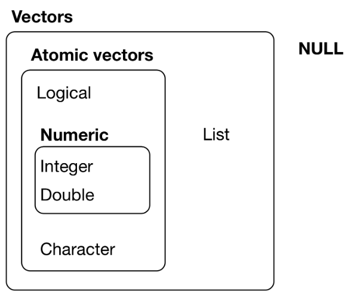
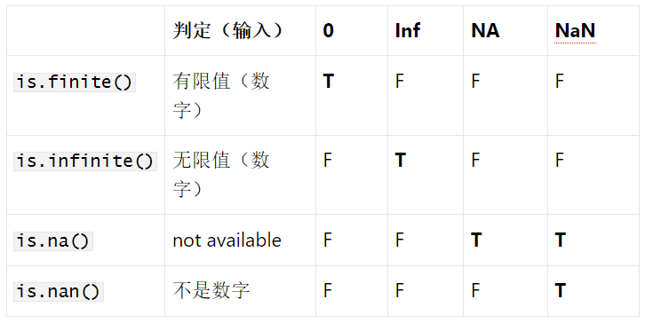
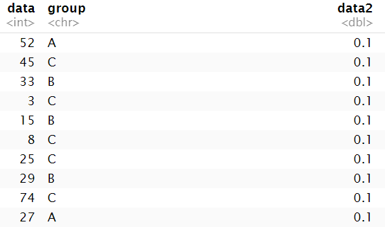
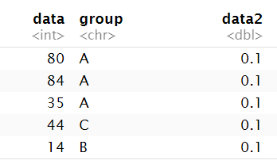
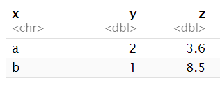
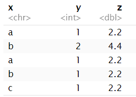
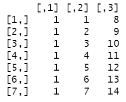
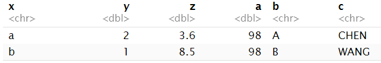
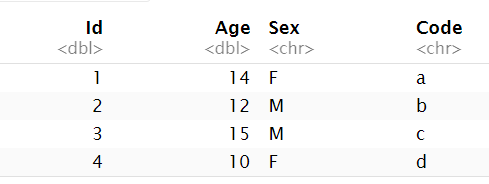

<a id="mulu">目录</a>
<a href="#mulu" class="back">回到目录</a>
<style>
    .back{width:40px;height:40px;display:inline-block;line-height:20px;font-size:20px;background-color:lightyellow;position: fixed;bottom:50px;right:50px;z-index:999;border:2px solid pink;opacity:0.3;transition:all 0.3s;color:green;}
    .back:hover{color:red;opacity:1}
    img{vertical-align:bottom;}
</style>

<!-- @import "[TOC]" {cmd="toc" depthFrom=3 depthTo=6 orderedList=false} -->

<!-- code_chunk_output -->

- [常用命令](#常用命令)
- [变量与赋值](#变量与赋值)
    - [赋值](#赋值)
    - [变量管理](#变量管理)
    - [运算](#运算)
- [基本数据类型](#基本数据类型)
    - [数字](#数字)
    - [逻辑符号(logical)](#逻辑符号logical)
    - [字符串(character)](#字符串character)
    - [vector](#vector)
      - [创建](#创建)
      - [数据类型转换](#数据类型转换)
      - [vectorisation](#vectorisation)
      - [合并、取值与替换](#合并-取值与替换)
      - [其它函数](#其它函数)
    - [matrix](#matrix)
      - [创建](#创建-1)
      - [取行列](#取行列)
      - [替换](#替换)
      - [vectorisation](#vectorisation-1)
      - [相关函数](#相关函数)
    - [array和list](#array和list)
    - [数据类型的探测](#数据类型的探测)
    - [特别值](#特别值)
- [data.frame和tibble](#dataframe和tibble)
    - [创建](#创建-2)
    - [添加](#添加)
    - [取/替换行列](#取替换行列)
    - [相互转换](#相互转换)
    - [区别](#区别)
    - [其它相关函数](#其它相关函数)
      - [绑定某个表](#绑定某个表)
      - [within](#within)
      - [row系列函数](#row系列函数)
      - [merge](#merge)
- [文件读写](#文件读写)
- [其它常用函数](#其它常用函数)
    - [关于包的操作](#关于包的操作)
    - [sample](#sample)
    - [seq](#seq)
    - [which](#which)

<!-- /code_chunk_output -->

<!-- 打开侧边预览：f1->Markdown Preview Enhanced: open...
只有打开侧边预览时保存才自动更新目录 -->

### 常用命令
使用`#`或`##`注释，CTRL+shift+c注释/取消注释
`? 函数/对象等` 获得有关它们的帮助信息

### 变量与赋值
##### 赋值
- `=`：如`x = 1`
- `<-`：如`x <- 1`，常用
- `->`：如`1 -> x`，较少使用
- `assign`函数：如`assign("x", 1)`，较少使用
##### 变量管理
所有的变量都可以在rstudio右上角的environment的data和values中显示
也可以使用函数查看：
```
ls();  ## 显示当前环境下所有变量
rm(x); ## 删除x变量
rm(list=ls()); ## 删除当前环境下所有变量
```
##### 运算
`a ^ b`：a的b次方
`a %% b`：取模
`&`/`|`：与/或，当左右两侧有数字类型时，会先转成bool类型（0->FALSE 其它->TRUE），当有其它类型时会报错
数学函数：log, log2, log10, exp, sin, cos, tan, sqrt等
```
log(10)  # 以e为底
```
### 基本数据类型
最基本的数据类型：数字和字符串
更高级的数据类型：vector向量和matrix矩阵
##### 数字
- 整数(integer)`287`
- 小数/浮点数(double)`99.99`
- 科学计数法
  - `1e-3` == `0.001` 即`1*10^-3^`
  - `1e2` == `100` 即`1*10^2^`
##### 逻辑符号(logical)
- 真：`TRUE`或`T`
- 假：`FALSE`或`F`

注意：它们不能小写
可转换成数字类型：T->1 F->0
```
1 + TRUE  # 2
2 * FALSE  # 0
```
##### 字符串(character)
可以是任何字符的组合，由单引号或双引号包括
```
'a sentence' ## 单括号
"一个字符串" ## 双括号
```
##### vector
###### 创建
**只能包含单一数据类型**
使用`c(元素1,元素2,...)`创建
```
c(100, 20, 30) ## 整数 vector 
c("字符串", "数组","是我") ## 字符串 vector
c(TRUE, FALSE, TRUE, T, F) ## 逻辑 vector
```
还可以使用`a:b`创建包含[a,b]整数的vector
```
2:8  # 2 3 4 5 6 7 8
```
###### 数据类型转换
在定义数组时，如果输入的数值是混合的，那么某些基本数据类型会自动转换为其它类型，以保证数值类型的一致性
优先级为：
1. 逻辑类型 -> 数字类型
2. 逻辑类型 -> 字符串
3. 数字类型 -> 字符串

即`逻辑类型`->`数字`->`字符串`
###### vectorisation
即**数据自动循环使用**
```
x <- c(10,100,1000, 10000);
(y <- sqrt(x) * 4 + 10); ## 赋值的之后打印变量内容
[1]  22.64911  50.00000 136.49111 410.00000
```
这里对vector进行了数值运算，相当于循环遍历其中每个元素进行运算，结果保存到另一个vector中

---

两个vector间也可进行运算：
```
a <- c(10,100,1000, 10000)
b <- c(10,100)
a / b
[1]   1   1 100 100
```
即`a[1]/b[1]` `a[2]/b[2]` 
此时b中的元素已遍历完成，自动循环使用`a[3]/b[1]` `a[4]/b[2]`
结果保存到新vector中
```
c(1,5,4,3,6) <= c(3,5,2,1,9);
TRUE  TRUE FALSE FALSE  TRUE
```
每个元素依次比较，即左边第一个元素和右边第一个元素比，左边第二个元素和右边第二个元素比，...
```
c(4,6,5,7,10,9,4,15)
x < 7  # 每个元素依次和7比较
# TRUE  TRUE  TRUE FALSE FALSE FALSE  TRUE FALSE
```

---

若两个vector的个数不成整数倍关系，仍会按此规则计算，只是会报warning
```
c(10,100,1000, 10000) / c(10,100,1000);
Warning: longer object length is not a multiple of shorter object length
[1]    1    1    1 1000
```
即`a[1]/b[1]` `a[2]/b[2]` `a[3]/b[3]` `a[4]/b[1]`
###### 合并、取值与替换
直接用`c(a,b)`就可将ab合并，同时进行数据类型转换
```
a <- 1:3;
b <- LETTERS[1:3];
( ab <- c(a,b) );  # "1" "2" "3" "A" "B" "C"
```
```
a[ length(a) + 1] <- 666  # 在结尾处添加元素
```

---

**R中第一个元素索引为1**
```
a[1];  # 第一个元素
a[ c(1, 4, 5) ];  # 第1，4，5个元素
a[ 2:5 ];  # 第[2,5]个元素，注意两边都是闭区间
a[ length(ab) ]; # length函数表示取长度，这里是取最后一个元素
```
```
a <- c(1,2,3,4,5,6)
a[1];  # 1
a[ c(1, 4, 5) ];  # 1 4 5
a[ 2:5 ];  # 2 3 4 5
a[ length(ab) ]; # 6
```

---

替换值就是给取到的值重新赋值
```
a[1] <- 10;  # 替换单个值
a[c(2,3)] <- c("20", "30");  # 替换多个值
a[3:6] <- c("0","1")  # 也是循环使用，相当于↓
a[3:6] <- c("0","1","0","1")
a  # "10" "20" "0"  "1"  "0"  "1"
```
###### 其它函数
- names(a)：获取/改变 元素/行/列的名称
  ```
  v <- 1:10
  names( v ) <- letters[1:10]
  a  b  c  d  e  f  g  h  i  j 
  1  2  3  4  5  6  7  8  9 10 
  ```
- as.character(a)：将a中每个元素变为字符串类型
  ```
  ab <- c(1:3);
  ab  # 1 2 3
  names( ab ) <- as.character( ab ); #将ab的每个元素命名
  ab  # 即第一个元素命名为"1"，第二个命名为"2"
  1 2 3 
  1 2 3 
  ```
- rev(a)：逆序
- sort(a)：排序，返回排序后结果
- order(a)：排序，返回排序后结果的每个元素在原数组中的位置
  ```
  lts <- c("C" "D" "A" "E" "B")
  sort( lts );  # "A" "B" "C" "D" "E"
  order( lts );  # 3 5 1 2 4
  即排序后结果的第一个元素"A"在原数组中的索引为3,...
  ```
##### matrix
可看做是一种带有限制的二维数组，矩阵内的数值也必须是同一种类型，类型强制转换规则同vector
###### 创建
`matrix(data, nrow=1, ncol=1, byrow=FALSE, dimnames=NULL)`
- data：用于创建矩阵的数据，必须有，可以是vector或矩阵
- nrow：指定行数，是一个整数
- ncol：指定列数，是一个整数
- byrow：是否按行将数据转化为矩阵
- dimnames：指定矩阵的行名和列名，是一个list

例：
```
matrix( c(20, 30.1, 2, 45.8, 23, 14), nrow = 2, byrow = T );  # 按行进行转化，就是先填满一行再填下一行
     [,1] [,2] [,3]
[1,] 20.0 30.1    2
[2,] 45.8 23.0   14
```
```
matrix( c(20, 30.1, 2, 45.8, 23, 14), nrow = 2, byrow = F );
     [,1] [,2] [,3]
[1,] 20.0  2.0   23
[2,] 30.1 45.8   14
```
```
matrix( c(20, 30.1, 2, 45.8, 23, 14), nrow = 2, 
       dimnames = list( c("row_A", "row_B"), c("A", "B", "C") ) );

         A    B  C
row_A 20.0  2.0 23
row_B 30.1 45.8 14
```
同时指定 ncol 和 nrow 时，生成的矩阵长度为nrow × ncol，此时可以不同于输入数据的长度。矩阵长度较小时，输入数据会被截短；而矩阵长度较大时，输入数据则会被重复使用。
```
## 生成一个2x5长度为10的矩阵，但输入数据的长度为20
matrix( 1:20, nrow = 2, ncol = 5, byrow = T); 
    [,1] [,2] [,3] [,4] [,5]
[1,]   1    2    3    4    5
[2,]   6    7    8    9   10
```
```
## 生成一个2x3长度为6的矩阵，但输入数据长度只有3
matrix( 1:3, nrow = 2, ncol = 3, byrow = T ); 
     [,1] [,2] [,3]
[1,]    1    2    3
[2,]    1    2    3
```
当矩阵长度大于输入数据长度，且前者不是后者的整数倍时，会报warning
```
matrix( 1:3, nrow = 2, ncol = 4, byrow = T );
Warning: data length [3] is not a sub-multiple or multiple of the number of rows [2]
     [,1] [,2] [,3] [,4]
[1,]    1    2    3    1
[2,]    2    3    1    2
```
矩阵长度小于输入数据的长度，且后者不是前者的整数倍时，也会报warning、
```
matrix( letters[1:20], nrow = 3, ncol = 5, byrow = T );  # letters[1:20]就是前20个小写字母
Warning: data length [20] is not a sub-multiple or multiple of the number of rows [3]
     [,1] [,2] [,3] [,4] [,5]
[1,] "a"  "b"  "c"  "d"  "e" 
[2,] "f"  "g"  "h"  "i"  "j" 
[3,] "k"  "l"  "m"  "n"  "o" 
```
###### 取行列
```
         A    B  C
row_A 20.0  2.0 23
row_B 30.1 45.8 14
```
`m[行索引,列索引]`其中行/列索引可以是单个整数，也可以是多个整数组成的vector。如果想单独取行/列，直接将列/行索引省略不写即可
```
m[ 1 , ];  # 取一行/一列的结果都是vector
 A  B  C 
20  2 23 
```
```
m[ 1:2,  ];
         A    B  C
row_A 20.0  2.0 23
row_B 30.1 45.8 14
```
```
m[ , 1 ];
row_A row_B 
 20.0  30.1
```
```
m[, c(1,2)];
         A    B
row_A 20.0  2.0
row_B 30.1 45.8
```
```
m[1:2, 2:3];  # 取其中一部分
         B  C
row_A  2.0 23
row_B 45.8 14
```

---

`m[行名,列名]`可以根据矩阵创建时指定的行/列名取到对应行/列
```
         A    B  C
row_A 20.0  2.0 23
row_B 30.1 45.8 14
```
```
m[ "row_A", ]
 A  B  C 
20  2 23 
```
```
m[ c( "row_B", "row_A" ), ]  # 注意取的顺序，先取了row_B，所以结果中row_B是第一行
         A    B  C
row_B 30.1 45.8 14
row_A 20.0  2.0 23
```
```
m[, c("B","A")];  # 注意取的顺序，先取了B列，所以结果中B是第一列
         B    A
row_A  2.0 20.0
row_B 45.8 30.1
```
###### 替换
直接给取到的行列赋值即可
```
         A    B  C
row_A 20.0  2.0 23
row_B 30.1 45.8 14
```
```
m[1, ] <- c(10);  # 替换一行，这里使用了vector的自动循环特性，将第一行的所有值置为10
         A    B  C
row_A 10.0 10.0 10
row_B 30.1 45.8 14
```
```
m[, "C"] <- c(230, 140);  # 替换一列
         A    B   C
row_A 10.0 10.0 230
row_B 30.1 45.8 140
```
```
m[ 1:2 , ] <- matrix( 1:6, nrow = 2 );  # 替换前两行
      A B C
row_A 1 3 5
row_B 2 4 6
```
```
m[ , c("C", "B") ] <- matrix( 100:103, nrow = 2 );  # 替换其中两列
      A   B   C
row_A 1 102 100
row_B 2 103 101
```
```
m[ 1  , c("C", "B") ] <- matrix(  110:111, nrow = 1 );  # 替换第一行的C/B列，注意取列的顺序，C->110、B->111
      A   B   C
row_A 1 111 110
row_B 2 103 101
```
###### vectorisation
与[vector中的vectorisation](#vectorisation)一样，都是数据的自动循环使用
```
m <- matrix( c(1, 2, 3, 4, 5, 6), nrow = 2, 
       dimnames = list( c("row_A", "row_B"), c("A", "B", "C") ) );
m
      A B C
row_A 1 3 5
row_B 2 4 6
```
```
m / c(1,10);
        A   B   C
row_A 1.0 3.0 5.0
row_B 0.2 0.4 0.6
```
计算时将矩阵展开成vector`c(1, 2, 3, 4, 5, 6)`（就是创建时使用的vector），将每个元素计算后（即`c(1, 2, 3, 4, 5, 6)/c(1,10)`），按列（创建时指定）填值
```
m / c(1,10,100)
        A    B    C
row_A 1.0 0.03 0.50
row_B 0.2 4.00 0.06
```
即`c(1, 2, 3, 4, 5, 6)/c(1,10,100)`
```
m / c(1,10,100,1000); ## 多于列数
Warning: longer object length is not a multiple of shorter object length
        A     B   C
row_A 1.0 0.030 5.0
row_B 0.2 0.004 0.6
```
即`c(1, 2, 3, 4, 5, 6)/c(1,10,100,1000)`
###### 相关函数
```
m
      A B C
row_A 1 3 5
row_B 2 4 6
```
- `dim(m)`：矩阵各维度长度
- `nrow(m)`：行数
- `ncol(m)`：列数
- `range(m)`：元素最大最小值
- `summary(m)`：（各列）元素最值、平均值、中位数、4等分点
- `t(m)`：转置

```
dim( m );  # 2 3
nrow( m );  # 2
ncol( m );  # 3
range( m );  # 1 6
summary( m );
      A              B              C       
Min.   :1.00   Min.   :3.00   Min.   :5.00  
1st Qu.:1.25   1st Qu.:3.25   1st Qu.:5.25  
Median :1.50   Median :3.50   Median :5.50  
Mean   :1.50   Mean   :3.50   Mean   :5.50  
3rd Qu.:1.75   3rd Qu.:3.75   3rd Qu.:5.75  
Max.   :2.00   Max.   :4.00   Max.   :6.00  
t(m);
  row_A row_B
A     1     2
B     3     4
C     5     6
```
##### array和list
高维数组可以由函数`array()`定义
```
array( data = LETTERS[1:16], 
      dim  = c(2,4,2),  # 指定维数，这里共有3维，长度分别为2、4、2
      dimnames = list( c("A","B"), 
                      c("one","two","three","four"), 
                      c("一", "二") ));
```
```
, , 一

  one two three four
A "A" "C" "E"   "G" 
B "B" "D" "F"   "H" 

, , 二

  one two three four
A "I" "K" "M"   "O" 
B "J" "L" "N"   "P" 
```
---

##### 数据类型的探测
数据类型汇总：
{:width=250 height=250}
**r里面所有对象/数值都是一个vector**，如某个数字/bool值也是vector，这个vector只有一个元素
- `length()` 显示数据对象中元素/成分的数量
- `dim()` 获取数据对象的维度
- `str()` 显示数据对象的结构
- `mode()` 显示数据对象的类型，如：数值型、字符型、逻辑型等
- `class()` 显示数据对象的类或类型，如：矩阵、列表、数据框等
- `typeof()` 显示更细分的类
```
x = c(1,2,3);
length(x);  # 3
dim(x);  # NULL
str(x);  # num [1:3] 1 2 3
mode(x);  # "numeric"
class(x);  # "numeric"
typeof(x);  # "double"
```
```
x = matrix(c(1,2,3,4),nrow = 2);
length(x);  # 4
dim(x);  # 2 2 即每维的长度分别为2、2
str(x);  # num [1:2, 1:2] 1 2 3 4
mode(x);  # "numeric"
class(x);  # "matrix" "array"
typeof(x);  # "double"
```
##### 特别值
- `NULL`：空值，是特别值也是特别数据类型。
  ```
  typeof(NULL);  # "NULL"
  ```
- `na`：即not available，无法获得的值
- `Inf`/`-Inf`：正/负无穷，它们都属于`Inf`特别数据类型
- `nan`：不是数字，是`na`的一种
  ```
  c(-1, 0, 1) / 0;
  -Inf  NaN  Inf
  ```

---

判定特别值：
{:width=250 height=250}
```
is.null( NULL );  # TRUE
is.numeric( NA );  # FALSE
is.numeric( Inf );  # TRUE
```

---

其它`is.`系列函数：
- `is.list()`
- `is.logical()`
- `is.character()`
- `is.vector()`
- ...
- `isTRUE()`：只在参数是一个逻辑运算值true时才返回true
  ```
  isTRUE( 5 )  # F
  isTRUE( 5 & 6 )  # T
  ```
### data.frame和tibble
data.frame是二维表格，由长度相同的不同列组成，每列是一个vector，不同列的数据类型可以不同，但一列只包括一种数据类型
tibble与data.frame类似，是它的升级版本，具有更强的功能和更高的准确性，由tibble或tidiverse包提供
以下将data.frame简称为df。tibble简称为tb
##### 创建
使用`data.frame()`函数创建新的data.frame：
```
data.frame(
  列名1=值1,
  列名2=值2,
  ...
  row.names = NULL
  stringsAsFactors = T
)
```
- `row.names`指定列名（可选）
- `stringsAsFactors`设置字符型是否转换为因子（之后会讲到）

```
dat2 <- data.frame( data = sample( 1:100, 5 ),   # 第一列是1-100的随机数（共5行）
  group = sample( LETTERS[1:3], 5, replace = TRUE),   # 第二列是A-C的随机字母
  data2 = 0.1 )  # 第三列全为0.1
```
{:width=150 height=150}

---

使用`tibble()`函数创建新的tibble，用法类似于`data.frame()`
```
dat <- tibble( data = sample( 1:100, 5 ), 
  group = sample( LETTERS[1:3], 5, replace = TRUE), 
  data2 = 0.1 )
```
{:width=150 height=150}

---

另一种方式：使用`tribble`函数创建新的tibble
```
tribble(
  ~x, ~y,  ~z,  #~表示列名
  "a", 2,  3.6,
  "b", 1,  8.5
)
```
{:width=150 height=150}

---

使用`str(df/tb)`查看它们的数据结构
```
str(dat);
```
```
tibble [5 × 3] (S3: tbl_df/tbl/data.frame)
 $ data : int [1:5] 80 84 35 44 14
 $ group: chr [1:5] "A" "A" "A" "C" ...
 $ data2: num [1:5] 0.1 0.1 0.1 0.1 0.1
```
##### 添加
- `rbind(df1,df2)`按行合并两个df，即行的叠加，返回新df，需要它们有相同个数的列
- `cbind(df1,df2)`按列合并两个df，即列的叠加，返回新df，需要它们有相同个数的行
- 如果在合并时，一个df的行/列数少于另一个，不会报错，而是自动循环使用已有的行/列(vectorisation)

在创建df时，可以创建"表头"，再填充
```
df2 <- data.frame( x = character(), y = integer(), z = double() , stringsAsFactors = FALSE );  # x列是字符型，y列是整数型，z列是小数型
df2 <- rbind( df2, data.frame( x = "a", y = 1L, z = 2.2 ) );  # 1L表示1这个整数
df2 <- rbind( df2, data.frame( x = "b", y = 2L, z = 4.4 ) );
df2 <- rbind( df2, data.frame( x = c("a","b","c"), y = 1L, z = 2.2 ) );
```
{:width=80 height=80}
```
m <- cbind(1, 1:7) ;
m <- cbind(m, 8:14) ;
```
{:width=80 height=80}

---

- `add_row(tb1,tb2)`/`bind_rows(tb1,tb2)`按行合并两个tb，即行的叠加，返回新tb，需要它们有相同个数的列
  - `add_row(tb1,列名1=列值1,列名2=列值2,...)`也可以，相当于把传入的列名列值先变为tb再合并。下同
- `add_column(df1,df2)`/`bind_cols(tb1,tb2)`按列合并两个tb，即列的叠加，返回新tb，需要它们有相同个数的行

```
tb <- tibble( x = character(), y = integer());  # 创建表头
tb <- add_row(tb, x = 4, y = 0, .before = 2);  # .before = 2表示在第二行之前插入
tb <- add_row(tb, x = 4:5, y = 0:-1);  # 插入多行  
tb <- add_row( tb, tibble( x = as.double(200:202), y = as.double(1000:1002) ) );  # 插入另一个tibble
```
```
tb3 <- tribble(
  ~x, ~y,  ~z,
  "a", 2,  3.6,
  "b", 1,  8.5
);
tb3 <-add_column( tb3, a=98,b = LETTERS[1:2], c = c("CHEN", "WANG") ); 
```
{:width=50 height=50}
##### 取/替换行列
df与tb的取法基本相同
可以通过整数索引取，也可通过行/列名取
替换就是将取到的行/列重新用新df/tb赋值
取的方式可类比[矩阵的取行列](#取行列)
```
df4[ 1:2, ];  # 取第1-2行
df4[, 2];  # 取第2列
df4[c(2,3,1), ];  # 取第2、3、1行，并重新排序
df4[, c(2,1)];  # 取第2、1列，并重新排序
df4[c(1,2), "x"]  # 取x列的第1、2行
df4[1, ] <- data.frame( data = 100, group = "A" );  # 替换第1行
df4[, "data"] <- sample( 1:100, 5 );  # 替换data列，等效于
df4[["data"]] <- sample( 1:100, 5 );  # 这种方式会在之后详细介绍
```
##### 相互转换
`as_tibble(df)`将df转成tb
`as.data.frame(tb)`将tb转成df
##### 区别
- tibble可以用已有列计算新的列
  ```
  tibble(x = 1:5, y = x ^ 2);  # y列是x列的平方
  data.frame(x = 1:5, y = x ^ 2);  # 但 data.frame会报错
  ```
- df按索引取行/列时，若只取一行，会返回一个vector，而不是一个df
  ```
  df1 <- data.frame(x = 1:3, y = 3:1);
  class(df1[, 1:2]);  # "data.frame"
  class(df1[, 1]);  # "integer"（整数型vector）
  class(df1[1,])  # "data.frame"
  ```
  tibble则不会，取的结果永远都是tibble
  ```
  tb <- tibble(x = 1:3, y = 3:1);
  class(tb[, 1]);  # "tbl_df" "tbl" "data.frame"表示是一个tb
  ```
- tibble可以进行可控的数据类型转换
  若想得到vector型的取单列结果：`tb[[列索引/"列名"]]`或`tb$列名`，如果使用上面`tb[,列]`的方式都是返回tb。
  df也有相同的方法，但取单列都是返回vector
  ```
  class(tb[[1]]);  # 取第一列
  class(tb[["x"]]);  # 取x列
  class(tb$x);  # 取x列
  ```
- 创建时，若某列的行数小于其它列，df和tb会自动循环补充，但tibble的自动循环补充仅限于长度为1；而data.frame则为整除即可
  ```
  data.frame(a = 1:6, b = 1:3);  # 为整数倍，可以
  data.frame(a = 1:6, b = 1:4);  # 不为整倍数，报错
  data.frame(a = 1:6, b = 1);  # 为整数倍，可以
  tibble(a = 1:3, b = 1);  # b列全为1，可以
  tibble(a = 1:6, b = 1:3);  # 长度不为1且不等长，报错
  ```
- 在使用`df$列名`取列时，会进行部分匹配
  ```
  df <- data.frame(abc = 1)
  #正常是df$abc，但
  df$ab; ##也可以 
  tb <- tibble(abc = 1)
  tb$a;  # Warning: Unknown or uninitialised column: `a`.  NULL（返回空值）
  ```
##### 其它相关函数
###### 绑定某个表
正常情况下如果我们想取某tb/df中的某列，就必须在取的时候说明是哪个tb/df
使用`attach(tb/df)`可以在之后取其中列时不再说明表名，使用`detach(tb/df)`解除这一绑定
```
attach( iris );
head(  Sepal.Length , n = 10 );  # 加上attach后就可以直接用列名获取数据，不用写$或[[]]，表示取iris中sepal.length列的前10行
detach(iris);  # 取消 attach 操作
```
`with(表名,对该表的操作函数)`也可实现同样的功能
```
with( iris, head(  Sepal.Length, n  = 10 ));
```
with括号内的函数中列名都绑定iris表，这种方式不需解绑。范围是with函数内，with之外不再绑定
###### within
是对with的拓展，用于基于原表创建新表，不修改原表，而是将结果保存到新表中
```
res <- within(表名,{
  列名1 <- 新列值1,
  列名2 <- 新列值2,
  ...,
  其它列操作
});
```
```
aq <- within(airquality, {
    lOzone <- log(Ozone)  # 对这列取log，存到lOzone列中
    S.cT <- Solar.R / lOzone  # 用Solar.R除以lOzone列，存到S.cT列中
    rm(Day, Temp)  # 删除Day、Temp列
});
```
###### row系列函数
- `rownames(df/tb)`获取/修改行名
- ` rowSums(df/tb[,c(列名1,列名2,...])`对指定列求和，同理还有`rowMeans`等

例：对df表中col_list中的列求和，结果保存到新列total中，并将total变为第一列
```
# tb共有4列
col_list=c("Rural.Male","Rural.Female","Urban.Male","Urban.Female");
tb$Total=rowSums(tb[,col_list]);  # 直接用取列的方式也可创建列
tb <- tb[,c(5,1:4)]  # total在第5列，需要放到第一列的位置
```
###### merge
`merge(df1,df2)`默认按照相同的列名合并
```
df1 <- data.frame(Id=c(1,2,3,4),Age=c(14,12,15,10));
df2 <- data.frame(Id=c(1,2,3,4),Sex=c('F','M','M','F'),Code=c('a','b','c','d'));
merge(df1,df2);
```
{:width=100 height=100}
即取两个df中相同的列，以此作索引，将其它的列合并到同一个表中
用merge函数可以实现两个表的自然/左/右/全连接（类比数据库中的inner_join/left_join/right_join/full_join）
详见：https://blog.csdn.net/chongbaikaishi/article/details/115740560
### 文件读写

### 其它常用函数
##### 关于包的操作
显示库的路径和所有已经安装包的信息：`library()`
安装：`install.packages("dplyr")`包名称要加引号
升级：`update.packages("dplyr")`
卸载：`remove.packages("dplyr")`
加载：`library(GEOquery)`或`require(dplyr)`不需要加引号
卸除（加载的逆操作，不在当前环境下使用某包，不是卸载）：`detach("package:GEOquery")`
更多：https://blog.csdn.net/qq_27390023/article/details/120738726
##### sample
sample(x,size,replace = FALSE)：从x数据中随机取样size个，返回一个vector
- replace：默认FALSE，即抽样数size不能大于x；若为TRUE，size可以大于x

```
sample(1:1000,3)  # 取3个在1-1000之间的随机数值
```
##### seq
`seq(from,to,length)`生成一组数字，从from开始，到to结束，每两个数间的间隔是length
```
seq(2,10,2)  # 2 4 6 8 10
```
`seq(from,to,length.out)`其中`length.out`指定返回数组的长度
```
seq(1,10,length.out = 3)  # 1.0  5.5 10.0
```
`length.out`也可用`along.with`代替，该参数接收一个数组，表示返回数组的长度与传入数组的长度相等
##### which
`which(m)`：which接收一个vector（可迭代对象），返回vector中所有为T的值的索引，结果为一个vector
```
x <- c(12:4)
y <- c(0,1,2,0,1,2,0,1,2)
is.finite(x/y)
# FALSE  TRUE  TRUE FALSE  TRUE  TRUE FALSE  TRUE  TRUE
which(!is.finite(x/y))
# 1 4 7
```
`!is.finite(x/y)`当x/y为无限数字时为true，`x/y=c(12/0,11,5,9/0,8,3.5,6/0,5,2)`，其中`12/0` `9/0` `6/0`的值为Inf，满足条件，索引分别为1，4，7
例：取出`a <- sample( 1:50, 20 )`中数据大于20的成员
```
a[which(a>20)]
```
