<a id="mulu">目录</a>
<a href="#mulu" class="back">回到目录</a>
<style>
    .back{width:40px;height:40px;display:inline-block;line-height:20px;font-size:20px;background-color:lightyellow;position: fixed;bottom:50px;right:50px;z-index:999;border:2px solid pink;opacity:0.3;transition:all 0.3s;color:green;}
    .back:hover{color:red;opacity:1}
    img{vertical-align:bottom;}
</style>

<!-- @import "[TOC]" {cmd="toc" depthFrom=3 depthTo=6 orderedList=false} -->

<!-- code_chunk_output -->

- [管道运算符pipe](#管道运算符pipe)
    - [向右操作符](#向右操作符)
    - [向左操作符](#向左操作符)
    - [解释操作符](#解释操作符)
    - [复合赋值操作符](#复合赋值操作符)
    - [%in%](#in)
- [dplyr包](#dplyr包)
    - [arrange](#arrange)
    - [select](#select)
    - [filter](#filter)
    - [mutate](#mutate)
    - [summarise与group_by](#summarise与group_by)
    - [其它取行操作](#其它取行操作)
    - [实际案例](#实际案例)
      - [成绩分析](#成绩分析)
      - [starwars](#starwars)
      - [Theoph](#theoph)
      - [基因分析](#基因分析)
- [tidyr包](#tidyr包)
    - [pivot_longer/wider系列](#pivot_longerwider系列)
    - [gather和spread系列](#gather和spread系列)
- [字符串处理](#字符串处理)
    - [R中自带函数](#r中自带函数)
    - [stringr和stringi包](#stringr和stringi包)
    - [其它](#其它)
- [R中的循环](#r中的循环)
    - [普通for循环](#普通for循环)
    - [apply系列函数](#apply系列函数)

<!-- /code_chunk_output -->

<!-- 打开侧边预览：f1->Markdown Preview Enhanced: open...
只有打开侧边预览时保存才自动更新目录 -->

### 管道运算符pipe
由`magrittr`包提供
##### 向右操作符
`%>%`向右操作符（最常用），把左侧的数据或表达式，传递给右侧的函数调用或表达式进行运行，可以连续操作
快捷键：`CTRL`+`shift`+`M`
在右侧函数中，可以用`.`指代传递来的数据，也可以省略不写，默认放入右侧（外层）函数的第一个参数位置
如果右侧是一个嵌套函数，我们要在内层函数中使用传递来的数据，就必须用`.`指代
```
swiss %>% do( head(., n = 4 ) );
swiss %>% head(., n = 4 );
swiss %>% head( n = 4 );
swiss %>% do( head( n = 4 ) );  # x被传到了do函数内，head未接收到x，报错
```
##### 向左操作符
`%T>%`向左操作符，把左侧的数据传给右侧函数调用或表达式，并将**左侧**的数据作为结果
`a %T>% func()`的结果为`a`，而`a %>% func()`的结果为`func(a)`，它们都会执行一次`func(a)`，只是`a %T>% func()`整体的值不同
例：
```
res <- 
  rnorm(100) %>%
    matrix(ncol = 2) %T>%
    plot();  # 都会画图
res  # 一个matrix
res2 <- 
  rnorm(100) %>%
    matrix(ncol = 2) %T>%
    plot();
res2  # 一个plot()图片
```
##### 解释操作符
`%$%`解释操作符，把左侧数据的属性名传给右侧，让右侧的调用函数直接通过名字，就可以获取左侧的数据
作用可类比`attach()`和`with()`
```
mtcars %$% 
  cor.test( cyl, mpg );  # 相当于
attach( mtcars );
cor.test( cyl, mpg );  # 相当于
with( mtcars, cor.test( cyl, mpg ) );
```
##### 复合赋值操作符
`%<>%`复合赋值操作符，功能可类比`%>%`，多了一项额外的操作，就是把结果写回到最左侧的对象（覆盖原来的值）
```
x<-rnorm(10);
x %>% abs %>% sort;
x;  # 取绝对值、排序之后的结果并没有直接写到x
x %<>% abs %>% sort;
x;  # 取绝对值、排序之后的结果直接覆盖掉了原来的x
```

---

在实际应用中，尽量使用方向明确的`%>%`，而不使用其它方向不明确的pipe
##### %in%
判断它左边的向量是否在右边的向量中
```
a <- 1:10
b <- c(1,3,5,9)
a %in% b
# TRUE FALSE  TRUE FALSE  TRUE FALSE FALSE FALSE  TRUE FALSE
```
即依次判断1在不在`c(1,3,5,9)`中、2在不在`c(1,3,5,9)`中、...
取a、b交集：
```
a[a %in% b]
```
与ifelse和which结合：
```
ifelse(a %in% 1, 1, 0) #若a的值包含在1里面，输出1，否者输出0
# 1 0 0 0 0 0 0 0 0 0
```
```
which(a %in% 1) #输出x包含在1中值的位置
# 1
```
### dplyr包
[参考文章](https://zhuanlan.zhihu.com/p/150457098)
类似于python中的pandas，能对dataframe/tb类型的数据做很方便的数据处理和分析操作
本节中使用的例子：`aapl`表
{:width=250 height=250}
##### arrange
`arrange(a, b)`对a数据按照其中b列的值进行升序排序
`arrange(a, -b)`对a数据按照其中b列的值进行降序排序
dplyr包的函数通常与[管道运算符](#管道运算符pipe)联用，写成`a %>% arrange(-b)`的形式
例：
```
aapl %>% arrange(-Volume)
```
{:width=250 height=250}
##### select
`a %>% select(列名1,列名2,...)`选取a中指定的列
例：
```
aapl %>% select(Date, Close, Volume)
```
{:width=250 height=250}
另外一种表达方式：`a %>% select(-c(列名1,列名2,...))`排除这些列，选取剩下的列
```
aapl %>% select(-c("Open", "High", "Low")) 
```
得到相同的结果

---

也可以传入一个函数判断式，用来选择符合条件的列名
```
starwars %>% 
  select( name, ends_with("color") );
```
表示选出以"color"结尾的列名
其它的操作：
- `select(data, starts_with("Sepal"))`选择以"Sepal"开头的所有列
- `select(data, Sepal.Length:Petal.Width)`选择"Sepal.Length"与"Petal.Width"之间的所有列
- `select(data, contains("."))`选择名称包含"."的列
- `select(data, matches("正则表达式"))`选择名称与正则表达式匹配的列
- `select(data, num_range("x", 1:5))`选择名为x1、x2、x3、x4、x5的列
- `select(data, one_of(c("Species", "Genus")))`选择名称在一组名称中的列
- `select(data, everything())`选择每一列
##### filter
`a %>% filter(条件表达式)`选取a中符合条件的行，条件表达式中一般用列名进行判断
例：
```
aapl %>% filter(Close>=150)  # 选择close列>=150的行
```
{:width=250 height=250}
```
aapl %>% filter((Close>=150) & (Close>Open))  # 选择close列>=150且close列值>open列值的行
```
{:width=250 height=250}
##### mutate
`a %>% mutate(新列1=列运算,...)`将现有的列经过计算后生成新列
例：
```
# 将High列减去Low列的结果定义为maxDif，并取log
aapl %>% mutate(maxDif = High-Low,
                log_maxDif=log(maxDif)) 
```
{:width=250 height=250}
```
aapl %>% mutate(n=row_number())  # 为每行数据添加行数标记
```
{:width=250 height=250}
其它的mutate函数：
- `transmute(新列1=列运算,...)`类似`mutate`，区别是它会删除使用过的就列
- `mutate_each(funs(列处理函数),c(列名1,列名2,...))`对每列/指定列执行给定的函数
  ```
  data %>% mutate_each(funs(as.numeric), c("dbl1","dbl2","dbl3"))
  ```
  表示将"dbl1","dbl2","dbl3"三列变成数值型
##### summarise与group_by
`a %>% group_by(列1,列2,...)`按指定列分组，有相同列值的行为同一组
`a %>% summarise(新列1=列运算,...)`将多个值转换为单个值（通过`mean平均值`、`median中位数`、`n_distinct计算每组行数`等操作），生成新列（总行数减少，通常与`group_by`配合使用），结果中每一组的计算结果为一行
例：weather数据集
{:width=250 height=250}
```
# 按city分组，计算温度的平均值，存入新列mean_temperature中
weather %>% group_by(city) %>% summarise(mean_temperature = mean(temperature))
```
{:width=125 height=125}
当不指定分组，直接summarise时，按所有数据为一组，即计算所有数据的平均值等
```
weather %>% summarise(mean_temperature = mean(temperature))
```
{:width=100 height=100}

更多的列运算：
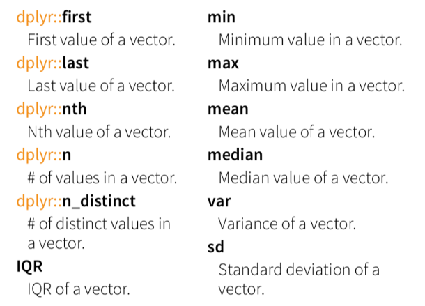{:width=200 height=200}
##### 其它取行操作
- `distinct(data)`删除重复行
- `sample_frac(data, 0.5, replace = TRUE)`随机选择部分行
- `sample_n(data, 10, replace = TRUE)`随机选择n行
- `slice(data, 10:15)`按位置选择行
- `top_n(data, n, 列名)`选择前n行，并按指定列排序（如果数据分组，则按组）
##### 实际案例
###### 成绩分析
给定tb`grades.melted`
```
grades <- tibble( "Name" = c("Weihua Chen", "Mm Hu", "John Doe", "Jane Doe","Warren Buffet", "Elon Musk", "Jack Ma"),
                  "Occupation" = c("Teacher", "Student", "Teacher", "Student", rep( "Entrepreneur", 3 ) ),
                  "English" = sample( 60:100, 7 ),
                  "ComputerScience" = sample(80:90, 7),
                  "Biology" = sample( 50:100, 7),
                  "Bioinformatics" = sample( 40:90, 7));
grades.melted <- grades %>% 
  gather( course, grade, -Name, -Occupation, na.rm = T );
```
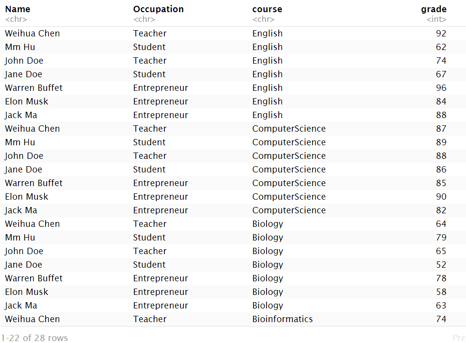{:width=300 height=300}
观察数据可以看到，每人都有很多门科目
- 求出每个人的平均成绩，并排序
  ```
  grades.melted %>% 
    group_by(Name, Occupation) %>%  # 按姓名/职位分组，即选出每人的各科成绩
    summarise( avg_grades = mean( grade )) %>%  # 将结果保存在avg_grades列
    arrange( -avg_grades );  # 降序排序
  ```
- 将每个人的分数排序
  ```
  grades.melted %>% 
  arrange( Name, -grade );  # 相当于先按Name排序，再排各Name中的grade
  ```
  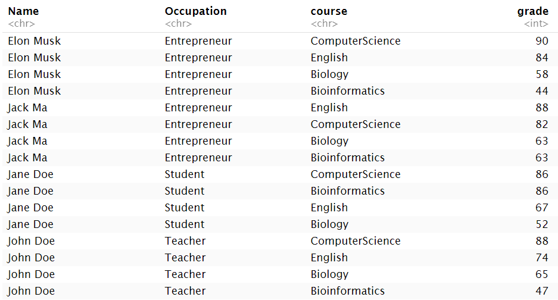{:width=250 height=250}
- 求出每个人的最好科目及其成绩（在上面的基础上）
  ```
  grades.melted %>% 
    arrange( Name, -grade ) %>%
    group_by( Name ) %>%  # 按姓名分组
    summarise( best_course = first( course ),  # 每组best_course值为第一个course
               best_grade = first( grade ),  # 每组best_grade值为第一个grade
               avg_grades = mean( grade ) )
  ```
  为什么是第一个course/grade？因为在`arrange( Name, -grade )`已经对每人的成绩排好序了，第一个就是最高的成绩
  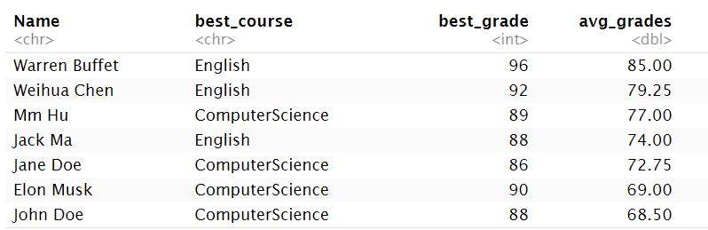{:width=120 height=120}
- 对每个职业的平均成绩排序
  ```
  grades.melted %>% 
    group_by(Occupation) %>%  # 按职业分组
    summarise(avg_grade=mean(grade)) %>%  # 取平均值
    arrange(-avg_grade)  # 对平均值排序
  ```
  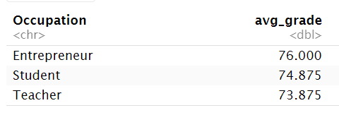{:width=80 height=80}
- 求出每个职业的最佳学科
  ```
  grades.melted %>% 
    group_by(Occupation,course) %>%  # 同时要知道职业和学科，所以按occupation和course分组
    summarise(avg_grade=mean(grade)) %>%  # 先得到每个职业的每个学科的平均值，共3*4行
    arrange(-avg_grade) %>%  # 对平均值排序
    summarise(best_course=first(course))  # 取每个职业的course列的第一个元素（最好的学科）为best_course列
  ```
  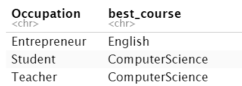{:width=80 height=80}
###### starwars
使用R中自带数据集`starwars`
- 取出相关列，用于计算人物的BMI
  ```
  starwars %>% 
  select( name, height, mass ) %>%
  mutate( bmi = mass / ( (height / 100 ) ^ 2 ) ) ;
  ```
- 获取与颜色相关的列: hair_color, skin_color, eye_color
  ```
  starwars %>% 
    select( name, ends_with("color") );
  ```
- 挑选金发碧眼的人物
  ```
  starwars %>% 
    select( name, ends_with("color"), gender, species ) %>% 
    filter( hair_color == "blond" & eye_color == "blue" )
  ```
- 挑选出所有人类，按BMI将他们分为三组，<18、18~25、>25，统计每组的人数并排序
  一种较容易想到的方法：让计算出的bmi列只取`<18`、`18~25`、`>25`三个值，之后按bmi列分组统计数量
  ```
  data <- starwars %>%
    select(name,height,mass,species) %>%
    mutate( bmi = mass / ( (height / 100 ) ^ 2 ) ) %>%
    filter(species=="Human" & !is.na(bmi)) %>%
    select(bmi) 
  data <- as.data.frame(data)
  #dataframe的[i,1]是一个值(vector)，而tibble的是一个tibble
  for(i in 1:nrow(data))  # nrow获取行数
  {
    if(data[i,1]<18&&data[i,1]>0)
    {
      data[i,1] <- "bmi<18"
    }
    else if(data[i,1]>=18&&data[i,1]<=25)
    {
      data[i,1] <- "18<=bmi<=25"
    }
    else if(data[i,1]>25)
    {
      data[i,1] <- "bmi>25"
    }  # 必须加else，要不"bmi<18">25会判断为true
  }
  data <- as.tibble(data) %>%
    group_by(bmi) %>%
    summarise(num=n()) %>%  # 统计每组行数（每个BMI区间人数）
    arrange(-num);
  ```
  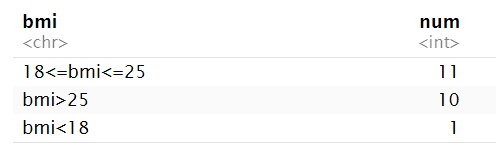{:width=80 height=80}
  注：最后一步统计行数可以改成
  ```
  data <- as.tibble(data) %>%
    count(bmi,sort = T)
  ```
###### Theoph
- 产生新列trend，其值为Time与Time列平均值的差
  ```
  Theoph %>%
    filter(!is.na(Time)) %>%  # 去除NA值
    mutate(trend=Time-mean(Time)) %>%
    select(Time,trend)
  ```
- 产生新列weight_cat，其值根据Wt的取值范围而不同：
  - 如果`Wt` \> 76.2，为 'Super-middleweight'，否则
  - 如果 `Wt` \> 72.57，为 'Middleweight'，否则
  - 如果 `Wt` \> 66.68，为 'Light-middleweight'
  - 其它值，为 'Welterweight'
  ```
  Theoph %>%
    select(Wt) %>%
    mutate(weight_cat=c("1"))
  for(i in 1:nrow(res4)) 
  {
    if(res4[[i,1]]>76.2)
    {
      res4[i,2] <- 'Super-middleweight'
    }
    else if(res4[[i,1]]>72.57)
    {
      res4[i,2] <- 'Middleweight'
    }
    else if(res4[[i,1]]>66.68)
    {
      res4[i,2] <- 'Light-middleweight'
    }
    else
    {
      res4[i,2] <- 'Welterweight'
    }
  }
  ```
###### 基因分析
使用tb`mouse.tibble`
```
mouse.tibble <- read_delim( file = "./r-data/mouse_genes_biomart_sep2018.txt",
                            delim = "\t", quote = "" )
```
共6列：
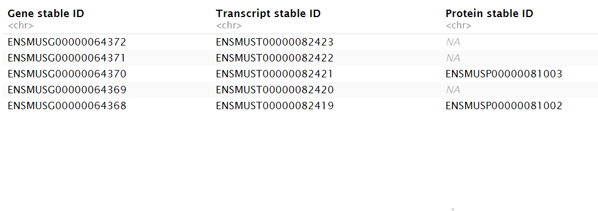{:width=200 height=200}
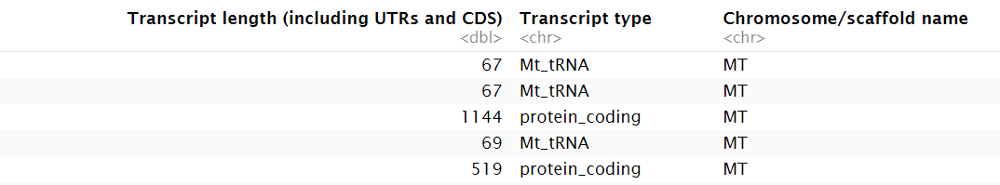{:width=100 height=100}
例1：
1. 处理行：将染色体限制在常染色体和XY上（去掉未组装的小片段）
2. 处理行：将基因类型限制在 protein_coding, miRNA和 lincRNA 这三种
3. 新增列：统计每条染色体上不同类型基因（protein_coding, miRNA, lincRNA）的数量
4. 按染色体（正）、基因数量（倒）进行排序

```
mouse.tibble %>% 
  ## 1. 
  filter( `Chromosome/scaffold name` %in% c( 1:19, "X", "Y" )   ) %>% 
  ## 2. 
  filter( `Transcript type` %in% c( "protein_coding", "miRNA", "lincRNA" ) ) %>%
  ## 改变列的名称，方便后续处理列 
  select( CHR = `Chromosome/scaffold name`, TYPE = `Transcript type`, 
          GENE_ID = `Gene stable ID`, 
          GENE_LEN =  `Transcript length (including UTRs and CDS)`  ) %>%
  ## 3.
  ## 按染色体和基因类型分组，因为要统计"每条染色体上"不同类型基因
  group_by( CHR, TYPE ) %>% 
  ## 使用n_distinct计算数量，mean计算平均值
  summarise( count = n_distinct( GENE_ID ), mean_len = mean( GENE_LEN ) ) %>% 
  ## 4. 
  arrange(  CHR  , desc( count ) );
```
例2：
每个染色体上每种基因类型的数量、平均长度、最大和最小长度，挑出最长和最短的基因
```
mouse.tibble %>%
  select( CHR = `Chromosome/scaffold name`,
          TYPE = `Transcript type`,
          GENE_ID = `Gene stable ID`,
          GENE_LEN =  `Transcript length (including UTRs and CDS)`  ) %>%  # 改变列名
  arrange( -GENE_LEN ) %>%  # 按照基因长度排序（从大到小）
  group_by( CHR, TYPE ) %>%  # 按照chr和type分组
  summarise(count=n_distinct(GENE_ID),
            mean_len=mean(GENE_LEN),
            max_len=first(GENE_LEN),
            min_len=last(GENE_LEN),
            max_GENE=first(GENE_ID),
            min_GENE=last(GENE_ID));
```
最后的`summarise`：之前按基因长度排完序后，每组的`GENE_LEN`的第一个元素就是最大值，`GENE_ID`的第一个元素就是最大值对应的id。若没排序就用`min` `max`取最大最小值
例3：
去掉含有500以下基因的染色体，按染色体数量从高到低进行排序
```
mouse.tibble %>%
  select( CHR = `Chromosome/scaffold name`, 
          TYPE = `Transcript type`, 
          GENE_ID = `Gene stable ID`, 
          GENE_LEN =  `Transcript length (including UTRs and CDS)`  ) %>%
  group_by(CHR)%>%
  summarise(count=n_distinct(GENE_ID)) %>%
  filter(count>500) %>%  # 选择count>500的行
  arrange(-count)  # 按count从大到小排序
```
### tidyr包
用于数据的清理，其中最重要的就是长宽数据转换
```
grades_wide <- read_tsv(file = "./r-data/grades2.txt")
```
**宽数据**：列多行少，如
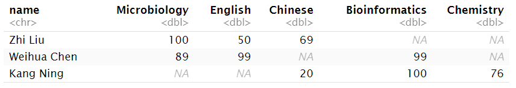{:width=80 height=80}
特点：自然、易理解，但不易处理、且稀疏时问题较大
**长数据**：列少行多，如
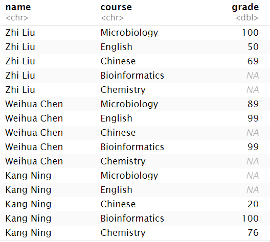{:width=250 height=250}
##### pivot_longer/wider系列
宽变长：`pivot_longer(要改变的列, names_to, values_to)`
- `names_to`把原列名变成一个新列的列名
- `values_to`原列对应的值变成的新列的列名

比如上例中实现转换的代码为：
```
grades_long <- grades_wide %>% 
  pivot_longer( - name, names_to = "course", values_to = "grade" )
```
`-name`表示除了`name`的剩下列，`name`列不改变。原列名表示学科名，现在让它们都存到`course`列中，`grade`列表示每个course对应的值
`pivot_longer`还可以接收`values_drop_na = TRUE`参数，用于消除值为NA的行

---

长变宽：`pivot_wider( names_from, values_from)`
- `names_from`列名来自哪列
- `values_from`列的值来自哪列

比如上例中实现转换的代码为：
```
grades_wide <- grades_long %>% 
  pivot_wider( names_from = "course", values_from = "grade" )
```
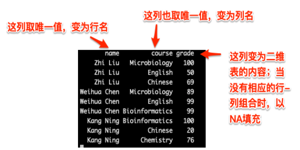{:width=200 height=200}

---

例1：
```
mini_iris <- iris[ c(1, 51, 101),  ];
```
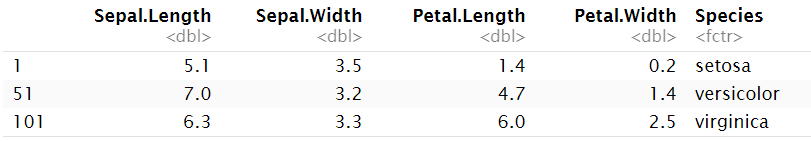{:width=80 height=80}
宽变长：
```
mini_iris.longer <- mini_iris %>% 
  pivot_longer( - Species, names_to = "type", values_to = "dat" )
```
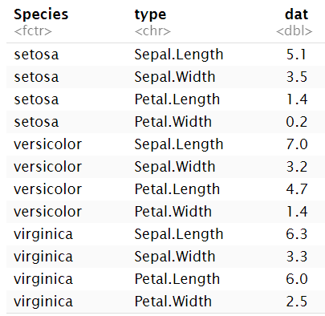{:width=250 height=250}
长变宽：
```
mini_iris.wider <- mini_iris.longer %>% 
  pivot_wider( names_from =  "type", values_from = "dat" )
```

---

例2：较复杂，有3列以上的长数据
```
grades_long <- read_delim( file = "./r-data/grades3.txt", delim = "\t",
                           quote = "", col_names = T)
```
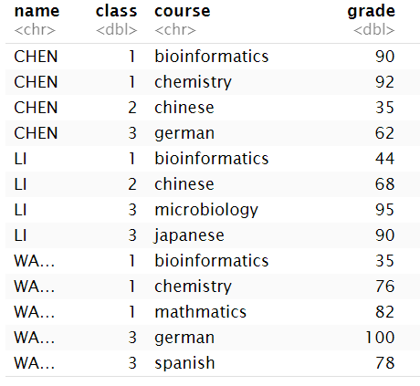{:width=250 height=250}
长变宽：
```
grades_wide <- grades_long %>% 
  pivot_wider( names_from = course, values_from =  grade )
```
同之前的例子，默认没改的两列保留
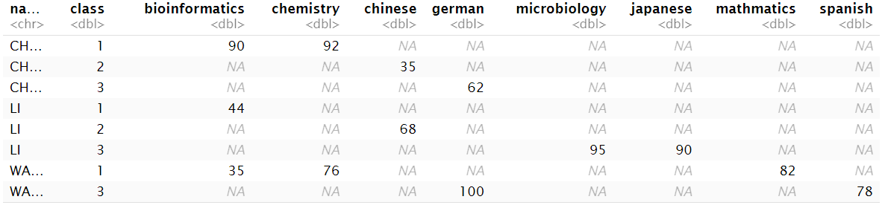{:width=80 height=150}
宽变长：
```
grades_wide %>% 
  pivot_longer( ! c( name, class ), 
                names_to = "course", values_to = "grade", 
                values_drop_na = T )
```
`!`加上一个vector表示其中元素是想保留的列，`!`相当于前面的`-name`中减号的作用
也可以：
```
grades_wide %>% 
  pivot_longer( bioinformatics:spanish, 
                names_to = "course", values_to = "grade", 
                values_drop_na = T )
```
表示想改变bioinf-spanish的列
##### gather和spread系列
[参考文章](https://zhuanlan.zhihu.com/p/108144320)
宽变长：`gather(合并后新列名, 合并后新列对应数值列名, 要合并的列)`
长变宽：`spread(新列名来自哪列, 新列值来自哪列)`
例：
宽数据为
{:width=80 height=250}
长数据为
{:width=80 height=200}
宽变长：
```
long <- wide %>% 
  gather(Quarter, Revenue, Qtr.1 : Qtr.4)
```
- `Quarter`：合并后新列的列名
- `Revenue`：合并后新列对应数值列的列名
- `Qtr.1 : Qtr.4`：把原始数据中的Qtr.1列到Qtr.4列合并在一起

长变宽：
```
wide <- long %>%
  spread(Quarter, Revenue)
```

---

`separate()`将含有文字的一列，按照某种规律将文字分开至多列
用法：`separate(data, col, into, sep = "[^[:alnum:]]+", remove=T, convert=F)`
- `data`：为要处理的数据
- `col`：要分开的列名
- `into`：一个字符串vector，指定分开后的新列名
- `seq`：指定分隔符，默认为非字母数字字符
- `remove`：是否删除原始列
- `convert`：是否将分开后的列转换成相应的数据类型

原始数据：
{:width=80 height=200}
```
data %>%
  separate(Quarter, c("Time_Interval", "Interval_ID"));
```
分隔后数据：
{:width=80 height=200}
表示将`Quarter`列分隔成`Time_Interval`和`Interval_ID`两列，默认按照非字母数字字符切分列值

`unite()`把分开的两列合并成一列，是`separate()`函数的反向操作
用法：`unite(data, 合并后新列名, 要合并的列1, 要合并的列2, ..., sep, remove=T)`
- `data`：为要处理的数据
- `seq`：指定合并时连接多个列值的符号

```
data %>%
  unite(Quarter, Time_Interval, Interval_ID, sep = ".");
```
就可以将上面的分隔后数据转回原始数据
### 字符串处理
##### R中自带函数
**单双引号区别**：如果想在字符串中写入单引号，就需要用单引号来包裹字符串，并用`\'`来转义；字符串中可以有双引号，无需转义，单双引号包裹均可
**多行字符串**：r中可以直接按回车换行来表示多行字符串
```
( string3 <- "a multiline 
string" );
# [1] "a multiline \nstring"
```
可以看到输出结果中有`\n`表示回车换行
**字符串长度**：`nchar(str)`，包含空格
```
nchar( c("a", "R for data science", NA) );
# [1]  1 18 NA
```
**字符串拼接**：`paste`和`paste0`，之前介绍过，这里只说一个比较特殊的地方，即它们的参数也可以是vector，进行循环调用
```
paste( c( "a", "b", "c" ), 2, sep = "|" );
# [1] "a|2" "b|2" "c|2"
paste0(2: 3, c("a", "b", "c"));  # 以长的为准
# [1] "2a" "3b" "2c"
```
**大小写转换**：
```
toupper( letters[1:10] );  # 小写变大写
# [1] "A" "B" "C" "D" "E" "F" "G" "H" "I" "J"
tolower( LETTERS[1:5] );  # 大写变小写
# [1] "a" "b" "c" "d" "e"
```
**字符串拆分**：`strsplit(str, split)`按照split拆分，以vector形式返回；若str是一个字符串数组，则以list(vector[str])形式返回
**字符串截取**：`substr(str, start, stop)`取[start, stop]位置的字符串，可以给该结果赋值以局部替换字符串
**字符串查询**：`grep(pattern, x, ...)`在x中找pattern（可以是正则表达式），返回第一次出现的索引；若x是一个字符串数组，则返回所有出现pattern的字符串在数组中的索引
`grepl`与它类似，只不过返回的是T/F，标识是否出现
[更多例子](https://www.jianshu.com/p/11bbfa8e98c5)
**字符串替换**：`gsub("目标字符", "替换字符", 对象)`可以使用正则表达式
[更多例子](https://blog.csdn.net/lztttao/article/details/82086346)
##### stringr和stringi包
是常用的字符串处理包，其中函数常用`str_`和`stri_`开头来命名
[关于stringr的更多详细介绍](https://blog.csdn.net/qq_45794091/article/details/132149212)
[关于stringr和stringi的更多详细介绍](https://www.jianshu.com/p/2e6137515c92)
<table><thead><tr><th>函数</th><th>功能</th></tr></thead><tbody><tr><td>str_c</td><td>字符串拼接</td></tr><tr><td>str_trim</td><td>去掉字符串的空格和TAB(\t)</td></tr><tr><td>str_sub</td><td>截取字符串</td></tr><tr><td>str_subset</td><td>返回匹配的字符串</td></tr><tr><td>str_count</td><td>字符串计数</td></tr><tr><td>str_length</td><td>字符串长度</td></tr><tr><td>str_sort</td><td>字符串值排序</td></tr><td>str_split</td><td>字符串分割</td></tr><td>str_detect</td><td>检查匹配字符串的字符</td></tr><tr><td>str_match</td><td>从字符串中提取匹配组。</td></tr><tr><td>str_replace</td><td>字符串替换</td></tr><tr><td>str_locate</td><td>找到匹配的字符串的位置。</td></tr><tr><td>str_extract</td><td>从字符串中提取匹配字符</td></tr><tr><td>str_to_upper</td><td>字符串转成大写</td></tr><tr><td>str_to_lower</td><td>字符串转成小写</td></tr><tr><td>str_to_title</td><td>字符串转成标题</td></tbody></table>

其中`str_match`、`str_replace`、`str_locate`、`str_extract`都有`_all`形式，表示操作整个字符串，如`str_extract_all`就是从字符串中提取所有的匹配字符

- `str_c(..., sep = "", collapse = NULL)`
  - sep: 用于字符串拼接，为字符串的分割符
  - collapse: 用于向量拼接，为向量字符串的分割
- `str_sub(string, start = 1L, end = -1L)`截取[start, stop]位置的字符串
- `str_subset(string, pattern)`返回匹配pattern的字符串
- `str_count(string, pattern = "")`计算字符串中指定字符的个数
- `str_replace(string, pattern, replacement)`替换字符串中的部分字符
- `str_detect(string, pattern)`检查字符串中是否包含指定字符，返回逻辑向量
- `str_locate(string, pattern)`返回匹配到的字符的位置
- `str_match(string, pattern)`返回匹配到的字符，以矩阵形式返回，如果string是字符串是字符串数组，就以矩阵列表形式返回
- `str_extract(string, pattern)`返回匹配到的字符，以数组形式返回，如果string是字符串是字符串数组，就以数组列表形式返回
##### 其它
**字符串比较**：
- 使用`>` `<` `==`等直接进行比较，是按照字符的ASCII码
  ```
  "A" > "abc";  # FALSE
  "A" == "abc";  # FALSE
  "abc" < "abcd";  # TRUE
  ```
- 使用`pracma`包中的`strcmp(s1, s2)`和`strcmpi(s1, s2)`比较两个字符串/字符串数组是否相等，strcmpi是忽略大小写
  ```
  library(pracma); 
  strcmp("a", "ab");  # FALSE
  strcmpi(c("a", "b"), c("B", "A"));  # FALSE
  strcmpi(c("A", "B"), c("A", "B"));  # TRUE
  ```
### R中的循环
##### 普通for循环
```
for(i in 可迭代对象){
  # 循环体
}
```
例：计算指定df的行平均值
```
res1 <- vector("double", nrow(df));  
# 初始化结果数组，生成长度为nrow(df)的元素为double类型的数组，每个元素默认值为0
for(row_idx in 1:nrow(df)){
  res1[row_idx] <- mean(as.numeric(df[row_idx, ]));  # 计算行平均值
}
```
另一种方法
```
res2 <- c();  # 初始化空数组
for(row_idx in 1:nrow(df)){
  res2[length(res2) + 1] <- mean(as.numeric(df[row_idx, ]));  # 不断往里面添加新结果
}
```
由于运行效率可能比较低，尽量使用for循环的替代：
```
rowMeans(df);  # 行平均值
colMeans(df);  # 列平均值
rowSums(df);  # 行和
colSums(df);  # 列和
```
##### apply系列函数

