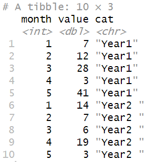
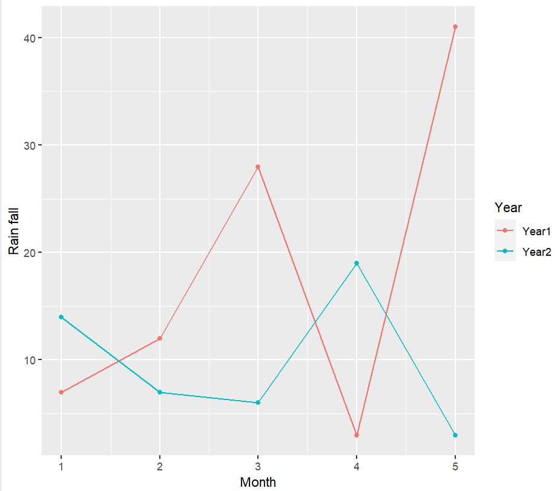
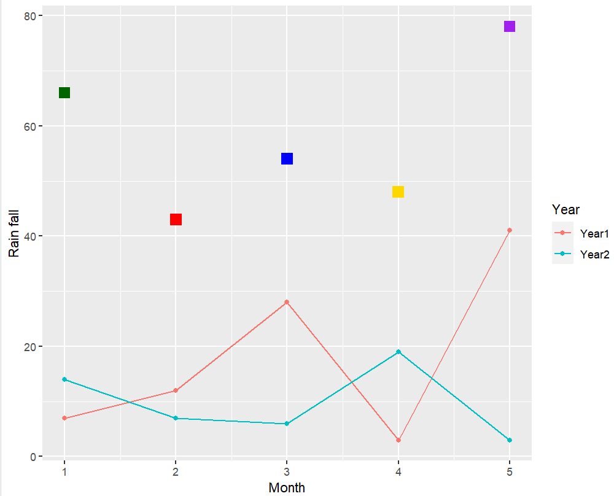
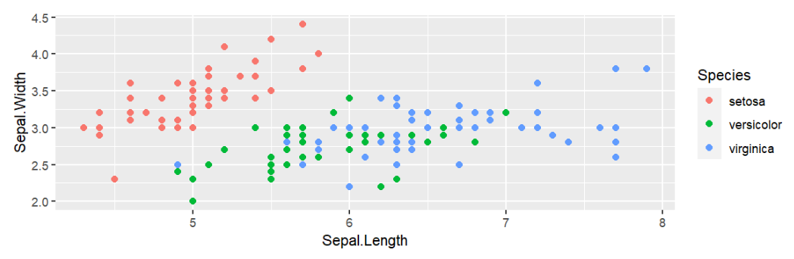
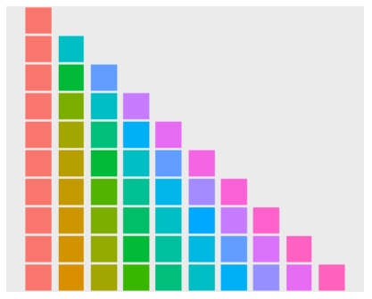
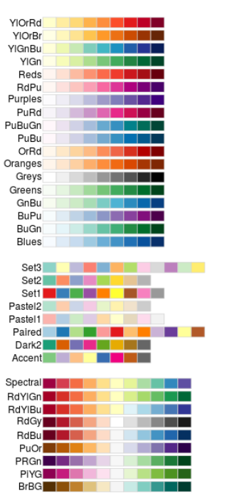
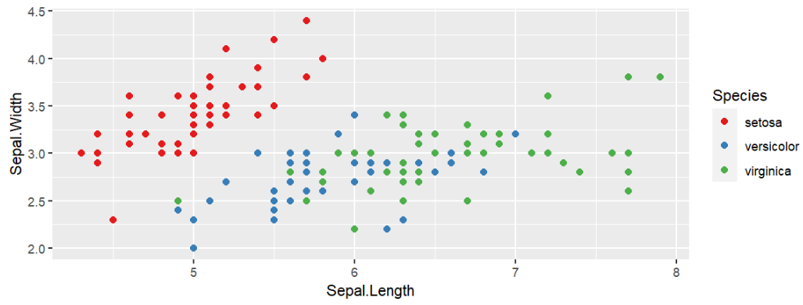
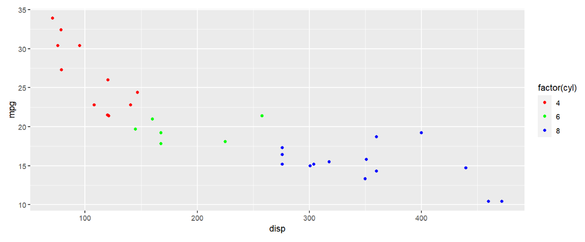

<a id="mulu">目录</a>
<a href="#mulu" class="back">回到目录</a>
<style>
    .back{width:40px;height:40px;display:inline-block;line-height:20px;font-size:20px;background-color:lightyellow;position: fixed;bottom:50px;right:50px;z-index:999;border:2px solid pink;opacity:0.3;transition:all 0.3s;color:green;}
    .back:hover{color:red;opacity:1}
    img{vertical-align:bottom;}
</style>

<!-- @import "[TOC]" {cmd="toc" depthFrom=3 depthTo=6 orderedList=false} -->

<!-- code_chunk_output -->

- [并行计算](#并行计算)
- [ggplot2基础](#ggplot2基础)
    - [基本参数](#基本参数)
    - [ggplot2作图的四个基本组成部分](#ggplot2作图的四个基本组成部分)
    - [scale显示控制](#scale显示控制)
      - [color](#color)

<!-- /code_chunk_output -->

<!-- 打开侧边预览：f1->Markdown Preview Enhanced: open...
只有打开侧边预览时保存才自动更新目录 -->

写在前面：本篇内容及例子（除标注了参考文章/具体案例的部分，以及一些比较零碎的小知识点）均来自[华中科技大学--组学数据分析与可视化课程--大二上](https://github.com/evolgeniusteam/R-for-bioinformatics) | [关于本课程的复习资料](https://github.com/Lucas04-nhr/Review-of-R) | [课程作业答案](https://github.com/Lucas04-nhr/R-for-Data-Science/tree/main/Exercises%20and%20homework) | [课程作业答案--中文注释版](https://github.com/lwstkhyl/r_class_homework)

### 并行计算
即同时执行多个计算任务以加速整体的处理速度，通过在多个处理器或多个计算节点上同时执行代码来实现
一般需要**3个步骤**：
- 分解并发放任务
- 分别计算
- 回收结果并保存
**相关的包**：
- `parallel`包：显示CPU core数量，将全部或部分CPU核心分配给任务。在任务完成后，要回收分配的CPU core
- `foreach`包：提供`%do%`和`%dopar%`操作符，以提交任务，进行顺序或并行计算
- 辅助包`iterators`：将data.frame、tibble、matrix等数据结构分割为行/列，用于提交并行任务

```
install.packages( "parallel" );
install.packages( "foreach" );  # 会自动安装 iterators 
```

---

一个简单的例子：
```
library(parallel); 
library(foreach);
library(iterators);
# 检测有多少个CPU core
cpus <- parallel::detectCores();  # 返回一个整数，表示CPU core数量
# 创建一个data.frame 
d <- data.frame(x=1:10, y=rnorm(10));
# 创造一个cluster集群进行计算
cl <- makeCluster( cpus - 1 );
# 分配任务
res <- foreach( row = iter( d, by = "row" ) ) %dopar% {
  return ( row$x * row$y  );
}
# 注意在最后关闭创建的cluster，释放资源
stopCluster( cl );
```
补充说明：
```
res <- foreach( row = iter( d, by = "row" ) ) %dopar% {
  return ( row$x * row$y  );
}
```
其中
- `row = iter( d, by = "row" )`表示将输入数据`d`按行row或列col遍历，每次取出一行/一列，赋予`row`这个变量（可随意取名）
- `foreach`函数将数据`row`分发给`cl`（这里没有体现出来），进行计算`row$x * row$y`，并返回结果
- `.combine = 'c'`参数规定将返回结果合并为vector
  该参数的可能值：
  - `'c'`将返回值合并为vector，当返回值是单个数字或字符串的时候使用
  - `'cbind'`将返回值按列合并
  - `'rbind'`将返回值按行合并
  - 默认情况下返回list

---

**`foreach`函数的其它参数**`.packages=NULL`：将需要的包传递给任务，例如当每个任务需要提前装入tidyverse包时，可以`.packages=c("tidyverse")`
**嵌套`foreach`**：有些情况下需要用到嵌套循环，使用以下语法--
```
foreach( ... ) %:% {
  foreach( ... ) %dopar% {
    # 语句
  }
}
```
即外层的循环部分用`%:%`操作符

---

例：将下面的计算转为并行计算
```
mtcars %>% 
    split( .$cyl ) %>% 
    map( ~ cor.test( .$wt, .$mpg ) ) %>% 
    map_dbl( ~.$estimate );
```
运行结果为：
```
         4          6          8 
-0.7131848 -0.6815498 -0.6503580 
```
使用并行计算：
```
cpus <- parallel::detectCores();
cl2 <- makeCluster( cpus - 1 );
res2 <- foreach( 
    df = iter(  mtcars %>% split( .$cyl )  ), 
    .combine = 'rbind' 
    ) %dopar% {
        cor.res <- cor.test( df$wt, df$mpg );
        return ( c(cor.res$estimate, cor.res$p.value) );  #注意这里的返回值是vector
    }
res2;
```
- `df = iter(mtcars %>% split( .$cyl ))`：将mtcars按汽缸数cyl分割为3个list，依次赋予`df`
- `cor.res <- cor.test(df$wt, df$mpg);`：计算每个`df`中wt与mpg的关联，将结果保存在`cor.res`变量中
- `.combine = 'rbind'`：由于返回值是vector，用此命令按行合并

运行结果为：
```
                cor           
result.1 -0.7131848 0.01374278
result.2 -0.6815498 0.09175766
result.3 -0.6503580 0.01179281
```
其中第二列是p值，第一列就是上面普通计算得到的结果

---

其它并行计算函数：`parallel`包本身也提供了`lapply`等函数的并行计算版本，包括`parLapply`、`parSapply`、`parRapply`、`parCapply`等
例：计算2的N次方
```
cl<-makeCluster(3);
parLapply(
  cl,  # 使用cl集群计算
  2:4,  # 要遍历的数据
  function(exponent)  # 将每个元素传给exponent
    2^exponent  # 返回2的exponent次方
);
stopCluster(cl);
```
运行结果为一个列表：
```
[[1]]
[1] 4

[[2]]
[1] 8

[[3]]
[1] 16
```
### ggplot2基础
[参考文章](https://zhuanlan.zhihu.com/p/503881951)
##### 基本参数
```
ggplot(data, aes(x, y, colour, fill, shape, size, group,...)) +
  geom_<layer_name>() +
  其它控制函数
```
- `data`标识使用的数据集
- `aes`(aesthetics)美学：控制全局参数，包括x,y轴使用的数据、颜色(colour、fill) 、形状 (shape)、大小(size)、分组(group)等等
- `geom_<layer_name>`绘制不同的图层：每张图可有多个图层，每个图层都可使用全局数据(`data`)和参数(`aes`)，也可以使用自己函数中指定的aes和数据
- `ggplot()`主函数与其它函数间使用`+`连接

一个例子：
- 准备数据
  ```
  year1 <- c(7, 12, 28, 3, 41);
  year2 <- c(14, 7, 6, 19, 3);
  df <- rbind( 
    tibble( month = 1:length( year1 ), value = year1, cat = "Year1" ),
    tibble( month = 1:length( year2 ), value = year2, cat = "Year2 ") 
  );
  ```
  {:width=200 height=200}
- 画图，并将结果保存都变量中
  ```
  plot1 <-  ## 将图保存在变量中；
    ggplot( df, aes( x = month, y = value, colour = cat) ) +  # 指定数据、xy轴使用哪列、根据哪列区分不同颜色
    geom_line() +  # 画折线
    geom_point() +  # 画点
    xlab( "Month" ) + ylab( "Rain fall" ) +  # 指定xy轴名称
    labs( colour = "Year");  # 图例
  ```
  {:width=400 height=400}
- 添加新图层，新图层使用自己的数据
  ```
  plot1 + 
    geom_point( 
      data = data.frame( x2 = 1:5, y2 = sample(30:100, 5) ),  # 注意data=是必须的
      aes( x = x2, y = y2 ),  # 使用自己的aes
      colour =  c("darkgreen", "red", "blue", "gold", "purple") , 
      shape = 15, 
      size = 4 
    );
  ```
  {:width=400 height=400}

从上面的例子中可以发现：
- xy轴范围会随数据自动调整
- ggplot2作图结果可以保存在变量中，并可在其基础上累加更多图层
- 图层使用自己的数据时，需要用`data=`指定；而全局数据（`ggplot(data,aes())`）则不用
##### ggplot2作图的四个基本组成部分
- **图层：`geom_<图层名>`**
  - `geom_point`/`geom_line`：点/线图，用于揭示两组数据间的关系
  - `geom_smooth`：拟合曲线图，常与`geom_point`联合使用，揭示数据走势
  - `geom_bar`：条形图
  - `geom_boxplot`：箱线图，用于比较N组数据，揭示区别
  - `geom_path`：与`geom_line`相似，但也可以画其它复杂图形
  - `geom_histogram`/`geom_density`：数据的分布，也可用于多组数据间的比较
- **scale显示控制**，基本语法为`scale_<控制内容>_<控制手段>`，例如`scale_color_manual`表示以手选方式(manual)控制颜色(color)
  4种基本控制：
  - `scale_color_...`（边框）颜色
  - `scale_fill_...`填充颜色（如果图中的点支持填充的话，如果不支持就只有color）
  - `scale_shape_...`形状
  - `scale_size_...`尺寸
- **坐标系统`coord_...`**
  - 线性坐标系统：
    - `coord_cartesian`默认使用的坐标系统，可以实现局部缩放的效果
    - `coord_flip`交换xy轴
    - `coord_fixed`用特定的长宽比例作图
  - 非线性坐标系统：
    - `coord_trans`对x/y轴进行变换，如让y轴取原来的log10，这样就得到不均匀的y轴
    - `coord_polar`极坐标图，可以实现柱图变饼图
    - `coord_map`用于地图的绘制
- **子图`facet_...`**：将一个数据集用多个子图来表示，每个子图表示数据集的不同子集
  - `facet_grid`指定将数据集按哪列分组 进行子图的绘制
  - `facet_wrap`指定子图的排列（几行几列、方向等）

之后会从这4部分完成对ggplot2基础的介绍
##### scale显示控制
###### color
一个关于颜色的简单图：
```
ggplot(iris,  # 使用iris数据
       aes(
         x=Sepal.Length,  # 长度
         y=Sepal.Width,  # 宽度
         color=Species  # 同物种的数据点有相同颜色
         )) +
  geom_point(size=2);  # 画散点图
```
{:width=200 height=200}
可以看到：
- `color=Species`指定了根据`Species`列决定颜色
- 共需要3种颜色
- 此时的颜色由默认色板决定
  {:width=150 height=150}
  根据需要的颜色数量，取相应的行

---

使用其它色板：`scale_colour_brewer(palette="<palette name>")`
{:width=550 height=550}
左侧为色板名称，右侧为其包含的颜色。使用时需要几种颜色，就取其前几种颜色
例：
```
ggplot(iris, aes(x=Sepal.Length, y=Sepal.Width, color=Species)) +
  geom_point(size=2) + 
  scale_color_brewer( palette = "Set1" );
```
{:width=200 height=200}

---

手动设置颜色：`scale_colour_manual(break=c(值1, 值2, ...), values=(c(颜色1, 颜色2, ...)))`
在此之前，需指定颜色根据哪列来取，该列值为`值1`的点颜色为`颜色1`
```
mtcars %>% 
  ggplot( aes(disp, mpg) ) + 
    geom_point( aes( color = factor(cyl) ) ) +
  # 也可以写成
  # ggplot(aes(x=disp, y=mpg, color=factor(cyl))) +
  #   geom_point() +
    scale_color_manual( 
      breaks = c("4","6","8"),  # cyl列值为4的点颜色为红色...
      values = c("red","green","blue") 
    );
```
{:width=200 height=200}
注意：使用该方法指定颜色根据哪列来取时，不能使用`color=列名`的方法，必须为`color=factor(列名)`，这是因为这个方法只能用于列值为离散值的情况，`factor`函数用于将这列的列值去重提取，便于与`scale_colour_manual`函数中的breaks参数适配
