<a id="mulu">目录</a>
<a href="#mulu" class="back">回到目录</a>
<style>
    .back{width:40px;height:40px;display:inline-block;line-height:20px;font-size:20px;background-color:lightyellow;position: fixed;bottom:50px;right:50px;z-index:999;border:2px solid pink;opacity:0.3;transition:all 0.3s;color:green;}
    .back:hover{color:red;opacity:1}
    img{vertical-align:bottom;}
</style>

<!-- @import "[TOC]" {cmd="toc" depthFrom=3 depthTo=6 orderedList=false} -->

<!-- code_chunk_output -->

- [ggplot2进阶](#ggplot2进阶)
    - [更多画子图的方式](#更多画子图的方式)
      - [cowplot包](#cowplot包)
      - [gridExtra包](#gridextra包)
      - [ggExtra包](#ggextra包)
    - [在图中写公式或统计信息](#在图中写公式或统计信息)
      - [如何写公式](#如何写公式)
      - [调整公式位置--hjust/vjust/angle](#调整公式位置-hjustvjustangle)
      - [希腊字符](#希腊字符)
      - [更多公式写法](#更多公式写法)
    - [先计算再做图--画图函数的计算方法](#先计算再做图-画图函数的计算方法)
    - [position参数--以柱形图为例](#position参数-以柱形图为例)
      - [堆叠柱状图(stacked bars)](#堆叠柱状图stacked-bars)
      - [并列柱状图](#并列柱状图)
    - [主题](#主题)
- [ggplot2实战](#ggplot2实战)
    - [swiss](#swiss)
    - [iris](#iris)

<!-- /code_chunk_output -->

<!-- 打开侧边预览：f1->Markdown Preview Enhanced: open...
只有打开侧边预览时保存才自动更新目录 -->

### ggplot2进阶
##### 更多画子图的方式
###### cowplot包
```
if (!require("cowplot")){ 
  install.packages("cowplot");
  library("cowplot");
} 
```
```
cowplot::plot_grid(
    子图对象1, 子图对象2, ... , 
    labels=c(图1名称, 图2名称, ...), 
    ncol = 总列数, 
    nrow = 总行数,
    byrow = TRUE,  # 第二个子图默认向右画
    ...
)
```
注意：`byrow`决定的是子图对象的位置，不决定`labels`的位置，`labels`都是向右延伸（第二个labels都在第一个labels的右面）
```
sp <- ggplot(mpg, aes(x = cty, y = hwy, colour = factor(cyl)))+
  geom_point(size=2.5);
bp <- ggplot(diamonds, aes(clarity, fill = cut)) +
  geom_bar() +
  theme(axis.text.x = element_text(angle=70, vjust=0.5));
cowplot::plot_grid(sp, bp, sp, labels=c("sp", "bp", "sp"), ncol = 2, nrow = 2);
cowplot::plot_grid(sp, bp, sp, labels = c("sp", "bp", "sp"), ncol = 2, nrow = 2, byrow = F);
```
{:width=400 height=400}
可以看到图的顺序发生了改变，而左上角标签的位置不变

---

**指定每个图的大小和位置**：`draw_plot(plot, x = 0, y = 0, width = 1, height = 1)`其中xy以及宽高取值均为0-1间，表示占整个图的百分比，坐标以左下角为原点
```
# 使用上面画的sp bp
plot.iris <- ggplot(iris, aes(Sepal.Length, Sepal.Width)) + 
  geom_point() + 
  facet_grid(. ~ Species) + 
  stat_smooth(method = "lm") +
  background_grid(major = 'y', minor = "none") + # add thin horizontal lines 
  panel_border();
(plot <- 
  ggdraw() +  # 相当于创建一个大的画板
  draw_plot(plot.iris, x=0, y=.5, width=1, height=.5) +
  draw_plot(sp, 0, 0, .5, .5) +
  draw_plot(bp, .5, 0, .5, .5));  # 分别画在大画板的哪个位置，以及高度宽度分别是多少
```
{:width=400 height=400}
**为每个子图设置标签**：`draw_plot_label(c(标签名), c(标签x轴位置), c(标签y轴位置))`
还可以设置字体颜色color、字体尺寸size等
```
plot +
  draw_plot_label(c("A", "B", "C"), c(0, 0, 0.5), c(1, 0.5, 0.5), size = 15);
```
表示"A"在x=0 y=1的位置，"B"在x=0 y=0.5的位置，"C"在x=0.5 y=0.5的位置
{:width=400 height=400}
###### gridExtra包
```
if (!require("gridExtra")){ 
  install.packages("gridExtra");
  library("gridExtra");
} 
```
**先创建子图对象**：
```
df <- ToothGrowth
df$dose <- as.factor(df$dose)

bp <- ggplot(df, aes(x=dose, y=len, color=dose)) +
  geom_boxplot() + 
  theme(legend.position = "none") + 
  labs( tag = "A");
dp <- ggplot(df, aes(x=dose, y=len, fill=dose)) +
  geom_dotplot(binaxis='y', stackdir='center')+
  stat_summary(fun.data=mean_sdl, mult=1, geom="pointrange", color="red")+
  theme(legend.position = "none") + 
  labs( tag = "B");
vp <- ggplot(df, aes(x=factor(dose), y=len)) +
  geom_violin()+
  geom_boxplot(width=0.1) + 
  labs( tag = "C");
sc <- ggplot(df, aes(x=dose, y=len, color=dose, shape=dose)) +
  geom_jitter(position=position_jitter(0.2))+
  theme(legend.position = "none") +
  theme_gray() + 
  labs( tag = "D");
```
`grid.arrange(子图对象1, 子图对象2, ... , ncol, nrow)`指定行列数：
```
grid.arrange(bp, dp, vp, sc, ncol=2, nrow =2);
```
{:width=400 height=400}
使用`layout_matrix`参数：由一个矩阵确定绘图区域的每个格子都画哪些图：
```
grid.arrange(bp, dp, vp, sc, ncol = 2, 
             layout_matrix = cbind(c(1,1,1), c(2,3,4)));
```
{:width=400 height=400}
- `c(1,1,1)`是第一列画哪些图，全是1就全画第一张图
- `c(2,3,4)`是第二列画第2 3 4张图

`cbind(c(1,1,1), c(2,3,4))`矩阵的样子：
```
     [,1] [,2]
[1,]    1    2
[2,]    1    3
[3,]    1    4
```
**另一个例子**：
```
grid.arrange(bp, dp, vp, sc, ncol = 3, 
             layout_matrix = cbind(c(1,1), c(2,2), c(3,4)));
```
{:width=400 height=400}

---

**gridExtra包与图例**：
实现效果：让两张图共享一个图例，图例显示在两张图的正上方
思路：把图例画成一张图，使用`grid.arrange`让第一行是图例，第二行是两张图
```
get_legend <- function(myggplot){
  tmp <- ggplot_gtable(ggplot_build(myggplot))
  leg <- which(sapply(tmp$grobs, function(x) x$name) == "guide-box")
  legend <- tmp$grobs[[leg]]
  return(legend)
}
```
该函数接收一个图，返回这个图中的图例
```
# 第一张子图（有图例）
bp <- ggplot(df, aes(x=dose, y=len, color=dose)) +
  geom_boxplot() + 
  labs(tag = "A") +
  theme(legend.position = "top");  # 让图例在图的上方
# 第二张子图（无图例）
vp <- ggplot(df, aes(x=dose, y=len, color=dose)) +
  geom_violin()+ 
  geom_boxplot(width=0.1) + 
  labs( tag = "B") +
  theme(legend.position="none");  # 去掉图例
# 将第一张子图的图例提取出来
legend <- get_legend(bp);
# 再删去第一张子图的图例
bp2 <- bp + theme(legend.position="none");
```
绘图：
```
grid.arrange(legend, bp2, vp,  ncol=2, nrow = 2, 
             layout_matrix = rbind(c(1,1), c(2,3)),
             widths = c(2.7, 2.7), heights = c(0.2, 2.5));
```
{:width=300 height=300}
其中widths和heights指定了第一行和第二行的宽高，第一行因为是图例，所以高度较小
`rbind(c(1,1), c(2,3))`矩阵的样子：
```
     [,1] [,2]
[1,]    1    1
[2,]    2    3
```
即第一行的两个格子全是第一张图的，第二行分别是第2/3张图
###### ggExtra包
用于向已有图中添加边缘直方图(marginal histograms)，展示数据的分布状况
```
if (!require("ggExtra")){ 
  install.packages("ggExtra");
  library("ggExtra");
} 
```
一个基本图：
```
(piris <- ggplot(iris, aes(Sepal.Length, Sepal.Width, colour = Species)) +
  geom_point());
```
{:width=300 height=300}
添加边缘直方图：
```
ggMarginal(piris, groupColour = TRUE, groupFill = TRUE);
```
{:width=300 height=300}
##### 在图中写公式或统计信息
###### 如何写公式
先看一个例子：
```
m = lm(Fertility ~ Education, swiss);  # 回归拟合分析
c = cor.test( swiss$Fertility, swiss$Education );  # 相关性分析
eq <- substitute(  # 写公式
  atop( 
    paste( italic(y), " = ",  a + b %.% italic(x), sep = ""),
    paste( italic(r)^2, " = ", r2, ", ", italic(p)==pvalue, sep = "" ) 
  ),
  list(
    a = as.vector( format(coef(m)[1], digits = 2) ),
    b =  as.vector( format(coef(m)[2], digits = 2) ),
    r2 =  as.vector( format(summary(m)$r.squared, digits = 2) ),
    pvalue =  as.vector( format( c$p.value , digits = 2) ) 
  )
); 
eq <- as.character(as.expression(eq));  # 先把eq转成公式，再变成字符串，以便写入图中
ggplot(swiss, aes( x = Education,  y = Fertility ) ) +  # 画图
  geom_point( shape = 20 ) +  # 散点图
  geom_smooth( se = T ) +  # 拟合曲线
  geom_text( data = NULL,  # 写文字
             aes( x = 30, y = 80, label= eq, hjust = 0, vjust = 1),  # 文字的内容和位置
             size = 4, parse = TRUE, inherit.aes=FALSE);
```
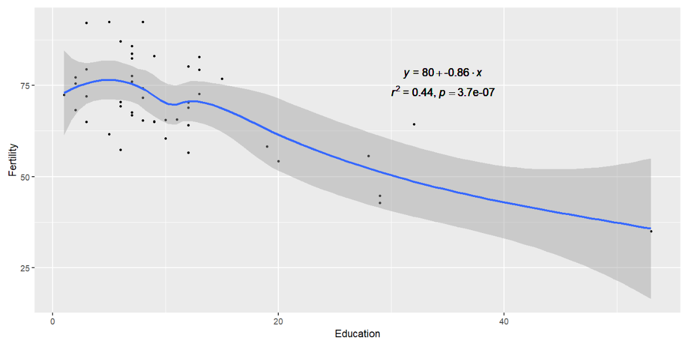{:width=300 height=300}
- `atop(<equation_1> , <equation_2>)`将两个公式上下放置，返回一个`<equation>`。其中`italic`函数将普通字符转为斜体加粗的公式变量形式
- `substitute(<equation>, list(变量名=值,...))`将公式中的变量名替换为数值，如上例中就是替换了`a` `b` `r2` `pvalue`
- `geom_text`
  - `data`是否需要继承前面的画图数据`swiss`
  - `aes(x, y, label)`标签的`x`/`y`位置及内容`label`
  - `size`文字大小
  - `family`字体
  - `nudge_x`/`nudge_y`设置文字距原坐标点的距离
  - `check_overlap=T`设置不画与同一层中的上一个文本重叠的文本
  - `parse=T`将字符串表示成公式形式
  - `inherit.aes=F`不继承之前的aes设置

**公式的写法1**：
```
paste( italic(y), " = ",  a + b %.% italic(x), sep = "")
paste( italic(r)^2, " = ", r2, ", ", italic(p)==pvalue, sep = "" )
```
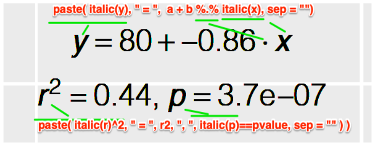{:width=200 height=200}
**公式的写法2**（不使用paste函数拼接）：
```
italic(y) == a + b %.% italic(x)
italic(r)^2~"="~r2*","~italic(p)==pvalue
```
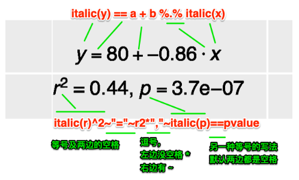{:width=300 height=300}
在这种方法中，引号两边必须有`*`或`~`字符，`~`表示空格，`*`表示什么都没有，`~~`表示两个空格
**公式中的代数负号**：
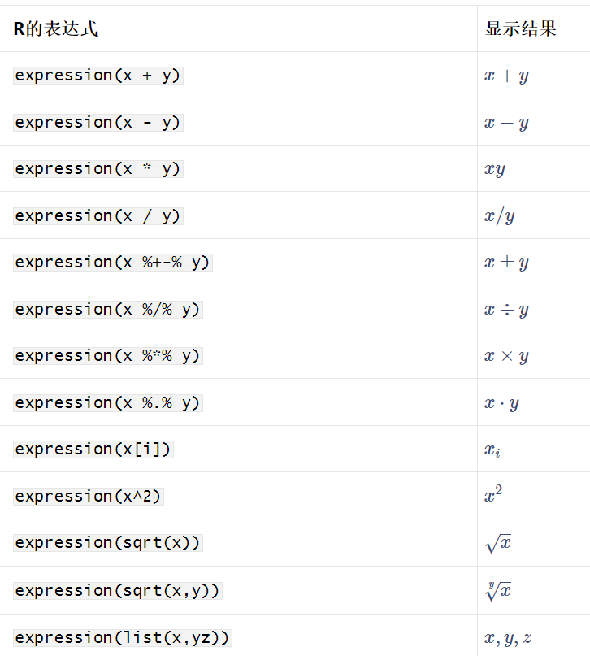{:width=500 height=500}
###### 调整公式位置--hjust/vjust/angle
[参考文章](https://juejin.cn/post/7130987741747085349)
- `hjust/vjust`调整水平/垂直方向的位置
  - `hjust`取值通常为0-1，0是左对齐（默认）、0.5是居中、1是右对齐
  - `vjust`取正值就是垂直向下移动，负值是向上移动
- `angle`使文本绕中心点旋转一定角度，取值为整数（正--逆时针、负--顺时针），单位为°

这三个参数可被用于各种需要写文字的地方，如坐标轴标签、文本注释等等
**例1**：
```
df = data.frame(team=c('The Amazing Amazon Anteaters',
                       'The Rowdy Racing Raccoons',
                       'The Crazy Camping Cobras'),
                points=c(14, 22, 11));
ggplot(data=df, aes(x=team, y=points)) +
  geom_bar(stat='identity') +
  theme(axis.text.x = element_text(angle=90)) ;
```
{:width=400 height=400}
使用hjust和vjust参数来调整x轴标签，使其与x轴上的刻度线更紧密地排列
```
ggplot(data=df, aes(x=team, y=points)) +
  geom_bar(stat='identity') +
  theme(axis.text.x = element_text(angle=90, vjust=.5, hjust=1));
```
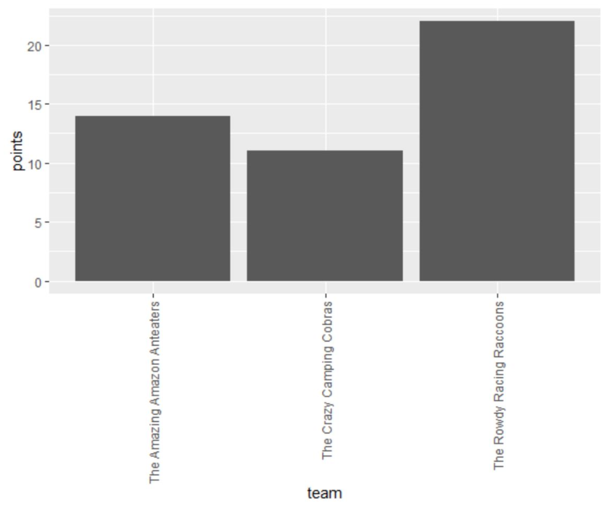{:width=400 height=400}
可以看到x轴标签向左/上移动了一些
**例2**：
```
df <- data.frame(player=c('Brad', 'Ty', 'Spencer', 'Luke', 'Max'),
                 points=c(17, 5, 12, 20, 22),
                 assists=c(4, 3, 7, 7, 5));
ggplot(df) +
  geom_point(aes(x=points, y=assists)) + 
  geom_text(aes(x=points, y=assists, label=player));
```
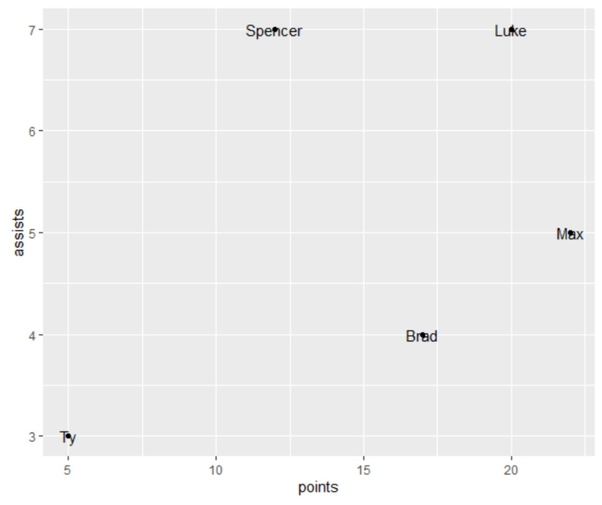{:width=300 height=300}
将文字向下移动使更容易阅读：
```
ggplot(df) +
  geom_point(aes(x=points, y=assists)) + 
  geom_text(aes(x=points, y=assists, label=player), vjust=1.2);
```
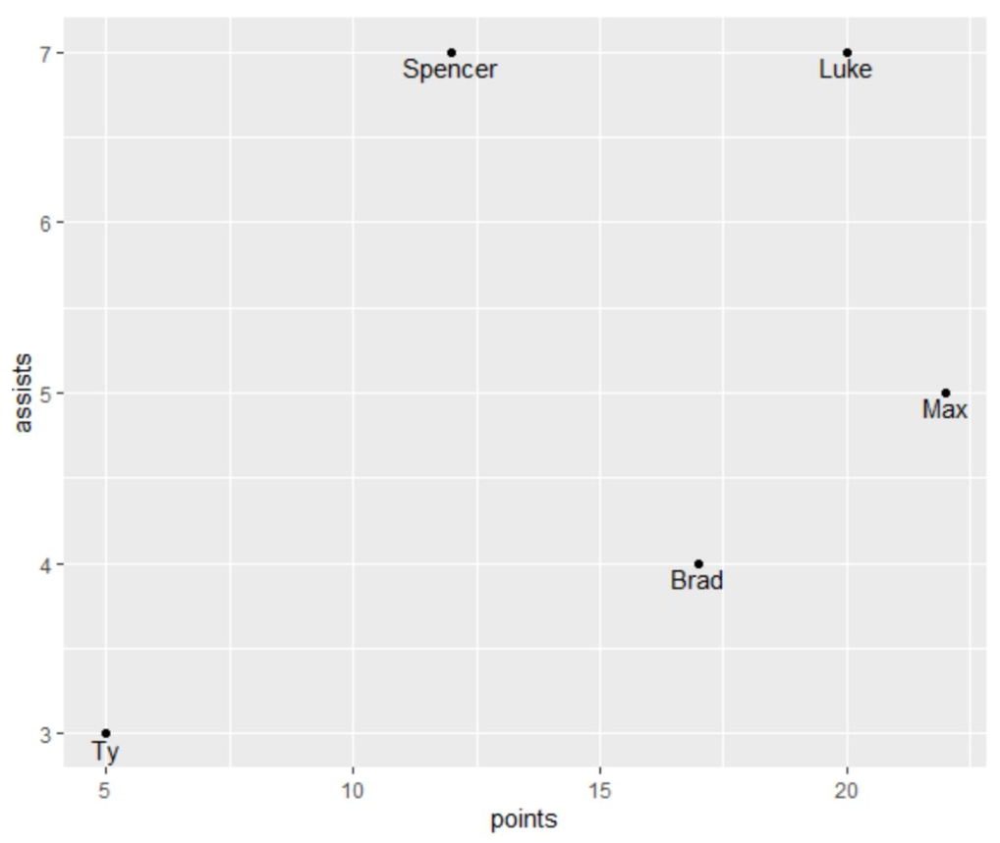{:width=300 height=300}
###### 希腊字符
`geom_text(aes(label="alpha"), parse=T)`
希腊字符的英文写法：
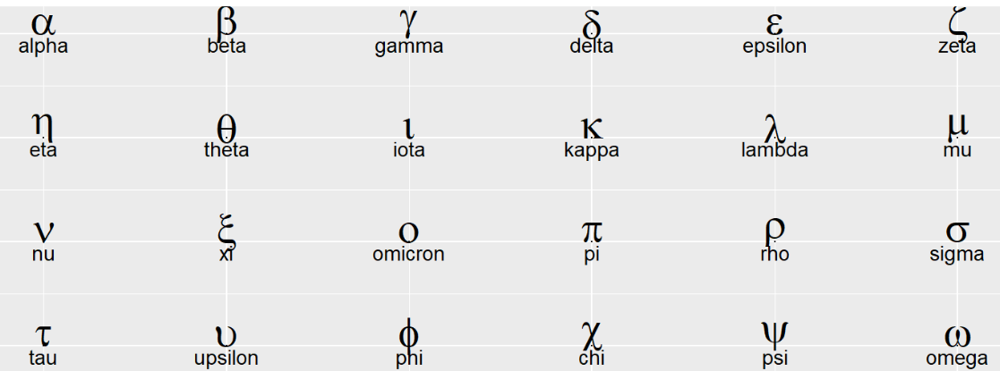{:width=300 height=300}
如何画出这个图？
思路：先画出4x6个点，再对点添加文本
准备数据：
```
greeks <- c("Alpha", "Beta", "Gamma", "Delta", "Epsilon", "Zeta",
            "Eta", "Theta", "Iota", "Kappa", "Lambda", "Mu",
            "Nu", "Xi", "Omicron", "Pi", "Rho", "Sigma",
            "Tau", "Upsilon", "Phi", "Chi", "Psi", "Omega");
dat <- data.frame( x = rep( 1:6, 4 ), y = rep( 4:1, each = 6), greek = greeks );  # rep是将数组复制多少次  
```
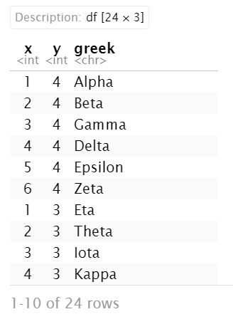{:width=300 height=300}
即每个文本对应的xy坐标
绘图：
```
plot2 <- 
  ggplot( dat, aes(x=x,y=y) ) + 
  geom_point(size = 0) +
  geom_text( aes( x, y + 0.1, label = tolower( greek ) ), size = 10, parse = T ) +
  geom_text( aes( x, y - 0.1, label = tolower( greek ) ), size = 5 );
```
注意两个`geom_text`的`label`都相同，但一个是写希腊符号，另一个是写普通英文，区别是`parse = T`参数，它控制是否要对字符串进行公式化转换
###### 更多公式写法
**例1**：分数、根号、指数
```
eq <- expression(
  paste(
    frac(1, sigma*sqrt(2*pi)), 
    " ",
    plain(e)^{frac(-(x-mu)^2, 2*sigma^2)}
  )
);
```
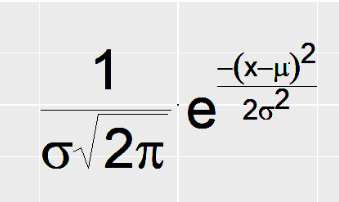{:width=150 height=150}
**例2**：`bquote`函数
```
x <- 1.24;
y <- 0.6;
ex <- bquote(
  .(
    parse(
        text = paste( 
          "observed (", 
          "italic(R)^2==",
          x,  
          "^bold(", x, "), 
          n == ", y, 
          ")", 
          sep = "  " 
        )
    )
  ) 
);
```
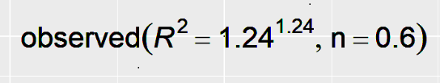{:width=100 height=100}
**例3**：`ggtitle()`指定标题不用写`parse = T`
```
x_mean <- 1.5;
x_sd <- 1.2;
ex <- substitute(
    paste(
      X[i], 
      " ~ N(", mu, "=", m, ", ", 
      sigma^2, "=", s2, ")"
    ),
    list(m = x_mean, s2 = x_sd^2)
);
ggplot( data.frame( x = rnorm(100, x_mean, x_sd) ), aes( x ) ) +
    geom_histogram( binwidth=0.5 ) +  # 直方图
    ggtitle(ex);  # 添加标题
```
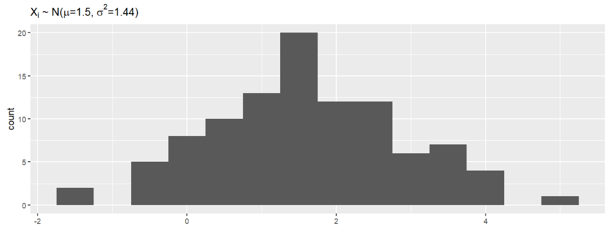{:width=300 height=300}
##### 先计算再做图--画图函数的计算方法
先看一个例子：
```
# 准备数据
grades2 <- read_delim( file = "data/grades2.txt", delim = "\t",
                       quote = "", col_names = T);
knitr::kable( grades2 );
```
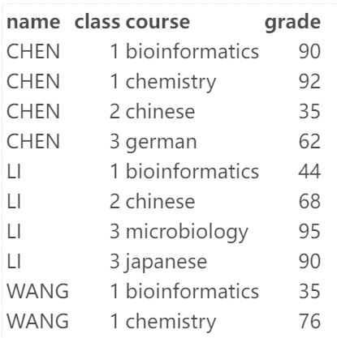{:width=200 height=200}
现在要画出每位学生及格的课程数，使用filter筛选行即可
```
ggplot( grades2 %>% dplyr::filter( grade >= 60 ), 
        aes( name ) ) +
  geom_bar();
```
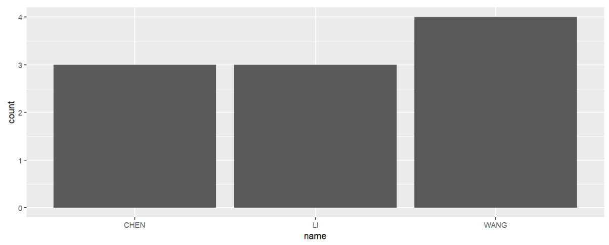{:width=300 height=300}
仔细观察上面的函数，我们只是筛选了行并给出了x轴取值，并没有分组和计算行数，但`geom_bar()`仍给出了正确的结果
这是因为`geom_bar()`中有一个默认的参数`stat = "count"`，它表示画图函数对数据的统计方法，柱状图默认是按x轴的数据分组并计算行数
以上函数实际相当于：
```
# 先做统计
cnt <- grades2 %>% 
  group_by( name ) %>% 
  summarise( cnt = sum( grade >= 60 )  );
ggplot( cnt, aes( x = name, y = cnt ) ) +
  geom_bar( stat = "identity" );  # 取消默认统计方法，按指定的df画图
```
其它画图函数的默认计算方法：
- `geom_bar` : count
- `geom_boxplot` : boxplot
- `geom_count` : sum
- `geom_density` : density
- `geom_histogram` : bin
- `geom_quantile` : quantile
##### position参数--以柱形图为例
###### 堆叠柱状图(stacked bars)
应用场景：宏基因组多样本物种丰度图
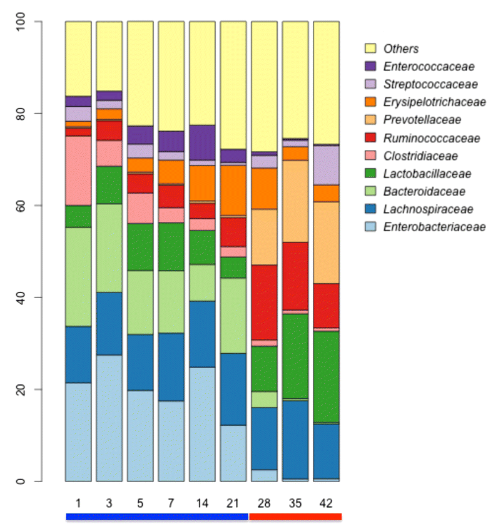{:width=300 height=300}
方法：为`geom_bar()`指定参数`position = "stack"`
例：
```
# 准备数据
speabu <-read_tsv( file = "data/mock_species_abundance.txt"  );
head( speabu );
```
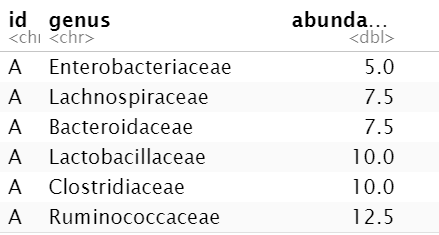{:width=150 height=150}
相同id的画一个柱子，柱子堆叠的每部分颜色不同（根据genus列来取），柱子高度由abundance列决定
```
ggplot( speabu, aes( x = id, y = abundance, fill = genus ) ) + 
  geom_bar( stat = "identity", position = "stack", color = "black", width = 0.2 );
```
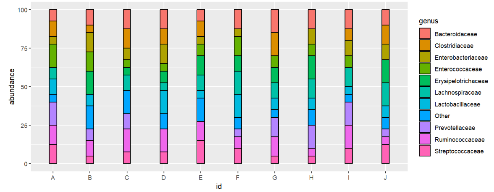{:width=300 height=300}
注意fill是填充色，而color是边框色

---

**需求1：指定Genus展示顺序**
思路：使用factor对Genus列进行重排
```
speabu$genus <- factor( speabu$genus, 
                        levels = rev( c( "Enterobacteriaceae", "Lachnospiraceae", "Bacteroidaceae", "Lactobacillaceae", "Clostridiaceae", 
                        "Ruminococcaceae", "Prevotellaceae", "Erysipelotrichaceae", "Streptococcaceae", "Enterococcaceae", "Other" ) ) );
ggplot( speabu, aes( x = id, y = abundance, fill = genus ) ) + 
  geom_bar( stat = "identity", position = "stack", color = "black", width = 0.8 );
```
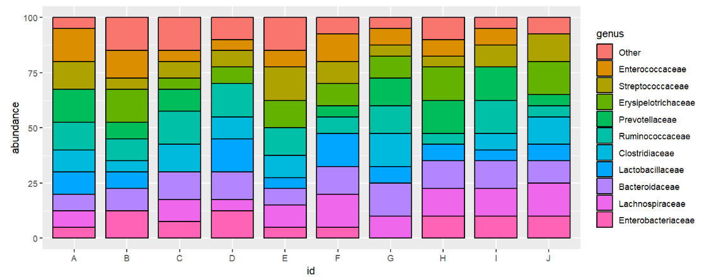{:width=300 height=300}

---

需求2：按丰度中值大小排序
使用reorder函数：`reorder(返回结果列, 顺序决定列, 排序方法)`
```
speabu$genus <- reorder( speabu$genus, speabu$abundance, median );
ggplot( speabu, aes( x = id, y = abundance, fill = genus ) ) + 
  geom_bar( stat = "identity", position = "stack", color = "white", width = 0.8 );
```
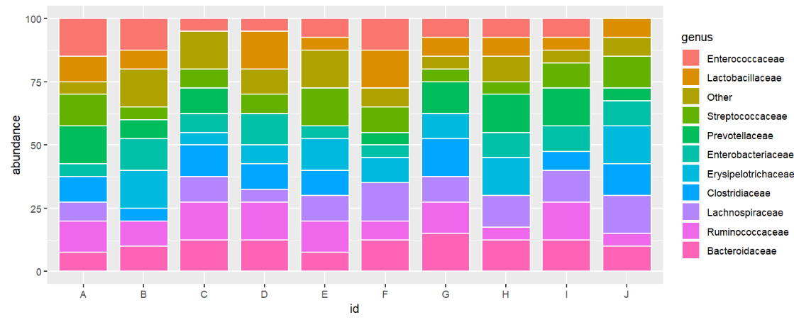{:width=300 height=300}

---

**需求3：显示数值**
即每个堆叠部分的占比（abundance值）
```
# 先计算显示位置
speabu <- speabu %>% 
  arrange( id, desc( factor( genus ) ) ) %>%  # 按id和genus排序
  group_by( id ) %>%  # 分组，让相同id的为一个柱子，每组单独计算位置
  mutate( ypos = cumsum( abundance ) - abundance / 2 );  # 累加，再减去一半的高度使文字居中
ggplot( speabu, aes( x = id, y = abundance, fill = genus ) ) + 
  geom_bar( stat = "identity", position = "stack", color = "black", width = 0.8 ) +
  geom_text( aes( y = ypos, label = paste( abundance, "%", sep = "" ) ), color = "white" );
```
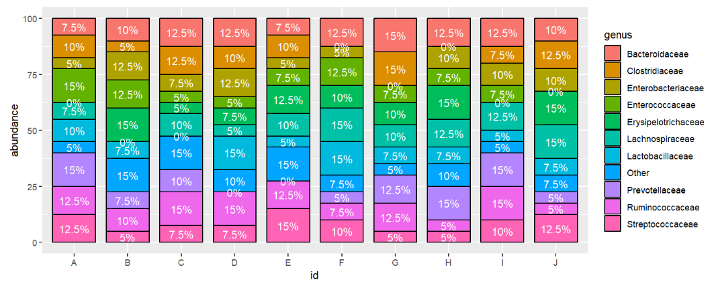{:width=300 height=300}
###### 并列柱状图
即让每个柱子不堆叠，而是相邻排列
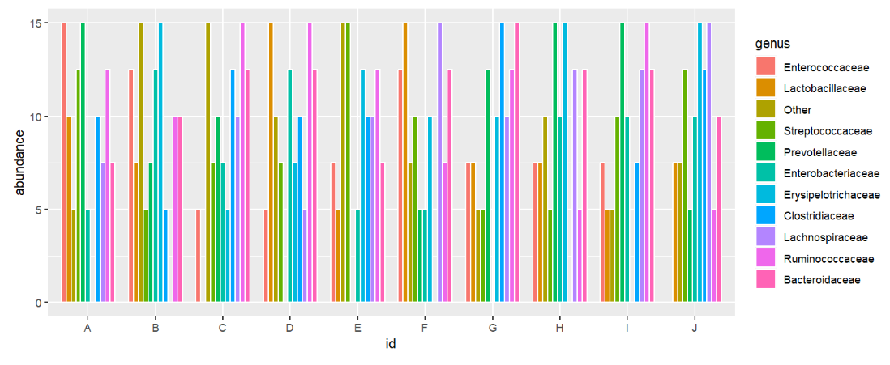{:width=300 height=300}
方法：为`geom_bar()`指定参数`position = "dodge"`或`position=position_dodge()`
```
ggplot( speabu, aes( x = id, y = abundance, fill = genus ) ) + 
  geom_bar( stat = "identity", position = "dodge", color = "white", width = 0.8 );
```

---

如何为并列的柱状图显示数值：使用`position_dodge`位置调整文本位置
```
# 准备数据
df2 <- data.frame(supp=rep(c("VC", "OJ"), each=3),
               dose=rep(c("D0.5", "D1", "D2"),2),
              len=c(6.8, 15, 33, 4.2, 10, 29.5));
```
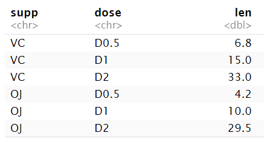{:width=150 height=150}
```
ggplot( df2, aes(x=factor(dose), y=len, fill=supp)) +
  geom_bar(stat="identity", 
           position=position_dodge())+
  geom_text(aes(label=len), vjust=1.6, color="black", size=3.5,
            position = position_dodge(0.9))
```
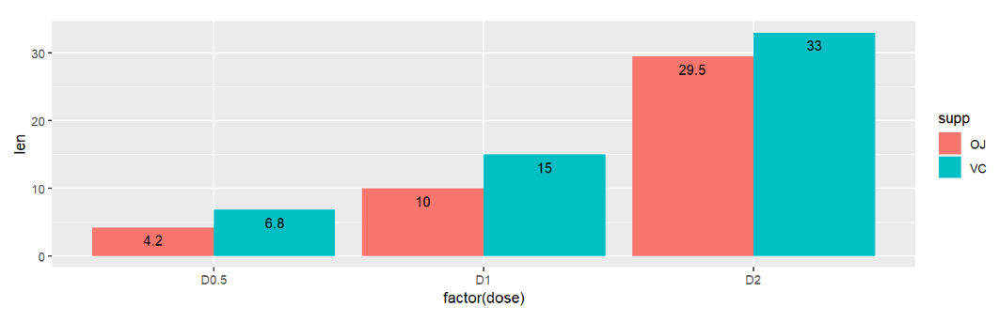{:width=150 height=150}
通过修改`position_dodge`里面的参数，可以调整文字和柱子的位置

---

position的其它取值：
- `position = position_identity()`：在指定位置，不改变
- `position = position_jitter()`：随机往别的地方移动使点不重叠
- `position = position_nudge()`：平移

[更多关于position系列函数](https://blog.csdn.net/weixin_54000907/article/details/120108707)
不同的画图函数有不同的默认position取值，比如柱形图是堆叠、箱型图是相邻
```
ggplot(ToothGrowth, aes(x=factor( dose ), y=len, fill=supp)) +
  geom_boxplot();
```
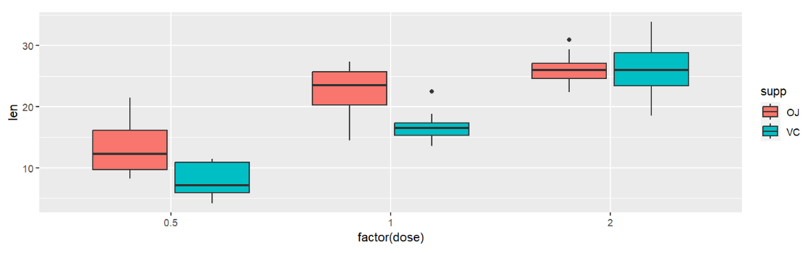{:width=300 height=300}
##### 主题
一般分为两种调整主题的方式：
- `theme(...)`自定义各个元素的样式
- `theme_xxx()`直接使用已经定制好的内容，包括`theme_bw`、`theme_linedraw`、`theme_light`、`theme_dark`、`theme_minimal`、`theme_classic`、`theme_void`和默认主题`theme_gray`

```
ggplot(ToothGrowth, aes(x=factor( dose ), y=len, fill=supp)) +
  geom_boxplot() + scale_fill_brewer( palette = "Paired" ) + theme_classic();
```
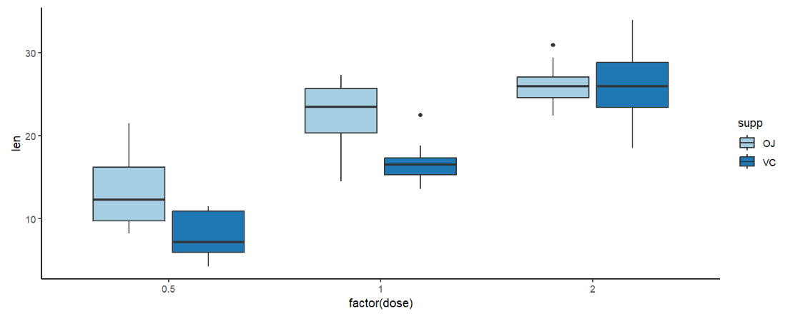{:width=300 height=300}

---

`theme()`函数：可用通式`theme(主题.部件=element_类型()/具体值)`表示
- 主题：`plot`整幅图、`axis`坐标轴、`legend`图例、`panel`面板、`facet`子图
- 部件：`title`名字，坐标轴名字、`line`线，坐标轴的xy轴, `text`标签，坐标轴刻度的数字、`ticks`坐标轴刻度的小线条、`background`背景、`position`位置、...
- 类型：`rect`区域、`line`线条、`text`文本

其中部件要和类型一致。如部件为title、text等文字相关的元素，那么类型处就应为text
[更多关于theme函数的应用](https://blog.csdn.net/zty0104/article/details/119646934)

---

除了theme函数，还有一些函数用于设置图样式，如`labs`：
```
labs(
  x = "<x label>",  # x轴标签
  y = "<y label>",  # y轴标签
  colour = "<legend title>",  # 与aes里的colour配合使用
  fill = "<legend title>",  # 与aes里的fill配合使用
  shape = "<legend title>",  # 与aes里的shape配合使用
  ...,
)
```
`colour/fill/shape`参数是为了给图例加标签，如果图在aes中按fill填充色进行区分并画图例，就使用`fill`参数给图例加标签
```
ggplot(ToothGrowth, aes(x=factor( dose ), y=len, fill=supp)) +
  geom_boxplot() + 
  scale_fill_brewer( palette = "Paired" ) + 
  labs( fill = "图例", x = "Dose (mg)" ) + 
  theme( legend.position = "top" );  # 调整图例位置为顶部
```
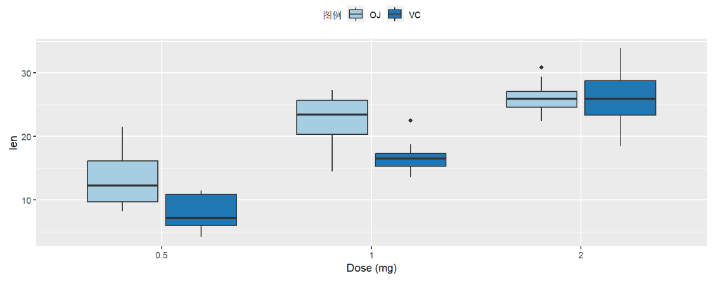{:width=300 height=300}
`labs`还可以同时为多个图例指定名称：
```
# 创建基础图
df <- ToothGrowth;
df$dose <- as.factor(df$dose);
sc <- ggplot(df, aes(x=dose, y=len, color=dose, shape=dose)) +
  geom_jitter(position=position_jitter(0.2))+
  theme(legend.position = "none") +
  theme_gray();
library("gridExtra");
grid.arrange(
  sc + labs(tag = "A"), 
  sc + labs( colour = "Dose (mg)" , tag = "B"),
  sc + labs( shape = "Dose (mg)" , tag = "C"),
  sc + labs( colour = "Dose (mg)", shape = "Dose (mg)", tag = "D"  ),
  ncol=4, nrow =1
);
```
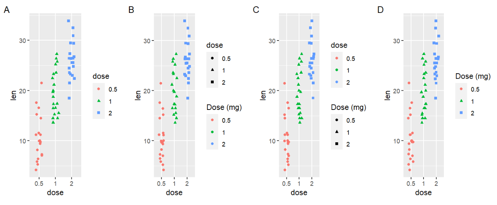{:width=300 height=300}
### ggplot2实战
##### swiss
用`swiss`数据做图
每道题都有R基础作图函数和ggplot2两个版本
**1.用直方图显示Catholic列的分布情况**
基础作图函数：
```
hist(
  x = swiss$Catholic,  # 数据
  main = "Catholic",  # 标题
  xlab = "Catholic"  # x轴标签
);
```
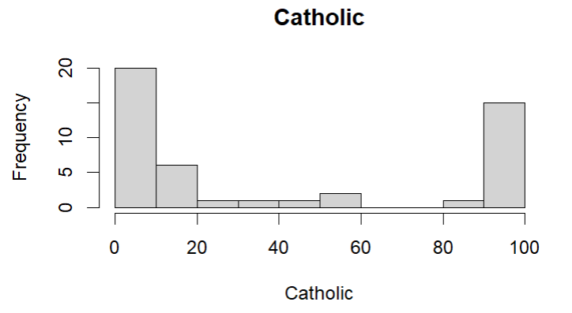{:width=300 height=300}
ggplot2：
```
ggplot(
  swiss,  # 使用的数据集
  aes( x = Catholic )  # 标明x轴的取自哪列
  ) +
  geom_histogram();  # 画直方图
```
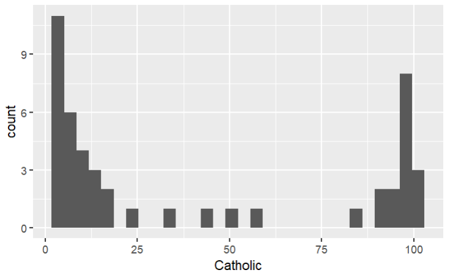{:width=300 height=300}
**2.用散点图显示Eduction与Fertility的关系**，同时将表示两者关系的线性公式、相关系数和p值画在图的空白处
因为要标注公式、相关系数和p值，所以首先要进行计算：
```
m <- lm(Fertility ~ Education,swiss);  # 线性回归
cor_val <- cor(swiss$Fertility, swiss$Education);  # 相关系数
p_val <- cor.test(swiss$Fertility,swiss$Education)$p.value;  # p值
a <- coef(m)[1];  # 回归线y=ax+b中的a
b <- coef(m)[2];  # 回归线y=ax+b中的b
```
基础作图函数：
```
with(swiss,plot(Education, Fertility, col = "blue"))  # 绘制基础散点图
abline(  # 添加拟合曲线
  lm(swiss$Fertility ~ swiss$Education),  # 回归线
  col="red"  # 线颜色
);
legend(  # 将文字作为图例进行添加
  "topright",  # 添加在右上角
  legend = paste(  # 图例内容
    "cor =", round(cor_val,2),  # 相关系数--保留2位小数
    "\n",
    "p =", format(p_val, scientific = T, digits = 2),  # p值--科学计数法，保留2位小数
    "\n",
    "y =",format(a ,digits = 2),"+",format(b ,digits = 2),"x",  # 公式，系数保留2位小数
    "\n"
  )
);
```
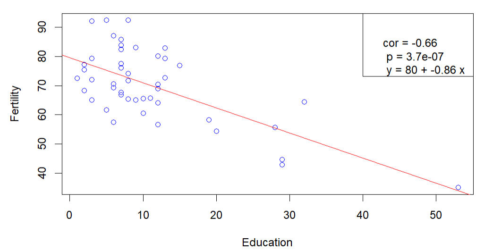{:width=300 height=300}
ggplot2：
```
ggplot(swiss, aes(x = Education, y = Fertility)) +
  geom_point(color = "blue", size = 3) +  # 绘制基础散点图
  geom_smooth(method = "lm", color = "red") +  # 添加拟合曲线
  labs(title = "Education~Fertility", x = "Education", y = "Fertility") +  # 标题和xy轴
  # 可以用之前讲过的as.expression(eq)方法添加，这里列举另一种添加方法
  annotate(  # 将文字作为注释进行添加
    "text",  # 声明注释的类型为文本
    x = 20, y = 35,  # 添加注释的位置
    label = paste(  # 注释内容--与基础作图函数中的相同
      "cor =", round(cor_val,2),
      "\n",
      "p =", format(p_val, scientific = T, digits = 2),
      "\n",
      "y =",format(a ,digits = 2),"+",format(b ,digits = 2),"x"
    )
  );
```
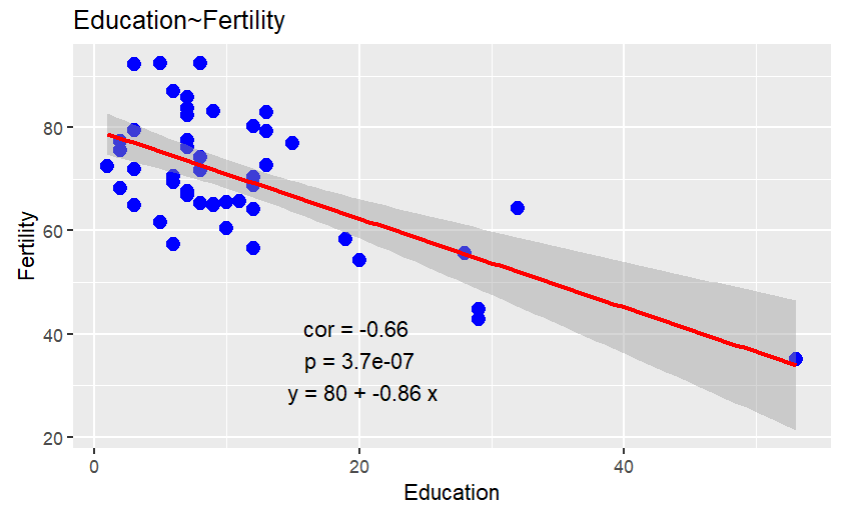{:width=300 height=300}
##### iris
用`iris`数据做图
每道题都有R基础作图函数和ggplot2两个版本
**1.用箱型图显示不同species的Sepal.Length的分布情况**
即x轴为species，y轴为Sepal.Length
基础作图函数：
```
boxplot(Sepal.Length ~ Species, data = iris);
```
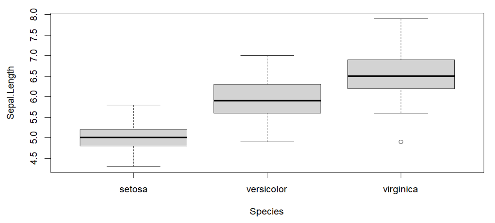{:width=300 height=300}
ggplot2：
```
ggplot(iris, aes(x = Species, y = Sepal.Length))+  # 指定数据集和xy轴
  geom_boxplot();  # 画箱型图
```
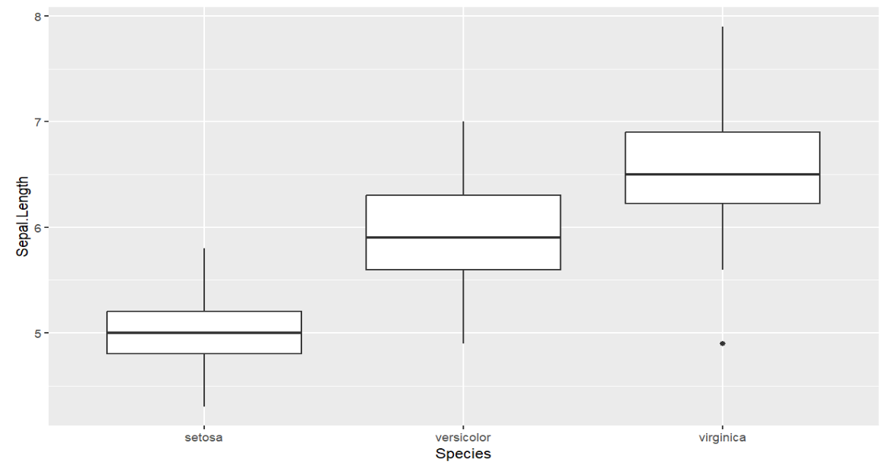{:width=300 height=300}
**2.用散点图显示Sepal.Length和Petal.Length之间的关系**，并根据species为点添加颜色，同时显示图例标明哪种颜色对应哪种species
