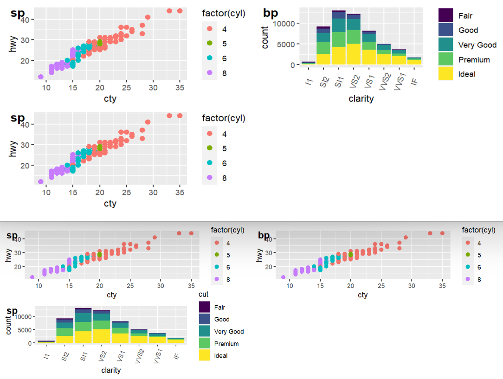
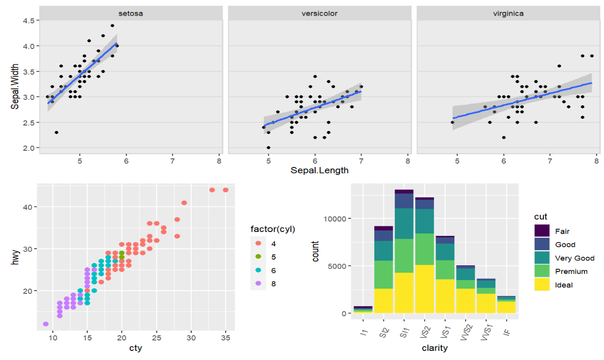
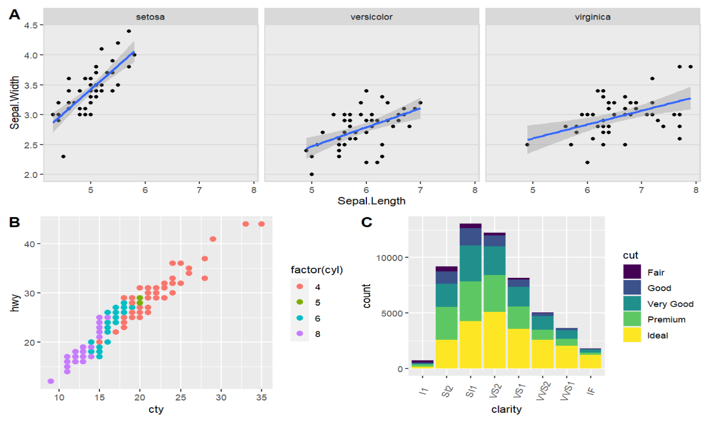
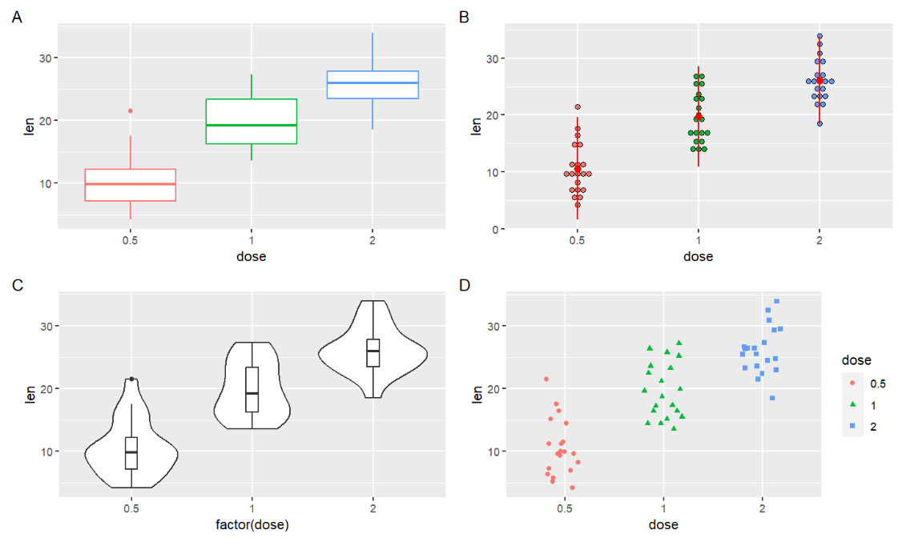
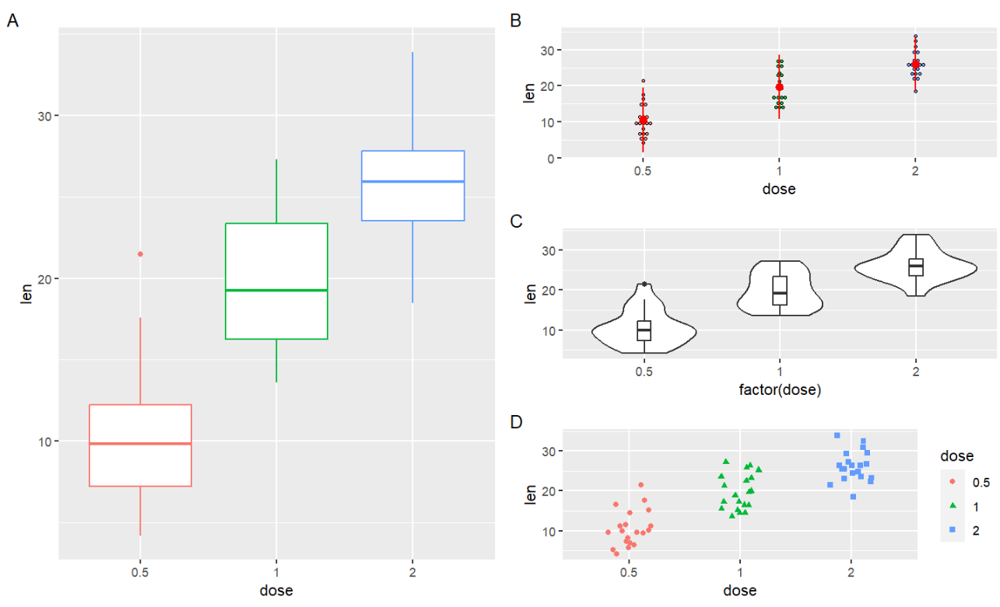
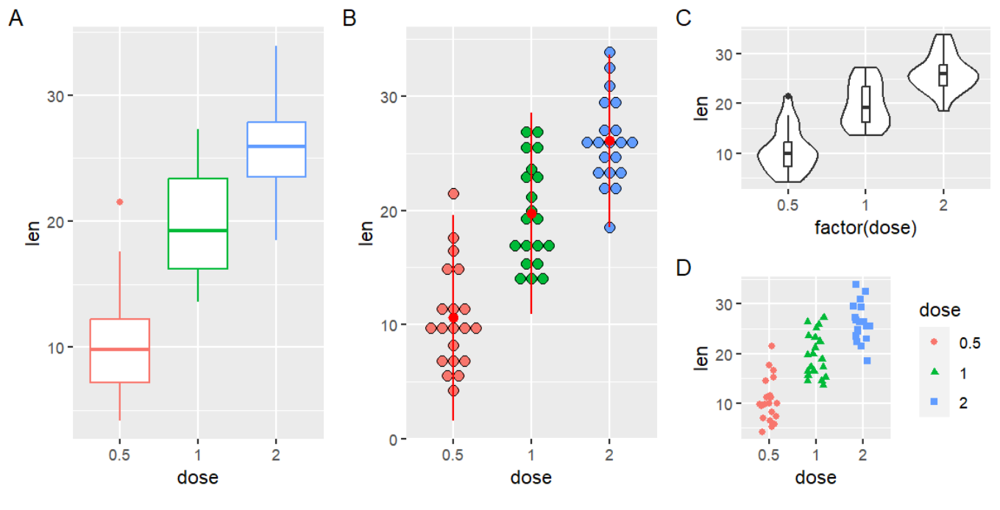
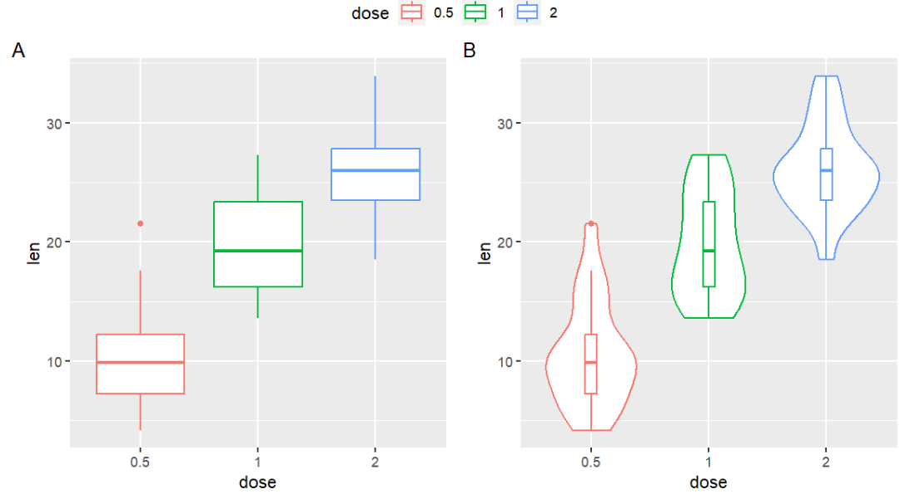
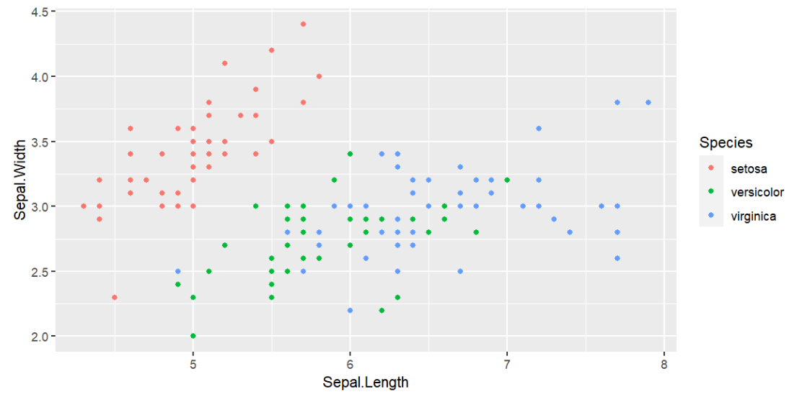
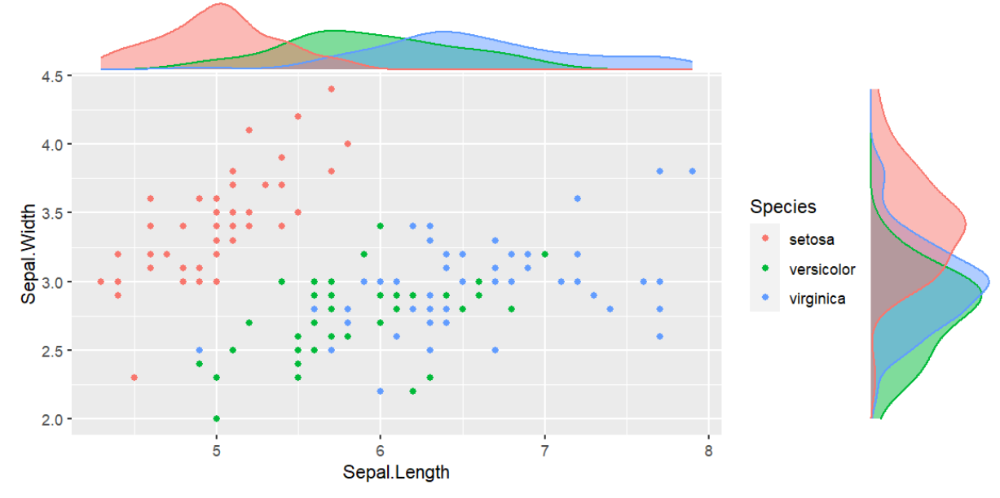

<a id="mulu">目录</a>
<a href="#mulu" class="back">回到目录</a>
<style>
    .back{width:40px;height:40px;display:inline-block;line-height:20px;font-size:20px;background-color:lightyellow;position: fixed;bottom:50px;right:50px;z-index:999;border:2px solid pink;opacity:0.3;transition:all 0.3s;color:green;}
    .back:hover{color:red;opacity:1}
    img{vertical-align:bottom;}
</style>

<!-- @import "[TOC]" {cmd="toc" depthFrom=3 depthTo=6 orderedList=false} -->

<!-- code_chunk_output -->

- [ggplot2进阶](#ggplot2进阶)
    - [更多画子图的方式](#更多画子图的方式)
      - [cowplot包](#cowplot包)
      - [gridExtra包](#gridextra包)
      - [ggExtra包](#ggextra包)

<!-- /code_chunk_output -->

<!-- 打开侧边预览：f1->Markdown Preview Enhanced: open...
只有打开侧边预览时保存才自动更新目录 -->

### ggplot2进阶
##### 更多画子图的方式
###### cowplot包
```
if (!require("cowplot")){ 
  install.packages("cowplot");
  library("cowplot");
} 
```
```
cowplot::plot_grid(
    子图对象1, 子图对象2, ... , 
    labels=c(图1名称, 图2名称, ...), 
    ncol = 总列数, 
    nrow = 总行数,
    byrow = TRUE,  # 第二个子图默认向右画
    ...
)
```
注意：`byrow`决定的是子图对象的位置，不决定`labels`的位置，`labels`都是向右延伸（第二个labels都在第一个labels的右面）
```
sp <- ggplot(mpg, aes(x = cty, y = hwy, colour = factor(cyl)))+
  geom_point(size=2.5);
bp <- ggplot(diamonds, aes(clarity, fill = cut)) +
  geom_bar() +
  theme(axis.text.x = element_text(angle=70, vjust=0.5));
cowplot::plot_grid(sp, bp, sp, labels=c("sp", "bp", "sp"), ncol = 2, nrow = 2);
cowplot::plot_grid(sp, bp, sp, labels = c("sp", "bp", "sp"), ncol = 2, nrow = 2, byrow = F);
```
{:width=400 height=400}
可以看到图的顺序发生了改变，而左上角标签的位置不变

---

**指定每个图的大小和位置**：`draw_plot(plot, x = 0, y = 0, width = 1, height = 1)`其中xy以及宽高取值均为0-1间，表示占整个图的百分比，坐标以左下角为原点
```
# 使用上面画的sp bp
plot.iris <- ggplot(iris, aes(Sepal.Length, Sepal.Width)) + 
  geom_point() + 
  facet_grid(. ~ Species) + 
  stat_smooth(method = "lm") +
  background_grid(major = 'y', minor = "none") + # add thin horizontal lines 
  panel_border();
(plot <- 
  ggdraw() +  # 相当于创建一个大的画板
  draw_plot(plot.iris, x=0, y=.5, width=1, height=.5) +
  draw_plot(sp, 0, 0, .5, .5) +
  draw_plot(bp, .5, 0, .5, .5));  # 分别画在大画板的哪个位置，以及高度宽度分别是多少
```
{:width=400 height=400}
**为每个子图设置标签**：`draw_plot_label(c(标签名), c(标签x轴位置), c(标签y轴位置))`
还可以设置字体颜色color、字体尺寸size等
```
plot +
  draw_plot_label(c("A", "B", "C"), c(0, 0, 0.5), c(1, 0.5, 0.5), size = 15);
```
表示"A"在x=0 y=1的位置，"B"在x=0 y=0.5的位置，"C"在x=0.5 y=0.5的位置
{:width=400 height=400}
###### gridExtra包
```
if (!require("gridExtra")){ 
  install.packages("gridExtra");
  library("gridExtra");
} 
```
**先创建子图对象**：
```
df <- ToothGrowth
df$dose <- as.factor(df$dose)

bp <- ggplot(df, aes(x=dose, y=len, color=dose)) +
  geom_boxplot() + 
  theme(legend.position = "none") + 
  labs( tag = "A");
dp <- ggplot(df, aes(x=dose, y=len, fill=dose)) +
  geom_dotplot(binaxis='y', stackdir='center')+
  stat_summary(fun.data=mean_sdl, mult=1, geom="pointrange", color="red")+
  theme(legend.position = "none") + 
  labs( tag = "B");
vp <- ggplot(df, aes(x=factor(dose), y=len)) +
  geom_violin()+
  geom_boxplot(width=0.1) + 
  labs( tag = "C");
sc <- ggplot(df, aes(x=dose, y=len, color=dose, shape=dose)) +
  geom_jitter(position=position_jitter(0.2))+
  theme(legend.position = "none") +
  theme_gray() + 
  labs( tag = "D");
```
`grid.arrange(子图对象1, 子图对象2, ... , ncol, nrow)`指定行列数：
```
grid.arrange(bp, dp, vp, sc, ncol=2, nrow =2);
```
{:width=400 height=400}
使用`layout_matrix`参数：由一个矩阵确定绘图区域的每个格子都画哪些图：
```
grid.arrange(bp, dp, vp, sc, ncol = 2, 
             layout_matrix = cbind(c(1,1,1), c(2,3,4)));
```
{:width=400 height=400}
- `c(1,1,1)`是第一列画哪些图，全是1就全画第一张图
- `c(2,3,4)`是第二列画第2 3 4张图

`cbind(c(1,1,1), c(2,3,4))`矩阵的样子：
```
     [,1] [,2]
[1,]    1    2
[2,]    1    3
[3,]    1    4
```
**另一个例子**：
```
grid.arrange(bp, dp, vp, sc, ncol = 3, 
             layout_matrix = cbind(c(1,1), c(2,2), c(3,4)));
```
{:width=400 height=400}

---

**gridExtra包与图例**：
实现效果：让两张图共享一个图例，图例显示在两张图的正上方
思路：把图例画成一张图，使用`grid.arrange`让第一行是图例，第二行是两张图
```
get_legend <- function(myggplot){
  tmp <- ggplot_gtable(ggplot_build(myggplot))
  leg <- which(sapply(tmp$grobs, function(x) x$name) == "guide-box")
  legend <- tmp$grobs[[leg]]
  return(legend)
}
```
该函数接收一个图，返回这个图中的图例
```
# 第一张子图（有图例）
bp <- ggplot(df, aes(x=dose, y=len, color=dose)) +
  geom_boxplot() + 
  labs(tag = "A") +
  theme(legend.position = "top");  # 让图例在图的上方
# 第二张子图（无图例）
vp <- ggplot(df, aes(x=dose, y=len, color=dose)) +
  geom_violin()+ 
  geom_boxplot(width=0.1) + 
  labs( tag = "B") +
  theme(legend.position="none");  # 去掉图例
# 将第一张子图的图例提取出来
legend <- get_legend(bp);
# 再删去第一张子图的图例
bp2 <- bp + theme(legend.position="none");
```
绘图：
```
grid.arrange(legend, bp2, vp,  ncol=2, nrow = 2, 
             layout_matrix = rbind(c(1,1), c(2,3)),
             widths = c(2.7, 2.7), heights = c(0.2, 2.5));
```
{:width=300 height=300}
其中widths和heights指定了第一行和第二行的宽高，第一行因为是图例，所以高度较小
`rbind(c(1,1), c(2,3))`矩阵的样子：
```
     [,1] [,2]
[1,]    1    1
[2,]    2    3
```
即第一行的两个格子全是第一张图的，第二行分别是第2/3张图
###### ggExtra包
用于向已有图中添加边缘直方图(marginal histograms)，展示数据的分布状况
```
if (!require("ggExtra")){ 
  install.packages("ggExtra");
  library("ggExtra");
} 
```
一个基本图：
```
(piris <- ggplot(iris, aes(Sepal.Length, Sepal.Width, colour = Species)) +
  geom_point());
```
{:width=300 height=300}
添加边缘直方图：
```
ggMarginal(piris, groupColour = TRUE, groupFill = TRUE);
```
{:width=300 height=300}
