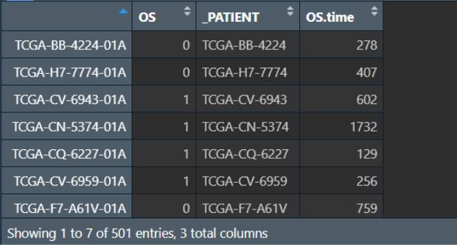

<a id="mulu">目录</a>
<a href="#mulu" class="back">回到目录</a>
<style>
    .back{width:40px;height:40px;display:inline-block;line-height:20px;font-size:20px;background-color:lightyellow;position: fixed;bottom:50px;right:50px;z-index:999;border:2px solid pink;opacity:0.3;transition:all 0.3s;color:green;}
    .back:hover{color:red;opacity:1}
    img{vertical-align:bottom;}
</style>

<!-- @import "[TOC]" {cmd="toc" depthFrom=3 depthTo=6 orderedList=false} -->

<!-- code_chunk_output -->

- [测序相关概念](#测序相关概念)
    - [标准化](#标准化)
- [常用分析方法](#常用分析方法)
    - [差异分析](#差异分析)
    - [单因素cox分析](#单因素cox分析)
    - [生存曲线](#生存曲线)
    - [分子互作网络](#分子互作网络)
    - [LASSO-COX筛选基因构建模型](#lasso-cox筛选基因构建模型)
      - [LASSO回归](#lasso回归)
      - [生存分析与ROC曲线](#生存分析与roc曲线)
    - [模型验证](#模型验证)
      - [内/外部验证](#内外部验证)
      - [独立性验证](#独立性验证)
    - [GO与KEGG富集分析](#go与kegg富集分析)
    - [免疫分析](#免疫分析)
    - [治疗反应](#治疗反应)
    - [总结](#总结)
- [常用数据库](#常用数据库)
    - [GEO数据库](#geo数据库)
      - [使用](#使用)
      - [使用R下载GEO数据](#使用r下载geo数据)
    - [TCGA数据库](#tcga数据库)
- [实战](#实战)
    - [数据预处理](#数据预处理)
      - [读取及转换成原始值](#读取及转换成原始值)
      - [过滤](#过滤)
      - [基因id转基因名](#基因id转基因名)
    - [差异表达分析](#差异表达分析)

<!-- /code_chunk_output -->

<!-- 打开侧边预览：f1->Markdown Preview Enhanced: open...
只有打开侧边预览时保存才自动更新目录 -->

写在前面：本篇教程来自b站课程[生信从0到1学习系列](https://www.bilibili.com/video/BV1ra4y117f3)
### 测序相关概念
- read：测序过程中要将一个基因切分成多个小段DNA，每对小段进行一次测序，就称为一次read
- count：一个基因所有read的总数
  在某样品中，基因A的count>基因B，但这不能说明基因A的表达一定比B高，可能只是因为基因A更长
  在两个样品中，其中一个样品基因A的count比另一个样品高，也不能说明这个样品基因A表达更多，可能是因为PCR时这个样品基因A扩增次数更多
- 转录本(transcript)：基因转录成pre-mRNA后，因为基因有内含子和外显子，需要对pre-mRNA进行剪切，有不同的剪切方法，产生不同的转录本
- 基因长度：有多少个碱基对（不包括内含子），大概有4种定义方式
  - 基因最长的转录本长度
  - 多个转录本长度的平均值
  - 非重叠外显子长度和（L1+L2+L3+L4）--常用
    {:width=50 height=50}
  - 非重叠编码序列长度和
- 测序深度：测序得到的碱基总量(bp)与基因组（或转录组、测序目标区域）大小的比值
    简单理解：PCR扩增后，DNA片段越多，测序的时候得到的碱基总量也就越多，测序深度越大

##### 标准化
- RPK：`count`/`基因长度`*10^3^，即每千个碱基的read数
    用于同一个样品中，比较不同基因表达量，可以减少基因长度的影响
- RPKM/FPKM：某个样品中`某基因的count值`/`该基因长度`/`所有基因count值之和`*10^9^，即每千个转录、每百万映射读取的read数
    {:width=300 height=300}
    在减少基因长度的影响后，再减少测序深度的影响
    单端测序使用RPKM，双端测序（得到正反两个测序结果）使用FPKM
    可以在样品内比较，无法在样品间比较。以上图为例，只能说明样品1中基因A表达量高于B，不能说明样品1中基因A表达量高于样品2中基因A表达量
- TPM：某个样品中`某基因的count值`/`该基因长度`/`所有基因count值与其基因长度比值之和`*10^6^，即每千个转录、每百万映射读取的transcripts
    {:width=200 height=200}
    {:width=200 height=200}
    既能组内比较，又能组间比较
- CPM（使用较少）：某个样品中`某基因的count值`/`所有基因的count值之和`*10^6^，即每百万映射读取的reads
    {:width=250 height=250}
    可以用于组件比较，不能用于组内比较

在使用R包作差异分析时，有些R包（如DESeq2）只能输入count值，而不能输入标准化后的值，因为它有自己的一套标准化算法，
总结：
{:width=100 height=100}
### 常用分析方法
以`用于头颈部鳞状细胞癌患者生存、治疗结果、免疫浸润的ADME相关基因签名的探索和验证`论文为例
ADME:药物在体内的吸收(Absorption)、分布(Distribution)、代谢(Metabolism)、和排泄(Excretion)，属于药代动力学研究的内容
##### 差异分析
通过肿瘤与正常细胞基因表达的差异，筛选出18353个差异表达基因
再将18353个差异表达基因与298个ADME基因取交集，得到160个差异表达的ADME基因
{:width=100 height=100}{:width=50 height=50}
##### 单因素cox分析
通俗来讲，就是为了研究哪类群体的“死亡”速度更快、什么因素影响了“死亡”速度
{:width=80 height=80}其中h~0~(t)为常数
两个简单的例子：
- 想知道性别对某疾病的影响，即是男性死亡风险高，还是女性死亡风险高。可以在t时刻，用女性的死亡风险除以男性的死亡风险，最后得到一个风险比，当其大于1且有统计学意义时就可以说女性死亡风险更高
- 想知道多个基因对死亡的影响，可以分别计算它们的风险比
    {:width=150 height=150}
无需记住公式，R包会提供函数进行计算

在实际应用中，会在很多个基因中进行筛选，如
{:width=200 height=200}
一共得到了19个有价值的差异表达基因，HR小于1为保护基因，大于1为风险基因
##### 生存曲线
如何验证通过单因素cox分析得到的基因是否真的有价值？
将每个基因根据表达量的中位数/均值，分为高表达与低表达两组，绘制曲线
曲线的横坐标为时间，纵坐标为生存概率
{:width=200 height=200}
比较同一时刻高/低表达组的生存概率，就可以知道单因素cox分析预测的是否准确
##### 分子互作网络
{:width=250 height=250}
- 圆圈：即旁边标注的基因
- 圈里有螺旋结构：代表这个基因的分子结构已知，没有则代表未知
- 圆圈颜色：不同颜色代表不同功能的基因
- 线条：表示基因之间存在的联系，没有则代表现在还不知道是否有联系
- 线条颜色：代表分子间不同的关系，具体可以在[string官网](http://string-db.org/) 中找到
##### LASSO-COX筛选基因构建模型
###### LASSO回归
{:width=250 height=250}
- 等号右边为n个影响因素及权重，X为影响因素，β为常数（代表对应X的权重）
- 等号左边的Y可以称为受它们影响的结果

在这些影响因素中，有些对结果的影响权重较高，有些较低。可以剔除一些影响因子，同时让Y不发生太大的改变，保留权值高的影响因子
LASSO回归提供了一个惩罚函数，逐渐让权值低的X的β=0，最后只留下必要的影响因子，从而简化模型

---

回归系数路径图：
{:width=300 height=300}
- 纵轴：回归系数
- 横轴：log λ（LASSO回归中的一个参数）
- 多少条线就代表了多少个变量的回归系数

随着λ不断变大，越来越多的回归系数收敛到0，回归方程越来越简单，最后只剩下Y=β~0~，这显然是不合理的，因此需要知道当λ为多少时才能得到合理的结果（保留多少个影响因素

---

交叉验证曲线：
{:width=300 height=300}
- 纵轴：似然偏差，越小代表拟合效果越好
- 横轴：log λ（同回归系数路径图）
- `λ min`：偏差最小时的log λ值，此时模型的拟合效果最好
- `λ1-se`（λ1减se）：表示`λ min`右侧的一个标准误，此时模型的拟合效果也很好，同时模型的变量更少、模型更简单
- 很多时候以λ1-se作为筛选标准，实际上`λ min`~`λ1-se`范围内都可以

---

通过LASSO回归，在上面的19个基因中筛选了其中14个关键基因
{:width=250 height=250}
去掉了其中4个影响权重较低的基因，同时保证了模型预测效果
###### 生存分析与ROC曲线
在完成上面的步骤后，根据14个关键基因在每个样本中的表达值，对每个样品进行风险打分。此例中共有274个样本，因此有274个风险得分
之后根据风险得分将这些样本分为高风险组和低风险组（设置分组阈值为风险得分的中位数）
对高/低风险组进行生存分析：
{:width=250 height=250}
并绘制ROC曲线：
{:width=250 height=250}
在ROC曲线中，只需关注AUC值，上图中对角线（灰色）即为AUC=0.5的基准线
- ROC曲线接近左上角（AUC值较大）：模型预测准确率高
- ROC曲线略高于基准线（AUC值略大于0.5）：模型预测准确率一般
- ROC曲线低于基准线（AUC值小于0.5）：模型未达到最低标准，无法使用
##### 模型验证
###### 内/外部验证
- 内部验证：将最开始建模所用到的数据集分成两部分，一部分用于建模，另一部分用于验证
- 外部验证：用另外一批测序的数据

重复上面的步骤：计算验证组风险得分，根据之前算出的分组阈值将它们分为高风险组和低风险组，画出生存分析图和ROC曲线
{:width=400 height=400}
可以看到内部验证效果较好（因为都来自同一批数据），外部验证中`1year`的效果较好，`2year`和`3year`效果一般
###### 独立性验证
即探究某个因素对预测结果的影响
此例中探究了淋巴血管是否浸润对结果的影响
按淋巴血管是否浸润分为有浸润组和无浸润组，对这两组分别重复上面的步骤（分为高风险组和低风险组，画出生存分析图），得到两张生存分析图
{:width=200 height=200}
在这两组中高风险组生存率都低于低风险组，且低/高风险组中出现浸润的病人比例类似
得出结论：生存分析结果不受淋巴血管是否浸润的影响
##### GO与KEGG富集分析
统计各差异表达基因的生物学功能
{:width=200 height=200}
纵轴为生物学功能，横轴为具有某项生物学功能的基因总数
{:width=200 height=200}
纵轴为生物学功能，横轴为具有某项生物学功能的基因比例
可以看到它们的p值很小，说明有统计学意义
此例中大多数基因都与免疫学功能有关，因此需要进行免疫分析
##### 免疫分析
为了弄清肿瘤组织中免疫细胞的构成比（免疫微环境），其对肿瘤的发展、治疗有很大作用
主要有2种方法：
- 单细胞测序，得到各个细胞亚群比例。缺点是成本很高
- 根据RNA-seq结果推测处组织中各免疫细胞构成

对高/低风险组分别进行免疫分析，并汇总到一个图上，可以得到各种免疫细胞在高/低风险组中的数量差别
{:width=300 height=300}
共统计了22种免疫细胞，其中10种（红色虚线部分）在高/低风险组中的比例有显著差异

---

免疫评分：将上面得到的有显著差异的免疫细胞单独进行风险评分
{:width=150 height=150}
图中的拟合曲线表明了该种免疫细胞对风险影响：斜率<0则有利，斜率>0则有害
三种评分：
- Stromal score(基质评分)：评估肿瘤组织中的基质细胞浸润水平
- Immune score(免疫评分)：评估肿瘤组织中的免疫细胞浸润水平
- Estimate Score(可推测帅瘤纯度) = stromal score + immune score

上述评分越高，肿瘤纯度越低，预后越好
{:width=200 height=200}
##### 治疗反应
即高/低风险组经过免疫治疗/化疗后的生存分析
{:width=400 height=400}
可以看到免疫治疗组预测效果较差，化疗组预测效果较好
##### 总结
{:width=300 height=300}
简化一下：
{:width=300 height=300}
- 差异分析是基础，它得到要进行分析的基因
- 富集分析让我们知道差异基因的哪项功能多，方便后续针对性的研究
- 互作网络得到分子间的相互作用
- 根据具体的临床问题构建相应的模型，并进行验证（内部、外部、实验验证）

为什么要实验验证？
基因表达，蛋白质不一定表达。而真正影响身体的是表达出的蛋白质，需要通过实验检测蛋白质的表达
### 常用数据库
##### GEO数据库
GEO数据库：由NCBI创建并维护的高通量基因表达数据库
有GEO Datasets和GEO Profiles两个子数据库：
- GEO Datasets：以基因为单位，存储基因在数据集中的表达谱
- GEO DataSets：以一次完整实验为单位，收录整个试验的数据集，是一个试验中的完整数据集
  - Platform：平台编号，以"GPL"开头
  - Samples：样本编号，以"GSM"开头
  - Series：将构成某个试验的相关数据集中到一个完整的数据集中，包括实验设计、描述、组别、样本等信息以及检测数据文件，以"GSE"开头

在下载GEO数据的过程中，最重要的就是Series
###### 使用
以头颈部鳞状细胞癌(head and neck cancer)为例：
进入[GEO官网](https://www.ncbi.nlm.nih.gov/geo/)
**第一种方法**：
搜索`head and neck cancer`
点击`There are 18010 results for "head and neck cancer" in the GEO DataSets Database`
如果想以人类作为研究对象，就在右上角`organisms`中选择`Homo sapiens`
{:width=300 height=300}
在每个标签内可以看到样本数，样本数过小的数据不能用于分析，需要将多个小样本数的数据合并。这里为了简单，直接过滤掉小样本数的数据，找样本足够多的数据：
- 在左侧栏中找到`Show additional filters`，勾选`Sample count`，点击`show`
  {:width=200 height=200}
- 再在它上面选择`Sample count` `Custom range`设置范围>30，点击`apply`
  {:width=100 height=100}

发现此时仍有数百条数据，且很多都不是关于头颈部鳞状细胞癌的

---

**第二种方法**：更加精准
点击首页中`Browse Content`的`Series`
{:width=250 height=250}
在打开的界面中搜索`head and neck cancer`
可以看到只有100条左右的数据
直接点击organisms列中的`Homo sapiens`就可以筛选出人类的数据
点击samples列就可以按样本数从高到低排序
以GSE65858基因集为例，点击`GSE65858`链接即可进入
{:width=200 height=200}
其中有
{:width=250 height=250}
- 测序平台信息`Platforms`
  点进去，重点看`data table`
  第一列是基因id，我们下载完测序数据后，需要和这个基因id对应起来，找到基因名称等
  {:width=250 height=250}
- 样本信息`Samples`
  其中`os`/`os_time`表示生存时间（从确诊到最近一次随访），`os_event`表示阳性事件是否发生（1为发生、0为不发生），这里的阳性事件指是否死亡
- 下载原始测序数据`Supplementary file`
  样本中的数据一般都是将counts标准化后的
  - `Non-normalized_data`就是未标准化的数据
  - `RAW`就是最原始的测序数据，未计算counts
- 下载数据集`Download family`
  其中最关注的就是`Series Matrix File(s)`
  点进去后可以看到文件大小，一般数量级是M，说明包含了表达、临床信息等
  如果是KB级，就需要到`Supplementary file`中找表达数据等
###### 使用R下载GEO数据
下载`GEOquery`包：[参考文章](https://www.jianshu.com/p/05f6648485a9)
https://bioconductor.org/packages/release/bioc/html/GEOquery.html 
（如不存在该网址就到https://bioconductor.org/packages 中手动搜索GEOquery
找到`Package Archives`部分，根据系统选择相应版本，一般用zip文件
在rstudio中点击上面的`Tools`->`install packages`，`install from`选择`package archive file`，选择刚刚下载的压缩包，即可安装
{:width=100 height=100}
也可使用
```
install.packages("BiocManager")
BiocManager::install("GEOquery")
```

---

之后使用`GEOquery`包中的`getGEO`函数进行下载
```
geo_set <- getGEO(
  GEO='数据集名称',  # 即GSE开头的数据集编号
  filename='已下载的数据集地址',  # 读取已下载的数据集，注意该参数与GEO=只能指定一个
  destdir='目标文件夹',  # 要下载到哪个文件夹
  GSElimits=NULL,  # 指定GSE子集，需要下载哪些样本
  GSEMatrix=TRUE,  # 是否需要下载matrix文件
  AnnotGPL=FALSE,  # 是否使用Annotation GPL（注释基因的文件），很多数据集没有这项
  getGPL=FALSE  # 是否下载Annotation GPL，用于注释基因
)
```
具体使用：
```
geo_set <- getGEO(
  GEO = "GSE65858",
  destdir = '.',  # 表示下载到当前工作目录
  AnnotGPL = F,
  getGPL = F
);
```
查看下载得到的`geo_set`：
{:width=200 height=200}
其中
- experimentData是实验信息，包括姓名、实验室、联系方式、摘要等等
- assayData是表达信息
- phenoData是临床信息

常用的两个函数：
```
expr <- exprs(geo_set[[1]]);
```
把表达信息复制到`expr`变量中，列名是样本名称，行名是基因id
{:width=200 height=200}
有时下载得到的数据中没有表达数据，得到的`expr`为空，这时就需要到GEO网站上下载原始数据进行进一步分析
```
pd <- pData(geo_set[[1]]);
```
得到临床信息pd，行名是基因id，列名包括肿瘤信息、os、os_event等等
{:width=200 height=200}

---

**提示**：有时使用已下载的数据集进行`getGEO()`，得到的数据用这两个函数处理时可能报错`函数...标签...找不到继承方法`
虽然从网站上下载的数据与getGEO()下载得到的数据内容相同，但外层格式会有一定差别：
```
geo_set <- getGEO(
  filename = "GSE65858_series_matrix.txt.gz",
  destdir = '.',
  AnnotGPL = F,
  getGPL = F
);
geo_set2 <- getGEO(
  GEO = "GSE65858",
  destdir = '.',
  AnnotGPL = F,
  getGPL = F
);
```
{:width=400 height=400}
对于第一种（本地下载数据集）应使用：
```
expr <- exprs(geo_set);
pd <- pData(geo_set);
```
##### TCGA数据库
是一个关于癌症研究的数据库
**第一种下载方法**：从TCGA官网下载
进入[TCGA官网](https://portal.gdc.cancer.gov/)
点击顶部四个标签中的`Cohort Builder`，可以看到有6个选项框：
- `Program`数据来源
- `Project`所属项目（项目名称一般指癌症种类）
- `Disease Type`疾病类型
- `Primary Diagnosis`初步诊断
- `Primary Site`原发部位
- `Tissue or Organ of Origin`发病组织或器官

比如我们想搜索TCGA数据库中关于肝癌的数据，就在`Program`中选择TCGA，在`Project`中选择`TCGA LIHC`（肝癌简称）
{:width=250 height=250}
再点击顶部四个标签中的`Repository`，可以看到左侧边栏中也有一些选项框：
- `Experimental Strategy`实验类型
- `Wgs Coverage`全基因组测序深度（一般不指定）
- `Data Category`数据分类
- `Data Type`数据类型
- `Data Format`数据格式
- `Workflow Type`工作流
- `Platform`测序平台
- `Access`使用权限：`controlled`不开放，`open`开放

在`Experimental Strategy`选择`RNA seq`，`Data Category`选择`transcriptome profiling`，`Access`选择`open`
之后点击`Add All Files to Cart`加数据添加到仓库，再点击右上角的`cart`即可查看仓库
{:width=250 height=250}
一般情况下要下载两个数据，一个是刚才已添加的`cart`，另一个是`Metadata`
{:width=150 height=150}

---
**第二种下载方法**：https://xenabrowser.net/
点击顶部的`DATA SETS`，找到`GDC TCGA Liver Cancer (LIHC)`，点击进入
可以看到有关于它的很多信息，在常规生信中，最关注的就是基因的表达`gene expression RNAseq`以及临床数据`phenotype`
点击对应的标签，即可查看详细说明和下载，最下面的表格就是部分数据的展示，点击`All Identifiers`可以查看所有列
{:width=150 height=200}

---

有时从GEO下载的数据会不完整，比如数据作者在他的文章中画了生存曲线，但数据中却没有生存相关的信息。而该网站中的TCGA数据一般较完整
### 实战
使用数据为TCGA中关于头颈部鳞状细胞癌的[counts](https://gdc-hub.s3.us-east-1.amazonaws.com/download/TCGA-HNSC.htseq_counts.tsv.gz)、[临床数据](https://gdc-hub.s3.us-east-1.amazonaws.com/download/TCGA-HNSC.survival.tsv)、[生存信息](https://gdc-hub.s3.us-east-1.amazonaws.com/download/TCGA-HNSC.GDC_phenotype.tsv.gz)
##### 数据预处理
###### 读取及转换成原始值
读取`counts`数据：
```
library(data.table);
counts1 <- fread("C:\\Users\\17185\\Desktop\\r-markdown\\R实战\\data\\TCGA-HNSC.htseq_counts.tsv.gz");  # 读取数据
# 因为是.gz格式，所以用fread函数，正常就是read_tsv
```
counts1：
{:width=150 height=150}
从官网上可知，这里的`counts`是log2处理后的，一般情况下需要转成原始值再分析
```
library(tidyverse)
counts1 <- column_to_rownames(counts1, "Ensembl_ID")  # 将各基因id转为列名，其它列作为行名
```
counts1：
{:width=150 height=150}
现在要把处理后的`counts`进行2^n^操作：
```
counts2 <- 2 ^ counts1 - 1;
#因为counts无小数，为防止逆转过程中精度损失，需要进行取整操作
counts <- round(counts2);
```
counts：
{:width=150 height=150}
为什么要2^n^后再-1？
因为从数据库下载下来的counts值，是通过log2对数转换了的，转换之前的原始counts值，有很多值为0，而以2为底，对0进行对数转换的话，是无意义的，数学上也无法转换，所以通常我们在进行log2转换之前，需要先将原始的counts值+1，然后进行对数转换
在counts中，行名为基因id，列名为样本名

---

读取生存数据和临床数据：
```
survival_data <- read_tsv("C:\\Users\\17185\\Desktop\\r-markdown\\R实战\\data\\TCGA-HNSC.survival.tsv");  # 生存数据
clinical_data <- fread("C:\\Users\\17185\\Desktop\\r-markdown\\R实战\\data\\TCGA-HNSC.GDC_phenotype.tsv.gz");  # 临床数据
```
survival_data：
{:width=150 height=150}
clinical_data：
{:width=150 height=150}
生存数据中有样本名sample、阳性事件os等列
###### 过滤
**过滤掉没有生存数据或者没有表达数据的样本**，即对`counts`和`survival_data`的样本名取交集
```
expr_sample <- colnames(counts);  # 表达数据的行名（样本名）
surv_sample <- survival_data$sample;  # 生存数据的样本名
valid_sample <- intersect(expr_sample, surv_sample);  # 取交集，得到既有生存数据也有表达数据的样本
counts <- counts[, valid_sample];  # 取出这些样本（根据列名）
survival_data <- column_to_rownames(survival_data, "sample");  # 样本名的列变行名，方便取出样本
surv_data <- survival_data[valid_sample, ];  # 取出这些样本（根据行名）
```
counts：
{:width=150 height=150}
surv_data：
{:width=150 height=150}
现在我们的表达数据是`counts`，有545个数据；生存数据是`surv_data`，也有545个数据

---

**过滤掉非肿瘤样本**：
[TCGA中样本编号命名规则](https://zhuanlan.zhihu.com/p/564801425)
由此需要让样本编号最后三位是01-09的保留
```
sample_type <- str_split(colnames(counts), pattern = '-', n = 4, simplify = TRUE);
# pattern指定分隔符，n指定分隔成几部分，simplify指定是否将分隔结果组合成向量级
sample_type <- as.data.frame(sample_type);  # 转成df
```
sample_type：
{:width=150 height=150}
```
sample_type <- sample_type[, 'V4'];  # 只取最后的V4列
unique(sample_type);  # "01A" "11A" "01B" "06A"
```
这说明我们的样本中有"01A"、"11A"、"01B"、"06A"这4中类型
为直观展示是不是肿瘤组织，我们想让"11A"->"normal"，另三种->"tumor"
```
sample_type <- ifelse(sample_type == "11A", "normal", "tumor");
sample_type <- as.data.frame(sample_type);
```
sample_type：
{:width=170 height=170}
因为`counts`和`surv_data`都是直接根据`valid_sample`取的，所以它们的数据顺序相同，而`sample_type`是根据`counts`取的，所以它可以直接应用在`surv_data`上
```
is_tumor <- sample_type[, 1] == "tumor";
```
`is_tumor`是由bool值组成的vector，第n个元素说明`counts`中第n列（即`surv_data`中第n行是不是tumor数据）
```
tumor_counts <- counts[, is_tumor];  # 根据bool值取列
tumor_surv <- surv_data[is_tumor, ];  # 根据bool值取行 
```
tumor_counts：
{:width=150 height=150}
tumor_surv：
{:width=200 height=200}
###### 基因id转基因名
为方便查看数据，将所有的基因id转化成基因名
获取基因id：
```
gene_id <- rownames(tumor_counts);
```
gene_id：
{:width=200 height=200}
因为**基因id中`.`后的没有用**，所以删去，方法是先按`.`分成两部分，再取第一部分
```
gene_id <- str_split(gene_id, pattern = '[.]', simplify = TRUE);  # 为避免'.'被识别成正则表达式，使用'[.]'
gene_id <- gene_id[, 1]  # 只取第一列（'.'前的部分）
```
分割后的gene_id：
{:width=200 height=200}
最终结果：
{:width=200 height=200}

---

现在我们得到了标准的基因id，需要构建一个tb，一列是基因id，另一列是其对应的基因名
使用`org.Hs.eg.db`包：
```
if(!require("org.Hs.eg.db", quietly = T))
{
  library("BiocManager");
  BiocManager::install("org.Hs.eg.db");
}
gene_name <- mapIds(org.Hs.eg.db, gene_id, "SYMBOL", "ENSEMBL");
```
gene_name：
{:width=200 height=200}
现在基因id是行名，需要变成列名
```
gene_name <- as.data.frame(gene_name);
gene_name <- rownames_to_column(gene_name, "gene_id");
```
gene_name：
{:width=220 height=220}

---

接下来要将`tumor_counts`中的行名（基因id）变成基因名称
```
# rownames(tumor_counts) <- gene_name;  # 更改counts表的行名（基因id）
# 执行上行代码时报错
```
为什么会报错：
因为多个基因id可能对应着相同的基因名称，而在`counts`表中，这些基因id的表达量不同，在转化为基因名称时，为了不让同一个基因名称有多个表达量，需要进行合并操作

另一种方式：不仅可以更改counts表的行名，还能同时让相同的基因对应的表达量合并（取平均值）。
```
# 先将counts表行名变列名
tumor_counts <- rownames_to_column(tumor_counts, "gene_id");  # 所有的行名（基因id）变为新列gene_id
tumor_counts$gene_id <- str_split(tumor_counts$gene_id, pattern = '[.]', simplify = TRUE)[, 1];  # 将基因id中`.`后的部分去掉，使其格式同gene_name中的基因id
```
tumor_counts：
{:width=220 height=220}
现在观察到`tumor_counts`和`gene_name`都有`gene_id`这列，可以将它们进行连接(join函数)
```
tumor_counts <- left_join(tumor_counts, gene_name, by = "gene_id");  # 也可以用right_join等
tumor_counts <- relocate(tumor_counts, gene_name, .after = gene_id);  # 为方便查看，现将基因名称列调到gene_id列后
```
tumor_counts：
{:width=220 height=220}

**最关键的一步：将同一个基因名称的多个表达量取平均值**
注：因为数据量很大，这段代码执行时间可能需要十分钟左右
```
# 先将基因id转成行名
tumor_counts <- column_to_rownames(tumor_counts, "gene_id");
# 按相同gene_name分组，对每组取平均值
tumor_counts_agg <- aggregate(.~gene_name, FUN = mean, data = tumor_counts);
```
tumor_counts_agg：
{:width=220 height=220}
{:width=50 height=50}
可以看到tumor_counts_agg比tumor_counts少了很多行(60488->35090)，且原行名基因id就被删除了
最后将基因名转成行名：
```
tumor_counts_agg <- column_to_rownames(tumor_counts_agg, "gene_name");
```
tumor_counts_agg：
{:width=220 height=220}
##### 差异表达分析
