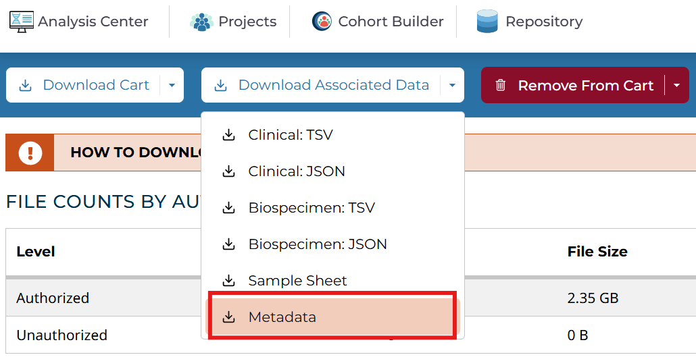
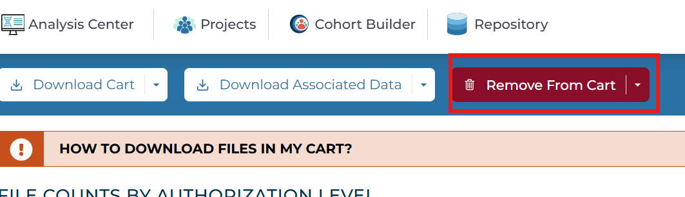
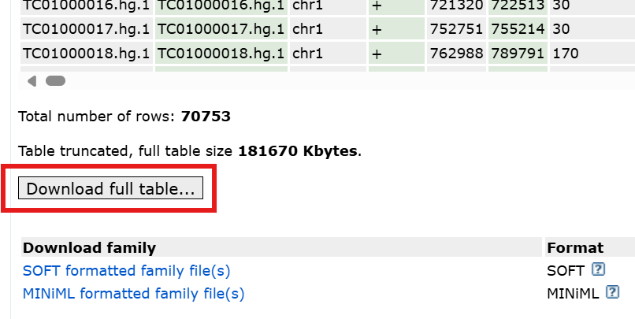
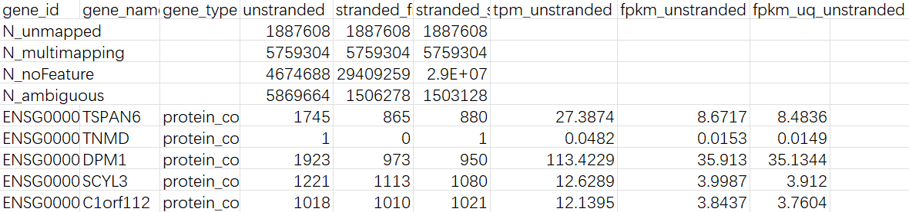
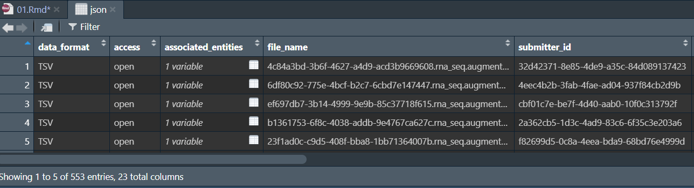
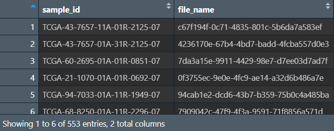
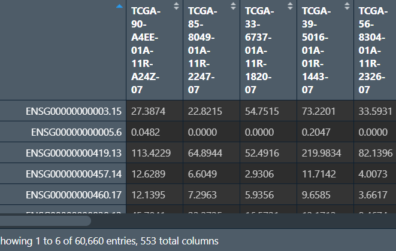
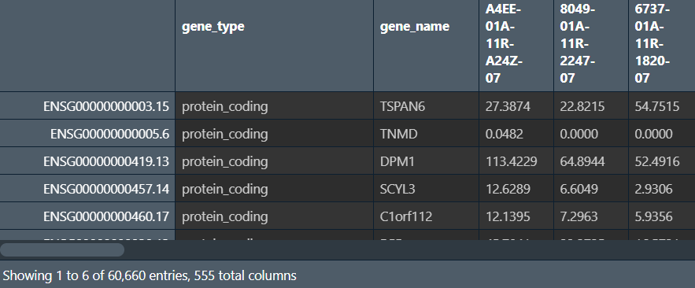
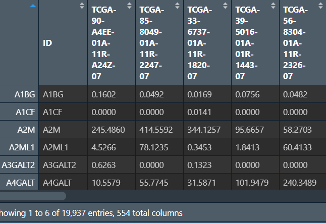

<a id="mulu">目录</a>
<a href="#mulu" class="back">回到目录</a>
<style>
    .back{width:40px;height:40px;display:inline-block;line-height:20px;font-size:20px;background-color:lightyellow;position: fixed;bottom:50px;right:50px;z-index:999;border:2px solid pink;opacity:0.3;transition:all 0.3s;color:green;}
    .back:hover{color:red;opacity:1}
    img{vertical-align:bottom;}
</style>

<!-- @import "[TOC]" {cmd="toc" depthFrom=3 depthTo=6 orderedList=false} -->

<!-- code_chunk_output -->

- [数据下载与预处理](#数据下载与预处理)
    - [数据下载](#数据下载)
      - [TCGA数据](#tcga数据)
      - [GEO数据](#geo数据)
    - [数据预处理](#数据预处理)
      - [表达数据](#表达数据)

<!-- /code_chunk_output -->

<!-- 打开侧边预览：f1->Markdown Preview Enhanced: open...
只有打开侧边预览时保存才自动更新目录 -->

写在前面：本篇教程来自b站课程[TCGA及GEO数据挖掘入门必看](https://www.bilibili.com/video/BV1b34y1g7RM)

### 数据下载与预处理
##### 数据下载
###### TCGA数据
进入[TCGA官网](https://portal.gdc.cancer.gov)
具体方法在[b站生信课01](./b站生信课01.md)中
`Cohort Builder`：
- `Program`--`TCGA`
- `Project`--`TCGA LUSC`（肺鳞癌）

**第一组数据：表达数据**
`Repository`：
- `Data Category`--`transcriptome profiling`
- `Data Type`--`Gene Expression Quantification`

`Add All Files to Cart`加数据添加到仓库，共553个
点击右上角的`cart`查看仓库，共下载两个文件，一个是cart
{:width=250 height=250}
另一个是Metadata，它将文件名与样本名进行对应
{:width=250 height=250}

---

之后点击`Remove From Cart`将cart中文件清除，返回`Repository`，将其中的筛选项也重置，建议从下往上进行重置
{:width=150 height=150}
{:width=150 height=150}
**第二组数据：miRNA数据**
`Repository`：
- `Data Category`--`transcriptome profiling`
- `Data Type`--`Isoform Expression Quantification`

`Add All Files to Cart`加数据添加到仓库，共523个
下载cart和Metadata

---

**第三组数据：临床数据**
`Repository`：
- `Data Category`--`clinical`
- `Data Type`--`Clinical Supplement`
- `Data Format`--`bcr xml`

`Add All Files to Cart`加数据添加到仓库，共504个
只需下载cart文件

---

**第四组数据：突变数据**
`Repository`：
- `Data Category`--`simple nucleotide variation`
- `Data Type`--`Masked Somatic Mutation`

`Add All Files to Cart`加数据添加到仓库，共549个
下载cart和Metadata

---

**第五组数据：甲基化数据**
`Repository`：
- `Data Category`--`dna methylation`
- `Data Type`--`Methylation Beta Value`
- `Platform`--`illumina human methylation 450`

`Add All Files to Cart`加数据添加到仓库，共412个
下载cart和Metadata

---

补充：[癌症名称简写对照](https://zhuanlan.zhihu.com/p/467229434)
另外的数据下载方式：
- [UCSC](https://xenabrowser.net/datapages)
- [sangerbox](http://vip.sangerbox.com/login.html)

这两种都可以提供处理较完全的数据，但数据较旧
###### GEO数据
进入[GEO官网](https://www.ncbi.nlm.nih.gov/geo/)
搜索数据集`GSE74777`，下载两个文件
一个是`Series Matrix File(s)`（表达矩阵），[下载](https://ftp.ncbi.nlm.nih.gov/geo/series/GSE74nnn/GSE74777/matrix/GSE74777_series_matrix.txt.gz)
另一个是`Platforms`->`Download full table...`，包括基因的symbol等
{:width=250 height=250}
{:width=200 height=200}
同样方法再下载数据集`GSE116918`和`GSE30219`
##### 数据预处理
###### 表达数据
将下载的压缩包解压成文件夹，里面有553个文件夹和1个.txt文件（无用），每个文件夹内都有一个tsv文件
{:width=150 height=150}
- `unstranded`--count
- `gene_type`--基因类型
- `tpm_unstranded`--TPM
- `fpkm_unstranded`--FPKM

可以发现缺少了样本名称，它存储在下载的metadata文件中

---

关键：**将样本名称添加到表达数据中**
**读取metadata文件**：使用`rjson`包，需要R版本>= 4.4.0
```
if(!require("rjson", quietly = T))
{
  install.packages("rjson");
  library("rjson");
}
json <- jsonlite::fromJSON("C:\\Users\\WangTianHao\\Documents\\GitHub\\R-for-bioinformatics\\b站生信课03\\data\\表达数据\\metadata.cart.2024-09-02.json");
```
{:width=220 height=220}
其中`file_id`是文件夹的名称，`associated_entities`这个表格中`entity_submitter_id`即为该文件夹中数据对应的样本名
```
# 样本名称，因为associated_entities的列值是一个list，不能直接用索引取，而是要遍历每个元素
sample_id <- sapply(json$associated_entities, function(x){x[,1]});
# 文件名称
file_name <- json$file_id;
# 将它们合并成一个df
file_sample <- data.frame(sample_id, file_name);
```
{:width=200 height=200}
**读取count数据**：因为count数据都是在文件夹中，且数量很多，无法用常规方法读取
解决方法：使用`list.files()`函数，它可以遍历整个文件夹，读取指定后缀的文件，返回文件相对路径
```
# 数据所在文件夹
wd <- "C:/Users/WangTianHao/Documents/GitHub/R-for-bioinformatics/b站生信课03/data/表达数据/gdc_download_20240902_050017.880821/";
# 文件相对路径
count_file <- list.files(
  wd,
  pattern = '.tsv',  # 指定读取tsv文件
  recursive = T  # 递归遍历（读取所有子文件）
);
# 文件绝对路径
count_file_path <- paste0(wd, count_file);
# 文件夹名：将路径按'/'切分，取第二个元素即为文件夹名
# 注意不是tsv文件的名称，而是它所在文件夹的名称
count_file_name <- strsplit(count_file, split = "/");
count_file_name <- sapply(count_file_name, function(x){x[1]});
```
根据上面得到的路径读取文件（使用循环）
- 因为我们仅使用tpm进行计算，所以只保留tpm列
- 根据文件夹名，确认其中数据的样本名（`file_sample`中的`sample_id`），将其作为tpm列的列名
- 因为所有组数据的行名及其顺序都相同，直接列合并即可

```
# 结果矩阵
matrix <- data.frame(matrix(nrow = 60660, ncol = 0));
for (i in 1:length(count_file_path)) {
  # 读取文件
  count_data <- read.delim(count_file_path[i], fill = T, header = F, row.names = 1);
  # 对读取结果进行一些更改
  colnames(count_data) <- count_data[2, ];  # 更改列名为第二行的元素
  count_data <- count_data[-c(1:6), ];  # 去除前6行无用数据
  count_data <- count_data[6];  # 取tpm列
  # 该文件对应file_sample中的第几行样本
  file_sample_index <- which(file_sample$file_name == count_file_name[i]);
  # 将这组数据的列名改为样本名
  colnames(count_data) <- file_sample$sample_id[file_sample_index];
  # 将数据添加到结果矩阵中
  matrix <- cbind(matrix, count_data);
}
```
{:width=250 height=250}
此时每组数据的行名`ENSGxxx`是基因名，但我们需要的是`TNMD`这种symbol形式的，需要进行转化
方法：因为所有tsv文件的这两列（两种基因名`gene_name`和`gene_id`）都相同，结果矩阵`matrix`的行名及其顺序也与每个tsv文件相同，所以随意取一个tsv文件的`gene_name`列，与`matrix`进行列合并即可。为方便后续进一步筛选，再将`gene_type`列也合并到结果中
为什么不直接将symbol作行名：在生信课01中提过，symbol有重复，无法作行名，后面需要去重处理后再作行名
```
count_data_single <- read.delim(count_file_path[1], fill = T, header = F, row.names = 1);
gene_name <- count_data_single[-c(1:6), 1];
gene_type <- count_data_single[-c(1:6), 2];
new_matrix <- cbind(gene_name, matrix);
new_matrix <- cbind(gene_type, new_matrix);
```
{:width=250 height=250}
**去除重复的基因**：与生信课01中方法相同，都是使用`aggregate`函数，这里保留tpm最大的基因
```
new_matrix <- aggregate(.~gene_name, data = new_matrix, FUN = max);
```
**只保留mRNA基因**：根据`gene_type`=="protein_coding"筛选
```
new_matrix <- subset(x = new_matrix, gene_type=="protein_coding");
```
**将`gene_name`列作为行名**：
```
rownames(new_matrix) <- new_matrix[, 1];
new_matrix <- new_matrix[, -c(1,2)];  # 删除这两列
```
{:width=250 height=250}
**保存到文件中**：
- 将行名（`gene_name`）单独作一列
- 将列名中的`.`改为`-`

```
save_matrix <- data.frame(
  ID=rownames(new_matrix),
  new_matrix
);
# 注意：正则表达式转义，'.'要写成'[.]'
colnames(save_matrix) <- gsub('[.]', '-', colnames(save_matrix));
# 保存数据
write.table(
  save_matrix,
  "C:\\Users\\WangTianHao\\Documents\\GitHub\\R-for-bioinformatics\\b站生信课03\\save_data\\TCGA_LUSC_TPM.txt",
  sep = '\t',
  quote = F,
  row.names = F
);
```
{:width=250 height=250}
