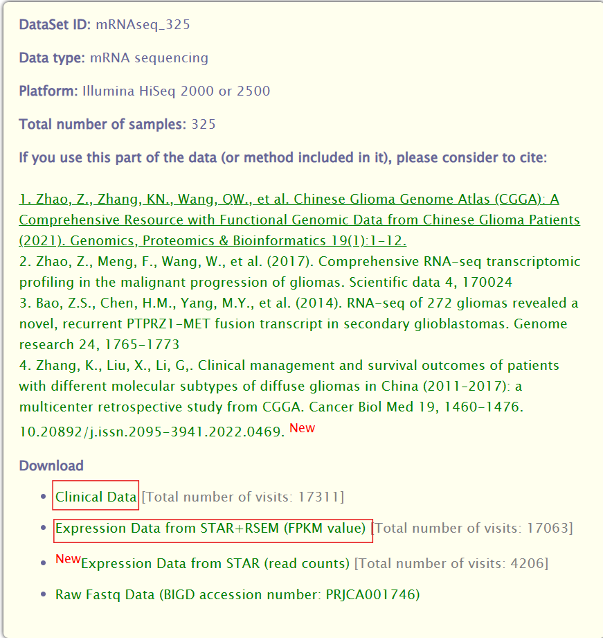

<a id="mulu">目录</a>
<a href="#mulu" class="back">回到目录</a>

<!-- @import "[TOC]" {cmd="toc" depthFrom=3 depthTo=6 orderedList=false} -->

<!-- code_chunk_output -->

- [常用数据库](#常用数据库)

<!-- /code_chunk_output -->

<!-- 打开侧边预览：f1->Markdown Preview Enhanced: open...
只有打开侧边预览时保存才自动更新目录 -->

### 常用数据库
- [UCSC Xena](https://xena.ucsc.edu/)：UCSC肿瘤数据库
- [UCSC Treehouse Public Data](https://treehousegenomics.soe.ucsc.edu/public-data/)：Treehouse肿瘤数据库
- [Chinese Glioma Genome Atlas](http://www.cgga.org.cn/index.jsp)：CGGA脑胶质瘤数据库
- [Gene Expression Omnibus](https://www.ncbi.nlm.nih.gov/geo/)：GEO数据库
- The Cancer Genome Atlas Program (TCGA) 

此次课程使用CGGA中4个数据集：
{:width=300 height=300}
{:width=300 height=300}