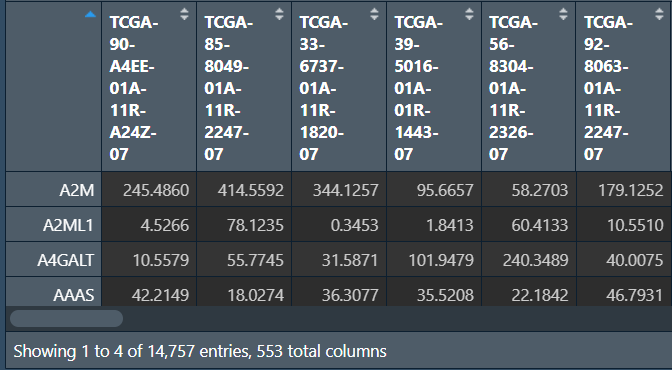
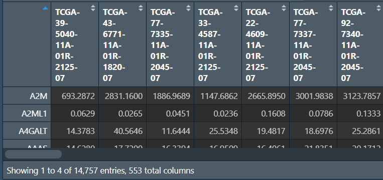
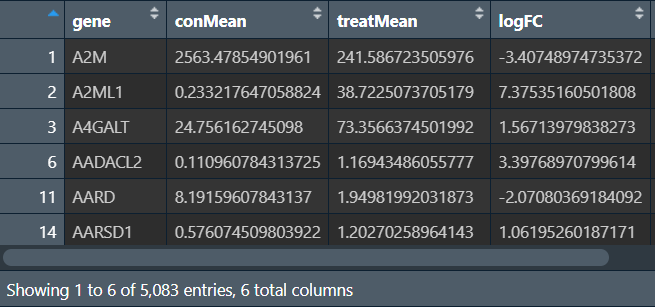
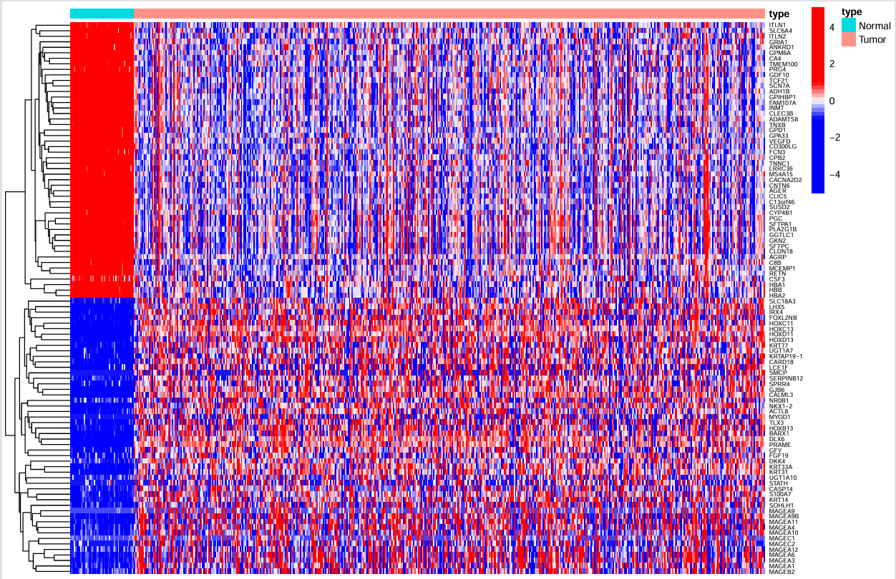
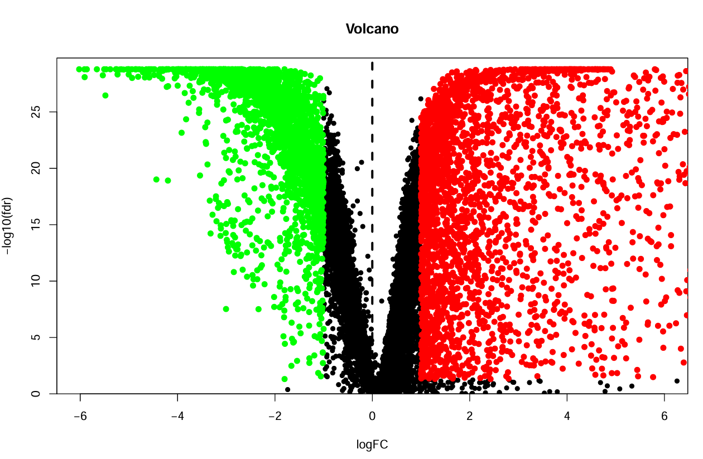
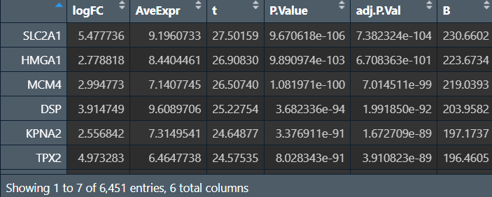
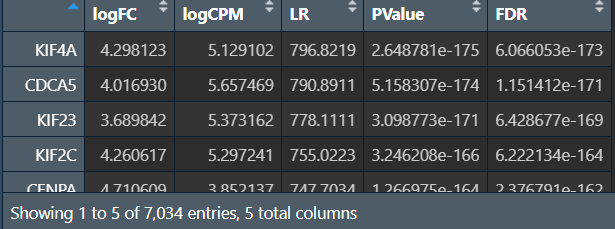
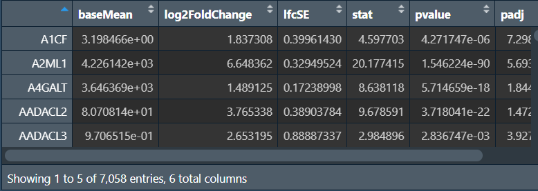
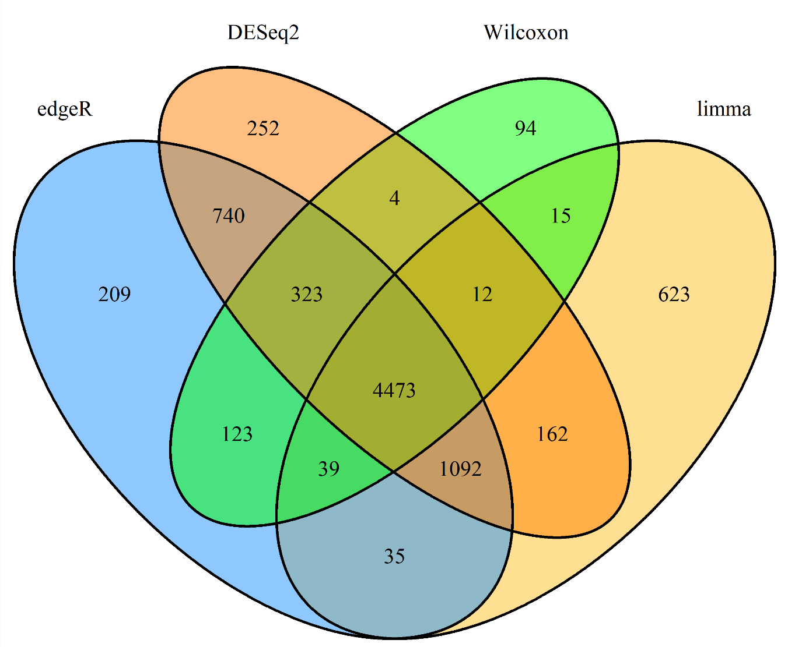

<a id="mulu">目录</a>
<a href="#mulu" class="back">回到目录</a>
<style>
    .back{width:40px;height:40px;display:inline-block;line-height:20px;font-size:20px;background-color:lightyellow;position: fixed;bottom:50px;right:50px;z-index:999;border:2px solid pink;opacity:0.3;transition:all 0.3s;color:green;}
    .back:hover{color:red;opacity:1}
    img{vertical-align:bottom;}
</style>

<!-- @import "[TOC]" {cmd="toc" depthFrom=3 depthTo=6 orderedList=false} -->

<!-- code_chunk_output -->

- [差异表达分析](#差异表达分析)
    - [TPM值](#tpm值)
    - [count值](#count值)
      - [limma](#limma)
      - [edgeR](#edger)
      - [DESeq2](#deseq2)
    - [查看以上4种分析结果](#查看以上4种分析结果)

<!-- /code_chunk_output -->

<!-- 打开侧边预览：f1->Markdown Preview Enhanced: open...
只有打开侧边预览时保存才自动更新目录 -->

写在前面：本篇教程来自b站课程[TCGA及GEO数据挖掘入门必看](https://www.bilibili.com/video/BV1b34y1g7RM) P8-P

### 差异表达分析
一般情况下，如果使用的表达矩阵是TPM值，就用wilcoxon；如果是count值，就用DESeq2等方法
##### TPM值
使用包：`limma`、`pheatmap`、`ggVolcano`
```{r}
if(!require("pheatmap", quietly = T))
{
  install.packages("pheatmap");
  library("pheatmap");
}
if(!require("ggVolcano", quietly = T))
{
  if(!require("devtools", quietly = T))
  {
    install.packages("devtools");
    library("devtools");
  }
  devtools::install_github("BioSenior/ggVolcano");
  library("ggVolcano");
}
library("tidyverse");
```
**读取文件并转化为matrix**，方法同前
```{r}
data <- read.table(
  "C:\\Users\\WangTianHao\\Documents\\GitHub\\R-for-bioinformatics\\b站生信课03\\save_data\\TCGA_LUSC_TPM.txt",
  header = T,
  sep = '\t',
  check.names = T,
  row.names = 1
);
dimnames <- list(rownames(data), colnames(data));
data <- matrix(
  as.numeric(as.matrix(data)),
  nrow = nrow(data),
  dimnames = dimnames
);
colnames(data) <- gsub('[.]', '-', colnames(data));
# 去除低表达基因
data <- data[rowMeans(data)>1, ];
```
{:width=250 height=250}
将data分成肿瘤组和正常组，方法同生信课01，将列名按`-`切分，第4个值如果是01-09就是癌症，10-19是正常，20-29是癌旁（也算正常组）。因此我们只需取出`01-09`的`0`，`10-19`的`1`
```{r}
# group：标识每个样本是正常还是癌症
group <- sapply(strsplit(colnames(data), '\\-'), "[", 4);  # 取出第4个值，以数组形式返回
# 等效于group <- sapply(strsplit(colnames(data), '\\-'), function(x){x[4]});
group <- sapply(strsplit(group, ''), "[", 1);  # 再取出第一个值
group <- gsub("2", "1", group);
# 获取正常组和肿瘤组样本数
con_num <- length(group[group==1]);  # 正常组
treat_num <- length(group[group==0]);  # 肿瘤组
# 根据肿瘤组和正常组排序，将正常组提前
data1 <- data[, group==1];
data2 <- data[, group==0];
data <- cbind(data1, data2);
# 获取新分组信息type，正常组为1， 肿瘤组为2
type <- c(rep(1, con_num), rep(2, treat_num));
```
{:width=250 height=250}
**差异分析**：
- 首先依次对每行（每个基因）进行分析
  - 使用`wilcox.test`分析表达量与样本类别的关系，得到p值
  - 分别计算正常组和肿瘤组表达量平均值，并取log2，它们的差为`logFC`
  - 分别计算正常组和肿瘤组表达量中位数，它们的差为`diffMed`
  - 当`logFC`和`diffMed`有相同的趋势（都>0或都<0）时，将该基因的分析结果保存到结果矩阵中
  - 结果矩阵：列名是基因名、两组表达量平均值、logFC、p值
- 根据p值，使用`p.adjust`函数获取fdr值，即修正后的p值
- 设定logFC和fdr的阈值，筛选出差异基因

```{r}
# 对每行（每个基因）进行分析
outTab <- data.frame();  # 结果矩阵
for (i in row.names(data)) {
  rt <- data.frame(  # 每个基因的表达矩阵
    expression=data[i, ],  # 某样本的表达量
    type=type  # 该样本属于哪组
  );
  wilcoxTest <- wilcox.test(expression~type, data = rt);  # wilcox检验
  pvalue <- wilcoxTest$p.value;  # p值
  con_mean <- mean(data[i, 1:con_num]);  # 正常组表达量平均值
  treat_mean <- mean(data[i, (con_num+1):ncol(data)]);  # 肿瘤组表达量平均值
  logFC <- log2(treat_mean)-log2(con_mean);  # 取log2后相减
  con_med <- median(data[i, 1:con_num]);  # 正常组表达量中值
  treat_med <- median(data[i, (con_num+1):ncol(data)]);  # 肿瘤组表达量中值
  diffMed <- treat_med-con_med;  # 相减
  if((logFC>0&&diffMed>0) || (logFC<0&&diffMed<0)){  # 如果有相同趋势
    outTab <- rbind(
      outTab,
      cbind(
        gene = i,  # 基因名
        conMean = con_mean,  # 正常组表达量平均值
        treatMean = treat_mean,  # 肿瘤组表达量平均值
        logFC = logFC,  # logFC
        pValue = pvalue  # p值
      )
    );
  }
}
# 计算fdr值
pvalue <- outTab[, "pValue"];
fdr <- p.adjust(as.numeric(as.vector(pvalue)), method = "fdr");
outTab <- cbind(outTab, fdr=fdr);
# 筛选差异基因
logFC_filter <- 1;
fdr_filter <- 0.05;
outDiff <- outTab[
  abs(as.numeric(as.vector(outTab$logFC)))>logFC_filter , ];
outDiff <- outDiff[
  as.numeric(as.vector(outDiff$fdr))<fdr_filter
, ];
# 保存数据
write.table(
  outDiff,
  file = "C:\\Users\\WangTianHao\\Documents\\GitHub\\R-for-bioinformatics\\b站生信课03\\save_data\\TCGA.diff.Wilcoxon.txt",
  sep = '\t',
  row.names = F,
  quote = F
);
```
{:width=200 height=200}
**热图**：需要两组数据
- 每个基因在各样本中的表达量（行名是基因名，列名是样本名），表达量+0.01后取log2
- 一个用于标识每个样本属于哪组的vector

```{r}
gene_num <- 50;  # 展示基因的数目
outDiff <- outDiff[order(as.numeric(as.vector(outDiff$logFC))),];  # 按logFC排序
diff_gene <- as.vector(outDiff[, 1]);  # 差异基因名称
diff_gene_len <- length(diff_gene);  # 差异基因数量
hm_gene <- c();  # 绘制热图的基因
if(diff_gene_len>2*gene_num){  # 如果差异基因数量多于100
  hm_gene <- diff_gene[c(1:gene_num, (diff_gene_len-gene_num+1):diff_gene_len)];  # 取前50个和后50个
} else{
  hm_gene <- diff_gene;  # 否则全取
}
hm_exp <- log2(data[hm_gene, ]+0.01);  # 表达量，加0.01后取log2（避免0值）
type <- c(rep("Normal", con_num), rep("Tumor", treat_num));  # 标识组别
names(type) <- colnames(data);  # 建立组别与样本名的对照
type <- as.data.frame(type);  # 转为df
pdf(  # 创建画图文件
  file = "C:\\Users\\WangTianHao\\Documents\\GitHub\\R-for-bioinformatics\\b站生信课03\\save_data\\heatmap.pdf",
  width = 10,
  height = 6.5
);
pheatmap(  # 开始画图
  hm_exp,
  annotation = type,
  color = colorRampPalette(c(rep('blue', 5),"white", rep("red", 5)))(50),
  cluster_cols = F,
  show_colnames = F,
  scale = "row",
  fontsize = 8,
  fontsize_row = 5,
  fontsize_col = 8
);
dev.off();  # 关闭文件
```
{:width=500 height=500}
左面的树状线是基因聚类，右面（纵轴）是基因名称，横轴为样本名称，每个点的颜色表示表达量大小
**火山图**：
横坐标是`logFC`，纵坐标是`-log10(fdr)`，先画出所有的点，之后以x=±`logFC_filter`为分界线，左半部分点为绿色，右半部分点为红色
```{r}
x_max <- 6;
y_max <- max(-log10(outTab$fdr))+1;  # xy轴极值
pdf(  # 创建画图文件
  file = "C:\\Users\\WangTianHao\\Documents\\GitHub\\R-for-bioinformatics\\b站生信课03\\save_data\\vol.pdf",
  width = 10,
  height = 6.5
);
# 所有的点
plot(
  as.numeric(as.vector(outTab$logFC)),
  -log10(outTab$fdr),  # 横纵坐标
  xlab = "logFC",
  ylab = "-log10(fdr)",  # xy轴标签
  main = "Volcano",  # 标题
  ylim = c(0, y_max),
  xlim = c(-x_max, x_max),  # xy轴范围
  yaxs = "i",  # 设置坐标轴范围与给定作图范围完全相同
  pch = 20,  # 点的形状
  cex = 1.2  # 绘图字符和符号相对于默认大小的缩放比例
);
# x=logFC_filter右边的点，需要对数据集再次进行筛选
diffSub1 <- subset(outTab, fdr<fdr_filter);
diffSub1 <- subset(diffSub1, as.numeric(as.vector(logFC))>logFC_filter);
points(
  as.numeric(as.vector(diffSub1$logFC)),
  -log10(diffSub1$fdr),
  pch = 20,
  col = "red",
  cex = 1.5
);
# x=-logFC_filter左边的点，也需要对数据集再次进行筛选
diffSub2 <- subset(outTab, fdr<fdr_filter);
diffSub2 <- subset(diffSub2, as.numeric(as.vector(logFC))<(-logFC_filter));
points(
  as.numeric(as.vector(diffSub2$logFC)),
  -log10(diffSub2$fdr),
  pch = 20,
  col = "green",
  cex = 1.5
);
# x=0的虚线
abline(v=0, lty=2, lwd=3);
dev.off();
```
{:width=400 height=400}
##### count值
###### limma
需要包：`limma`、`pheatmap`、`edgeR`
```{r}
if(!require("edgeR", quietly = T))
{
  library("BiocManager");
  BiocManager::install("edgeR");
  library("edgeR");
}
library("pheatmap");
library("limma");
library("tidyverse");
```
读取文件并分组：
```{r}
data <- read.table(
  "C:\\Users\\WangTianHao\\Documents\\GitHub\\R-for-bioinformatics\\b站生信课03\\save_data\\TCGA_LUSC_count.txt",
  header = T,
  sep = '\t',
  check.names = T,
  row.names = 1
);
dimnames <- list(rownames(data), colnames(data));
data <- matrix(
  as.numeric(as.matrix(data)),
  nrow = nrow(data),
  dimnames = dimnames
);
colnames(data) <- gsub('[.]', '-', colnames(data));
data <- data[rowMeans(data)>1, ];
group <- sapply(strsplit(colnames(data), '\\-'), "[", 4);
group <- sapply(strsplit(group, ''), "[", 1);
group <- gsub("2", "1", group);
con_num <- length(group[group==1]);
treat_num <- length(group[group==0]);
data1 <- data[, group==1];
data2 <- data[, group==0];
data <- cbind(data1, data2);
type <- c(rep(1, con_num), rep(2, treat_num));
type <- factor(type);
design <- model.matrix(~0+type); 
rownames(design) <- colnames(data);
```
进行差异分析：
```{r}
DGElist <- DGEList(counts=data, group=type);
keep_gene_index <- rowSums(cpm(DGElist)>1) >= 2; 
DGElist <- DGElist[keep_gene_index, , keep.lib.sizes=F];
DGElist <- calcNormFactors(DGElist);
v <- voom(DGElist, design, plot = T, normalize="quantile");
fit <- lmFit(v, design);
colnames(design) <- c("normal", "tumor");
cont.matrix <- makeContrasts(contrasts = c('tumor-normal'), levels = design);
fit2 <- contrasts.fit(fit, cont.matrix);
fit2 <- eBayes(fit2);
nrDEG_limma_voom <- topTable(fit2, coef = 'tumor-normal', n = Inf);
nrDEG_limma_voom <- na.omit(nrDEG_limma_voom);
```
筛选：
```{r}
padj <- 0.05;
logFC <- 1;
outDiff <- nrDEG_limma_voom[nrDEG_limma_voom$adj.P.Val<padj, ];
outDiff <- rbind(
  outDiff[outDiff$logFC>logFC, ],
  outDiff[outDiff$logFC<(-logFC), ]
);
write.table(
  data.frame(
    ID = rownames(outDiff),
    outDiff
  ),
  file = "C:\\Users\\WangTianHao\\Documents\\GitHub\\R-for-bioinformatics\\b站生信课03\\save_data\\TCGA.diff.limma.txt",
  sep = '\t',
  row.names = F,
  quote = F
);
```
{:width=180 height=180}
之后用`outDiff`画图的过程同前，下同
###### edgeR
需要包：`limma`、`pheatmap`、`edgeR`
```{r}
library("edgeR");
library("pheatmap");
library("limma");
library("tidyverse");
```
读取文件并分组：
```{r}
data <- read.table(
  "C:\\Users\\WangTianHao\\Documents\\GitHub\\R-for-bioinformatics\\b站生信课03\\save_data\\TCGA_LUSC_count.txt",
  header = T,
  sep = '\t',
  check.names = T,
  row.names = 1
);
dimnames <- list(rownames(data), colnames(data));
data <- matrix(
  as.numeric(as.matrix(data)),
  nrow = nrow(data),
  dimnames = dimnames
);
colnames(data) <- gsub('[.]', '-', colnames(data));
data <- data[rowMeans(data)>1, ];
group <- sapply(strsplit(colnames(data), '\\-'), "[", 4);
group <- sapply(strsplit(group, ''), "[", 1);
group <- gsub("2", "1", group);
con_num <- length(group[group==1]);
treat_num <- length(group[group==0]);
data1 <- data[, group==1];
data2 <- data[, group==0];
data <- cbind(data1, data2);
type <- c(rep(1, con_num), rep(2, treat_num));
type <- factor(type);
design <- model.matrix(~0+type); 
rownames(design) <- colnames(data);
```
差异分析：
```{r}
DGElist <- DGEList(counts=data, group=type);
keep_gene_index <- rowSums(cpm(DGElist)>1) >= 2; 
DGElist <- DGElist[keep_gene_index, , keep.lib.sizes=F];
DGElist <- calcNormFactors(DGElist);
DGElist <- estimateGLMCommonDisp(DGElist, design);
DGElist <- estimateGLMTrendedDisp(DGElist, design);
DGElist <- estimateGLMTagwiseDisp(DGElist, design);
fit <- glmFit(DGElist, design);
results <- glmLRT(fit, contrast = c(-1, 1));
nrDEG_edgeR <- topTags(results, n = nrow(DGElist));
nrDEG_edgeR <- as.data.frame(nrDEG_edgeR);
```
筛选（同前）：
```{r}
padj <- 0.05;
logFC <- 1;
outDiff <- nrDEG_edgeR[nrDEG_edgeR$FDR<padj, ];
outDiff <- rbind(
  outDiff[outDiff$logFC>logFC, ],
  outDiff[outDiff$logFC<(-logFC), ]
);
write.table(
  data.frame(
    ID = rownames(outDiff),
    outDiff
  ),
  file = "C:\\Users\\WangTianHao\\Documents\\GitHub\\R-for-bioinformatics\\b站生信课03\\save_data\\TCGA.diff.edgeR.txt",
  sep = '\t',
  row.names = F,
  quote = F
);
```
{:width=150 height=150}
###### DESeq2
需要包：`DESeq2`
与生信课01中的类似，只是这里没有分成训练组和验证组
```{r}
if(!require("DESeq2", quietly = T))
{
  library("BiocManager");
  BiocManager::install("DESeq2");
  library("DESeq2");
}
```
读取数据并分组：
```{r}
data <- read.table(
  "C:\\Users\\WangTianHao\\Documents\\GitHub\\R-for-bioinformatics\\b站生信课03\\save_data\\TCGA_LUSC_count.txt",
  header = T,
  sep = '\t',
  check.names = T,
  row.names = 1
);
dimnames <- list(rownames(data), colnames(data));
data <- matrix(
  as.numeric(as.matrix(data)),
  nrow = nrow(data),
  dimnames = dimnames
);
colnames(data) <- gsub('[.]', '-', colnames(data));
data <- data[rowMeans(data)>1, ];
group <- sapply(strsplit(colnames(data), '\\-'), "[", 4);
group <- sapply(strsplit(group, ''), "[", 1);
group <- gsub("2", "1", group);
con_num <- length(group[group==1]);
treat_num <- length(group[group==0]);
data1 <- data[, group==1];
data2 <- data[, group==0];
data <- cbind(data1, data2);
type <- c(rep(1, con_num), rep(2, treat_num));
condition <- factor(type);
coldata <- data.frame(row.names = colnames(data), condition);
```
差异分析：
```{r}
dds <- DESeqDataSetFromMatrix(
  countData = data,
  colData = coldata,
  design = ~condition
);
dds$condition <- relevel(dds$condition, ref = "1");  # 指定为1的行是正常组（对照组）
dds <- DESeq(dds);
allDEG2 <- as.data.frame(results(dds));
```
筛选（同前）：
```{r}
padj <- 0.05;
logFC <- 1;
outDiff <- allDEG2[allDEG2$padj<padj, ];
outDiff <- rbind(
  outDiff[outDiff$log2FoldChange>logFC, ],
  outDiff[outDiff$log2FoldChange<(-logFC), ]
);
write.table(
  data.frame(
    ID = rownames(outDiff),
    outDiff
  ),
  file = "C:\\Users\\WangTianHao\\Documents\\GitHub\\R-for-bioinformatics\\b站生信课03\\save_data\\TCGA.diff.DESeq2.txt",
  sep = '\t',
  row.names = F,
  quote = F
);
```
{:width=180 height=180}
##### 查看以上4种分析结果
使用包：`VennDiagram`
```{r}
if(!require("VennDiagram", quietly = T))
{
  install.packages("VennDiagram");
  library("VennDiagram");
}
```
载入4组数据，获取4种方法得到差异基因名
```{r}
data_name <- c("edgeR", "limma", "DESeq2", "Wilcoxon");
file_path <- c("C:\\Users\\WangTianHao\\Documents\\GitHub\\R-for-bioinformatics\\b站生信课03\\save_data\\TCGA.diff.edgeR.txt", "C:\\Users\\WangTianHao\\Documents\\GitHub\\R-for-bioinformatics\\b站生信课03\\save_data\\TCGA.diff.limma.txt", "C:\\Users\\WangTianHao\\Documents\\GitHub\\R-for-bioinformatics\\b站生信课03\\save_data\\TCGA.diff.DESeq2.txt", "C:\\Users\\WangTianHao\\Documents\\GitHub\\R-for-bioinformatics\\b站生信课03\\save_data\\TCGA.diff.Wilcoxon.txt");
data_list <- list();  # 结果列表
for (i in 1:length(file_path)) {
  data <- read.table(file_path[i], header = T, sep = '\t', check.names = F, row.names = 1);
  data_list[[data_name[i]]] <- rownames(data);
}
```
画图：
```{r}
venn.diagram(
  x = data_list,
  filename = "C:\\Users\\WangTianHao\\Documents\\GitHub\\R-for-bioinformatics\\b站生信课03\\save_data\\VN.png",
  fill = c("dodgerblue", "goldenrod1", "darkorange1", "green")
);
```
{:width=350 height=350}
