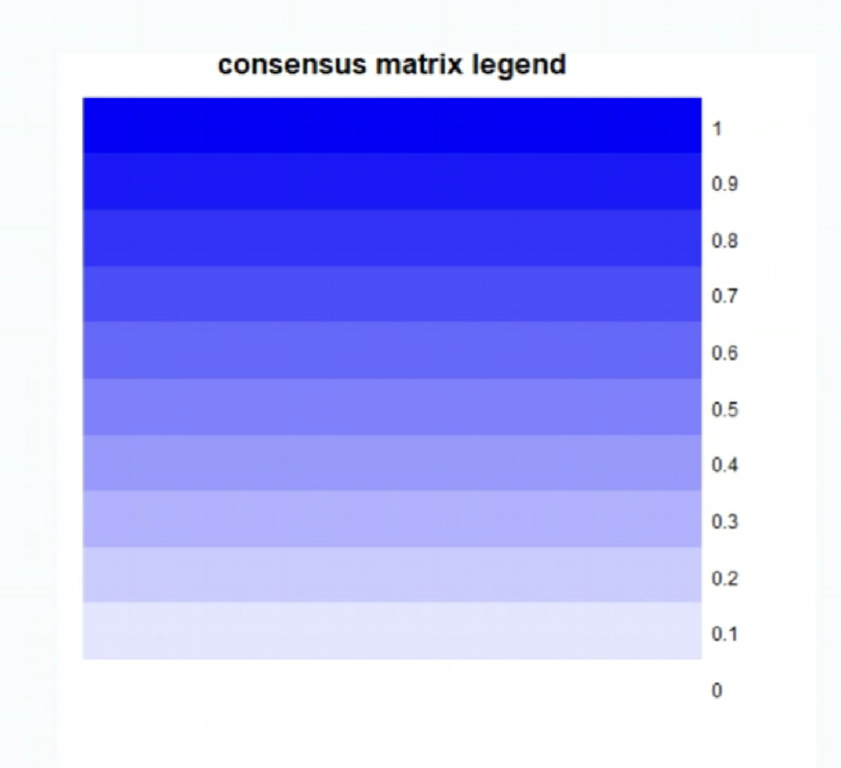
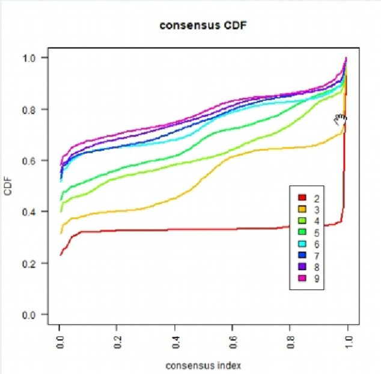
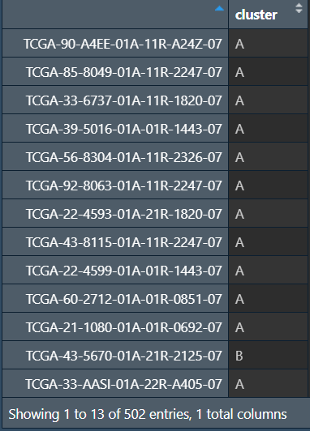
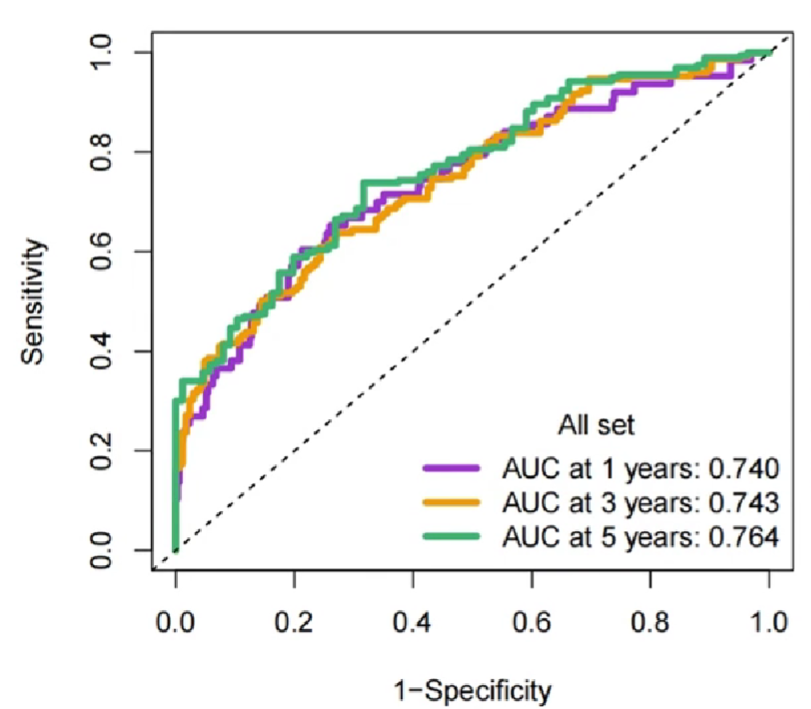
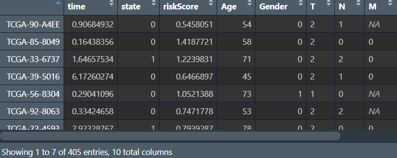
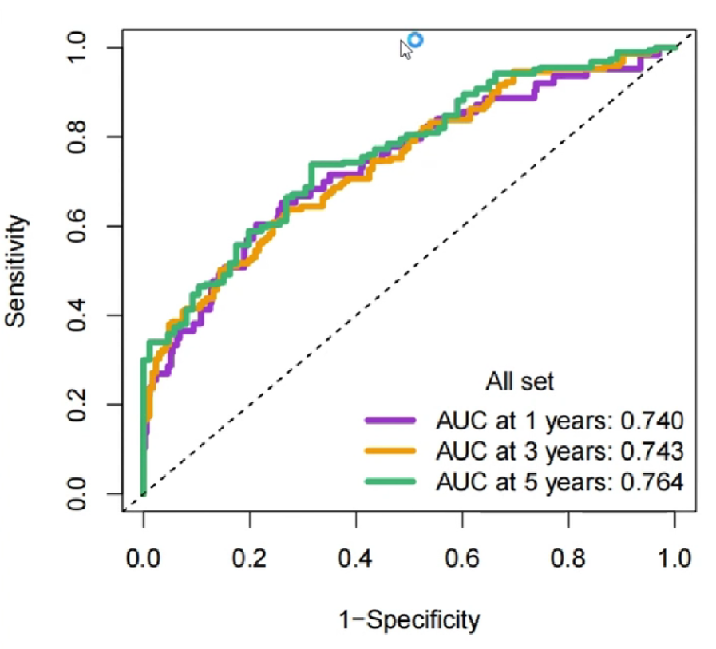
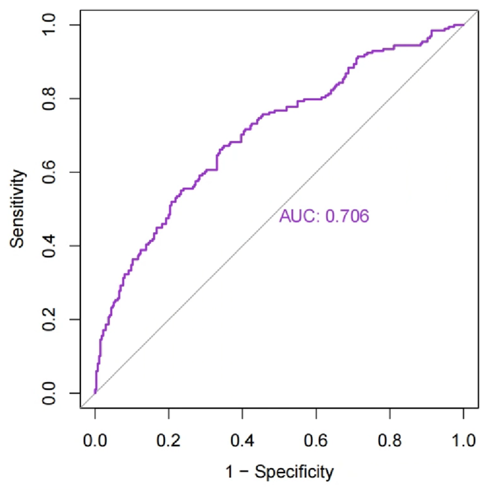
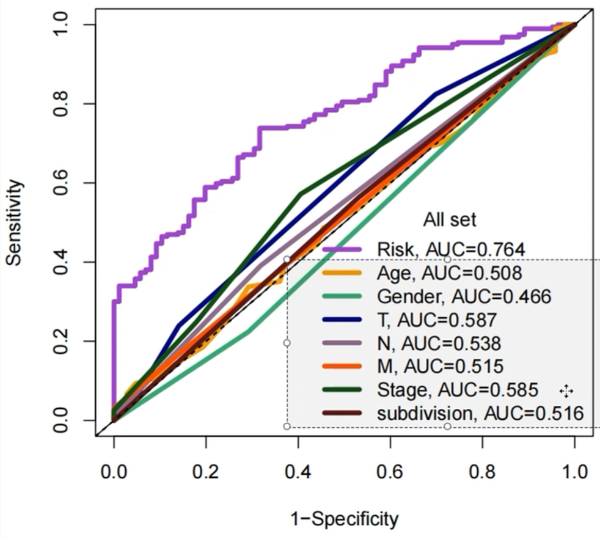

<a id="mulu">目录</a>
<a href="#mulu" class="back">回到目录</a>
<style>
    .back{width:40px;height:40px;display:inline-block;line-height:20px;font-size:20px;background-color:lightyellow;position: fixed;bottom:50px;right:50px;z-index:999;border:2px solid pink;opacity:0.3;transition:all 0.3s;color:green;}
    .back:hover{color:red;opacity:1}
    img{vertical-align:bottom;}
</style>

<!-- @import "[TOC]" {cmd="toc" depthFrom=3 depthTo=6 orderedList=false} -->

<!-- code_chunk_output -->

- [一致性聚类与无监督聚类](#一致性聚类与无监督聚类)
- [ROC曲线](#roc曲线)

<!-- /code_chunk_output -->

<!-- 打开侧边预览：f1->Markdown Preview Enhanced: open...
只有打开侧边预览时保存才自动更新目录 -->

写在前面：本篇教程来自b站课程[TCGA及GEO数据挖掘入门必看](https://www.bilibili.com/video/BV1b34y1g7RM) P18-P21

### 一致性聚类与无监督聚类
需要数据：多因素cox回归结果（其实也可以是lasso/单因素cox回归结果）、tpm表达矩阵
需要包：`ConsensusClusterPlus`
```{r}
if(!require("ConsensusClusterPlus", quietly = T))
{
  library("BiocManager");
  BiocManager::install("ConsensusClusterPlus");
  library("ConsensusClusterPlus");
}
```
**读取数据**：选出肿瘤组的样本，取出筛选后基因的在各样本中的表达量
```{r}
# tpm表达矩阵
data <- read.table("C:\\Users\\WangTianHao\\Documents\\GitHub\\R-for-bioinformatics\\b站生信课03\\save_data\\TCGA_LUSC_TPM.txt", check.names = F, row.names = 1, sep = '\t', header = T);
dimnames <- list(rownames(data), colnames(data));
data <- matrix(as.numeric(as.matrix(data)), nrow = nrow(data), dimnames = dimnames);
# 选出肿瘤组的样本
group <- sapply(strsplit(colnames(data), '\\-'), "[", 4);
group <- sapply(strsplit(group, ''), "[", 1);
data <- data[, group==0];
# 筛选基因
multi_cox_gene <- read.table("C:\\Users\\WangTianHao\\Documents\\GitHub\\R-for-bioinformatics\\b站生信课03\\save_data\\multiCox.txt", check.names = F, row.names = 1, sep = '\t', header = T);
data <- data[rownames(multi_cox_gene), ];
```
{:width=250 height=250}
**对样品进行聚类分型**，使用`ConsensusClusterPlus`函数：
- `maxK`最大的K值，形成一系列梯度
- `pItem`选择百分之多少的样本重复抽样
- `pfeature`选择百分之多少的基因重复抽样
- `reps`重复抽样的数目，可以先设置为100，结果不错再设置为1000（这样结果更严谨）
- `clusterAlg`聚类算法，取值："hc"/"pam"/"km"
- `distanc`距离矩阵算法，取值："pearson"/"spearman"/"euclidean"
- `title`输出结果的文件夹名字，包含输出的图片等
- `seed`随机种子，用于固定结果
- `plot`输出图片的格式
```{r}
res <- ConsensusClusterPlus(
  data,
  maxK = 9,
  reps = 100,
  pItem = 0.8,
  pFeature = 1,
  title = "C:\\Users\\WangTianHao\\Documents\\GitHub\\R-for-bioinformatics\\b站生信课03\\save_data\\ConsensusClusterPlus",
  clusterAlg = "pam",
  distance = "euclidean",
  seed = 123,
  plot = "png"
);
```
**结果分析**：
- 第一张图标识相关度与颜色的关系（图例）：1是非常相关（蓝色），0是不相关（白色）
  {:width=300 height=300}
- 002-009：每个k值（分成了多少组）对应的聚类结果
  {:width=400 height=400}
  红框部分的不同颜色代表不同的组，它下面的2*2个方块代表每组的差异
  评判标准（以k=2为例）：
  - 组内的差异小（右上和左下两个块足够蓝）
  - 组间的差异大（右下和左上两个块足够白）
  - 每组的样本数不能过小（不能小于总样本的10%），可以通过红框中颜色占比看出
  
  可以看到k=2的图是符合标准的
- 010CDF值：
  {:width=400 height=400}
  曲线在x=0.1~0.9的变化越小的越好。可以看出k=2（红色线）符合标准
- 011CDF值变化：
  {:width=400 height=400}
  一般选取折线拐点（曲线变化趋势改变最大的点）附近的点，该图中拐点为x=3

综合上面的分析，我们选取k=2的结果
**根据上面的分组，对样本进行分型**：
```{r}
clu_num <- 2;  # 分成几组（k值）
clu <- res[[clu_num]][["consensusClass"]];  # 聚类结果（分组信息）
clu <- as.data.frame(clu);
colnames(clu) <- c("cluster");
letter <- LETTERS[1:10];  # 每组的名称，这里是ABCD大写字母
uniq_clu <- levels(factor(clu$cluster));  # 原来每组的名称
clu$cluster <- letter[match(clu$cluster, uniq_clu)];  # 将每组名称改成我们刚才定义的大写字母
clu_save <- rbind(ID = colnames(clu), clu);
write.table(clu_save, file = "C:\\Users\\WangTianHao\\Documents\\GitHub\\R-for-bioinformatics\\b站生信课03\\save_data\\cluster.txt", sep = '\t', row.names = F, quote = F);
```
{:width=300 height=300}
可以看到样品被分为了AB两组
### ROC曲线
{:width=300 height=300}
横坐标1-Specificity是特异性（假阳性概率），纵坐标Sentivity是敏感性（真阳性概率）
AUC指曲线下的面积
- AUC=1：是完美的分类器
- 0.5< AUC <1：优于随机猜测，数值越大越好
- AUC=0.5：等同于随机猜测，没有预测价值
- AUC<0.5：比随机猜测差。但如果是反向猜测，该模型也可能优于随机猜测

```{r}
if(!require("pROC", quietly = T))
{
  library("BiocManager");
  BiocManager::install("pROC");
  library(pROC);
}
library(survival);
library(survminer);
if(!require("timeROC", quietly = T))
{
  library("BiocManager");
  install.packages('listenv');
  install.packages('parallelly');
  BiocManager::install("timeROC");
  library(timeROC);
}
```
**读取并处理生存信息，与风险得分合并**：
```{r}
# 读取生存信息
library("readxl");
library(tidyverse);
cli <- read_excel("C:\\Users\\WangTianHao\\Documents\\GitHub\\R-for-bioinformatics\\b站生信课03\\save_data\\clinical.xlsx");
cli <- cli[, c("survival_time", "vital_status", "days_to_birth", "gender", "T", "N", "M", "stage_event", "anatomic_neoplasm_subdivision", "bcr_patient_barcode")];
# 处理生存信息
cli <- column_to_rownames(cli, "bcr_patient_barcode");  # 更改行名为样本名
cli$time <- as.numeric(cli$survival_time)/365;  # 存活天数用年表示
cli$state <- ifelse(cli$vital_status=='Alive', 0, 1);  # 0表示存活，1表示死亡
cli$Age <- round(as.numeric(cli$days_to_birth)/(-365));  # 年龄用年表示
cli$Gender <- ifelse(cli$gender=="MALE", 0, 1);  # 性别用01表示
cli$`T` <- substr(cli$`T`, 1, 1);
cli$`N` <- substr(cli$`N`, 1, 1);
cli$`M` <- substr(cli$`M`, 1, 1);  # TNM列只取第一个字符
cli$`T` <- gsub('X', NA, cli$`T`);
cli$`N` <- gsub('X', NA, cli$`N`);
cli$`M` <- gsub('X', NA, cli$`M`);  # TNM列将X替换为NA
cli$stage_event <- ifelse(grepl('X', cli$stage_event), NA, cli$stage_event);  # X变NA
cli$stage_event <- ifelse(grepl('IV', cli$stage_event), "4", cli$stage_event);  # IV变4
cli$stage_event <- ifelse(grepl('III', cli$stage_event), "3", cli$stage_event);  # III变3
cli$stage_event <- ifelse(grepl('II', cli$stage_event), "2", cli$stage_event);  # II变2
cli$stage_event <- ifelse(grepl('I', cli$stage_event), "1", cli$stage_event);  # I变1
cli$Stage <- as.numeric(cli$stage_event);
cli$`T` <- as.numeric(cli$`T`);
cli$`N` <- as.numeric(cli$`N`);
cli$`M` <- as.numeric(cli$`M`);  # TNM、Stage列转为数值型
cli$subdivision <- ifelse(  # 开头L->1  R->2
  startsWith(cli$anatomic_neoplasm_subdivision, "L"),
  1,
  ifelse(
    startsWith(cli$anatomic_neoplasm_subdivision, "R"),
    2,
    NA
  )
);
# 读取风险得分
risk <- read.table("C:\\Users\\WangTianHao\\Documents\\GitHub\\R-for-bioinformatics\\b站生信课03\\save_data\\risk.txt", check.names = F, row.names = 1, sep = '\t', header = T);
# 合并
same_sample <- intersect(row.names(risk), row.names(cli));
risk <- risk[same_sample, ];
cli <- cli[same_sample, ];
rt <- cbind(
  cli[, c("time", "state")],
  riskScore = risk[, c("riskScore")],
  cli[, c("Age", "Gender", "T", "N", "M", "Stage", "subdivision")]
);
# 保存生存信息
library(writexl);
write_xlsx(cbind(ID = row.names(cli), cli[, c("time", "state", "Age", "Gender", "T", "N", "M", "Stage", "subdivision")]), "C:\\Users\\WangTianHao\\Documents\\GitHub\\R-for-bioinformatics\\b站生信课03\\save_data\\new_clinical.xlsx");
```
{:width=250 height=250}
**ROC分析并绘图**：
```{r}
# 可以是state/是否为肿瘤组~基因表达量/风险得分
roc1 <- roc(rt$state ~ rt$riskScore);  
pdf(file = "C:\\Users\\WangTianHao\\Documents\\GitHub\\R-for-bioinformatics\\b站生信课03\\save_data\\ROC.riskscore.pdf", width = 5, height = 5);
bioCol = c("DarkOrchid", "Orange2", "MediumSeaGreen", "NavyBlue", "#8B668B", "#FF4500", "#135612", "#561214");
plot(
  roc1,
  print.auc = T,
  col = bioCol,
  legacy.axes = T
);
dev.off();
```
{:width=250 height=250}
另一种ROC分析--**`timeROC`时间依赖型生存曲线**：
- `T`事件时间
- `delta`事件状态（删失数据值为0）
- `marker`一个标记值，值越大，事件越可能发生，此处使用风险得分。如果使用的数据值越小越可能发生，则可以在前面加负号
- `other_markers`协变量（矩阵形式输入）
- `cause`所关注的时间结局，一般为1（死亡）
- `weighting`计算方法，默认使用KM模型，还可以是"cox"cox模型、"aalen"additive Aalen模型
- `times`想计算ROC曲线的时间节点
- `ROC`是否保存sensitivities的specificties值（默认为T）
- `iid`是否保存置信区间（默认为F，样本量大时很耗时间）

```{r}
roc_rt <- timeROC(
  T = risk$time,
  delta = risk$state,
  marker = risk$riskScore,
  cause = 1,
  weighting = 'aalen',
  times = c(1, 3, 5),
  ROC = T
);
pdf(file = "C:\\Users\\WangTianHao\\Documents\\GitHub\\R-for-bioinformatics\\b站生信课03\\save_data\\ROC.all.pdf", width = 5, height = 5);
plot(roc_rt, time = 1, col = bioCol[1], title = F, lwd = 4);
plot(roc_rt, time = 3, col = bioCol[2], title = F, lwd = 4, add = T);  # 在前一条线上继续添加
plot(roc_rt, time = 5, col = bioCol[3], title = F, lwd = 4, add = T);  # 在前一条线上继续添加
legend(
  'bottomright',
  c(paste0('AUC at 1 year: ', sprintf("%.03f", roc_rt$AUC[1])),
    paste0('AUC at 3 years: ', sprintf("%.03f", roc_rt$AUC[2])),
    paste0('AUC at 5 years: ', sprintf("%.03f", roc_rt$AUC[3]))),
  col = bioCol[1:3],
  lwd = 4,
  bty = 'n',
  title = "All set"
);
dev.off();
```
{:width=250 height=250}
**其它临床特征的ROC曲线**：
```{r}
pre_time <- 5;  # 预测年限
# 先使用风险得分作roc预测
roc_rt <- timeROC(
  T = risk$time,
  delta = risk$state,
  marker = risk$riskScore,
  cause = 1,
  weighting = 'aalen',
  times = c(pre_time),
  ROC = T
);
pdf(file = "C:\\Users\\WangTianHao\\Documents\\GitHub\\R-for-bioinformatics\\b站生信课03\\save_data\\cliROC.all.pdf", width = 5.5, height = 5.5);
# 风险得分的roc曲线
plot(roc_rt, time = pre_time, col = bioCol[1], title = F, lwd = 4);
# 
abline(0, 1);
auc_text <- c(paste0("Risk", ", AUC=", sprintf("%.3f", roc_rt$AUC[2])));
# 再使用临床数据的其它列作roc预测
for (i in 4:ncol(rt)) {
  roc_rt <- timeROC(
    T = rt$time,
    delta = rt$state,
    marker = rt[, i],
    cause = 1,
    weighting = 'aalen',
    times = c(pre_time),
    ROC = T
  );
  plot(roc_rt, time = pre_time, col = bioCol[i-2], title = F, lwd = 4, add = T);
  auc_text <- c(auc_text, paste0(colnames(rt)[i], ", AUC=", sprintf("%.3f", roc_rt$AUC[2])));
}
legend("bottomright", auc_text, lwd = 4, bty = 'n', title = "All set", col = bioCol[1:(ncol(rt)-1)]);
dev.off();
```
{:width=250 height=250}
可以看到使用风险得分进行roc预测的准确度明显大于其它临床特征
