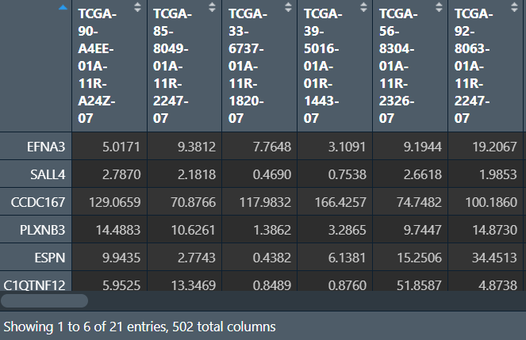
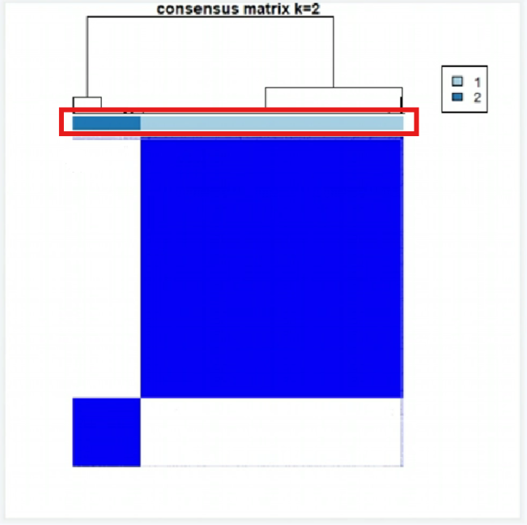
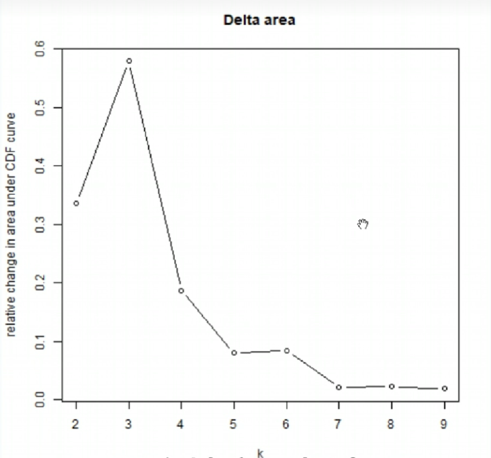

<a id="mulu">目录</a>
<a href="#mulu" class="back">回到目录</a>
<style>
    .back{width:40px;height:40px;display:inline-block;line-height:20px;font-size:20px;background-color:lightyellow;position: fixed;bottom:50px;right:50px;z-index:999;border:2px solid pink;opacity:0.3;transition:all 0.3s;color:green;}
    .back:hover{color:red;opacity:1}
    img{vertical-align:bottom;}
</style>

<!-- @import "[TOC]" {cmd="toc" depthFrom=3 depthTo=6 orderedList=false} -->

<!-- code_chunk_output -->

- [差异表达分析](#差异表达分析)
    - [TPM值](#tpm值)
    - [count值](#count值)
      - [limma](#limma)
      - [edgeR](#edger)
      - [DESeq2](#deseq2)
    - [查看以上4种分析结果](#查看以上4种分析结果)
- [单因素cox回归](#单因素cox回归)
- [GO富集分析](#go富集分析)
- [KEGG富集分析](#kegg富集分析)
- [Kaplan–Meier生存分析](#kaplanmeier生存分析)
- [基因集富集分析GSEA](#基因集富集分析gsea)
- [ssGSEA和GSVA](#ssgsea和gsva)
- [样本配对的差异表达分析](#样本配对的差异表达分析)

<!-- /code_chunk_output -->

<!-- 打开侧边预览：f1->Markdown Preview Enhanced: open...
只有打开侧边预览时保存才自动更新目录 -->

写在前面：本篇教程来自b站课程[TCGA及GEO数据挖掘入门必看](https://www.bilibili.com/video/BV1b34y1g7RM) P18-P21

### 一致性聚类与无监督聚类
需要数据：多因素cox回归结果（其实也可以是lasso/单因素cox回归结果）、tpm表达矩阵
需要包：`ConsensusClusterPlus`
```{r}
if(!require("ConsensusClusterPlus", quietly = T))
{
  library("BiocManager");
  BiocManager::install("ConsensusClusterPlus");
  library("ConsensusClusterPlus");
}
```
**读取数据**：选出肿瘤组的样本，取出筛选后基因的在各样本中的表达量
```{r}
# tpm表达矩阵
data <- read.table("C:\\Users\\WangTianHao\\Documents\\GitHub\\R-for-bioinformatics\\b站生信课03\\save_data\\TCGA_LUSC_TPM.txt", check.names = F, row.names = 1, sep = '\t', header = T);
dimnames <- list(rownames(data), colnames(data));
data <- matrix(as.numeric(as.matrix(data)), nrow = nrow(data), dimnames = dimnames);
# 选出肿瘤组的样本
group <- sapply(strsplit(colnames(data), '\\-'), "[", 4);
group <- sapply(strsplit(group, ''), "[", 1);
data <- data[, group==0];
# 筛选基因
multi_cox_gene <- read.table("C:\\Users\\WangTianHao\\Documents\\GitHub\\R-for-bioinformatics\\b站生信课03\\save_data\\multiCox.txt", check.names = F, row.names = 1, sep = '\t', header = T);
data <- data[rownames(multi_cox_gene), ];
```
{:width=250 height=250}
**对样品进行聚类分型**，使用`ConsensusClusterPlus`函数：
- `maxK`最大的K值，形成一系列梯度
- `pItem`选择百分之多少的样本重复抽样
- `pfeature`选择百分之多少的基因重复抽样
- `reps`重复抽样的数目，可以先设置为100，结果不错再设置为1000（这样结果更严谨）
- `clusterAlg`聚类算法，取值："hc"/"pam"/"km"
- `distanc`距离矩阵算法，取值："pearson"/"spearman"/"euclidean"
- `title`输出结果的文件夹名字，包含输出的图片等
- `seed`随机种子，用于固定结果
- `plot`输出图片的格式
```{r}
res <- ConsensusClusterPlus(
  data,
  maxK = 9,
  reps = 100,
  pItem = 0.8,
  pFeature = 1,
  title = "C:\\Users\\WangTianHao\\Documents\\GitHub\\R-for-bioinformatics\\b站生信课03\\save_data\\ConsensusClusterPlus",
  clusterAlg = "pam",
  distance = "euclidean",
  seed = 123,
  plot = "png"
);
```
**结果分析**：
- 第一张图标识相关度与颜色的关系（图例）：1是非常相关（蓝色），0是不相关（白色）
  {:width=250 height=250}
- 002-009：每个k值（分成了多少组）对应的聚类结果
  {:width=250 height=250}
  红框部分的不同颜色代表不同的组，它下面的2*2个方块代表每组的差异
  评判标准（以k=2为例）：
  - 组内的差异小（右上和左下两个块足够蓝）
  - 组间的差异大（右下和左上两个块足够白）
  - 每组的样本数不能过小（不能小于总样本的10%），可以通过红框中颜色占比看出
  
  可以看到k=2的图是符合标准的
- 010CDF值：
  {:width=250 height=250}
  曲线在x=0.1~0.9的变化越小的越好。可以看出k=2（红色线）符合标准
- 011CDF值变化：
  {:width=250 height=250}
  一般选取折线拐点（曲线变化趋势改变最大的点）附近的点，该图中拐点为x=3

综合上面的分析，我们选取k=2的结果
**根据上面的分组，对样本进行分型**：
```{r}
clu_num <- 2;  # 分成几组（k值）
clu <- res[[clu_num]][["consensusClass"]];  # 聚类结果（分组信息）
clu <- as.data.frame(clu);
colnames(clu) <- c("cluster");
letter <- LETTERS[1:10];  # 每组的名称，这里是ABCD大写字母
uniq_clu <- levels(factor(clu$cluster));  # 原来每组的名称
clu$cluster <- letter[match(clu$cluster, uniq_clu)];  # 将每组名称改成我们刚才定义的大写字母
clu_save <- rbind(ID = colnames(clu), clu);
write.table(clu_save, file = "C:\\Users\\WangTianHao\\Documents\\GitHub\\R-for-bioinformatics\\b站生信课03\\save_data\\cluster.txt", sep = '\t', row.names = F, quote = F);
```
{:width=250 height=250}
可以看到样品被分为了AB两组

