<a id="mulu">目录</a>
<a href="#mulu" class="back">回到目录</a>
<style>
    .back{width:40px;height:40px;display:inline-block;line-height:20px;font-size:20px;background-color:lightyellow;position: fixed;bottom:50px;right:50px;z-index:999;border:2px solid pink;opacity:0.3;transition:all 0.3s;color:green;}
    .back:hover{color:red;opacity:1}
    img{vertical-align:bottom;}
</style>

<!-- @import "[TOC]" {cmd="toc" depthFrom=3 depthTo=6 orderedList=false} -->

<!-- code_chunk_output -->

- [免疫组化图片](#免疫组化图片)
- [免疫细胞浸润分析(cibersort)](#免疫细胞浸润分析cibersort)
- [多种免疫细胞浸润分析](#多种免疫细胞浸润分析)

<!-- /code_chunk_output -->

<!-- 打开侧边预览：f1->Markdown Preview Enhanced: open...
只有打开侧边预览时保存才自动更新目录 -->

写在前面：本篇教程来自b站课程[TCGA及GEO数据挖掘入门必看](https://www.bilibili.com/video/BV1b34y1g7RM) P22-P26

### 免疫组化图片
使用HPA数据库，它是基于蛋白质组学、转录组学以及系统生物学数据创建的，拥有组织、细胞、器官等图谱，不仅收录肿瘤组织，也涵盖正常组织的蛋白表达情况，还可查询肿瘤患者的生存曲线
以EGFR基因为例：进入[HPA官网](https://www.proteinatlas.org)，在搜索栏中输入`EGFR`，search
- `Tissue`是正常组织
- `Pathology`是肿瘤组织

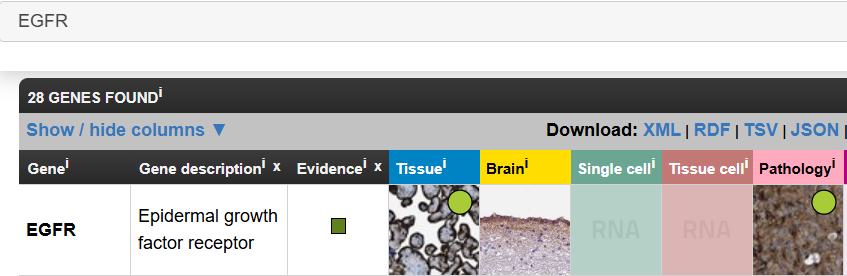{:width=200 height=200}
点击[tissue的那张图](https://www.proteinatlas.org/ENSG00000146648-EGFR/tissue)
- `RNA expression (nTPM)`是RNA表达水平
- `Protein expression (score)`是蛋白表达水平

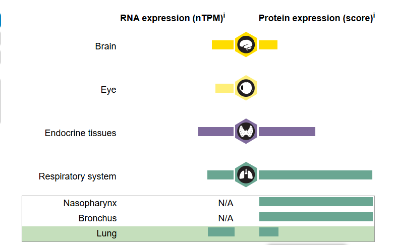{:width=250 height=250}
点击`Respiratory system`->`Lung`，就可以查看该基因[在肺中的表达](https://www.proteinatlas.org/ENSG00000146648-EGFR/tissue/lung)
`Antibody HPA001200`、`Antibody HPA018530`、...这些都是抗体名称
以`HPA018530`为例，点击[对应的图片](https://images.proteinatlas.org/18530/41191_A_2_4.jpg)
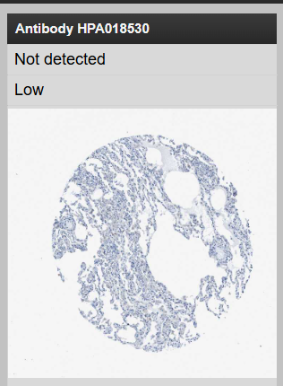{:width=250 height=250}

---

对于[肿瘤组织](https://www.proteinatlas.org/ENSG00000146648-EGFR/pathology)，点击页面下方的`Lung cancer`就可查看该基因[在肺癌中的表达](https://www.proteinatlas.org/ENSG00000146648-EGFR/pathology/lung+cancer#ihc)
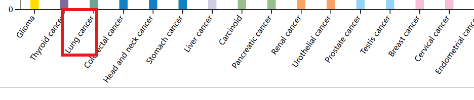{:width=150 height=150}
在新打开的页面中，`Antibody staining`标识了各抗体的免疫组化图片，点击`HPA018530`，勾选`high`（高表达），点击[绿框标注的图片](https://images.proteinatlas.org/18530/41189_B_1_3.jpg)
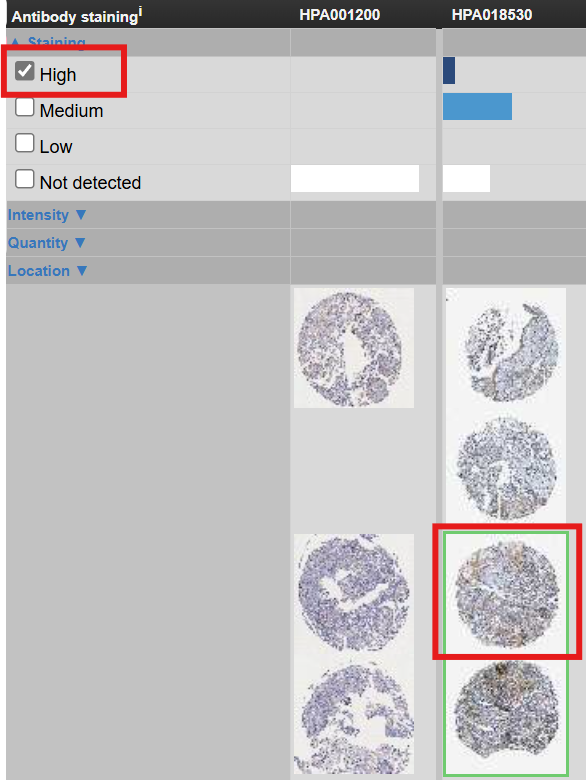{:width=250 height=250}
对比这两种图片，就可得到该抗体在正常/肿瘤免疫组化的结果
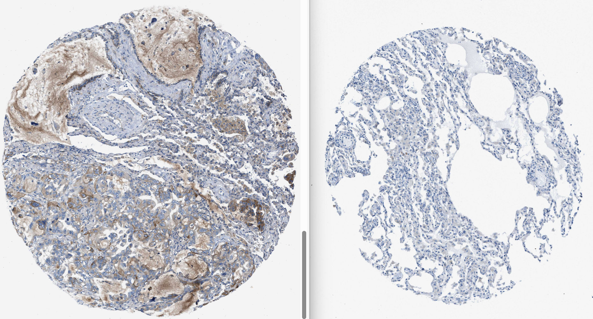{:width=250 height=250}
### 免疫细胞浸润分析(cibersort)
需要数据：tpm表达矩阵
需要包：`e1071`、`parallel`、`preprocessCore`、`bseqsc`、`tidyverse`、`corrplot`、`vioplot`、`CIBERSORT`
```{r}
if(!require("e1071", quietly = T))
{
  install.packages("e1071");
}
if(!require("parallel", quietly = T))
{
  install.packages("parallel");
}
if(!require("preprocessCore", quietly = T))
{
  library(BiocManager);
  BiocManager::install("preprocessCore");
}
if(!require("devtools", quietly = T))
{
  install.packages("devtools");
}
if(!require("corrplot", quietly = T))
{
  install.packages("corrplot");
}
if(!require("vioplot", quietly = T))
{
  install.packages("vioplot");
}
if(!require("bseqsc", quietly = T))
{
  library(devtools);
  devtools::install_github("shenorrlab/bseqsc");
}
if(!require("CIBERSORT", quietly = T))
{
  library(devtools);
  devtools::install_github("Moonerss/CIBERSORT");
}
library(devtools);
library(e1071);
library(preprocessCore);
library(parallel);
library(bseqsc);
library(ggplot2);
library(CIBERSORT);
library(corrplot);
library(vioplot);
```
**读取数据**：
```{r}
data(LM22);  # 导入CIBERSORT内置数据，包含22种细胞中基因表达情况
data <- read.table("C:\\Users\\WangTianHao\\Documents\\GitHub\\R-for-bioinformatics\\b站生信课03\\save_data\\TCGA_LUSC_TPM.txt", check.names = F, row.names = 1, sep = '\t', header = T);
dimnames <- list(rownames(data), colnames(data));
data <- matrix(as.numeric(as.matrix(data)), nrow = nrow(data), dimnames = dimnames);
```
**进行CIBERSORT分析**：
```{r}
res <- cibersort(sig_matrix = LM22, mixture_file = data);
# 保存结果
res <- as.matrix(res[, 1:(ncol(res)-3)]);
res_save <- cbind(id = rownames(res), res);
write.table(res_save, file = "C:\\Users\\WangTianHao\\Documents\\GitHub\\R-for-bioinformatics\\b站生信课03\\save_data\\CIBERSORT-Results.txt", row.names = F, sep = '\t', quote = F);
```
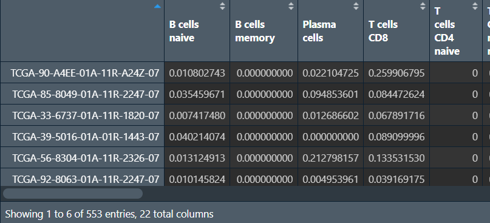{:width=200 height=200}
行名是样本名，列名是不同的细胞类型，后三列是p值、相关性、RMSE，这三列一般不用，删去
**绘图--柱状图1**：
```{r}
immune <- read.table("C:\\Users\\WangTianHao\\Documents\\GitHub\\R-for-bioinformatics\\b站生信课03\\save_data\\CIBERSORT-Results.txt", header = T, sep = '\t', check.names = F);
library(tidyverse);
immune <- column_to_rownames(immune, "id");
immune <- as.matrix(immune);
data <- t(immune);
col <- rainbow(nrow(data), s = 0.7, v = 0.7);
pdf(file = "C:\\Users\\WangTianHao\\Documents\\GitHub\\R-for-bioinformatics\\b站生信课03\\save_data\\CIBERSORT1.pdf", width = 22, height = 10);
par(las = 1, mar = c(8, 5, 4, 16), mgp = c(3, 0.1, 0), cex.axis = 1.5);
a1 <- barplot(data, col = col, yaxt = "n", ylab = "Relative Percent", xaxt = "n", cex.lab = 1.8);
a2 <- axis(2, tick = F, labels = F);
axis(2, a2, paste0(a2*100, "%"));
axis(1, a1, labels = F);
par(srt = 60, xpd = T);
text(a1, -0.02, colnames(data), adj = 1, cex = 0.6);
par(srt = 0);
ytick2 <- cumsum(data[, ncol(data)]);
ytick1 <- c(0, ytick2[-length(ytick2)]);
legend(
  par("usr")[2]*0.98,
  par("usr")[4],
  legend = rownames(data),
  col = col, pch = 15, bty = "n", cex = 1.3
);
dev.off();
```
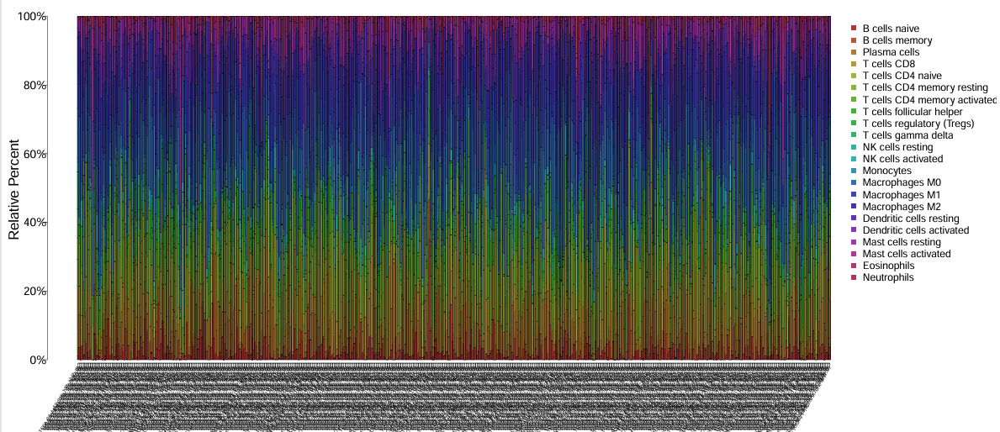{:width=400 height=400}
颜色代表细胞类型，横坐标是不同的样本，纵坐标是不同类型的细胞在不同样本中所占的比例
**第二种柱状图**：
```{r}
# 数据准备
cell.prop <- apply(immune, 1, function(x){x/sum(x)});
plot_data <- data.frame();
for(i in 1:ncol(cell.prop)){
  plot_data <- rbind(
    plot_data,
    cbind(
      cell.prop[, i],
      rownames(cell.prop),
      rep(colnames(cell.prop)[i], nrow(cell.prop))
    )
  );
}
colnames(plot_data) <- c("proportion", "celltype", "sample");
plot_data$proportion <- as.numeric(plot_data$proportion);
# 绘图
my_colors36 <- c('#E5D2DD','#53A85F','#F1BB72','#F3B1A0','#D6E7A3','#57C3F3','#476D87','#E95C59','#E59CC4','#AB3282','#23452F','#BD956A','#8C549C','#585658','#9FA3A8','#E0D4CA','#5F3D69','#C5DEBA','#58A4C3','#E4C755','#F7F398','#AA9A59','#E63863','#E39A35','#C1E6F3','#6778AE','#91D0BE','#B53E2B','#712820','#DCC1DD','#CCE0F5','#CCC9E6','#625D9E','#68A180','#3A6963','#968175');
pdf(file = "C:\\Users\\WangTianHao\\Documents\\GitHub\\R-for-bioinformatics\\b站生信课03\\save_data\\CIBERSORT2.pdf", width = 22, height = 10);
ggplot(
  plot_data,
  aes(sample, proportion, fill = celltype),
) +
  geom_bar(stat = "identity", position = "fill") +
  scale_fill_manual(values = my_colors36) +
  ggtitle("cell portation") +
  theme_bw() +
  theme(
    axis.ticks.length = unit(0.5, "cm"),
    axis.title.x = element_text(size = 1),
    axis.text.x = element_text(angle = 45, hjust = 0.5, vjust = 0.5)
  ) +
  guides(fill = guide_legend(title = NULL));
dev.off();
```
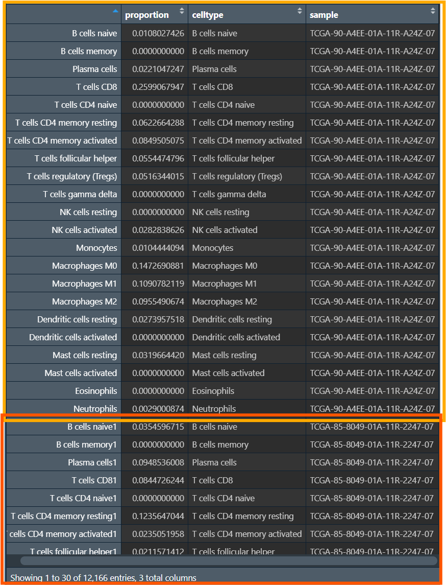{:width=250 height=250}
宽数据->长数据：将每个样本的每种细胞占比（数据值）变为`proportion`列
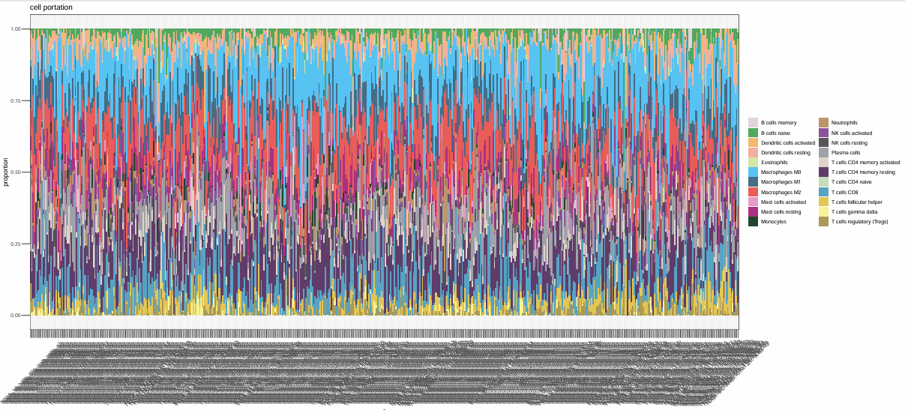{:width=250 height=250}
**相关性图**：
```{r}
pdf(file = "C:\\Users\\WangTianHao\\Documents\\GitHub\\R-for-bioinformatics\\b站生信课03\\save_data\\CIBERSORT_cor.pdf", width = 13, height = 13);
par(oma = c(0.5, 1, 1, 1.2));
plot_data <- immune[, colMeans(immune)>0];
plot_data <- cor(immune);
corrplot(
  plot_data,
  order = "hclust",
  method = "color",
  addCoef.col = "black",
  diag = T,
  tl.col = "black",
  col = colorRampPalette(c("blue", "white", "red"))(50)
);
dev.off();
```
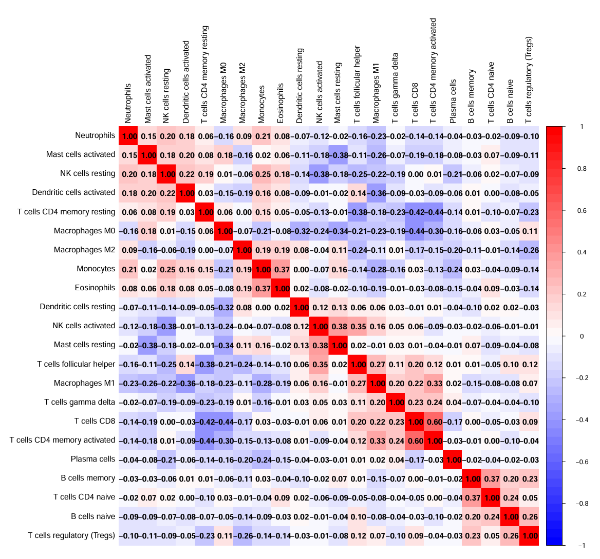{:width=250 height=250}
表示这22种细胞类型之间，红色--正相关、蓝色--负相关、白色--不相关
**对正常组和肿瘤组的免疫细胞浸润进行差异分析**：
```{r}
# 先根据样本名分成正常组和肿瘤组（同之前操作）
group <- sapply(strsplit(rownames(immune), '\\-'), "[", 4);
group <- sapply(strsplit(group, ''), "[", 1);
group <- gsub("2", "1", group);
con_num <- length(group[group==1]);
treat_num <- length(group[group==0]);
type <- c(rep(1, con_num), rep(2, treat_num));
rt1 <- immune[group==1, ];
rt2 <- immune[group==0, ];
rt <- rbind(rt1, rt2);
# 绘制小提琴图
outTab <- data.frame();
pdf(file = "C:\\Users\\WangTianHao\\Documents\\GitHub\\R-for-bioinformatics\\b站生信课03\\save_data\\CIBERSORT_vioplot.pdf", width = 13, height = 8);
par(las = 1, mar = c(10, 6, 3, 3));
x <- 1:ncol(rt);
y <- 1:ncol(rt);
plot(
  x, y,
  xlim = c(0, 63),
  ylim = c(min(rt), max(rt)+0.05),
  main = "",
  xlab = "",
  ylab = "Fraction",
  pch = 21,
  col = "white",
  xaxt = "n"
);
for(i in 1:ncol(rt)){
  # 计算标准差
  if(sd(rt[1:con_num])==0){
    rt[1, i] <- 0.00001;
  }
  if(sd(rt[(con_num+1):(con_num+treat_num), i])==0){
    rt[con_num+1, i] <- 0.00001;
  }
  # 取出数据
  rt1 <- rt[1:con_num, i];
  rt2 <- rt[(con_num+1):(con_num+treat_num), i];
  # 绘图
  vioplot(rt1, at = 3*(i-1), lty = 1, add = T, col = "blue");
  vioplot(rt2, at = 3*(i-1)+1, lty = 1, add = T, col = "red");
  # Wilcox检验
  wilcox_test <- wilcox.test(rt1, rt2);
  p <- wilcox_test$p.value;
  if(p<0.05){
    cell_p <- cbind(Cell=colnames(rt)[i], pvalue = p);
    outTab <- rbind(outTab, cell_p);
  }
  mx <- max(c(rt1, rt2));
  lines(c(x=3*(i-1)+0.2, x=3*(i-1)+0.8), c(mx, mx));
  text(
    x = 3*(i-1)+0.5, 
    y = mx+0.02,
    labels = ifelse(
      p<0.001,
      paste0("p<0.001"),
      paste0("p=", sprintf("%.03f", p))
    ),

  );
}
legend(
  "topright",
  c("Normal", "Tumor"),
  lwd = 3,
  bty = "n",
  cex = 1,
  col = c("blue", "red")
);
text(
  seq(1, 64, 3), 
  -0.04, 
  xpd = NA, 
  labels = colnames(rt), 
  cex = 1, 
  srt = 45, 
  pos = 2
);
dev.off();
# 保存数据（免疫细胞和其p值）
write.table(outTab, file = "C:\\Users\\WangTianHao\\Documents\\GitHub\\R-for-bioinformatics\\b站生信课03\\save_data\\CIBERSORT_Diff.txt", row.names = F, sep = '\t', quote = F);
```
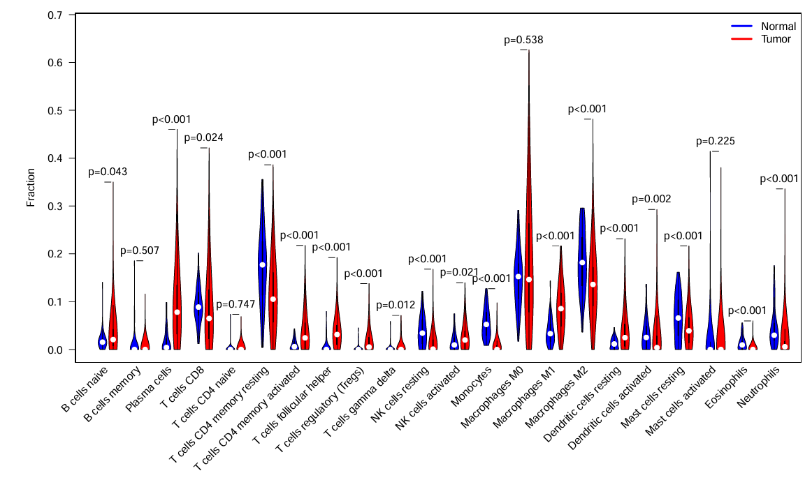{:width=250 height=250}
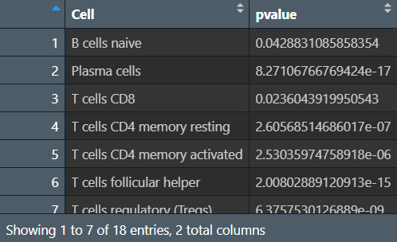{:width=250 height=250}
横坐标是细胞种类，纵坐标是每种细胞具体含量，p值就是每种细胞在正常/肿瘤组中的差异
`outTab`是在正常/肿瘤组中有统计学差异的细胞
除此之外，正常/肿瘤组也可以换成高/低风险组、某基因表达量高/低等
### 多种免疫细胞浸润分析
```{r}
library(limma);
library(scales);
library(ggplot2);
library(ggtext);
```
**读取免疫细胞浸润文件、tpm表达矩阵，并取交集**：
```{r}
# 免疫细胞浸润文件
immune <- read.csv("C:\\Users\\WangTianHao\\Documents\\GitHub\\R-for-bioinformatics\\b站生信课03\\data\\infiltration_estimation_for_tcga.csv", check.names = F, row.names = 1, sep = ',', header = T);
immune <- as.matrix(immune);
rownames(immune) <- gsub(  # 改样本名
  "(.*?)\\-(.*?)\\-(.*?)\\-(.*)", 
  "\\1\\-\\2\\-\\3",
  rownames(immune)
);
immune <- avereps(immune);  # 对相同样本取平均值
# tpm表达矩阵
data <- read.table("C:\\Users\\WangTianHao\\Documents\\GitHub\\R-for-bioinformatics\\b站生信课03\\save_data\\TCGA_LUSC_TPM.txt", check.names = F, row.names = 1, sep = '\t', header = T);
dimnames <- list(rownames(data), colnames(data));
data <- matrix(as.numeric(as.matrix(data)), nrow = nrow(data), dimnames = dimnames);
group <- sapply(strsplit(colnames(data),"\\-"), "[", 4);
group <- sapply(strsplit(group,""), "[", 1);
data = data[,group == 0];  # 仅保留肿瘤样本
data <- t(data);
rownames(data) <- substr(rownames(data), 1, 12);
rownames(data) <- gsub('[.]', '-', rownames(data));
# 取交集
same_sample <- intersect(row.names(data), row.names(immune));
# 以A1BG这个基因的表达水平为区分
data <- data[same_sample, "A1BG"];
immune <- immune[same_sample, ];
```
`data`：
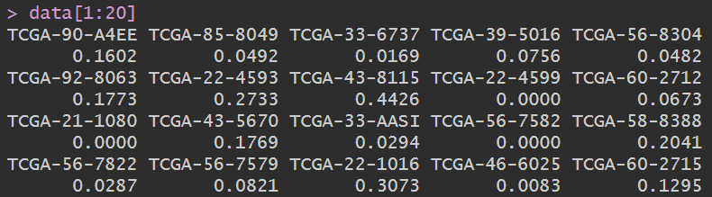{:width=250 height=250}
是A1BG基因在各样本中的表达量
免疫细胞浸润文件`immune`：
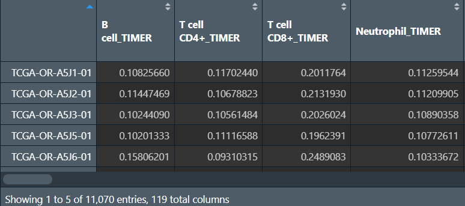{:width=250 height=250}
包括所有TCGA样本、使用不同分析方法进行分析的、各种免疫细胞分析结果
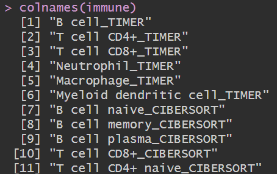{:width=250 height=250}
列名后面的`TIMER`、`CIBERSORT`就是分析方法
此时得到的`immune`与上节中的类似，只不过它是多种分析方法得到的结果，可根据列名选取某种分析方法得到的结果，绘图的方法与上节课相同（此处画了气泡图）
**相关性分析**（A1BG基因表达量与免疫细胞分析结果）：
```{r}
x <- as.numeric(data);
outTab <- data.frame();
for(i in colnames(immune)){
  y <- as.numeric(immune[, i]);
  corT <- cor.test(x, y, method="spearman");
  cor <- corT$estimate;
  pvalue <- corT$p.value;
  if(pvalue<0.05){
    outTab <- rbind(outTab, cbind(immune=i, cor, pvalue));
  }
}
# 保存结果
write.table(file="C:\\Users\\WangTianHao\\Documents\\GitHub\\R-for-bioinformatics\\b站生信课03\\save_data\\immune_corResult.txt", outTab, sep="\t", quote=F, row.names=F);
```
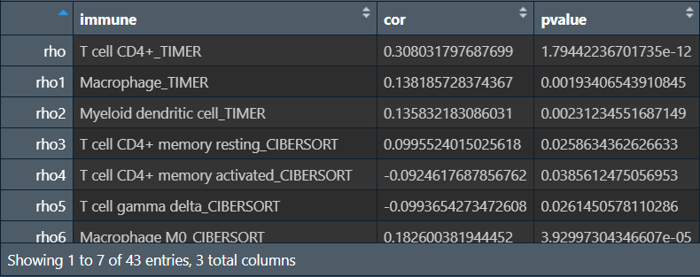{:width=250 height=250}
得到与A1BG基因表达量相关性显著的免疫细胞
**绘制气泡图**：
```{r}
corResult <- read.table("C:\\Users\\WangTianHao\\Documents\\GitHub\\R-for-bioinformatics\\b站生信课03\\save_data\\immune_corResult.txt", head=T, sep="\t");
corResult$Software <- sapply(strsplit(corResult[, 1], "_"), '[', 2);  # 得到分析方法Software列
corResult$Software <- factor(
  corResult$Software,
  level = as.character(
    unique(
      corResult$Software[rev(order(as.character(corResult$Software)))]
)));  # 将Software列转为factor
b <- corResult[order(corResult$Software), ];  # 按分析方法重排序
b$immune <- factor(b$immune, levels = rev(as.character(b$immune)));  # 将immune列转为factor（如果不转，y轴将不会按分析方法排序）
colslabels <- rep(
  hue_pal()(length(levels(b$Software))),
  table(b$Software)
);  # 绘图颜色
pdf(file = "C:\\Users\\WangTianHao\\Documents\\GitHub\\R-for-bioinformatics\\b站生信课03\\save_data\\immune_cor.pdf", width = 10, height = 10);
ggplot(
  data = b, 
  aes(x=cor, y=immune, color=Software)
) +
  labs(x = "Correlation coefficient", y = "Immune cell") +
  geom_point(size = 4.1) +
  theme(
    panel.background = element_rect(fill = "white", size = 1, color = "black"),
    panel.grid = element_line(color = "grey75", size = 0.5),
    axis.ticks = element_line(size = 0.5),
    axis.text.y = ggtext::element_markdown(colour = rev(colslabels))
  );
dev.off();
```
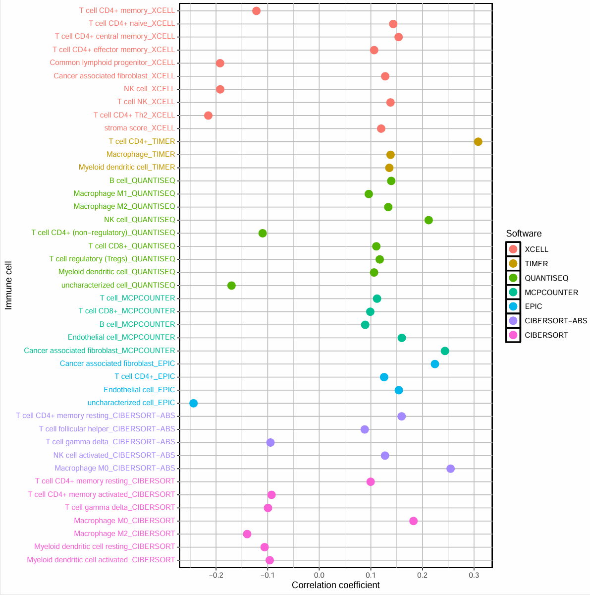{:width=250 height=250}
横坐标是相关性系数，每种颜色是不同的分析方法，纵坐标是不同的免疫细胞，>0的点是正相关，<0的是负相关
