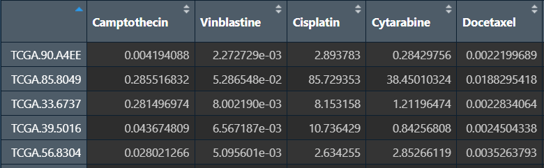
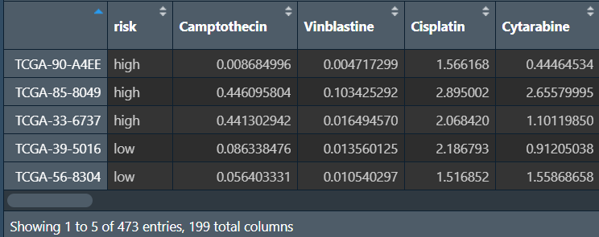
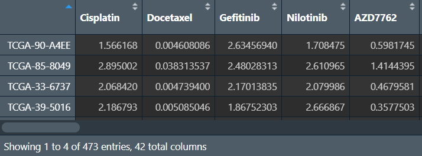
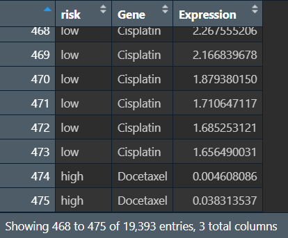
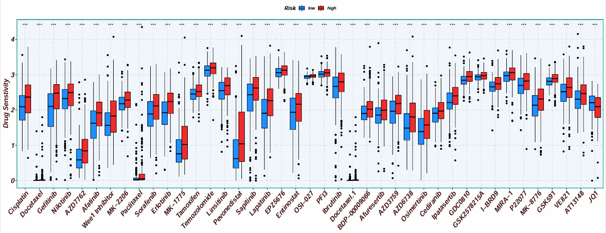
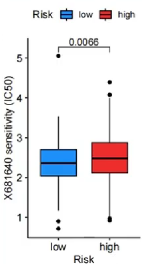
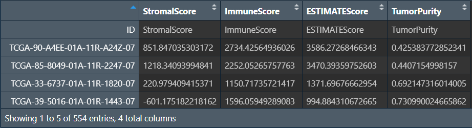
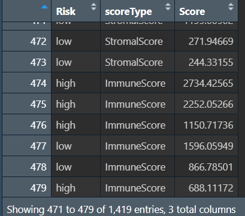
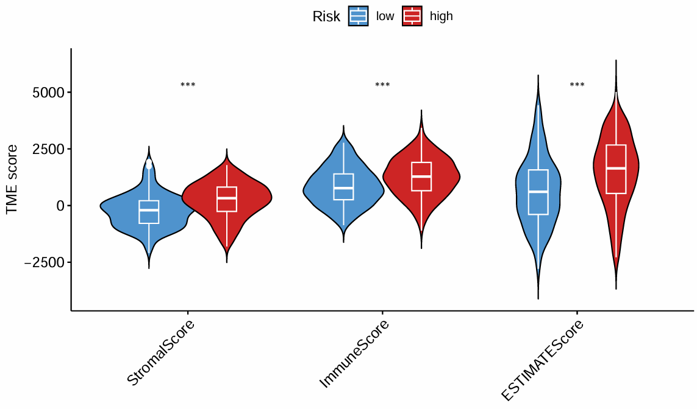

<a id="mulu">目录</a>
<a href="#mulu" class="back">回到目录</a>
<style>
    .back{width:40px;height:40px;display:inline-block;line-height:20px;font-size:20px;background-color:lightyellow;position: fixed;bottom:50px;right:50px;z-index:999;border:2px solid pink;opacity:0.3;transition:all 0.3s;color:green;}
    .back:hover{color:red;opacity:1}
    img{vertical-align:bottom;}
</style>

<!-- @import "[TOC]" {cmd="toc" depthFrom=3 depthTo=6 orderedList=false} -->

<!-- code_chunk_output -->

- [突变数据整理](#突变数据整理)
- [TIDE预测免疫治疗反应](#tide预测免疫治疗反应)
- [预测药物敏感性(oncoPredict)](#预测药物敏感性oncopredict)
- [预测药物敏感性(pRRophetic)](#预测药物敏感性prrophetic)
- [免疫浸润评分(estimate)](#免疫浸润评分estimate)
- [临床信息相关性分析](#临床信息相关性分析)
    - [热图](#热图)
    - [箱型图](#箱型图)

<!-- /code_chunk_output -->

<!-- 打开侧边预览：f1->Markdown Preview Enhanced: open...
只有打开侧边预览时保存才自动更新目录 -->

写在前面：本篇教程来自b站课程[TCGA及GEO数据挖掘入门必看](https://www.bilibili.com/video/BV1b34y1g7RM) P27-P

### 突变数据整理
```{r}
if(!require("maftools", quietly = T))
{
  library("BiocManager");
  BiocManager::install("maftools");
  library("maftools");
}
library(dplyr);
```
**合并所有数据文件**：
```{r}
wd <- "C:/Users/WangTianHao/Documents/GitHub/R-for-bioinformatics/b站生信课03/data/突变数据/gdc_download_20231124_162149.342756/";
files <- list.files(wd, pattern = '*.gz', recursive = TRUE);
all_mut <- data.frame();
for (file in files) {
  file <- paste0(wd, file);
  mut <- read.delim(file, skip = 7, header = T, fill = TRUE, sep = "\t");
  all_mut <- rbind(all_mut,mut);
}
# 样本名仅保留前12个字符
all_mut$Tumor_Sample_Barcode <-  substr(all_mut$Tumor_Sample_Barcode, 1, 12);
# 数据读入
all_mut <- read.maf(all_mut);
# 选取指定列，更改样本名
a <- all_mut@data %>%
  .[,c("Hugo_Symbol","Variant_Classification","Tumor_Sample_Barcode")] %>%
  as.data.frame() %>%
  mutate(Tumor_Sample_Barcode = substring(.$Tumor_Sample_Barcode,1,12));
```
{:width=180 height=180}
每个样本的每个基因都发生了什么样的突变
**创建两个矩阵**：列名是样本名，行名是基因名，值分别是该样本的该基因是否发生突变、发生了什么样的突变（如果未发生突变就为NA）
```{r}
gene <- as.character(unique(a$Hugo_Symbol));  # 所有基因名
sample <- as.character(unique(a$Tumor_Sample_Barcode));  # 所有样本名
# 发生了什么样的突变
mat <- as.data.frame(  # 列名是样本名，行名是基因名的空矩阵
  matrix(
    "",
    length(gene),length(sample),
    dimnames = list(gene,sample)
  )
);
for (i in 1:nrow(a)){
  mat[as.character(a[i,1]),as.character(a[i,3])] <- as.character(a[i,2]);  # 根据行列名设定值
}
# 是否发生突变
mat_0_1 <- as.data.frame(  # 列名是样本名，行名是基因名的空矩阵
  matrix(
    0,
    length(gene),length(sample),
    dimnames = list(gene,sample)
  )
);
for (i in 1:nrow(a)){
  mat_0_1[as.character(a[i,1]),as.character(a[i,3])] <- 1;  # 没取到的位置就为NA
}
```
{:width=200 height=200}
{:width=180 height=180}
**汇总所有样本的突变情况**（每个基因在多少个样本中发生了突变）：将行名变成`Gene`列，对应的`count`列只需对`mat_0_1`的每行加和即可（有突变就是1，有几个1就有几个突变）
```{r}
gene_count <- data.frame(
  Gene = rownames(mat_0_1),
  Num = as.numeric(apply(mat_0_1, 1, sum))
) %>%
  arrange(desc(Num));  # 按突变数从大到小排序
# 保存数据
write.table(gene_count, 'C:\\Users\\WangTianHao\\Documents\\GitHub\\R-for-bioinformatics\\b站生信课03\\save_data\\geneMut.txt', sep="\t", quote=F, row.names = F);
write.mafSummary(maf = all_mut, basename = "C:\\Users\\WangTianHao\\Documents\\GitHub\\R-for-bioinformatics\\b站生信课03\\save_data\\input");
```
{:width=250 height=250}
**绘制瀑布图oncoplot**：
```{r}
pdf(file = "C:\\Users\\WangTianHao\\Documents\\GitHub\\R-for-bioinformatics\\b站生信课03\\save_data\\maf.pdf", width = 6, height = 6);
oncoplot(
  maf = all_mut,
  top = 30,  # 显示前30个的突变基因信息
  fontSize = 0.6,  # 设置字体大小
  showTumorSampleBarcodes = F
);  # 不显示病人信息
dev.off();
```
{:width=500 height=500}
**计算每个样本的TMB值**（肿瘤突变负荷：每百万碱基检测出的体细胞变异总数）
```{r}
tmb_table <- tmb(maf = all_mut, logScale = F);
tmb_table <- tmb_table[, c(1,3)];  # 保留需要的tmb值信息
tmb_table <- as.data.frame(tmb_table);
tmb_table[,1] <- substr(tmb_table[,1],1,12);
tmb_table <- aggregate( . ~ Tumor_Sample_Barcode, data = tmb_table, max);  # 去重，重复行取最大值
colnames(tmb_table)[1] = "id";
colnames(tmb_table)[2] = "TMB";
write.table(tmb_table,'C:\\Users\\WangTianHao\\Documents\\GitHub\\R-for-bioinformatics\\b站生信课03\\save_data\\TMB.txt', sep="\t", quote=F, row.names = F);
```
{:width=180 height=180}
### TIDE预测免疫治疗反应
TIDE：肿瘤免疫功能障碍和排斥，用于评估肿瘤样本基因表达谱中肿瘤免疫逃逸的可能性——值越大，越可能免疫，对免疫治疗越不敏感
```{r}
library(limma);
library(ggpubr);
```
**读取tpm表达矩阵，并进行标准化**：`数据值-行平均值`，使基因的均值为0
```{r}
rt <- read.table("C:\\Users\\WangTianHao\\Documents\\GitHub\\R-for-bioinformatics\\b站生信课03\\save_data\\TCGA_LUSC_TPM.txt", header = T, sep = "\t", check.names = F);
rownames(rt) <- rt[, 1];
exp <- rt[, 2:ncol(rt)];
Expr <- t(apply(exp, 1, function(x)x-(mean(x))));
write.table(
  data.frame(ID = rownames(Expr), Expr, check.names = F),
  'C:\\Users\\WangTianHao\\Documents\\GitHub\\R-for-bioinformatics\\b站生信课03\\save_data\\tcga_normalize.txt', sep="\t", quote=F, row.names = TRUE
);
```
{:width=220 height=220}
**TIDE数据的获取**：进入[网站](http://tide.dfci.harvard.edu)
- 点击`选择文件`，将刚才得到的标准化表达矩阵放入
- `cancer type`：NSCLC
- 点击`Predict response`

{:width=350 height=350}
之后点击页面最下面的`Export to CSV`导出
{:width=180 height=180}
只需要两列信息：`patient`样本名、`TIDE`
**读取TIDE数据并处理**：
```{r}
tide <- read.csv("C:\\Users\\WangTianHao\\Documents\\GitHub\\R-for-bioinformatics\\b站生信课03\\save_data\\TIDE.csv");
tide <- tide[, c(1, 4)];
# 仅保留肿瘤样本
group <- sapply(strsplit(tide[, 1],"\\-"), "[", 4);
group <- sapply(strsplit(group,""), "[", 1);
group <- gsub("2", "1", group);
tide <- tide[group==0, , drop=F];
# 修改样本名
tide[, 1] <- gsub("(.*?)\\-(.*?)\\-(.*?)\\-(.*?)\\-.*", "\\1\\-\\2\\-\\3", tide[, 1]);
# 去除重复
tide1 <- tide[!duplicated(tide$Patient), ];
# 让样本名为行名
rownames(tide1) <- tide1[, 1];
tide <- as.data.frame(tide1[, 2]);
rownames(tide) <- rownames(tide1);
colnames(tide) <- "TIDE";
tide <- avereps(tide);
```
{:width=150 height=150}
**读取风险得分，根据样本名合并，同时设置比较组**：
- 更改risk列：如果值为high就改为"High-risk"，反之为"Low-risk"
- 将所有的组名两两组合，存入一个列表中，使每个元素是一个有两个元素（组名）的字符串数组

```{r}
# 读取风险得分
risk <- read.table( "C:\\Users\\WangTianHao\\Documents\\GitHub\\R-for-bioinformatics\\b站生信课03\\save_data\\risk.txt", check.names = F, row.names = 1, sep = '\t', header = T);
# 合并
same_sample <- intersect(row.names(risk), row.names(tide));
data <- cbind(
  tide[same_sample, , drop=F],
  risk[same_sample, "risk", drop=F]
);
# 设置比较组
data$risk <- ifelse(data$risk=="high", "High-risk", "Low-risk");
group <- levels(factor(data$risk));
comp <- combn(group, 2);  # 将group中每2个元素进行组合
my_comparisons <- list();
for(i in 1:ncol(comp)){
  my_comparisons[[i]] <- comp[, i];
}
```
{:width=180 height=180}
{:width=60 height=60}
**画图**：
```{r}
pdf(file = "C:\\Users\\WangTianHao\\Documents\\GitHub\\R-for-bioinformatics\\b站生信课03\\save_data\\TIDE.pdf", width = 5, height = 4.5);
ggviolin(
  data, 
  x = "risk", y="TIDE", 
  fill = "risk", 
  xlab = "", ylab = "TIDE",
  palette = c("Firebrick2", "DodgerBlue1"),
  legend.title = "Risk",
  add = "boxplot", 
  add.params = list(fill = "white")
) + 
  stat_compare_means(comparisons = my_comparisons);  # 添加p值显著性标记
dev.off();
```
{:width=400 height=400}
横坐标是高低风险组，纵坐标是TIDE得分。可以看到低风险组的TIDE低于高风险组，对免疫治疗更敏感
### 预测药物敏感性(oncoPredict)
药物预测需要训练集，一般推荐使用权威数据作为训练集建模，之后预测自己的数据。这里使用GDSC(Genomics of Drug Sensitivity in Cancer)数据库
使用`oncoPredict`包
需要数据：tpm表达矩阵、风险得分、2个GDSC文件
```{r}
if(!require("GenomicFeatures", quietly = T))
{
  library("BiocManager");
  BiocManager::install("GenomicFeatures");
  library("GenomicFeatures");
}
if(!require("TCGAbiolinks", quietly = T))
{
  library("BiocManager");
  BiocManager::install("TCGAbiolinks");
  library("TCGAbiolinks");
}
if(!require("TxDb.Hsapiens.UCSC.hg19.knownGene", quietly = T))
{
  library("BiocManager");
  BiocManager::install("TxDb.Hsapiens.UCSC.hg19.knownGene");
  library("TxDb.Hsapiens.UCSC.hg19.knownGene");
}
if(!require("oncoPredict", quietly = T))
{
  install.packages("oncoPredict");
}
library(limma);
library(oncoPredict);
library(parallel);
library(limma);
library(ggplot2);
library(ggpubr);
library(limma);
library(reshape2);
library(ggplot2);
library(ggpubr);
```
**读取数据**：
```{r}
# tpm表达矩阵
data <- read.table("C:\\Users\\WangTianHao\\Documents\\GitHub\\R-for-bioinformatics\\b站生信课03\\save_data\\TCGA_LUSC_TPM.txt", header = T, sep = "\t", check.names = F, row.names = 1);
dimnames <- list(rownames(data), colnames(data));
data <- matrix(as.numeric(as.matrix(data)), nrow = nrow(data), dimnames = dimnames);
colnames(data) <- gsub("(.*?)\\_(.*?)", "\\2", colnames(data));
# 读取风险得分
risk <- read.table( "C:\\Users\\WangTianHao\\Documents\\GitHub\\R-for-bioinformatics\\b站生信课03\\save_data\\risk.txt", check.names = F, row.names = 1, sep = '\t', header = T);
```
**读取GDSC文件并建模**：
```{r}
set.seed(999);  # 随机数种子
# 读取GDSC文件
GDSC2_Expr <- readRDS(file = 'C:\\Users\\WangTianHao\\Documents\\GitHub\\R-for-bioinformatics\\b站生信课03\\data\\免疫数据\\GDSC2_Expr.rds');
GDSC2_Res <- readRDS(file = 'C:\\Users\\WangTianHao\\Documents\\GitHub\\R-for-bioinformatics\\b站生信课03\\data\\免疫数据\\GDSC2_Res.rds');
GDSC2_Res <- exp(GDSC2_Res);
# 药物敏感性建模（半小时左右）
calcPhenotype(
  trainingExprData = GDSC2_Expr,    
  trainingPtype = GDSC2_Res,        
  testExprData = data,              
  batchCorrect = 'eb',  
  powerTransformPhenotype = TRUE,
  removeLowVaryingGenes = 0.2,    
  minNumSamples = 10,    
  printOutput = TRUE,    
  removeLowVaringGenesFrom = 'rawData'
);
```
{:width=150 height=150}
横坐标是样本，纵坐标是药物名，显示不同药物在每一个样本中的敏感性
**读入药敏文件，处理后与风险得分合并**：
```{r}
# 读入药敏文件
senstivity <- read.csv("C:\\Users\\WangTianHao\\Documents\\GitHub\\R-for-bioinformatics\\b站生信课03\\save_data\\calcPhenotype_Output\\DrugPredictions.csv", header = T, sep = ",", check.names = F, row.names = 1);
colnames(senstivity) <- gsub("(.*)\\_(\\d+)", "\\1", colnames(senstivity));
# 仅保留肿瘤样本
group <- sapply(strsplit(rownames(senstivity),"\\-"), "[", 4);
group <- sapply(strsplit(group,""), "[", 1);
senstivity <- senstivity[group==0,];
# 样本名仅保留前12字符
senstivity <- t(senstivity);  # 为避免行名重复，先转置，改变列名
colnames(senstivity) <- substr(colnames(senstivity), 1, 12);
senstivity <- t(senstivity);  # 最后再转回来
# 合并
same_sample <- intersect(row.names(risk), row.names(senstivity));
senstivity <- senstivity[same_sample, , drop=F];
risk <- risk[same_sample, "risk", drop=F];
# NA->0
senstivity[is.na(senstivity)] <- 0;
# 取log2
senstivity <- log2(senstivity+1);
rt <- cbind(risk, senstivity);
```
{:width=180 height=180}
**设置比较组、提取显著差异的药物**：
```{r}
# 设置比较组
rt$risk <- factor(rt$risk, levels = c("low", "high"));
group <- levels(factor(rt$risk));
comp <- combn(group, 2);
my_comparisons <- list();
for(i in 1:ncol(comp)){
  my_comparisons[[i]] <- comp[, i];
}
# 提取显著差异的药物
sigGene <- c();
for(i in colnames(rt)[2:(ncol(rt))]){
  if(sd(rt[, i])<0.05){next}  # 某列（某种药物）的标准差<0.05就跳过
  wilcoxTest <- wilcox.test(rt[, i] ~ rt[, "risk"]);
  pvalue <- wilcoxTest$p.value;
  if(wilcoxTest$p.value<0.001){  # 如果药物数量较少，可设为0.05
    sigGene <- c(sigGene, i);
  }
}
sigGene <- c(sigGene, "risk");
rt_sig <- rt[, sigGene];
```
{:width=150 height=150}
**绘图前的数据准备**：
```{r}
# 宽数据变长数据（risk列不变，其它列名变列值
rt_sig <- melt(rt_sig,id.vars=c("risk"));
colnames(rt_sig) <- c("risk","Gene","Expression");
# 设置比较组
group <- levels(factor(rt$risk));
rt_sig$risk <- factor(rt_sig$risk, levels = c("low", "high"));
comp <- combn(group, 2);
my_comparisons <- list();
for(i in 1:ncol(comp)){
  my_comparisons[[i]] <- comp[, i];
}
```
{:width=200 height=200}
**画箱型图**：
```{r}
boxplot <- ggboxplot(
  rt_sig, x = "Gene", y = "Expression", 
  fill = "risk",
  xlab = "", ylab = "Drug Senstivity",
  legend.title = "Risk",
  width = 0.8,
  palette = c("DodgerBlue1","Firebrick2") 
) +
  rotate_x_text(50) +
  stat_compare_means(
    aes(group = risk),
    method = "wilcox.test",
    symnum.args = list(
      cutpoints = c(0, 0.001, 0.01, 0.05, 1), 
      symbols = c("***", "**", "*", "ns")
    ), 
    label = "p.signif"
  ) +
  theme(
    axis.text = element_text(
      face = "bold.italic",
      colour = "#441718",
      size = 16
    ),
    axis.title = element_text(
      face = "bold.italic",
      colour = "#441718",
      size = 16
    ),
    axis.line = element_blank(),
    plot.title = element_text(
      face = "bold.italic",
      colour = "#441718",
      size = 16
    ),
    legend.text = element_text(face = "bold.italic"),
    panel.border = element_rect(
      fill = NA,
      color = "#35A79D",
      size = 1.5,
      linetype = "solid"
    ),
    panel.background = element_rect(fill = "#F1F6FC"),
    panel.grid.major = element_line(
      color = "#CFD3D6", 
      size =.5,
      linetype ="dotdash"
    ),
    legend.title = element_text(
      face ="bold.italic",
      size = 13
    )
  );
# 输出图片
pdf(file = "C:\\Users\\WangTianHao\\Documents\\GitHub\\R-for-bioinformatics\\b站生信课03\\save_data\\drugSenstivity.pdf", width = 20, height = 8);
print(boxplot);
dev.off();
```
{:width=400 height=400}
横坐标是不同的药物，纵坐标是药物敏感性，按高/低风险分组（也可以是某个基因的表达量高低）。得分越低，则该药物在该组中越敏感
### 预测药物敏感性(pRRophetic)
使用`pRRophetic`包，它比上面的`oncoPredict`包旧一点，所以要使用R<4.3版本运行，推荐使用上面的`oncoPredict`包
[安装方法](https://zhuanlan.zhihu.com/p/672440831)
```{r}
install.packages("C:\\Users\\WangTianHao\\Downloads\\pRRophetic_0.5.tar.gz", repos = NULL, type = "source");
library(limma);
library(ggpubr);
library(pRRophetic);
library(ggplot2);
set.seed(12345);
```
**读入数据**：tpm表达矩阵和风险分组
```{r}
# 表达矩阵
data <- read.table("C:\\Users\\WangTianHao\\Documents\\GitHub\\R-for-bioinformatics\\b站生信课03\\save_data\\TCGA_LUSC_TPM.txt", header = T, sep = "\t", check.names = F,row.names = 1);
dimnames <- list(rownames(data), colnames(data));
data <- matrix(as.numeric(as.matrix(data)), nrow = nrow(data), dimnames = dimnames);
data <- data[rowMeans(data)>0.5, ];
#仅保留肿瘤样本
group <- sapply(strsplit(colnames(data),"\\-"), "[", 4);
group <- sapply(strsplit(group, ""), "[", 1);
group <- gsub("2", "1", group);
data <- data[, group==0];
data <- t(data);
rownames(data) <- gsub("(.*?)\\-(.*?)\\-(.*?)\\-(.*)",  "\\1\\-\\2\\-\\3", rownames(data));
data <- avereps(data);
data <- t(data);
# 风险分组
riskRT <- read.table("C:\\Users\\WangTianHao\\Documents\\GitHub\\R-for-bioinformatics\\b站生信课03\\save_data\\risk.txt", header = T, sep = "\t", check.names = F, row.names = 1);
```
使用CGP数据库，使用`?pRRopheticPredict`--arguments--drug可以看到它可以预测哪些药物
**进行预测**：
```{r}
# 能预测的药物
alldrugs <- c("A.443654","A.770041","ABT.263","ABT.888","AG.014699","AICAR","AKT.inhibitor.VIII","AMG.706","AP.24534","AS601245","ATRA","AUY922","Axitinib","AZ628","AZD.0530","AZD.2281","AZD6244","AZD6482","AZD7762","AZD8055","BAY.61.3606","Bexarotene","BI.2536","BIBW2992","Bicalutamide","BI.D1870","BIRB.0796","Bleomycin","BMS.509744","BMS.536924","BMS.708163","BMS.754807","Bortezomib","Bosutinib","Bryostatin.1","BX.795","Camptothecin","CCT007093","CCT018159","CEP.701","CGP.082996","CGP.60474","CHIR.99021","CI.1040","Cisplatin","CMK","Cyclopamine","Cytarabine","Dasatinib","DMOG","Docetaxel","Doxorubicin","EHT.1864","Elesclomol","Embelin","Epothilone.B","Erlotinib","Etoposide","FH535","FTI.277","GDC.0449","GDC0941","Gefitinib","Gemcitabine","GNF.2","GSK269962A","GSK.650394","GW.441756","GW843682X","Imatinib","IPA.3","JNJ.26854165","JNK.9L","JNK.Inhibitor.VIII","JW.7.52.1","KIN001.135","KU.55933","Lapatinib","Lenalidomide","LFM.A13","Metformin","Methotrexate","MG.132","Midostaurin","Mitomycin.C","MK.2206","MS.275","Nilotinib","NSC.87877","NU.7441","Nutlin.3a","NVP.BEZ235","NVP.TAE684","Obatoclax.Mesylate","OSI.906","PAC.1","Paclitaxel","Parthenolide","Pazopanib","PD.0325901","PD.0332991","PD.173074","PF.02341066","PF.4708671","PF.562271","PHA.665752","PLX4720","Pyrimethamine","QS11","Rapamycin","RDEA119","RO.3306","Roscovitine","Salubrinal","SB.216763","SB590885","Shikonin","SL.0101.1","Sorafenib","S.Trityl.L.cysteine","Sunitinib","Temsirolimus","Thapsigargin","Tipifarnib","TW.37","Vinblastine","Vinorelbine","Vorinostat","VX.680","VX.702","WH.4.023","WO2009093972","WZ.1.84","X17.AAG","X681640","XMD8.85","Z.LLNle.CHO","ZM.447439");
# 进行预测并画图（可能需要半小时左右）
for(drug in alldrugs){
  # 预测药物敏感性
  sensitivity <- pRRopheticPredict(data, drug, selection = 1);
  sensitivity <- sensitivity[sensitivity!="NaN"];
  # 合并风险文件和药物敏感性结果
  sameSample <- intersect(row.names(riskRT),  names(sensitivity));
  risk <- riskRT[sameSample, "risk", drop=F];
  sensitivity <- sensitivity[sameSample];
  rt <- cbind(risk, sensitivity);
  # 设置比较组
  rt$risk <- factor(rt$risk, levels = c("low", "high"));
  type <- levels(factor(rt[, "risk"]));
  comp <- combn(type, 2);
  my_comparisons <- list();
  for(i in 1:ncol(comp)){
    my_comparisons[[i]]<-comp[,i];
  }
  #获取差异pvalue
  test <- wilcox.test(sensitivity ~ risk, data = rt);
  if(test$p.value < 0.05){  # 如果想得到更少的结果，就改成0.001
    #绘制箱线图
    boxplot <- ggboxplot(
      rt, x = "risk", y = "sensitivity", 
      fill = "risk",
      xlab = "Risk", ylab = paste0(drug, " sensitivity (IC50)"),
      legend.title = "Risk",
      palette = c("DodgerBlue1", "Firebrick2")
    ) + 
      stat_compare_means(comparisons = my_comparisons);
    pdf(file = paste0("C:\\Users\\WangTianHao\\Documents\\GitHub\\R-for-bioinformatics\\b站生信课03\\save_data\\pRRopheticPredict\\durgsensitivity.", drug, ".pdf"), width = 2.3, height = 4.3);
    print(boxplot);
    dev.off();
  }
}
```
注：这种方法是每个药物都画一张图
{:width=400 height=400}
横坐标是不同的分组（高/低风险），纵坐标是药物敏感性。与上面方法相同，药物敏感性值越低，对这个药物越敏感
### 免疫浸润评分(estimate)
```{r}
if(!require("estimate", quietly = T))
{
  library(utils);
  rforge <- "http://r-forge.r-project.org";
  install.packages("estimate", repos = rforge, dependencies = TRUE);
}
library(limma);
library(estimate);
library(reshape2);
library(ggpubr);
```
**进行分析**：
- 基因过滤，将表达矩阵中的基因和`estimate`包的`common gene`（存储在`commonGenes.gct`中）进行比对过滤
- 运行`estimate`包

```{r}
# 基因过滤
filterCommonGenes(
  input.f = "C:\\Users\\WangTianHao\\Documents\\GitHub\\R-for-bioinformatics\\b站生信课03\\save_data\\TCGA_LUSC_TPM.txt", 
  output.f = "C:\\Users\\WangTianHao\\Documents\\GitHub\\R-for-bioinformatics\\b站生信课03\\data\\免疫数据\\commonGenes.gct", 
  id = "GeneSymbol"
);
# 运行estimate包
estimateScore(
  input.ds = "C:\\Users\\WangTianHao\\Documents\\GitHub\\R-for-bioinformatics\\b站生信课03\\data\\免疫数据\\commonGenes.gct",
  output.ds = "C:\\Users\\WangTianHao\\Documents\\GitHub\\R-for-bioinformatics\\b站生信课03\\save_data\\estimateScore.gct"  # 输出结果
);
# 保存每个样品的打分
scores <- read.table("C:\\Users\\WangTianHao\\Documents\\GitHub\\R-for-bioinformatics\\b站生信课03\\save_data\\estimateScore.gct", skip = 2, header = T);
rownames(scores) <- scores[, 1];
scores <- t(scores[, 3:ncol(scores)]);
rownames(scores) <- gsub("\\.", "\\-", rownames(scores));
out <- rbind(ID = colnames(scores), scores);
write.table(out, file = "C:\\Users\\WangTianHao\\Documents\\GitHub\\R-for-bioinformatics\\b站生信课03\\save_data\\TMEscores.txt", sep = "\t", quote = F, col.names = F);
```
{:width=150 height=150}
这四列分别是`StromalScore`肿瘤组织中的基质细胞、`ImmuneScore`肿瘤组织中的免疫细胞浸润、`ESTIMATEScore`estimate得分、`TumorPurity`肿瘤纯度
其中`ESTIMATEScore` = `StromalScore` + `ImmuneScore`，该值与肿瘤纯度成负相关（`ESTIMATEScore`越高，肿瘤纯度越低）
`ESTIMATEScore`越高，肿瘤微环境中基质细胞和免疫细胞含量越高，肿瘤细胞含量（肿瘤纯度）越低，预后越好
**画图前的数据处理**：
- 仅保留estimate结果的前3列（`TumorPurity`的值与另三个值差距太大，一起画图不好统一坐标轴，且它与`Estimate socre`成负相关，可单独画图）
- 读取风险分组，并获取共同样本，合并
- 宽数据->长数据（同前）

```{r}
# 仅保留前3列
score <- scores[,1:3];
# 读取风险文件
Risk <- read.table("C:\\Users\\WangTianHao\\Documents\\GitHub\\R-for-bioinformatics\\b站生信课03\\save_data\\risk.txt", header = T, sep = "\t", check.names = F, row.names = 1);
Risk$risk <- factor(Risk$risk, levels = c("low","high"));
# 仅保留肿瘤样本
group <- sapply(strsplit(rownames(score), "\\-"), "[", 4);
group <- sapply(strsplit(group, ""), "[", 1);
score <- score[group==0, ];
rownames(score) <- substr(rownames(score), 1, 12);
rownames(score) <- gsub('[.]', '-', rownames(score));
# 获取共同样本
score <- score[row.names(Risk), , drop=F];
# 合并
rt <- cbind(Risk[,"risk", drop=F], score);
# 宽变长
data <- melt(rt, id.vars = c("risk"));
colnames(data) <- c("Risk", "scoreType", "Score");
```
{:width=200 height=200}
**画小提琴图**：
```{r}
p <- ggviolin(
  data, x = "scoreType", y = "Score", 
  fill = "Risk",
  xlab = "", ylab = "TME score",
  legend.title = "Risk",
  add = "boxplot", 
  add.params = list(color = "white"),
  palette = c("SteelBlue3", "Firebrick3", "green"), 
  width = 1
);
p <- p + rotate_x_text(45);
p1 <- p + stat_compare_means(
  aes(group = Risk),
  method = "wilcox.test",
  symnum.args = list(
    cutpoints = c(0, 0.001, 0.01, 0.05, 1), 
    symbols = c("***", "**", "*", " ")
  ),
  label = "p.signif"
);
#输出图形
pdf(file = "C:\\Users\\WangTianHao\\Documents\\GitHub\\R-for-bioinformatics\\b站生信课03\\save_data\\TME.vioplot.pdf", width = 8, height = 5);
print(p1);
dev.off();
```
{:width=300 height=300}
按高/低风险分组，横纵坐标是三种得分
### 临床信息相关性分析
##### 热图

##### 箱型图
