<a id="mulu">目录</a>
<a href="#mulu" class="back">回到目录</a>
<style>
    .back{width:40px;height:40px;display:inline-block;line-height:20px;font-size:20px;background-color:lightyellow;position: fixed;bottom:50px;right:50px;z-index:999;border:2px solid pink;opacity:0.3;transition:all 0.3s;color:green;}
    .back:hover{color:red;opacity:1}
    img{vertical-align:bottom;}
</style>

<!-- @import "[TOC]" {cmd="toc" depthFrom=3 depthTo=6 orderedList=false} -->

<!-- code_chunk_output -->

- [突变数据整理](#突变数据整理)
- [TIDE预测免疫治疗反应](#tide预测免疫治疗反应)

<!-- /code_chunk_output -->

<!-- 打开侧边预览：f1->Markdown Preview Enhanced: open...
只有打开侧边预览时保存才自动更新目录 -->

写在前面：本篇教程来自b站课程[TCGA及GEO数据挖掘入门必看](https://www.bilibili.com/video/BV1b34y1g7RM) P27-P

### 突变数据整理
```{r}
if(!require("maftools", quietly = T))
{
  library("BiocManager");
  BiocManager::install("maftools");
  library("maftools");
}
library(dplyr);
```
**合并所有数据文件**：
```{r}
wd <- "C:/Users/WangTianHao/Documents/GitHub/R-for-bioinformatics/b站生信课03/data/突变数据/gdc_download_20231124_162149.342756/";
files <- list.files(wd, pattern = '*.gz', recursive = TRUE);
all_mut <- data.frame();
for (file in files) {
  file <- paste0(wd, file);
  mut <- read.delim(file, skip = 7, header = T, fill = TRUE, sep = "\t");
  all_mut <- rbind(all_mut,mut);
}
# 样本名仅保留前12个字符
all_mut$Tumor_Sample_Barcode <-  substr(all_mut$Tumor_Sample_Barcode, 1, 12);
# 数据读入
all_mut <- read.maf(all_mut);
# 选取指定列，更改样本名
a <- all_mut@data %>%
  .[,c("Hugo_Symbol","Variant_Classification","Tumor_Sample_Barcode")] %>%
  as.data.frame() %>%
  mutate(Tumor_Sample_Barcode = substring(.$Tumor_Sample_Barcode,1,12));
```
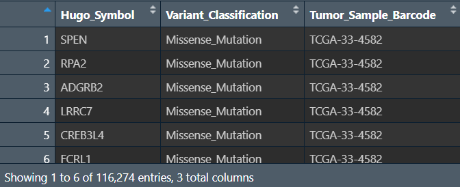{:width=180 height=180}
每个样本的每个基因都发生了什么样的突变
**创建两个矩阵**：列名是样本名，行名是基因名，值分别是该样本的该基因是否发生突变、发生了什么样的突变（如果未发生突变就为NA）
```{r}
gene <- as.character(unique(a$Hugo_Symbol));  # 所有基因名
sample <- as.character(unique(a$Tumor_Sample_Barcode));  # 所有样本名
# 发生了什么样的突变
mat <- as.data.frame(  # 列名是样本名，行名是基因名的空矩阵
  matrix(
    "",
    length(gene),length(sample),
    dimnames = list(gene,sample)
  )
);
for (i in 1:nrow(a)){
  mat[as.character(a[i,1]),as.character(a[i,3])] <- as.character(a[i,2]);  # 根据行列名设定值
}
# 是否发生突变
mat_0_1 <- as.data.frame(  # 列名是样本名，行名是基因名的空矩阵
  matrix(
    0,
    length(gene),length(sample),
    dimnames = list(gene,sample)
  )
);
for (i in 1:nrow(a)){
  mat_0_1[as.character(a[i,1]),as.character(a[i,3])] <- 1;  # 没取到的位置就为NA
}
```
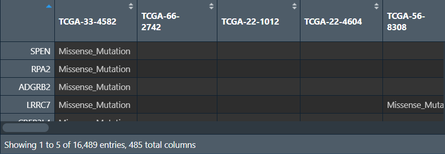{:width=200 height=200}
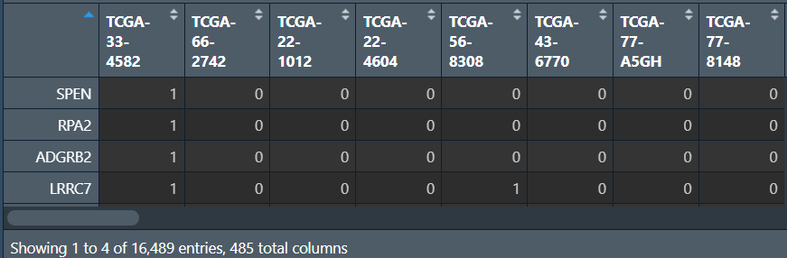{:width=180 height=180}
**汇总所有样本的突变情况**（每个基因在多少个样本中发生了突变）：将行名变成`Gene`列，对应的`count`列只需对`mat_0_1`的每行加和即可（有突变就是1，有几个1就有几个突变）
```{r}
gene_count <- data.frame(
  Gene = rownames(mat_0_1),
  Num = as.numeric(apply(mat_0_1, 1, sum))
) %>%
  arrange(desc(Num));  # 按突变数从大到小排序
# 保存数据
write.table(gene_count, 'C:\\Users\\WangTianHao\\Documents\\GitHub\\R-for-bioinformatics\\b站生信课03\\save_data\\geneMut.txt', sep="\t", quote=F, row.names = F);
write.mafSummary(maf = all_mut, basename = "C:\\Users\\WangTianHao\\Documents\\GitHub\\R-for-bioinformatics\\b站生信课03\\save_data\\input");
```
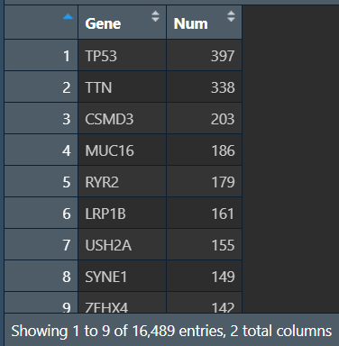{:width=250 height=250}
**绘制瀑布图oncoplot**：
```{r}
pdf(file = "C:\\Users\\WangTianHao\\Documents\\GitHub\\R-for-bioinformatics\\b站生信课03\\save_data\\maf.pdf", width = 6, height = 6);
oncoplot(
  maf = all_mut,
  top = 30,  # 显示前30个的突变基因信息
  fontSize = 0.6,  # 设置字体大小
  showTumorSampleBarcodes = F
);  # 不显示病人信息
dev.off();
```
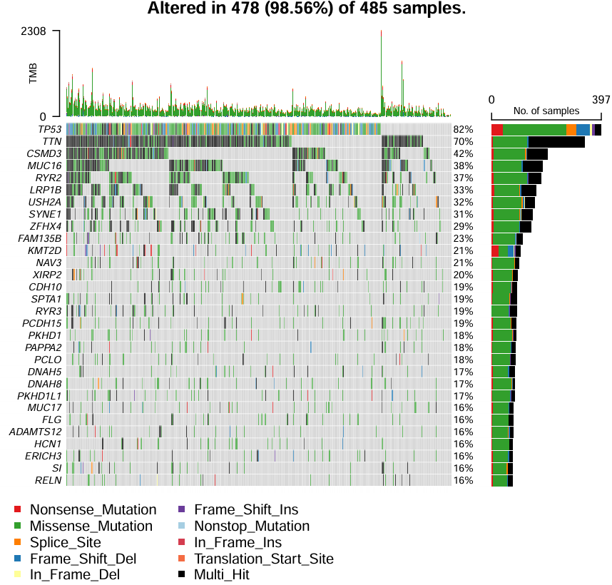{:width=500 height=500}
**计算每个样本的TMB值**（肿瘤突变负荷：每百万碱基检测出的体细胞变异总数）
```{r}
tmb_table <- tmb(maf = all_mut, logScale = F);
tmb_table <- tmb_table[, c(1,3)];  # 保留需要的tmb值信息
tmb_table <- as.data.frame(tmb_table);
tmb_table[,1] <- substr(tmb_table[,1],1,12);
tmb_table <- aggregate( . ~ Tumor_Sample_Barcode, data = tmb_table, max);  # 去重，重复行取最大值
colnames(tmb_table)[1] = "id";
colnames(tmb_table)[2] = "TMB";
write.table(tmb_table,'C:\\Users\\WangTianHao\\Documents\\GitHub\\R-for-bioinformatics\\b站生信课03\\save_data\\TMB.txt', sep="\t", quote=F, row.names = F);
```
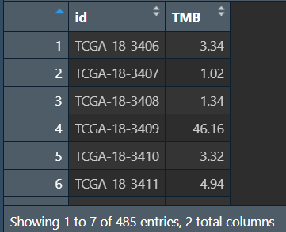{:width=180 height=180}
### TIDE预测免疫治疗反应
TIDE：肿瘤免疫功能障碍和排斥，用于评估肿瘤样本基因表达谱中肿瘤免疫逃逸的可能性——值越大，越可能免疫，对免疫治疗越不敏感
```{r}
library(limma);
library(ggpubr);
```
**读取tpm表达矩阵，并进行标准化**：`数据值-行平均值`，使基因的均值为0
```{r}
rt <- read.table("C:\\Users\\WangTianHao\\Documents\\GitHub\\R-for-bioinformatics\\b站生信课03\\save_data\\TCGA_LUSC_TPM.txt", header = T, sep = "\t", check.names = F);
rownames(rt) <- rt[, 1];
exp <- rt[, 2:ncol(rt)];
Expr <- t(apply(exp, 1, function(x)x-(mean(x))));
write.table(
  data.frame(ID = rownames(Expr), Expr, check.names = F),
  'C:\\Users\\WangTianHao\\Documents\\GitHub\\R-for-bioinformatics\\b站生信课03\\save_data\\tcga_normalize.txt', sep="\t", quote=F, row.names = TRUE
);
```
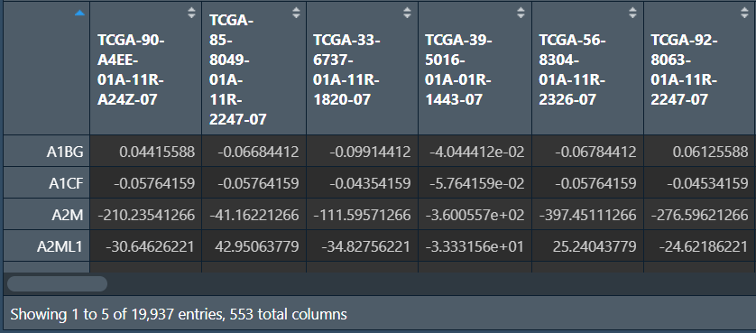{:width=220 height=220}
**TIDE数据的获取**：进入[网站](http://tide.dfci.harvard.edu)
- 点击`选择文件`，将刚才得到的标准化表达矩阵放入
- `cancer type`：NSCLC
- 点击`Predict response`

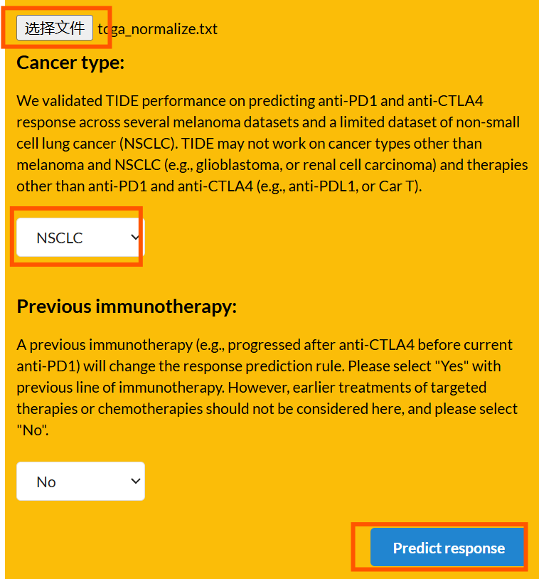{:width=350 height=350}
之后点击页面最下面的`Export to CSV`导出
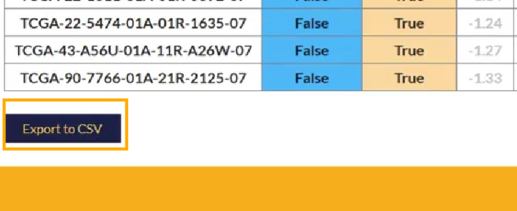{:width=180 height=180}
只需要两列信息：`patient`样本名、`TIDE`
**读取TIDE数据并处理**：
```{r}
tide <- read.csv("C:\\Users\\WangTianHao\\Documents\\GitHub\\R-for-bioinformatics\\b站生信课03\\save_data\\TIDE.csv");
tide <- tide[, c(1, 4)];
# 仅保留肿瘤样本
group <- sapply(strsplit(tide[, 1],"\\-"), "[", 4);
group <- sapply(strsplit(group,""), "[", 1);
group <- gsub("2", "1", group);
tide <- tide[group==0, , drop=F];
# 修改样本名
tide[, 1] <- gsub("(.*?)\\-(.*?)\\-(.*?)\\-(.*?)\\-.*", "\\1\\-\\2\\-\\3", tide[, 1]);
# 去除重复
tide1 <- tide[!duplicated(tide$Patient), ];
# 让样本名为行名
rownames(tide1) <- tide1[, 1];
tide <- as.data.frame(tide1[, 2]);
rownames(tide) <- rownames(tide1);
colnames(tide) <- "TIDE";
tide <- avereps(tide);
```
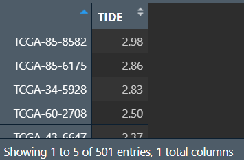{:width=150 height=150}
**读取风险得分，根据样本名合并，同时设置比较组**：
- 更改risk列：如果值为high就改为"High-risk"，反之为"Low-risk"
- 将所有的组名两两组合，存入一个列表中，使每个元素是一个有两个元素（组名）的字符串数组

```{r}
# 读取风险得分
risk <- read.table( "C:\\Users\\WangTianHao\\Documents\\GitHub\\R-for-bioinformatics\\b站生信课03\\save_data\\risk.txt", check.names = F, row.names = 1, sep = '\t', header = T);
# 合并
same_sample <- intersect(row.names(risk), row.names(tide));
data <- cbind(
  tide[same_sample, , drop=F],
  risk[same_sample, "risk", drop=F]
);
# 设置比较组
data$risk <- ifelse(data$risk=="high", "High-risk", "Low-risk");
group <- levels(factor(data$risk));
comp <- combn(group, 2);  # 将group中每2个元素进行组合
my_comparisons <- list();
for(i in 1:ncol(comp)){
  my_comparisons[[i]] <- comp[, i];
}
```
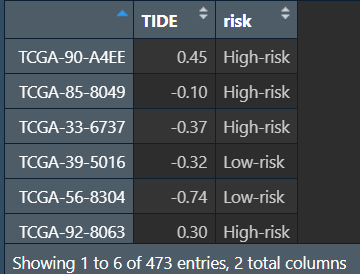{:width=180 height=180}
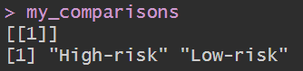{:width=60 height=60}
**画图**：
```{r}
pdf(file = "C:\\Users\\WangTianHao\\Documents\\GitHub\\R-for-bioinformatics\\b站生信课03\\save_data\\TIDE.pdf", width = 5, height = 4.5);
ggviolin(
  data, 
  x = "risk", y="TIDE", 
  fill = "risk", 
  xlab = "", ylab = "TIDE",
  palette = c("Firebrick2", "DodgerBlue1"),
  legend.title = "Risk",
  add = "boxplot", 
  add.params = list(fill = "white")
) + 
  stat_compare_means(comparisons = my_comparisons);  # 添加p值显著性标记
dev.off();
```
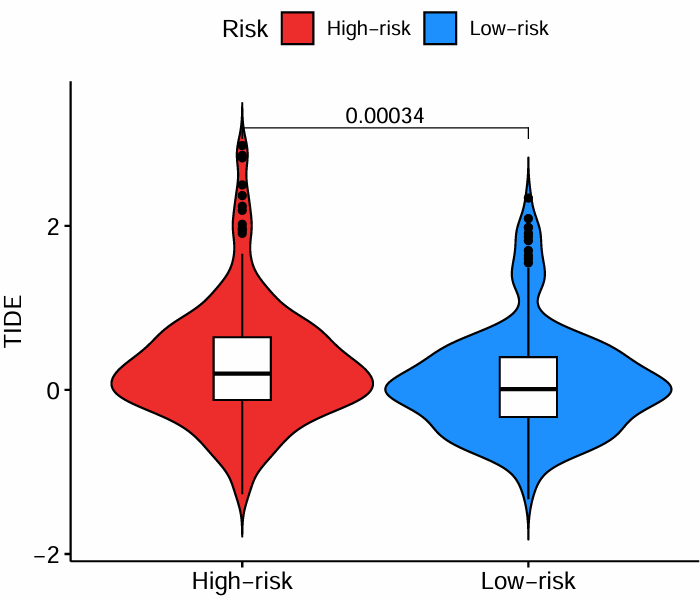{:width=400 height=400}
横坐标是高低风险组，纵坐标是TIDE得分。可以看到低风险组的TIDE低于高风险组，对免疫治疗更敏感
