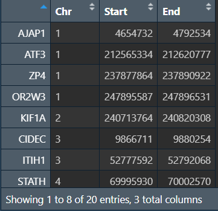
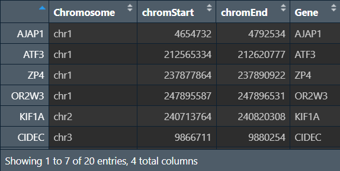
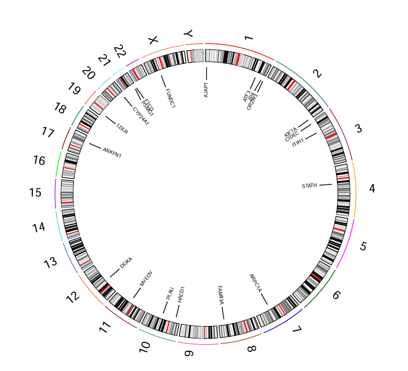
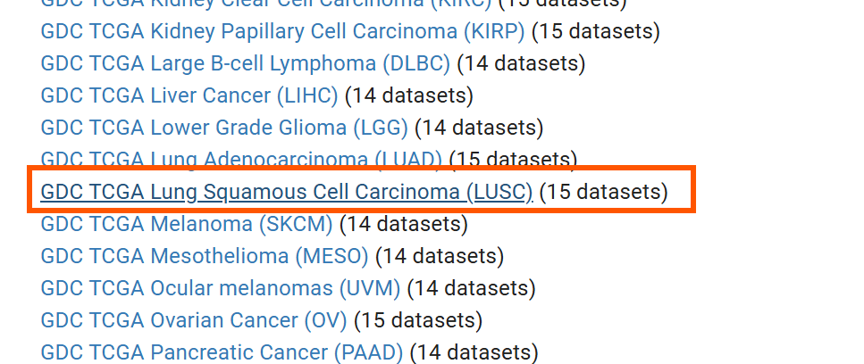
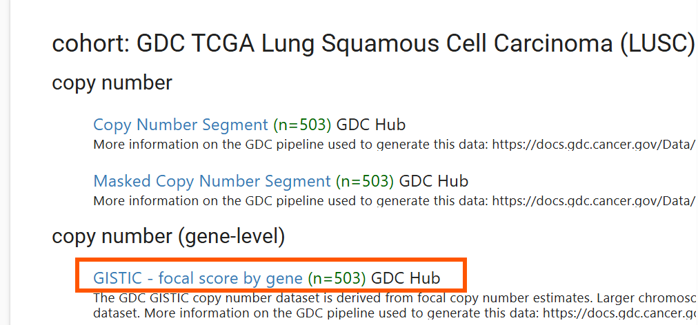
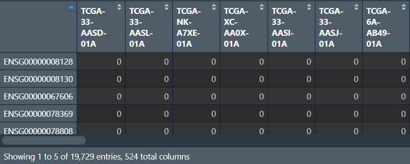
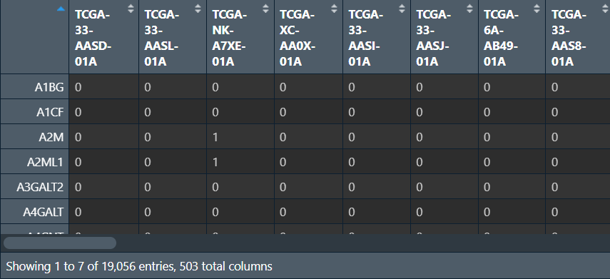
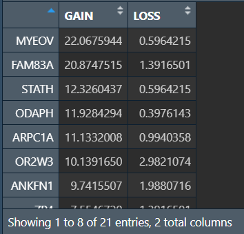
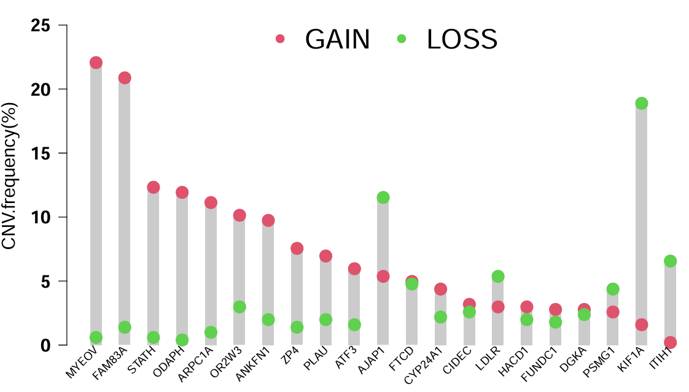

<a id="mulu">目录</a>
<a href="#mulu" class="back">回到目录</a>
<style>
    .back{width:40px;height:40px;display:inline-block;line-height:20px;font-size:20px;background-color:lightyellow;position: fixed;bottom:50px;right:50px;z-index:999;border:2px solid pink;opacity:0.3;transition:all 0.3s;color:green;}
    .back:hover{color:red;opacity:1}
    img{vertical-align:bottom;}
</style>

<!-- @import "[TOC]" {cmd="toc" depthFrom=3 depthTo=6 orderedList=false} -->

<!-- code_chunk_output -->

- [基因所在染色体位置](#基因所在染色体位置)
- [拷贝数突变频率](#拷贝数突变频率)
- [TCGA甲基化数据下载和整理](#tcga甲基化数据下载和整理)
- [logistic列线图](#logistic列线图)
- [生存状态+风险曲线+表达热图](#生存状态风险曲线表达热图)

<!-- /code_chunk_output -->

<!-- 打开侧边预览：f1->Markdown Preview Enhanced: open...
只有打开侧边预览时保存才自动更新目录 -->

写在前面：本篇教程来自b站课程[TCGA及GEO数据挖掘入门必看](https://www.bilibili.com/video/BV1b34y1g7RM) P44-P

### 基因所在染色体位置
需要数据：一个标识各基因在染色体上位置的文件`Ref.txt`，要标识的基因名称（这里以多因素cox回归得到的基因为例）
```{r}
if(!require("RCircos", quietly = T))
{
  library(BiocManager);
  BiocManager::install("RCircos");
}
library("RCircos");
```
读取数据：基因位置信息、基因名称
```{r}
data(UCSC.HG19.Human.CytoBandIdeogram);  # 内置的人类染色体数据
data <- read.table("C:\\Users\\WangTianHao\\Documents\\GitHub\\R-for-bioinformatics\\b站生信课03\\save_data\\multiCox.txt", check.names = F, row.names = 1, sep = '\t', header = T);  # 基因名称
dataref <- read.table("C:\\Users\\WangTianHao\\Documents\\GitHub\\R-for-bioinformatics\\b站生信课03\\data\\Ref.txt", header = T, sep = "\t", check.names = F, row.names = 1);  # 基因位置信息
# 合并
samegene <- intersect(rownames(dataref), rownames(data));
generef <- dataref[samegene, ];
```
{:width=200 height=200}
修改格式：将行名（基因名）提取为`Gene`列
```{r}
generef2 <- cbind(generef[, 1:3], rownames(generef));
colnames(generef2) <- c("Chromosome", "chromStart", "chromEnd", "Gene");  # 改列名
generef2[, 1] <- paste("chr", generef2[, 1], sep = "");  # 在染色体名称前加"chr"
```
{:width=200 height=200}
画图：
```{r}
pdf(file = "C:\\Users\\WangTianHao\\Documents\\GitHub\\R-for-bioinformatics\\b站生信课03\\save_data\\Circle.pdf", width = 7, height = 7);
cyto.info <- UCSC.HG19.Human.CytoBandIdeogram;
chr.exclude <- NULL;
tracks.inside <- 4;
tracks.outside <- 0;
RCircos.Set.Core.Components(cyto.info, chr.exclude, tracks.inside, tracks.outside);
chr.exclude <- NULL;
RCircos.Set.Plot.Area();
RCircos.Chromosome.Ideogram.Plot();
side <- "in";
track.num <- 1;
RCircos.Gene.Connector.Plot(generef2, track.num, side);
name.col <- 4;
track.num <- 2;
RCircos.Gene.Name.Plot(generef2, name.col,track.num, side);
dev.off();
```
{:width=200 height=200}
外圈代表23对染色体，内圈代表不同基因在染色体上的位置
### 拷贝数突变频率
进入[ucsc官网](https://xenabrowser.net/datapages/)，找到[GDC TCGA Lung Squamous Cell Carcinoma (LUSC)]()
{:width=200 height=200}
下载[GISTIC - focal score by gene (n=503) GDC Hub](https://gdc-hub.s3.us-east-1.amazonaws.com/download/TCGA-LUSC.gistic.tsv.gz)
{:width=200 height=200}
下载后解压，行名是基因symbol，列名是样本名
需要数据：刚才下载的突变数据、基因列表（这里以多因素cox回归得到的基因为例）、基因组注释文件`GRCh38.gtf`（[下载方法](https://blog.csdn.net/u011262253/article/details/89363809)）
```{r}
library(maftools);
library(rtracklayer);
library(stringr);
```
读取突变数据：
```{r}
CNV <- read.table("C:\\Users\\WangTianHao\\Documents\\GitHub\\R-for-bioinformatics\\b站生信课03\\data\\TCGA-LUSC.gistic.tsv", header = T, sep = "\t", check.names = F, row.names = 1);
# 更改行名，删除.之后的数
rownames(CNV) <- unlist(lapply(rownames(CNV), function(x){
  str_split(string = x, pattern = "\\.")[[1]][1];
}));
```
{:width=200 height=200}
读取注释信息，并将基因id转为基因名：（类似于GEO数据的注释）
```{r}
gtf <- rtracklayer::import('C:\\Users\\WangTianHao\\Documents\\GitHub\\R-for-bioinformatics\\b站生信课03\\data\\GRCh38.gtf');
gtf <- as.data.frame(gtf);
ids <- gtf[, c("gene_id", "gene_name")];
colnames(ids) <- c('probe_id', 'symbol');  # 更改列名
ids <- aggregate(. ~ probe_id, data = ids, max);  # 删除重复id
ids <- ids[ids$probe_id %in% rownames(CNV), ];  # 取出ids在CNV行名中的基因id
CNV <- CNV[ids$probe_id, ];  # 根据行名（基因id）取出CNV在ids探针id中的行
CNV <- cbind(ids, CNV);  # 合并
CNV <- aggregate(. ~ symbol, data = CNV, FUN = max);  # 去重
rownames(CNV) <- CNV[, 1];  # 改行名为基因名
CNV <- CNV[, -c(1, 2)];  # 去除前两列（基因id和基因名）
```
{:width=200 height=200}
读取基因名称，合并，并计算GAIN和LOSS值：
```{r}
data <- read.table("C:\\Users\\WangTianHao\\Documents\\GitHub\\R-for-bioinformatics\\b站生信课03\\save_data\\multiCox.txt", check.names = F, row.names = 1, sep = '\t', header = T);  # 基因名称
samegenes <- intersect(rownames(data),rownames(CNV));  # 共有基因
rt <- CNV[samegenes, ];  # 提取
# 计算GAIN和LOSS值
GAIN <- rowSums(rt>0);
LOSS <- rowSums(rt<0);
GAIN <- GAIN/ncol(rt)*100;
LOSS <- LOSS/ncol(rt)*100;
data <- cbind(GAIN, LOSS);
# 按GAIN值从大到小排序
data <- data[order(data[, "GAIN"], decreasing = T), ];
```
{:width=200 height=200}
行名是基因名，列分别是GAIN和LOSS值
画图：
```{r}
data.max <- apply(data, 1, max);  # 每个基因GAIN和LOSS两者中的的最大值
pdf(file = "C:\\Users\\WangTianHao\\Documents\\GitHub\\R-for-bioinformatics\\b站生信课03\\save_data\\CNV.frequency.pdf", width = 9, height = 6);
cex <- 1.3;
par(
  cex.lab = cex, 
  cex.axis = cex, 
  font.axis = 2, 
  las = 1, 
  xpd = T
);
bar <- barplot(
  data.max, 
  col = "grey80", 
  border = NA,
  xlab = "", ylab = "CNV.frequency(%)", 
  space = 1.5,
  xaxt = "n", 
  ylim = c(0, 1.2*max(data.max))
);
points(bar, data[, "GAIN"], pch = 20, col = 2, cex = 3);
points(bar, data[, "LOSS"], pch = 20, col = 3, cex = 3);
legend(
  "top", 
  legend = c('GAIN','LOSS'), 
  col = 2:3,
  pch = 20, 
  bty = "n", 
  cex = 2, 
  ncol = 2
);
par(srt = 45);
text(bar, par('usr')[3]-0.2, rownames(data), adj = 1, cex = 0.8);
dev.off();
```
{:width=200 height=200}
横坐标是基因，纵坐标是拷贝数突变频率，gain和loss分别代表增加和丢失
### TCGA甲基化数据下载和整理

### logistic列线图
之前的是使用cox方法（有多个因素）

### 生存状态+风险曲线+表达热图
需要数据：风险得分以及各基因在样本中的表达量`risk.txt`

- 左上角的图：横坐标是病人编号，纵坐标是生存时间/年，不同颜色代表生存状态
- 左下角的图：横坐标是病人编号，纵坐标是风险得分，不同颜色代表高/低风险组。可以看到以x轴中点为分界线，一半病人是高风险，一半病人是低风险，右上角点密集处就是风险得分超过10的病人（为了让图不过高，让超过10的风险得分全画在了10的位置上）
- 右侧热图：上面的risk标明了高/低风险组，横坐标是样本，纵坐标是基因名，每个块的值是表达量
