<a id="mulu">目录</a>
<a href="#mulu" class="back">回到目录</a>
<style>
    .back{width:40px;height:40px;display:inline-block;line-height:20px;font-size:20px;background-color:lightyellow;position: fixed;bottom:50px;right:50px;z-index:999;border:2px solid pink;opacity:0.3;transition:all 0.3s;color:green;}
    .back:hover{color:red;opacity:1}
    img{vertical-align:bottom;}
</style>

<!-- @import "[TOC]" {cmd="toc" depthFrom=3 depthTo=6 orderedList=false} -->

<!-- code_chunk_output -->

- [基因所在染色体位置](#基因所在染色体位置)
- [拷贝数突变频率](#拷贝数突变频率)
- [TCGA甲基化数据下载和整理](#tcga甲基化数据下载和整理)
- [logistic列线图](#logistic列线图)
- [生存状态+风险曲线+表达热图](#生存状态风险曲线表达热图)
- [预测microRNA下游靶基因](#预测microrna下游靶基因)
- [GEO数据库--表达矩阵的间接下载和整理](#geo数据库-表达矩阵的间接下载和整理)
- [TCGA数据库--大于5G的数据下载](#tcga数据库-大于5g的数据下载)

<!-- /code_chunk_output -->

<!-- 打开侧边预览：f1->Markdown Preview Enhanced: open...
只有打开侧边预览时保存才自动更新目录 -->

写在前面：本篇教程来自b站课程[TCGA及GEO数据挖掘入门必看](https://www.bilibili.com/video/BV1b34y1g7RM) P44-P

### 基因所在染色体位置
需要数据：一个标识各基因在染色体上位置的文件`Ref.txt`，要标识的基因名称（这里以多因素cox回归得到的基因为例）
```{r}
if(!require("RCircos", quietly = T))
{
  library(BiocManager);
  BiocManager::install("RCircos");
}
library("RCircos");
```
**读取数据**：基因位置信息、基因名称
```{r}
data(UCSC.HG19.Human.CytoBandIdeogram);  # 内置的人类染色体数据
data <- read.table("C:\\Users\\WangTianHao\\Documents\\GitHub\\R-for-bioinformatics\\b站生信课03\\save_data\\multiCox.txt", check.names = F, row.names = 1, sep = '\t', header = T);  # 基因名称
dataref <- read.table("C:\\Users\\WangTianHao\\Documents\\GitHub\\R-for-bioinformatics\\b站生信课03\\data\\Ref.txt", header = T, sep = "\t", check.names = F, row.names = 1);  # 基因位置信息
# 合并
samegene <- intersect(rownames(dataref), rownames(data));
generef <- dataref[samegene, ];
```
{:width=200 height=200}
**修改格式**：将行名（基因名）提取为`Gene`列
```{r}
generef2 <- cbind(generef[, 1:3], rownames(generef));
colnames(generef2) <- c("Chromosome", "chromStart", "chromEnd", "Gene");  # 改列名
generef2[, 1] <- paste("chr", generef2[, 1], sep = "");  # 在染色体名称前加"chr"
```
{:width=170 height=170}
**画图**：
```{r}
pdf(file = "C:\\Users\\WangTianHao\\Documents\\GitHub\\R-for-bioinformatics\\b站生信课03\\save_data\\Circle.pdf", width = 7, height = 7);
cyto.info <- UCSC.HG19.Human.CytoBandIdeogram;
chr.exclude <- NULL;
tracks.inside <- 4;
tracks.outside <- 0;
RCircos.Set.Core.Components(cyto.info, chr.exclude, tracks.inside, tracks.outside);
chr.exclude <- NULL;
RCircos.Set.Plot.Area();
RCircos.Chromosome.Ideogram.Plot();
side <- "in";
track.num <- 1;
RCircos.Gene.Connector.Plot(generef2, track.num, side);
name.col <- 4;
track.num <- 2;
RCircos.Gene.Name.Plot(generef2, name.col,track.num, side);
dev.off();
```
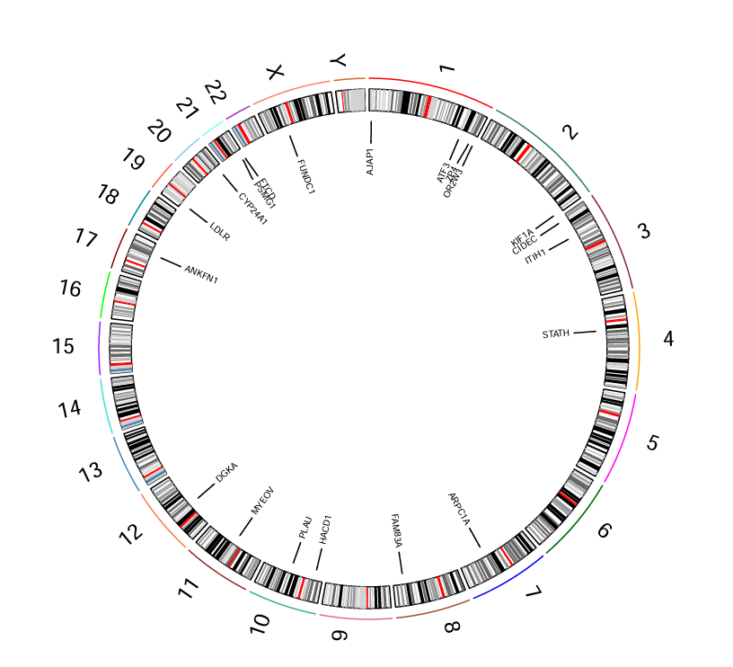{:width=500 height=500}
外圈代表23对染色体，内圈代表不同基因在染色体上的位置
### 拷贝数突变频率
进入[ucsc官网](https://xenabrowser.net/datapages//)，找到[GDC TCGA Lung Squamous Cell Carcinoma (LUSC)]()
{:width=200 height=200}
下载[GISTIC - focal score by gene (n=503) GDC Hub](https://gdc-hub.s3.us-east-1.amazonaws.com/download/TCGA-LUSC.gistic.tsv.gz)
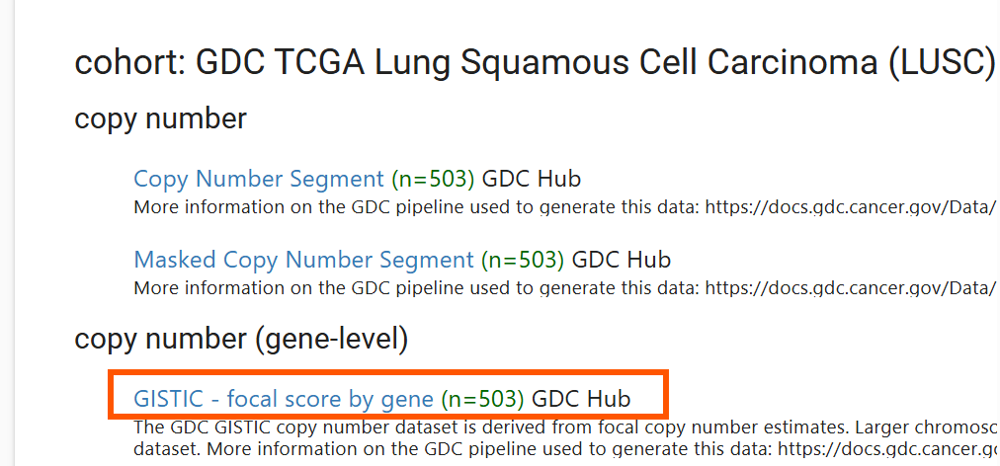{:width=220 height=220}
下载后解压，行名是基因symbol，列名是样本名
需要数据：刚才下载的突变数据、基因列表（这里以多因素cox回归得到的基因为例）、基因组注释文件`GRCh38.gtf`（[下载方法](https://blog.csdn.net/u011262253/article/details/89363809)）
```{r}
library(maftools);
library(rtracklayer);
library(stringr);
```
**读取突变数据**：
```{r}
CNV <- read.table("C:\\Users\\WangTianHao\\Documents\\GitHub\\R-for-bioinformatics\\b站生信课03\\data\\TCGA-LUSC.gistic.tsv", header = T, sep = "\t", check.names = F, row.names = 1);
# 更改行名，删除.之后的数
rownames(CNV) <- unlist(lapply(rownames(CNV), function(x){
  str_split(string = x, pattern = "\\.")[[1]][1];
}));
```
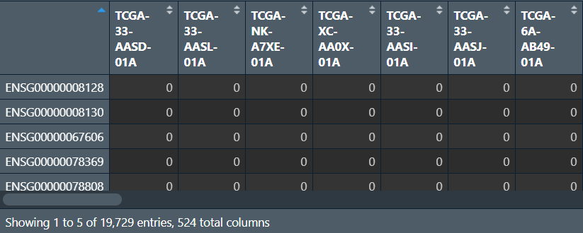{:width=200 height=200}
**读取注释信息，并将基因id转为基因名**：（类似于GEO数据的注释）
```{r}
gtf <- rtracklayer::import('C:\\Users\\WangTianHao\\Documents\\GitHub\\R-for-bioinformatics\\b站生信课03\\data\\GRCh38.gtf');
gtf <- as.data.frame(gtf);
ids <- gtf[, c("gene_id", "gene_name")];
colnames(ids) <- c('probe_id', 'symbol');  # 更改列名
ids <- aggregate(. ~ probe_id, data = ids, max);  # 删除重复id
ids <- ids[ids$probe_id %in% rownames(CNV), ];  # 取出ids在CNV行名中的基因id
CNV <- CNV[ids$probe_id, ];  # 根据行名（基因id）取出CNV在ids探针id中的行
CNV <- cbind(ids, CNV);  # 合并
CNV <- aggregate(. ~ symbol, data = CNV, FUN = max);  # 去重
rownames(CNV) <- CNV[, 1];  # 改行名为基因名
CNV <- CNV[, -c(1, 2)];  # 去除前两列（基因id和基因名）
```
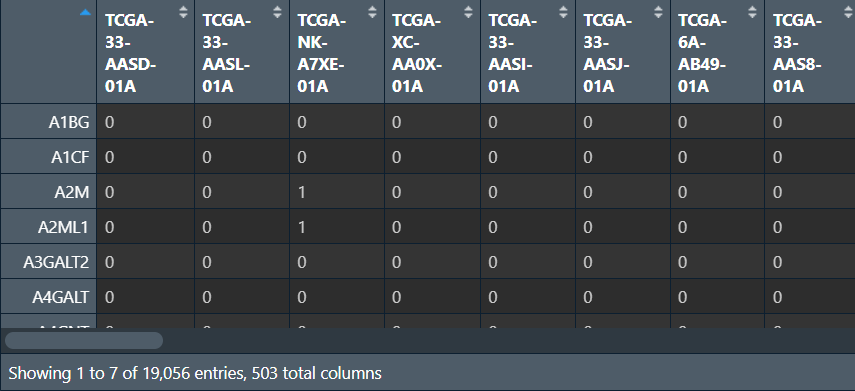{:width=230 height=230}
**读取基因名称，合并，并计算GAIN和LOSS值**：
```{r}
data <- read.table("C:\\Users\\WangTianHao\\Documents\\GitHub\\R-for-bioinformatics\\b站生信课03\\save_data\\multiCox.txt", check.names = F, row.names = 1, sep = '\t', header = T);  # 基因名称
samegenes <- intersect(rownames(data),rownames(CNV));  # 共有基因
rt <- CNV[samegenes, ];  # 提取
# 计算GAIN和LOSS值
GAIN <- rowSums(rt>0);
LOSS <- rowSums(rt<0);
GAIN <- GAIN/ncol(rt)*100;
LOSS <- LOSS/ncol(rt)*100;
data <- cbind(GAIN, LOSS);
# 按GAIN值从大到小排序
data <- data[order(data[, "GAIN"], decreasing = T), ];
```
{:width=200 height=200}
行名是基因名，列分别是GAIN和LOSS值
**画图**：
```{r}
data.max <- apply(data, 1, max);  # 每个基因GAIN和LOSS两者中的的最大值
pdf(file = "C:\\Users\\WangTianHao\\Documents\\GitHub\\R-for-bioinformatics\\b站生信课03\\save_data\\CNV.frequency.pdf", width = 9, height = 6);
cex <- 1.3;
par(
  cex.lab = cex, 
  cex.axis = cex, 
  font.axis = 2, 
  las = 1, 
  xpd = T
);
bar <- barplot(
  data.max, 
  col = "grey80", 
  border = NA,
  xlab = "", ylab = "CNV.frequency(%)", 
  space = 1.5,
  xaxt = "n", 
  ylim = c(0, 1.2*max(data.max))
);
points(bar, data[, "GAIN"], pch = 20, col = 2, cex = 3);
points(bar, data[, "LOSS"], pch = 20, col = 3, cex = 3);
legend(
  "top", 
  legend = c('GAIN','LOSS'), 
  col = 2:3,
  pch = 20, 
  bty = "n", 
  cex = 2, 
  ncol = 2
);
par(srt = 45);
text(bar, par('usr')[3]-0.2, rownames(data), adj = 1, cex = 0.8);
dev.off();
```
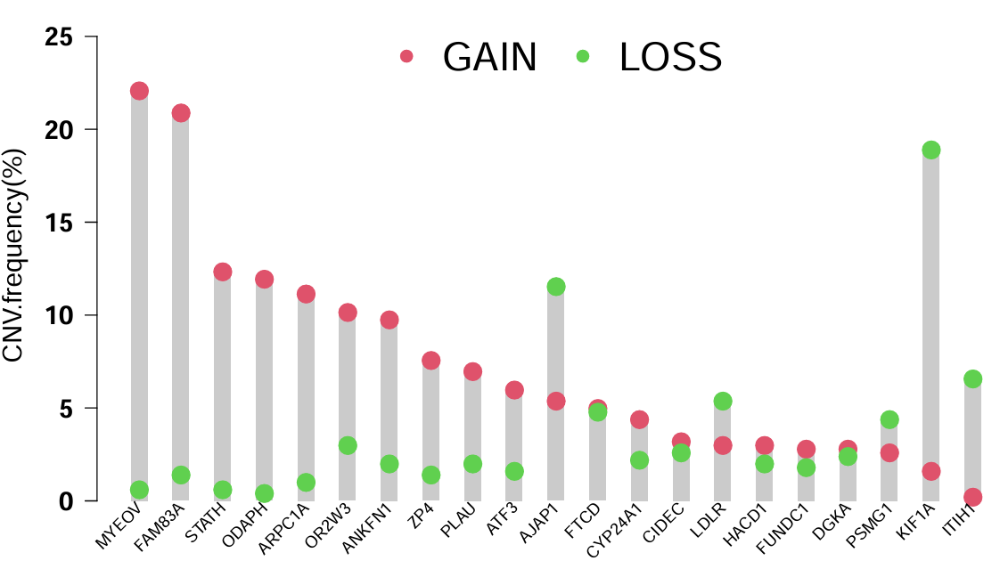{:width=300 height=300}
横坐标是基因，纵坐标是拷贝数突变频率，gain和loss分别代表增加和丢失
### TCGA甲基化数据下载和整理
```{r}
library(stringr);
library(tidyverse);
```
读取json文件，获取样本名称和文件名称的对照：
```{r}
json <- jsonlite::fromJSON("C:\\Users\\WangTianHao\\Documents\\GitHub\\R-for-bioinformatics\\b站生信课03\\data\\甲基化数据\\metadata.cart.2023-12-31.json");
# 样本名称
sample_id <- sapply(json$associated_entities, function(x){x[, 1]});
# 对应的txt文件名称
file_name <- json$file_name;
# 合并成df
file_sample <- data.frame(sample_id, file_name);
```
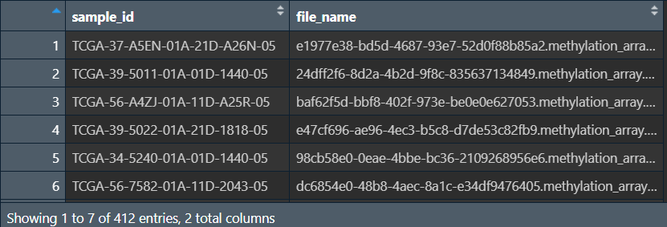{:width=200 height=200}
获取每个txt的文件名称：
```{r}
count_file <- list.files('C:\\Users\\WangTianHao\\Documents\\GitHub\\R-for-bioinformatics\\b站生信课03\\data\\甲基化数据\\gdc_download_20231230_164551.556154\\', pattern = '*level3betas.txt', recursive = TRUE);
count_file_name <- strsplit(count_file, split='/');
count_file_name <- sapply(count_file_name, function(x){x[2]});
```
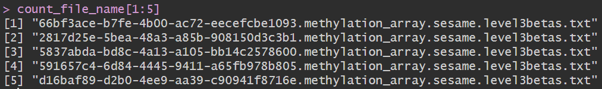{:width=200 height=200}
读取数据，结果矩阵中列名是样本名，行名是甲基化位点：
```{r}
# 先读取一个文件，看看有多少行
test_data <- read.delim(
  paste0('C:\\Users\\WangTianHao\\Documents\\GitHub\\R-for-bioinformatics\\b站生信课03\\data\\甲基化数据\\gdc_download_20231230_164551.556154\\', count_file[1]), 
  fill = TRUE, header = FALSE, row.names = 1
);
# 结果矩阵
matrix <- data.frame(matrix(nrow = nrow(test_data), ncol = 0));
# 逐个读取及合并
for (i in 1:length(count_file)){
  # 根据文件名读取数据
  data <- read.delim(
    paste0('C:\\Users\\WangTianHao\\Documents\\GitHub\\R-for-bioinformatics\\b站生信课03\\data\\甲基化数据\\gdc_download_20231230_164551.556154\\', count_file[i]), 
    fill = TRUE, header = FALSE, row.names = 1
  );
  # 找该文件名对应的样本名
  index <- which(file_sample$file_name==count_file_name[i]);  # 对应的样本名的索引
  sample_name <- file_sample$sample_id[index];  # 对应的样本名
  colnames(data) <- sample_name;  # 作列名
  matrix <- cbind(matrix, data);  # 添加到结果矩阵中
}
```
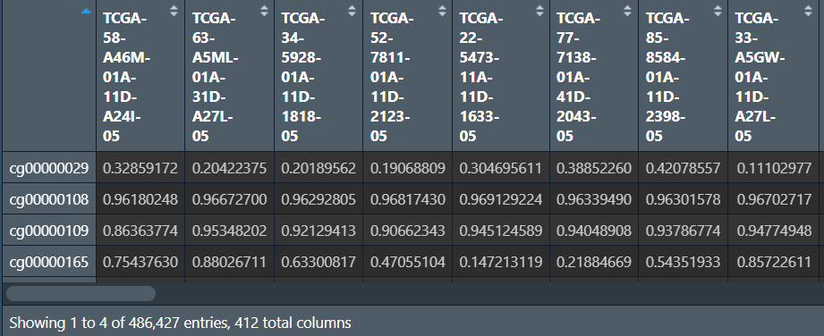{:width=200 height=200}
删除NA并导出：
```{r}
matrix <- na.omit(matrix);  # 删除NA
save_df <- data.frame(ID = rownames(matrix), matrix);
colnames(save_df) <- gsub('[.]', '-', colnames(save_df));
# 保存
write.table(save_df, 'C:\\Users\\WangTianHao\\Documents\\GitHub\\R-for-bioinformatics\\b站生信课03\\data\\甲基化数据\\methylation.450.txt', sep = "\t", quote = F, row.names = F);
```
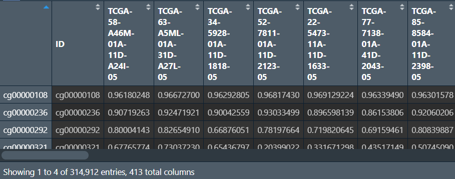{:width=200 height=200}

---

补充：也可以从[UCSC](https://xenabrowser.net/datapages/)中下载：
找到[TCGA Lung Squamous Cell Carcinoma (LUSC)](https://xenabrowser.net/datapages/?cohort=TCGA%20Lung%20Squamous%20Cell%20Carcinoma%20(LUSC)&removeHub=https%3A%2F%2Fxena.treehouse.gi.ucsc.edu%3A443)
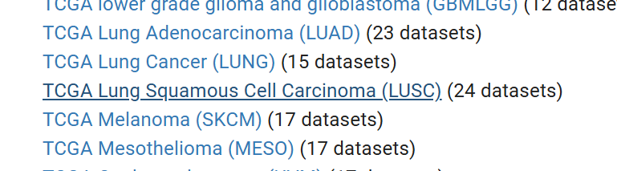{:width=200 height=200}
找到[Methylation450k](https://tcga-xena-hub.s3.us-east-1.amazonaws.com/download/TCGA.LUSC.sampleMap%2FHumanMethylation450.gz)
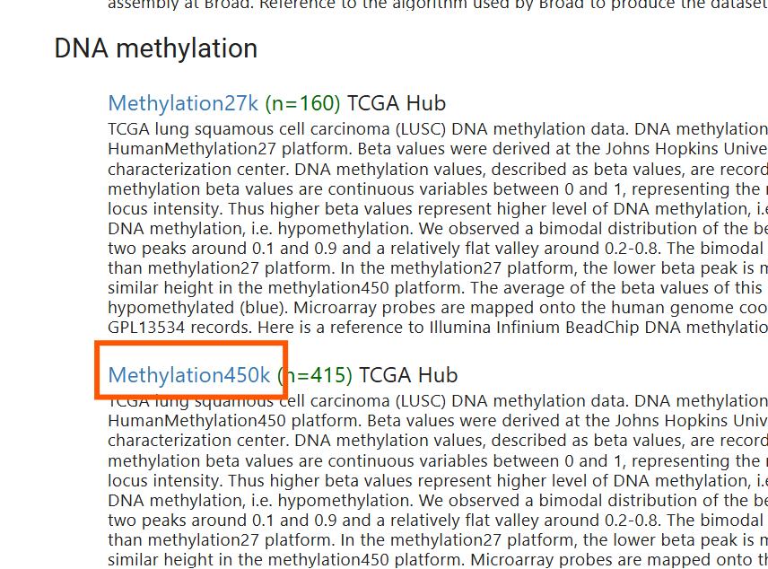{:width=200 height=200}
下载的文件与刚才整理的相同，都是行名是样本名，列名是甲基化编号，不过未删除NA值
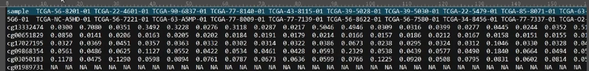{:width=200 height=200}
### logistic列线图
之前的是使用cox方法（有多个因素，预测模型），对于单一的二分类的变量（比如正常/肿瘤组、控制/治疗组，诊断模型），可以使用logistic方法
需要数据：`GSE30219.txt`表达矩阵（行名为基因名，列名为样本名，数据为表达量），之前在GEO差异表达分析中得到的`Control.txt`和`Treat.txt`分组（控制/治疗组），当然也可以使用正常/肿瘤组
```{r}
if(!require("rmda", quietly = T))
{
  install.packages("rmda");
}
library(rms);
library("rmda");
library(limma);
```
**读取表达矩阵并标准化**：
```{r}
data <- read.table("C:\\Users\\WangTianHao\\Documents\\GitHub\\R-for-bioinformatics\\b站生信课03\\data\\GSE30219\\GSE30219.txt", header = T, sep = "\t", check.names = F, row.names = 1);
# 转化为matrix
dimnames <- list(rownames(data), colnames(data));
data <- matrix(as.numeric(as.matrix(data)), nrow = nrow(data), dimnames = dimnames);
# 去除低表达的基因
data <- data[rowMeans(data)>1, ];
# 标准化
data <- normalizeBetweenArrays(data);
# 保存
write.table(
  data.frame(ID = rownames(data), data),
  file = "C:\\Users\\WangTianHao\\Documents\\GitHub\\R-for-bioinformatics\\b站生信课03\\data\\GSE30219\\normalize.txt", 
  sep = "\t", quote = F, row.names = F
);
```
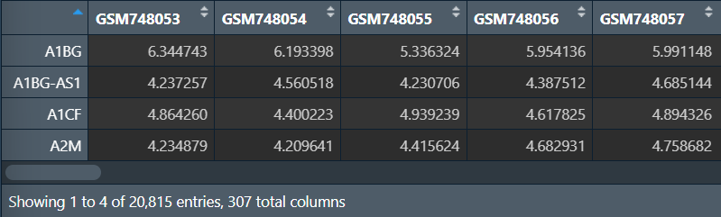{:width=150 height=150} 
**选取基因，读取分组信息**：
```{r}
gene <- c("A1BG","A1CF","A2M","A2ML1","A2MP1","A4GALT");  # 基因列表
#获取基因
data <- data[gene, ];  # 提取表达矩阵
data <- t(data);
# 读取分组信息
Control <- read.table("C:\\Users\\WangTianHao\\Documents\\GitHub\\R-for-bioinformatics\\b站生信课03\\data\\GSE30219\\Control.txt", header = F, sep = "\t", check.names = F);
Treat <- read.table("C:\\Users\\WangTianHao\\Documents\\GitHub\\R-for-bioinformatics\\b站生信课03\\data\\GSE30219\\Treat.txt", header = F, sep = "\t", check.names = F);
# 按照control和treat排序
data <- data[c(Control[, 1], Treat[, 1]), ];
# 设置分组信息
conNum <- length(rownames(Control));
treatNum <- length(rownames(Treat));
group <- c(rep("Control", conNum), rep("Treat", treatNum));
# 合并
rt <- cbind(as.data.frame(data), Type = group);
```
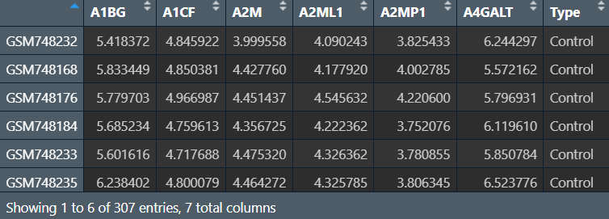{:width=170 height=170} 
前6列是基因名，最后一列是分组信息，行名是样本名
**构建模型**：
```{r}
model <- paste0("Type", "~", paste(colnames(data), collapse="+"));  # 模型公式：Type~A1BG+A1CF+A2M+A2ML1+A2MP1+A4GALT
ddist <- datadist(rt);
options(datadist = "ddist");  # 为模型设置数据
lrmModel <- lrm(as.formula(model), data = rt, x = T, y = T);
nomo <- nomogram(
  lrmModel, 
  fun = plogis,
  fun.at = c(0.1, 0.5, 0.8, 0.99),  # 展示的概率（x轴值）
  lp = F, 
  funlabel = "Risk of Disease"
);
```
**列线图**：
```{r}
pdf("C:\\Users\\WangTianHao\\Documents\\GitHub\\R-for-bioinformatics\\b站生信课03\\save_data\\Nom.pdf", width = 9, height = 6);
plot(nomo);
dev.off();
```
{:width=400 height=400} 
最上面的`points`是得分，中间的6行是随机挑选的6个基因，横坐标对应着不同的得分。以A1BG这行为例，它横坐标为5时对应的points为0、为8.5时对应的points为100，即表达量为5时得分为0、表达量为8.5时得分为100。`total points`是总得分，最下面的`risk of disease`是患病几率，如果总得分为0，它对应着的患病几率为0，就是不会患病；如果总得分为60，它对应着的患病几率为0.5，就是有50%几率患病；如果总得分为260，它对应着的患病几率为1，就是一定患病
**校准曲线**：
```{r}
cali <- calibrate(lrmModel, method = "boot", B = 1000);
pdf("C:\\Users\\WangTianHao\\Documents\\GitHub\\R-for-bioinformatics\\b站生信课03\\save_data\\Calibration.pdf", width = 6, height = 6);
plot(
  cali,
  xlab = "Predicted probability", ylab = "Actual probability", 
  sub = F
);
dev.off();
```
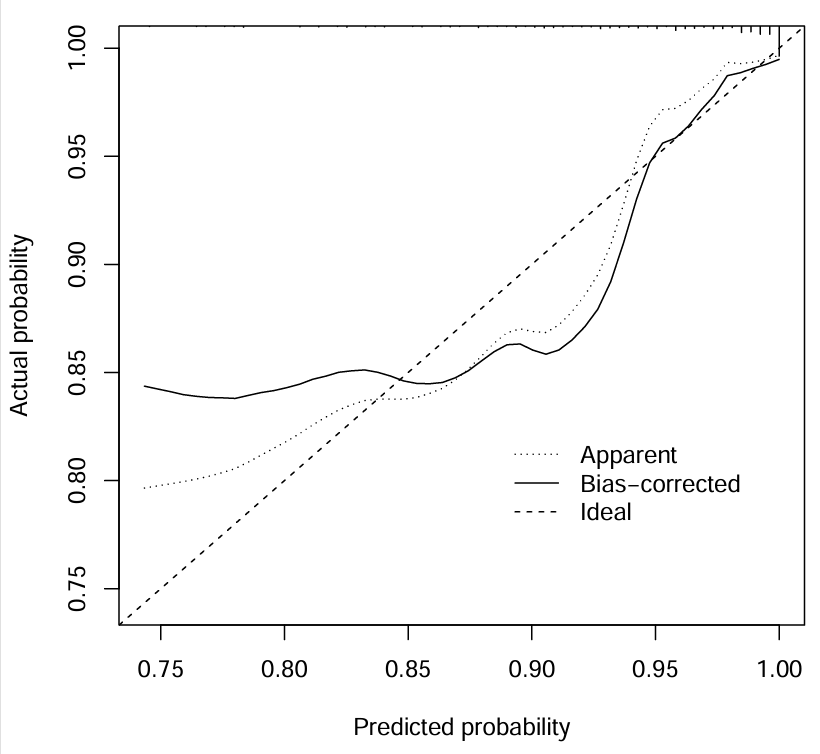{:width=400 height=400} 
`Bias−corrected`线与`Ideal`线（对角线）越重合，结果越好（因为这里是随便选的基因，拟合效果不是很好）
**决策曲线，DCA图形**：
```{r}
rt$Type <- ifelse(rt$Type=="Control", 0, 1);  # 控制组的值为1
# 决策曲线
dc <- decision_curve(
  as.formula(model), 
  data = rt, 
  family = binomial(link ='logit'),
  thresholds = seq(0,1,by = 0.01),
  confidence.intervals = 0.95
);
# DCA图形
pdf(file = "C:\\Users\\WangTianHao\\Documents\\GitHub\\R-for-bioinformatics\\b站生信课03\\save_data\\DCA.pdf", width = 6, height = 6);
plot_decision_curve(
  dc,
  curve.names = "six genes",
  xlab = "Threshold probability",
  cost.benefit.axis = T,
  col = "#561215",
  confidence.intervals = FALSE,
  standardize = FALSE
);
dev.off();
```
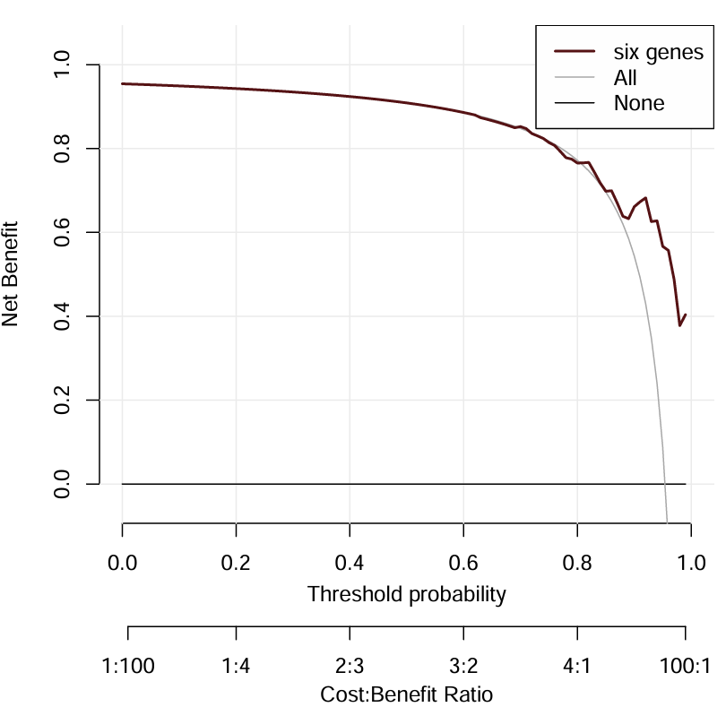{:width=400 height=400} 
`six genes`线离`All`线越远，结果越好
### 生存状态+风险曲线+表达热图
需要数据：风险得分以及各基因在样本中的表达量`risk.txt`
```{r}
library(pheatmap);
```
**读取数据，并按风险得分从小到大排序**：
```{r}
rt <- read.table("C:\\Users\\WangTianHao\\Documents\\GitHub\\R-for-bioinformatics\\b站生信课03\\save_data\\risk.txt", header = T, sep = "\t", check.names = F, row.names = 1);
rt <- rt[order(rt$riskScore), ];
```
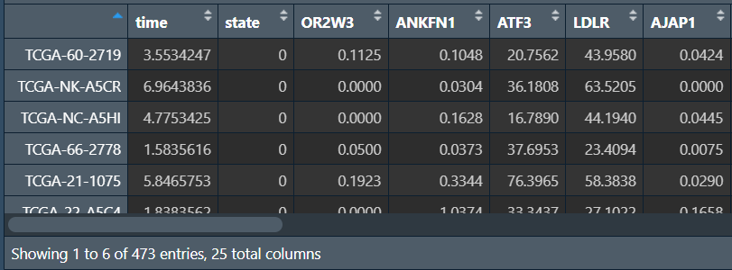{:width=200 height=200}
**风险曲线**：
```{r}
riskClass <- rt[, "risk"];
lowLength <- length(riskClass[riskClass=="low"]);
highLength <- length(riskClass[riskClass=="high"]);
lowMax <- max(rt$riskScore[riskClass=="low"]);  # 高/低风险组分界点的纵坐标
line <- rt[, "riskScore"];
line[line>10] <- 10;  # 将超过10的风险得分设置为10
pdf(file = "C:\\Users\\WangTianHao\\Documents\\GitHub\\R-for-bioinformatics\\b站生信课03\\save_data\\riskScore1.pdf", width = 7, height = 4);
plot(
  line, 
  type = "p", 
  pch = 20,
  xlab = "Patients (increasing risk socre)", ylab = "Risk score",
  col = c(
    rep("MediumSeaGreen", lowLength),
    rep("Firebrick3", highLength)
  ) 
);
abline(h = lowMax,v = lowLength, lty = 2);  # 高/低风险组分界线
legend(
  "topleft", 
  c("High risk", "Low risk"),
  bty = "n",
  pch = 19,
  col = c("Firebrick3", "MediumSeaGreen"),
  cex = 1.2
);
dev.off();
```
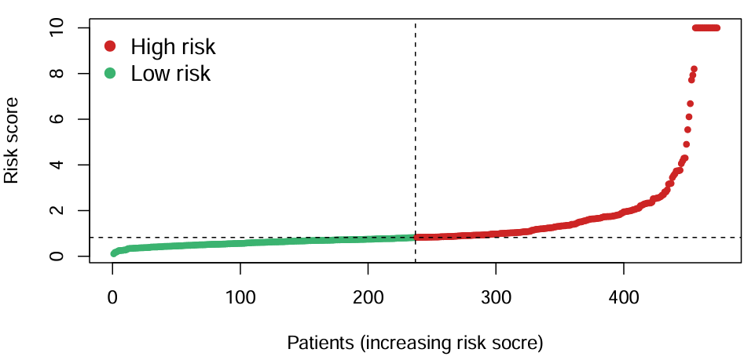{:width=300 height=300}
横坐标是病人编号，纵坐标是风险得分，不同颜色代表高/低风险组。可以看到以x轴中点为分界线，一半病人是高风险，一半病人是低风险，右上角点密集处就是风险得分超过10的病人（为了让图不过高，让超过10的风险得分全画在了10的位置上）
**生存状态图**：
```{r}
color <- as.vector(rt$state);
color[color==1] <- "Firebrick3";
color[color==0] <- "MediumSeaGreen";
pdf(file = "C:\\Users\\WangTianHao\\Documents\\GitHub\\R-for-bioinformatics\\b站生信课03\\save_data\\survStat1.pdf", width = 7, height = 4);
plot(
  rt$time, 
  pch = 19,
  xlab = "Patients (increasing risk socre)", ylab = "Survival time (years)",
  col = color
);
legend(
  "topleft", 
  c("Dead", "Alive"),
  bty = "n",
  pch = 19,
  col = c("Firebrick3", "MediumSeaGreen"),
  cex = 1.2
);
abline(v = lowLength, lty = 2);
dev.off();
```
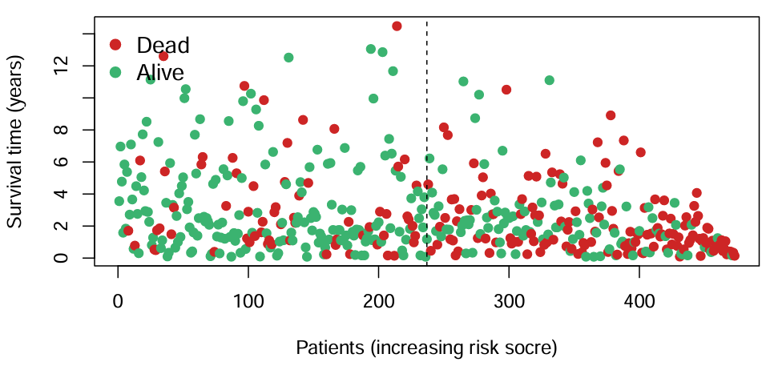{:width=300 height=300}
横坐标是病人编号，纵坐标是生存时间/年，不同颜色代表生存状态
**热图**：
```{r}
# 颜色
ann_colors <- list();
bioCol <- c("MediumSeaGreen", "Firebrick3");
names(bioCol) <- c("low", "high");
ann_colors[["Risk"]] <- bioCol;
# 画图
rt1 <- rt[c(3:(ncol(rt)-2))];  # 取表达量
rt1 <- t(rt1);
annotation <- data.frame(Risk = rt[, ncol(rt)]);
rownames(annotation) <- rownames(rt);
pdf(file = "C:\\Users\\WangTianHao\\Documents\\GitHub\\R-for-bioinformatics\\b站生信课03\\save_data\\surv_heatmap1.pdf", width = 6, height = 5);
pheatmap(
  rt1, 
  annotation = annotation,
  annotation_colors = ann_colors, 
  cluster_cols = FALSE,
  cluster_rows = FALSE,
  show_colnames = F,
  scale = "row",
  color = colorRampPalette(
    c(
      rep("MediumSeaGreen", 3.5), 
      "white", 
      rep("Firebrick3", 3.5)
    )
  )(50),
  fontsize_col = 3,
  fontsize = 7,
  fontsize_row = 8
);
dev.off();
```
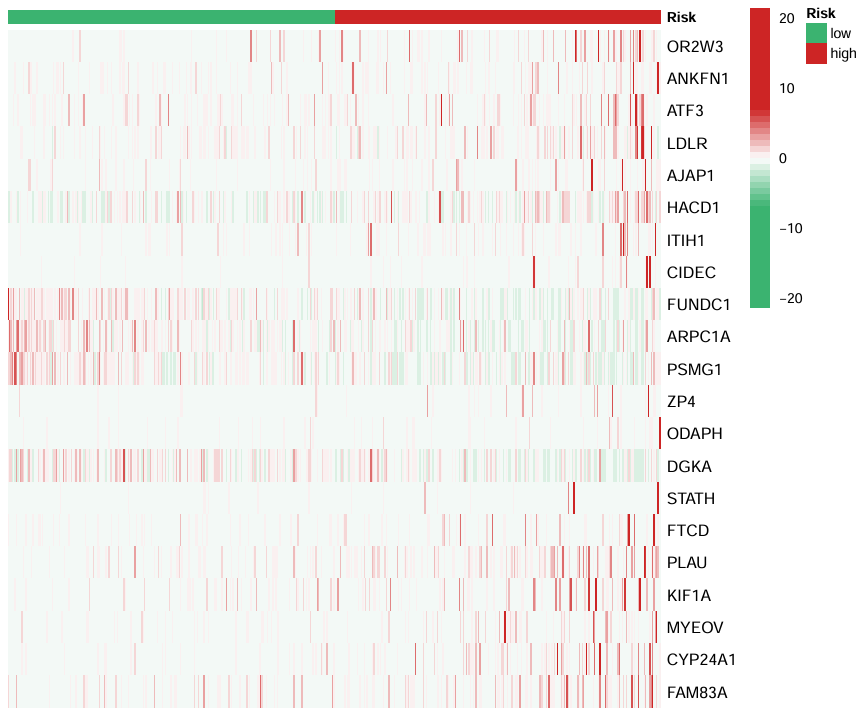{:width=500 height=500}
上面的risk标明了高/低风险组，横坐标是样本，纵坐标是基因名，每个块的值是表达量
### 预测microRNA下游靶基因
```{r}
if(!require("multiMiR", quietly = T))
{
  library("BiocManager");
  BiocManager::install("multiMiR");
}
library("multiMiR");
library(tidyverse);
```
读取mirna文件（获取要预测的mirna名称），进行预测：
```{r}
# 读取文件
data <- read.table("C:\\Users\\WangTianHao\\Documents\\GitHub\\R-for-bioinformatics\\b站生信课03\\save_data\\miRNA.RPM.txt", sep = "\t", check.names = F,header = T, row.names = 1);
gene <- rownames(data)[1:5];  # 以前5个mirna为例
example <- get_multimir(
  org = "hsa",  # 物种：hsa人类、mmu小鼠、rno兔子
  mirna = gene,  # 要预测的mirna
  table = "all",
  summary = TRUE
);
example_result <- example@data;
# 保存
write.table(example_result, file = "C:\\Users\\WangTianHao\\Documents\\GitHub\\R-for-bioinformatics\\b站生信课03\\save_data\\mirna_all.predict.txt", sep = "\t", quote = F, row.names = F, col.names = T);
```
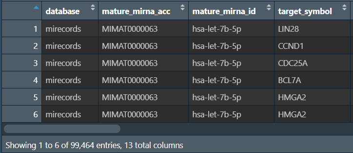{:width=500 height=500}
- `mature_mirna_id`mirna名称
- `database`来自哪个数据库
- `target_symbol`下游靶基因
- `type`预测方式
  - `validated`实验验证
  - `predicted`计算机预测
  - `disease.drug`疾病-药物
筛选并去重：
```{r}
# 展示diana_microt数据库中hsa-let-7a-5p的预测结果
target1 <- example_result %>% 
  filter(
    database == "diana_microt",
    mature_mirna_id == "hsa-let-7a-5p"
  );
target1.unique <- unique(target1$target_symbol);
target1.unique[1:20];
# 所有数据
table(example_result$database);
table(example_result$mature_mirna_id);
table(example_result$type);
```
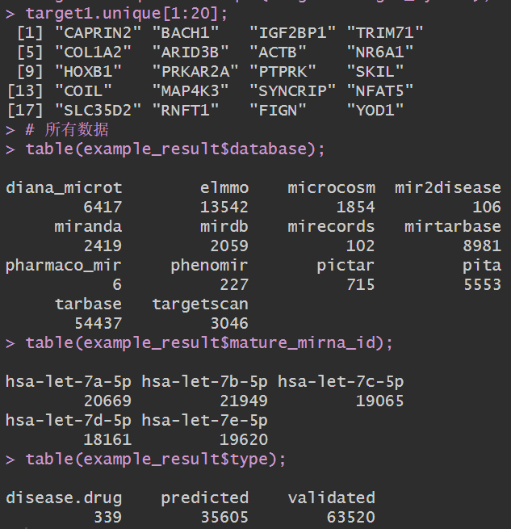{:width=500 height=500}
### GEO数据库--表达矩阵的间接下载和整理
进入[GEO官网](https://www.ncbi.nlm.nih.gov/geo/)，搜索`GSE98422`，下载[Series Matrix File(s)](https://ftp.ncbi.nlm.nih.gov/geo/series/GSE98nnn/GSE98422/matrix/)中的两个文件。之前的这个文件都包含表达矩阵，但这个数据集没有（因为文件大小只有几K）
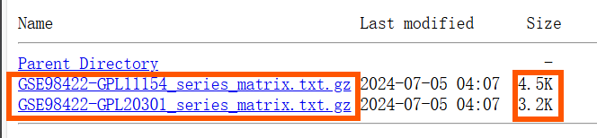{:width=200 height=200}
**如何找到表达矩阵**：（两种方法）
- 将两个`.txt.gz`文件解压，打开，找到`!Sample_supplementary_file_1`的行，根据其中的网址下载
  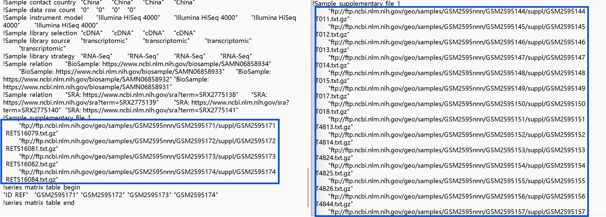{:width=200 height=200}

- 在GEO官网中GSE98422的页面，下载[GSE98422_RAW.tar](https://www.ncbi.nlm.nih.gov/geo/download/?acc=GSE98422&format=file)（推荐）
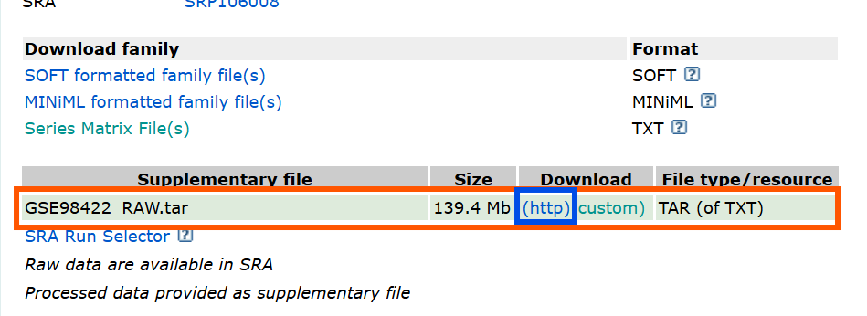{:width=200 height=200}
  - `http`是全部下载
  - `custom`是选取部分下载（点一下它，下面会出现一个列表，可以进行选取）

  下载好后解压成文件夹，其中的数据与第一种方法下载的相同
  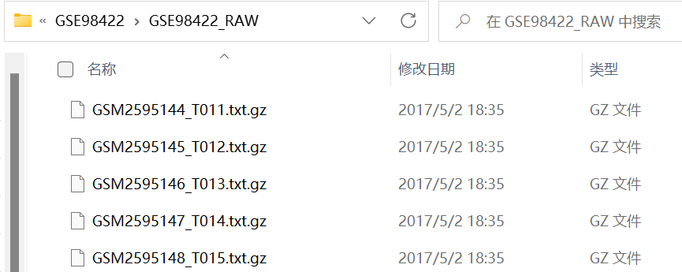{:width=200 height=200}

**样本的临床信息**：储存在上面提到的两个`.txt.gz`中，最好将这3个文件都下载
```{r}
library(GEOquery);
library(stringr);
```
临床信息：
```{r}
gset <- getGEO(
  "GSE98422", 
  destdir = "C:\\Users\\WangTianHao\\Documents\\GitHub\\R-for-bioinformatics\\b站生信课03\\data\\GSE98422",
  AnnotGPL = F,
  getGPL = F
);
#获取临床信息
pd <- pData(gset[[1]]);
pd2 <- pData(gset[[2]]);
# 保存
write.csv(pd, 'C:\\Users\\WangTianHao\\Documents\\GitHub\\R-for-bioinformatics\\b站生信课03\\data\\GSE98422\\clinicalGSE98422.1.csv',row.names = TRUE);
write.csv(pd2, 'C:\\Users\\WangTianHao\\Documents\\GitHub\\R-for-bioinformatics\\b站生信课03\\data\\GSE98422\\clinicalGSE98422.2.csv', row.names = TRUE);

```
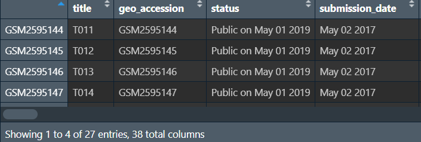{:width=200 height=200}
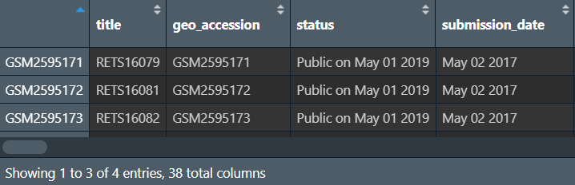{:width=200 height=200}
注：这两个临床信息有部分列不同，无法直接合并
表达矩阵：
```{r}
# 获取全部的表达矩阵文件名
count_file <- list.files('C:\\Users\\WangTianHao\\Documents\\GitHub\\R-for-bioinformatics\\b站生信课03\\data\\GSE98422\\GSE98422_RAW\\', pattern = '*.txt', recursive = T);
# 看看有多少行
test_data <- read.delim(
  paste0('C:\\Users\\WangTianHao\\Documents\\GitHub\\R-for-bioinformatics\\b站生信课03\\data\\GSE98422\\GSE98422_RAW\\', count_file[1]), 
  fill = TRUE, header = T, row.names = 1
);
# 结果矩阵
matrix <- data.frame(matrix(nrow = nrow(test_data), ncol = 0));
# 逐个读取及合并
for (i in 1:length(count_file)){
  path <- paste0('C:\\Users\\WangTianHao\\Documents\\GitHub\\R-for-bioinformatics\\b站生信课03\\data\\GSE98422\\GSE98422_RAW\\', count_file[i]);  
  data <- read.delim(path, fill = T, header = T, row.names = 1);
  data <- data[, 4, drop=F];
  matrix <- cbind(matrix, data);
}
```
每个表达矩阵：
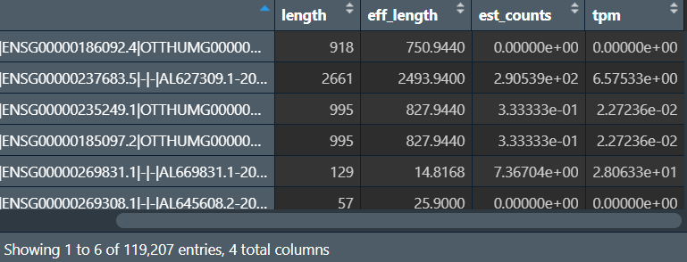{:width=200 height=200}
行名是基因id/symbol，`est_counts`是count值，这里我们获取最后一列tpm值作为表达量
总表达矩阵：
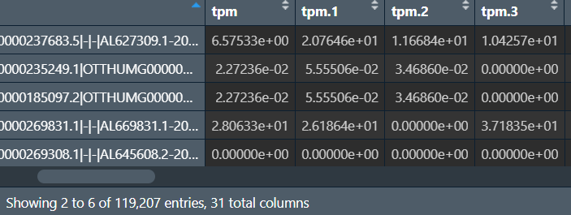{:width=200 height=200}
获取样本名，将其作为列名：就是`count_file`中`.txt.gz`前面的部分
```{r}
sample_ids <- c();
for (i in 1:length(count_file)) {
  sample_id <- strsplit(count_file, "_")[[i]][1];
  sample_ids <- c(sample_ids, sample_id);
}
colnames(matrix) <- sample_ids;
```
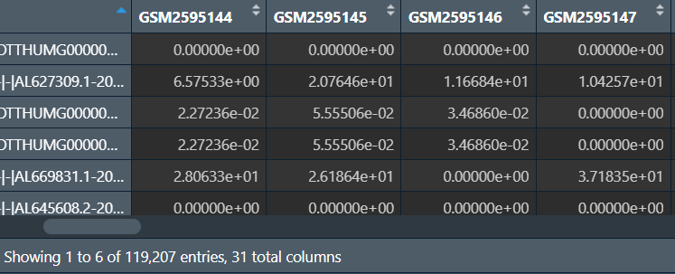{:width=200 height=200}
更改基因名（列名）：
"ENST00000335137.3|ENSG00000186092.4|OTTHUMG00000001094.1|OTTHUMT00000003223.1|OR4F5-001|OR4F5|918|CDS:1-918|"中`OR4F5`是基因名（以`|`分隔的第6项）
```{r}
matrix$ids <- trimws(
  str_split(
    rownames(matrix),
    '\\|',
    simplify = T
  )[, 6]
);
```
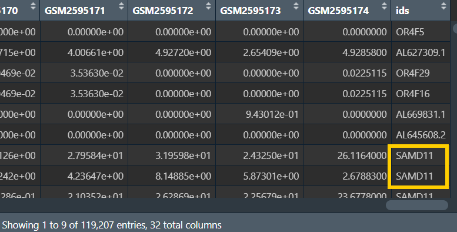{:width=200 height=200}
为什么新添加一列`ids`：因为有些基因名重复，重复值无法直接作行名，需要进行去重
去重（保留最大值）：
```{r}
matrix1 <- aggregate(. ~ ids, data = matrix, max);
# 更改行名为基因名，并删除ids列
rownames(matrix1) <- matrix1[, 1];
matrix1 <- matrix1[, -1];
# 保存
write.table(
  data.frame(ID = rownames(matrix1), matrix1),
  file = "C:\\Users\\WangTianHao\\Documents\\GitHub\\R-for-bioinformatics\\b站生信课03\\data\\GSE98422\\GSE98422.txt", 
  sep = "\t", quote = F, row.names = F
);
```
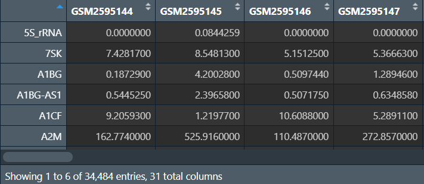{:width=200 height=200}
### TCGA数据库--大于5G的数据下载
进入[TCGA官网](https://portal.gdc.cancer.gov/)
以乳腺癌的转录组表达数据为例：
`Cohort Builder`：
- `Program`--`TCGA`
- `Project`--`TCGA-BRCA`

`Repository`：
- `Data Category`--`transcriptome profiling`
- `Data Type`--`Gene Expression Quantification`

`Add All Files to Cart`加数据添加到仓库，共1231个，5.22GB
下载三个文件，manifest、metadata和cart
{:width=200 height=200}
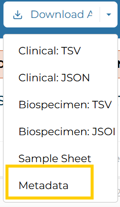{:width=200 height=200}
下载cart时会弹出提示：
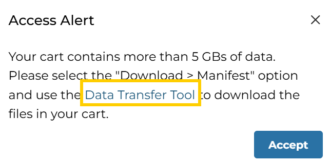{:width=200 height=200}
**第一种方法（不推荐，很费时间）**：使用它推荐的`Data Transfer Tool`(gdc-client.exe)下载
下载好后将它添加到环境变量中，终端输入命令`gdc-client -h`查看是否添加完成
之后将下载的manifest文件复制到和它的同目录下，在该目录中打开终端，运行命令：
``` sh
gdc-client.exe download -m gdc_manifest.2024-03-01.txt
```
其中`gdc_manifest.2024-03-01.txt`是manifest文件名，可能需要修改
**第二种方法**：使用r获取样本名，之后分批次下载
只需下载metadata文件即可，之后运行r代码：
```{r}
library(rjson);
library(tidyverse);
# 读入metadata文件
json <- jsonlite::fromJSON("C:\\Users\\WangTianHao\\Documents\\GitHub\\R-for-bioinformatics\\b站生信课03\\data\\大于5G的数据下载\\metadata.cart.2024-03-01.json");
# 获取样本名称及文件名称
sample_id <- sapply(json$associated_entities, function(x){x[, 1]});
file_sample <- data.frame(sample_id, file_name = json$file_name);
# 将样本拆成两组，分别包含615和616个样本
file_sample1 <- file_sample[1:(nrow(file_sample)/2), ];
file_sample2 <- file_sample[(nrow(file_sample)/2):nrow(file_sample)+1, ];
# 导出
write.table(file_sample1, 'C:\\Users\\WangTianHao\\Documents\\GitHub\\R-for-bioinformatics\\b站生信课03\\data\\大于5G的数据下载\\samples1.txt', sep = "\t", quote = F, row.names = F);
write.table(file_sample2, 'C:\\Users\\WangTianHao\\Documents\\GitHub\\R-for-bioinformatics\\b站生信课03\\data\\大于5G的数据下载\\samples2.txt', sep = "\t", quote = F, row.names = F);
```
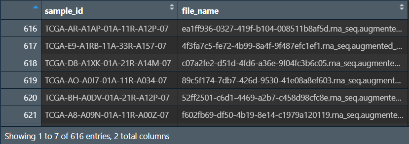{:width=200 height=200}
回到TCGA网页中，点击`Import New Cohort`
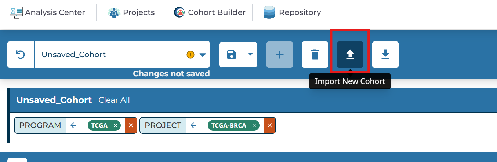{:width=200 height=200}
将`samples1.txt`中内容复制粘贴上去，可以看到识别到了615个样本，点击`Submit`
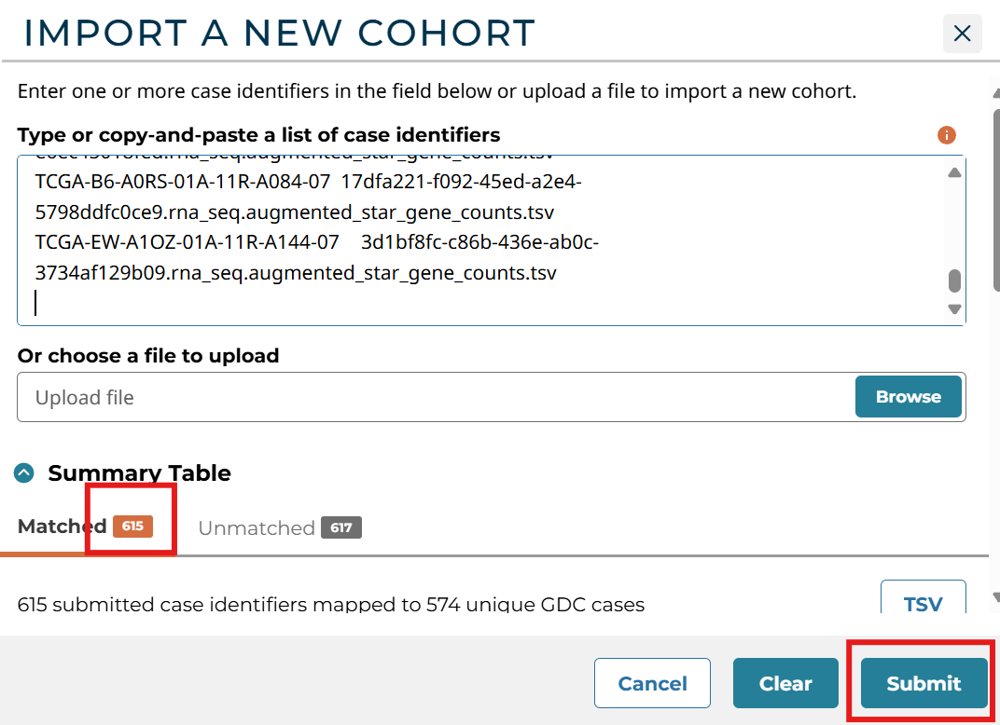{:width=200 height=200}
取一个名字，这里我取得是`03-03.1`，点击`Save`
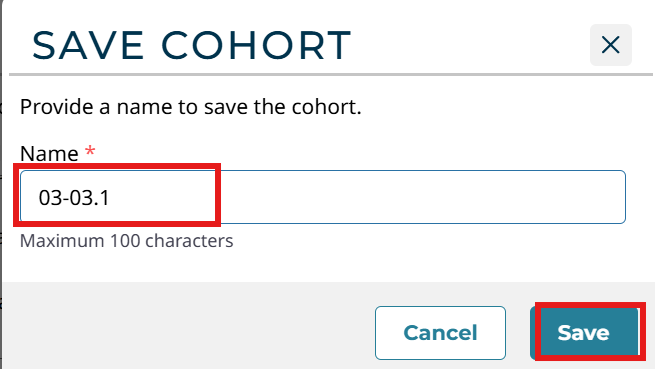{:width=200 height=200}
在`Repository`中筛选：
- `Data Category`--`transcriptome profiling`
- `Data Type`--`Gene Expression Quantification`

添加到Cart中，这里只需下载cart文件即可
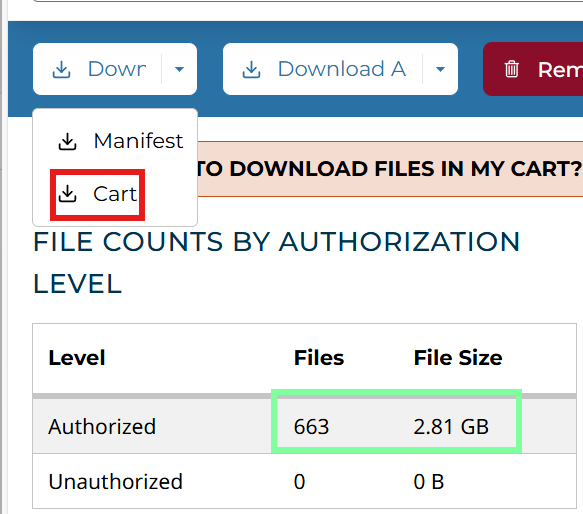{:width=200 height=200}
再同样操作下载`samples2.txt`，取名为`03-03.2`
将下载的两个.tar.gz文件解压，将其中的样本文件夹都集中到一个文件夹内，就与之前一般的数据下载得到的结果相同了（过程中提示有相同的文件名，替换/跳过都可）
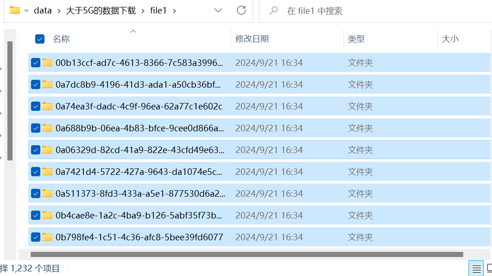{:width=200 height=200}
共有1232个文件（多了一个MANIFEST.txt），正好与之前的1231个文件对应
之后的处理方式同前：
```{r}
# 读取文件名
count_file <- list.files(
  'C:\\Users\\WangTianHao\\Documents\\GitHub\\R-for-bioinformatics\\b站生信课03\\data\\大于5G的数据下载\\file1\\',
  pattern = '*.tsv',recursive = TRUE
);
# 获取每个文件名称
count_file_name <- strsplit(count_file, split = '/');
count_file_name <- sapply(count_file_name, function(x){x[2]});
# 结果矩阵
test_data <- read.delim(paste0('C:\\Users\\WangTianHao\\Documents\\GitHub\\R-for-bioinformatics\\b站生信课03\\data\\大于5G的数据下载\\file1\\', count_file[1]), fill = TRUE, header = FALSE, row.names = 1);
matrix <- data.frame(matrix(nrow = nrow(test_data), ncol = 0));
# 逐个读取及合并
for (i in 1:length(count_file)){
  path <- paste0('C:\\Users\\WangTianHao\\Documents\\GitHub\\R-for-bioinformatics\\b站生信课03\\data\\大于5G的数据下载\\file1\\', count_file[i]);
  data <- read.delim(path, fill = TRUE,header = FALSE, row.names = 1);
  colnames(data) <- data[2, ];
  data <- data[6];  # 3-unstranded_counts 4-stranded_first 5-stranded_second 6-tpm_unstranded 7-fpkm_unstranded 8-fpkm_uq_unstranded
  colnames(data) <- file_sample$sample_id[which(file_sample$file_name==count_file_name[i])];
  matrix <- cbind(matrix, data);
}
matrix <- matrix[-c(1:6), ];  # 去除前6行（空行）
# 转化为gene_symbol
test_data <- as.matrix(test_data);
gene_name <- test_data[-c(1:6), 1];
matrix0 <- cbind(gene_name, matrix);
# 获取基因类型
gene_type <- test_data[-c(1:6), 2];
matrix0 <- cbind(gene_type, matrix0);
# 将gene_name列去除重复的基因，保留基因最大表达量结果
matrix0 <- aggregate(. ~ gene_name, data = matrix0, max);
# 只保留mRNA
matrix0 <- subset(x = matrix0, gene_type == "protein_coding");
# 将gene_name列设为行名
rownames(matrix0) <- matrix0[, 1];
matrix0 <- matrix0[, -c(1, 2)];
#导出
matrix1 <- data.frame(ID = rownames(matrix0), matrix0);
colnames(matrix1) <- gsub('[.]', '-', colnames(matrix1));
write.table(matrix1,'C:\\Users\\WangTianHao\\Documents\\GitHub\\R-for-bioinformatics\\b站生信课03\\data\\大于5G的数据下载\\TPM.txt', sep = "\t", quote = F, row.names = F);
```
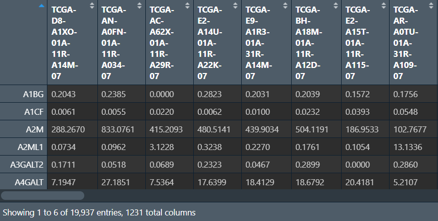{:width=200 height=200}
