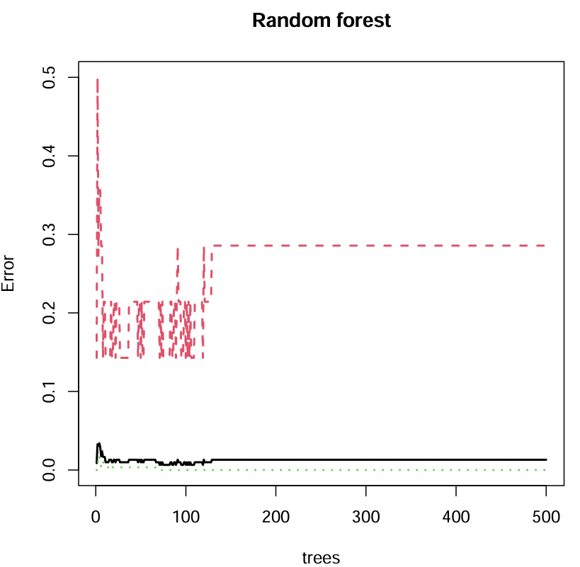
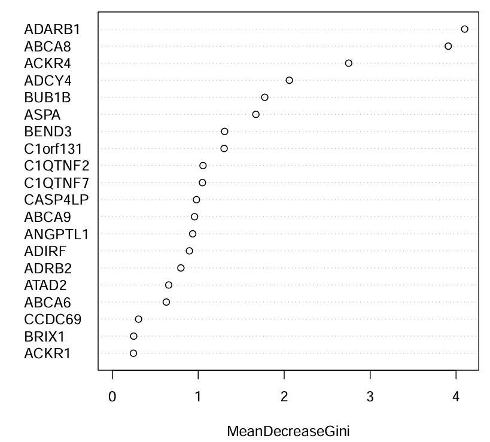
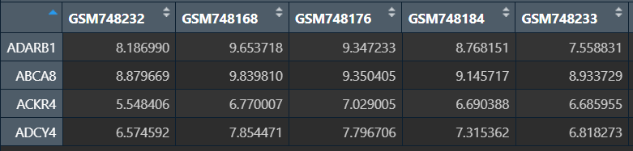
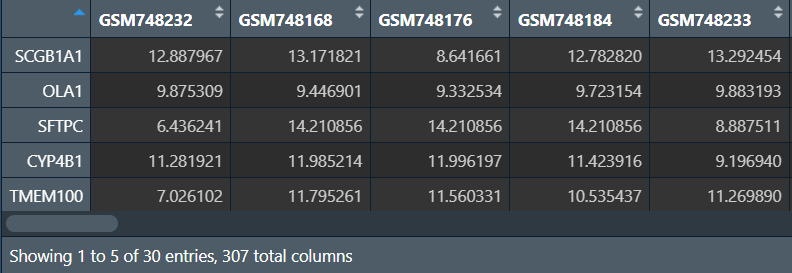
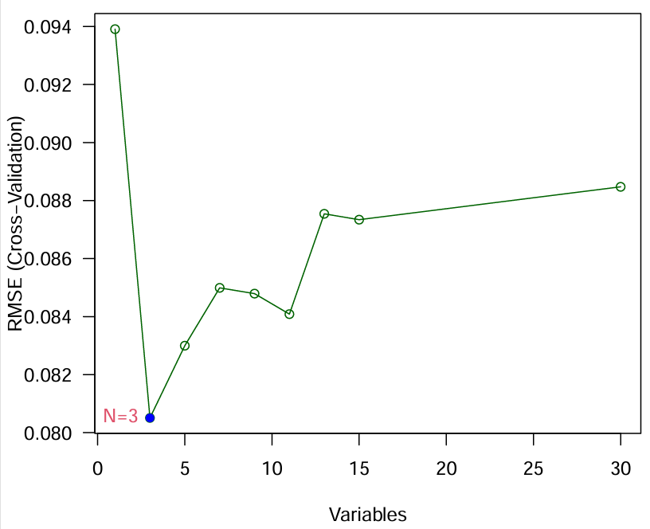
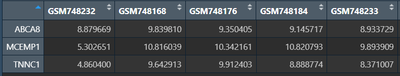
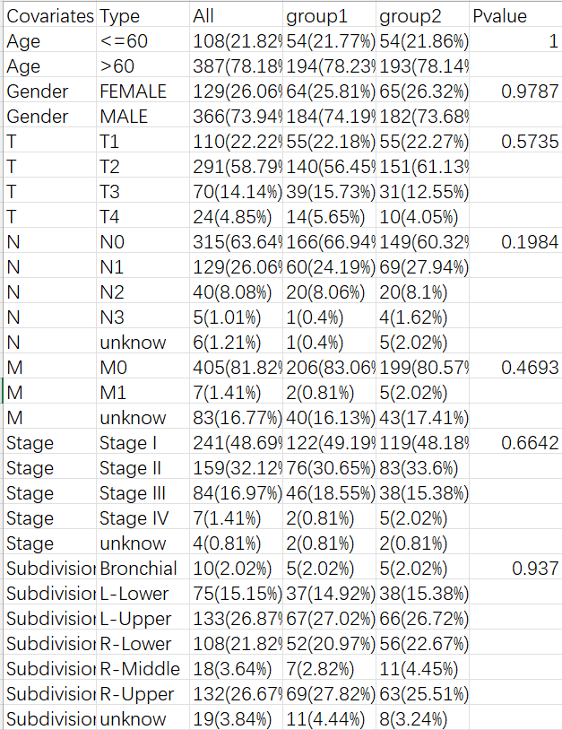
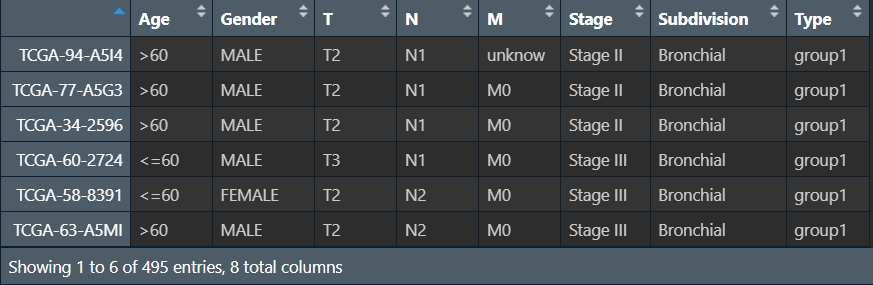
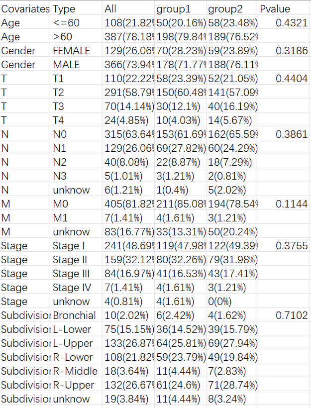

<a id="mulu">目录</a>
<a href="#mulu" class="back">回到目录</a>
<style>
    .back{width:40px;height:40px;display:inline-block;line-height:20px;font-size:20px;background-color:lightyellow;position: fixed;bottom:50px;right:50px;z-index:999;border:2px solid pink;opacity:0.3;transition:all 0.3s;color:green;}
    .back:hover{color:red;opacity:1}
    img{vertical-align:bottom;}
</style>

<!-- @import "[TOC]" {cmd="toc" depthFrom=3 depthTo=6 orderedList=false} -->

<!-- code_chunk_output -->

- [二分类LASSO回归](#二分类lasso回归)
- [随机森林筛选特征基因](#随机森林筛选特征基因)
- [SVM-RFE筛选特征基因](#svm-rfe筛选特征基因)
- [临床信息三线表](#临床信息三线表)

<!-- /code_chunk_output -->

<!-- 打开侧边预览：f1->Markdown Preview Enhanced: open...
只有打开侧边预览时保存才自动更新目录 -->

写在前面：本篇教程来自b站课程[TCGA及GEO数据挖掘入门必看](https://www.bilibili.com/video/BV1b34y1g7RM) P56-P

### 二分类LASSO回归
之前的LASSO回归是以生存情况为结果进行分析，这次是按控制/治疗分组（也可以是正常/肿瘤、治疗前/后、癌旁/肿瘤、存活/死亡）
常用于在二分类构建诊断模型后，进行LASSO、随机森林、决策树分析，这三个结果取交集（当然用于分析的基因必须是相同的），以下将依次介绍这三种方法
需要数据：GSE30219标准化的表达矩阵(normalize.txt)、分组信息(Control.txt/Treat.txt)
``` r
library(glmnet);
library(limma);
set.seed(123);  # 随机种子固定结果
```
**读取数据，分组，提取特定基因**：
提取特定基因：可以是某些特定基因集、差异表达分析结果、单因素cox分析结果等。这里取的是平均表达量>12的前20个基因
``` r
# 读取数据
data <- read.table("C:\\Users\\WangTianHao\\Documents\\GitHub\\R-for-bioinformatics\\b站生信课03\\data\\GSE30219\\normalize.txt", header = T, sep = "\t", check.names = F, row.names = 1);
Control <- read.table("C:\\Users\\WangTianHao\\Documents\\GitHub\\R-for-bioinformatics\\b站生信课03\\data\\GSE30219\\Control.txt", header = F, sep = "\t", check.names = F);
Treat <- read.table("C:\\Users\\WangTianHao\\Documents\\GitHub\\R-for-bioinformatics\\b站生信课03\\data\\GSE30219\\Treat.txt", header = F, sep = "\t", check.names = F);
# 分组
conNum <- length(rownames(Control));
treatNum <- length(rownames(Treat));
Type <- c(rep(1, conNum), rep(2, treatNum));
# 按照控制-治疗排序
data1 <- data[, Control[, 1]];
data2 <- data[, Treat[, 1]];
data <- cbind(data1, data2);
# 提取特定基因
data <- data[rowMeans(data)>12, ];
data <- data[c(1:20), ];
```
{:width=180 height=180}
**构建模型进行分析**：
``` r
x <- as.matrix(t(data));
y <- Type;
fit <- glmnet(x, y, family = "binomial");  # 注意binomial代表二分类
cvfit <- cv.glmnet(x, y, family = "binomial", nfolds = 10);
# 绘制交叉验证曲线
pdf(file = "C:\\Users\\WangTianHao\\Documents\\GitHub\\R-for-bioinformatics\\b站生信课03\\save_data\\binomial_cvfit.pdf", width = 6, height = 5.5);
plot(cvfit);
dev.off();
# 根据分析结果筛选特征基因
coef <- coef(fit, s = cvfit$lambda.min);
index <- which(coef != 0);
lassoGene <- row.names(coef)[index];
lassoGene <- lassoGene[-1];
# 保存特征基因的表达矩阵
lassoGene_exp <- data.frame(
  ID = rownames(data[lassoGene, ]),
  data[lassoGene, ]
);
write.table(lassoGene_exp, file = "C:\\Users\\WangTianHao\\Documents\\GitHub\\R-for-bioinformatics\\b站生信课03\\save_data\\LASSO.gene.exp.txt", sep = "\t", quote = F, row.names = F, col.names = T
);
```
{:width=170 height=170}
共获取到了11个特征基因
{:width=400 height=400}
### 随机森林筛选特征基因
将多个决策树结合在一起，每次数据集是随机有放回的选出，同时随机选出部分特征作为输入
需要数据：GSE30219表达矩阵、分组信息(Control.txt/Treat.txt)、差异表达分析结果(diff.Wilcoxon.txt)（用于选择特征基因进行筛选）
```{r}
if(!require("randomForest", quietly = T))
{
  install.packages("randomForest");
}
library(limma);
library(randomForest);
```
**标准化表达矩阵（去除平均表达量不到1的基因）**：
``` r
data <- read.table("C:\\Users\\WangTianHao\\Documents\\GitHub\\R-for-bioinformatics\\b站生信课03\\data\\GSE30219\\GSE30219.txt", header=T, sep="\t", check.names=F,row.names = 1);
dimnames <- list(rownames(data), colnames(data));
data <- matrix(as.numeric(as.matrix(data)), nrow = nrow(data), dimnames = dimnames);
data <- data[rowMeans(data)>1,];
data <- normalizeBetweenArrays(data);
write.table(data.frame(ID = rownames(data), data), file = "C:\\Users\\WangTianHao\\Documents\\GitHub\\R-for-bioinformatics\\b站生信课03\\data\\GSE30219\\normalize.txt", sep = "\t", quote = F, row.names = F);
```
**读取数据，分组，提取差异基因进行分析**：
提取特定基因：可以是某些特定基因集、差异表达分析结果、单因素cox分析结果等。这里取的是fdr最小的20个基因
```{r}
data <- read.table("C:\\Users\\WangTianHao\\Documents\\GitHub\\R-for-bioinformatics\\b站生信课03\\data\\GSE30219\\normalize.txt", header = T, sep = "\t", check.names = F, row.names = 1);
Control <- read.table("C:\\Users\\WangTianHao\\Documents\\GitHub\\R-for-bioinformatics\\b站生信课03\\data\\GSE30219\\Control.txt", header = F, sep = "\t", check.names = F);
Treat <- read.table("C:\\Users\\WangTianHao\\Documents\\GitHub\\R-for-bioinformatics\\b站生信课03\\data\\GSE30219\\Treat.txt", header = F, sep = "\t", check.names = F);
# 分组
conNum <- length(rownames(Control));
treatNum <- length(rownames(Treat));
Type <- c(rep(1, conNum), rep(2, treatNum));
# 按照控制-治疗排序
data1 <- data[, Control[, 1]];
data2 <- data[, Treat[, 1]];
data <- cbind(data1, data2);
# 提取特定基因
genes <- read.table("C:\\Users\\WangTianHao\\Documents\\GitHub\\R-for-bioinformatics\\b站生信课03\\save_data\\diff.Wilcoxon.txt", header = T, sep = "\t", check.names = F, row.names = 1);
# 选取fdr最小的20个基因
genes <- genes[order(genes$fdr, decreasing = F), ];
data = data[rownames(genes)[1:20], ];
```
{:width=180 height=180}
**构建森林**：
```{r}
x <- as.matrix(t(data));
y <- Type;
rf <- randomForest(as.factor(y) ~ ., data = x, ntree = 500);
pdf(file = "C:\\Users\\WangTianHao\\Documents\\GitHub\\R-for-bioinformatics\\b站生信课03\\save_data\\random_forest.pdf", width = 6, height = 6);
plot(rf, main = "Random forest", lwd = 2);
dev.off();
```
{:width=400 height=400}
横坐标代表有多少个决策树，纵坐标代表误差，图下部绿色的代表对照组，上部红色代表实验组，要选取的是黑色线（误差）最小的树
**基因的重要性图**：
```{r}
# 找出误差最小的点
optionTrees <- which.min(rf$err.rate[, 1]);
rf2 <- randomForest(as.factor(y) ~ ., data = x, ntree = optionTrees);
# 基因重要性
importance <- importance(x = rf2);
# 绘图
pdf(file = "C:\\Users\\WangTianHao\\Documents\\GitHub\\R-for-bioinformatics\\b站生信课03\\save_data\\geneImportance.pdf", width = 6.2, height = 6);
varImpPlot(rf2, main = "");
dev.off();
```
{:width=400 height=400}
横坐标代表重要性，纵坐标代表不同基因，一般选取重要性最高的前几个或重要性大于多少的基因
**筛选特征基因，并保存它们的表达矩阵**：
```{r}
rfGenes <- importance[order(importance[, "MeanDecreaseGini"], decreasing = TRUE), ];
# 重要性评分大于2的基因
rfGenes <- names(rfGenes[rfGenes>2])  ;
# 也可以是重要性评分最高的5个基因
# rfGenes <- names(rfGenes[1:5])          
# 特征基因表达量
sigExp <- data[rfGenes, ];
write.table(data.frame(ID = rownames(sigExp), sigExp), file = "C:\\Users\\WangTianHao\\Documents\\GitHub\\R-for-bioinformatics\\b站生信课03\\save_data\\rfGeneExp.txt", sep = "\t", quote = F, col.names = T, row.names = F);
```
{:width=120 height=120}
### SVM-RFE筛选特征基因
支持向量机-递归特征消除(support vector machine-recursive feature elimination, SVM-RFE)是基于支持向量机的机器学习方法，通过删减SVM产生的特征向量来寻找最佳变量
需要数据：GSE30219表达矩阵、分组信息(Control.txt/Treat.txt)、差异表达分析结果(diff.Wilcoxon.txt)（用于选择特征基因进行筛选）
```{r}
if(!require("kernlab", quietly = T))
{
  install.packages("kernlab");
}
library(e1071);
library(kernlab);
library(caret);
library(limma);
set.seed(123);  # 随机种子固定结果
```
**读取数据，分组，提取差异基因进行分析**：（同上面随机森林筛选）
提取特定基因：可以是某些特定基因集、差异表达分析结果、单因素cox分析结果等。这里取的是logFC绝对值最大的前30个基因
```{r}
data <- read.table("C:\\Users\\WangTianHao\\Documents\\GitHub\\R-for-bioinformatics\\b站生信课03\\data\\GSE30219\\normalize.txt", header = T, sep = "\t", check.names = F, row.names = 1);
Control <- read.table("C:\\Users\\WangTianHao\\Documents\\GitHub\\R-for-bioinformatics\\b站生信课03\\data\\GSE30219\\Control.txt", header = F, sep = "\t", check.names = F);
Treat <- read.table("C:\\Users\\WangTianHao\\Documents\\GitHub\\R-for-bioinformatics\\b站生信课03\\data\\GSE30219\\Treat.txt", header = F, sep = "\t", check.names = F);
# 分组
conNum <- length(rownames(Control));
treatNum <- length(rownames(Treat));
Type <- c(rep(1, conNum), rep(2, treatNum));
# 按照控制-治疗排序
data1 <- data[, Control[, 1]];
data2 <- data[, Treat[, 1]];
data <- cbind(data1, data2);
# 提取特定基因
genes <- read.table("C:\\Users\\WangTianHao\\Documents\\GitHub\\R-for-bioinformatics\\b站生信课03\\save_data\\diff.Wilcoxon.txt", header = T, sep = "\t", check.names = F, row.names = 1);
# 选取logFC绝对值最大的前30个基因
genes <- genes[order(abs(genes$logFC), decreasing = T), ];
data <- data[rownames(genes)[1:30], ];
```
{:width=180 height=180}
**SVM-RFE分析并绘图**：
注：运行时间可能很长（30min-1h左右）
```{r}
# SVM-RFE分析
x <- t(data);
y <- as.numeric(as.factor(Type));
Profile <- rfe(
  x = x, y = y,
  sizes = c(seq(1, 15, by=2)),
  rfeControl = rfeControl(functions = caretFuncs, method = "cv"),
  methods = "svmRadial"
);
# 绘图
pdf(file = "C:\\Users\\WangTianHao\\Documents\\GitHub\\R-for-bioinformatics\\b站生信课03\\save_data\\SVM-RFE.pdf", width = 6, height = 5.5);
par(las = 1);
x <- Profile$results$Variables;
y <- Profile$results$RMSE;
plot(
  x, y, 
  xlab = "Variables", ylab = "RMSE (Cross-Validation)", 
  col = "darkgreen"
);
lines(x, y, col = "darkgreen");
wmin <- which.min(y);
wmin.x <- x[wmin];
wmin.y <- y[wmin];
points(wmin.x, wmin.y, col = "blue", pch = 16);
text(wmin.x, wmin.y, paste0('N=', wmin.x), pos = 2, col = 2);
dev.off();
```
{:width=400 height=400}
横坐标是特征数量（或者说是基因数），纵坐标是交叉验证的误差，需要选取误差值最小的基因数，可以看到当N=3（基因数为3）的时候最合适
**筛选特征基因，并保存它们的表达矩阵**：
```{r}
# 特征基因
featureGenes <- Profile$optVariables;
# 表达矩阵
sigExp <- data[featureGenes, ];
write.table(
  data.frame(ID = rownames(sigExp), sigExp), 
  file = "C:\\Users\\WangTianHao\\Documents\\GitHub\\R-for-bioinformatics\\b站生信课03\\save_data\\SVM-RFE.Gene.Exp.txt", 
  sep = "\t", quote = F, col.names = T, row.names = F
);
```
{:width=100 height=100}
### 临床信息三线表
比如评估某种药物的治疗效果，将样本分为治疗组和对照组，这时就需要统计每组的临床特征。例如下面的三线表：
{:width=500 height=500}
第一列是临床特征名称，第二列是每个特征有哪些分类，之后是各分类在全部/第一组/第二组中的样本数及占比，后面的p值代表该特征在两组中的差异是否显著。一般来讲，我们希望临床特征在两组中没有统计学差异(p>0.05)且p值越接近1越好，因为我们想要的是治疗影响两组的数据，而不是临床特征对两组产生影响，因此两组越相似越好
使用的临床特征数据：允许空值，包含样本名、Age、Gender、T、N、M、Stage、Subdivision列，其中只有年龄列是数值型，其它均为字符型(T1/N0/M0/FEMALE/Stage II)，Subdivision列取值为Bronchial、L-Lower、L-Upper、R-Lower、R-Middle、R-Upper、unknow
**读取数据并分组**：
```{r}
clinical <- read.table("C:\\Users\\WangTianHao\\Documents\\GitHub\\R-for-bioinformatics\\b站生信课03\\data\\临床信息三线表clinical.txt", header = T, sep = "\t", check.names = F, row.names = 1);
# 将年龄按>60和<=60分组（将数据都变成离散变量）
clinical[, "Age"] <- ifelse(
  clinical[, "Age"]=="unknow", "unknow", 
  ifelse(
    clinical[,"Age"]>60,
    ">60",
    "<=60"
  )
);
# 分组，这里随机成2组，实际上应按指定的方式分组
samples <- sample(
  rownames(clinical),
  round(length(rownames(clinical))/2)
);
# 获取各个分组的临床信息
group1clinical <- clinical[which(rownames(clinical) %in% samples), ];
group1clinical <- cbind(group1clinical, Type = "group1");  # 标识属于哪组
group2clinical <- clinical[-which(rownames(clinical) %in% samples), ];
group2clinical <- cbind(group2clinical, Type = "group2");  # 标识属于哪组
# 合并
group12clinical <- rbind(group1clinical, group2clinical);
```
{:width=180 height=180}
**计算p值**：
```{r}
cliStatOut <- data.frame();
for(i in 1:(ncol(group12clinical)-1)){
  nameStat <- colnames(group12clinical)[i];
  tableStat <- table(group12clinical[, c(nameStat, "Type")]);
  # All为全部集的名字
  tableStatSum <- cbind(All = rowSums(tableStat), tableStat);
  tableStatRatio <- prop.table(tableStatSum, 2);
  tableStatRatio <- round(tableStatRatio*100, 2);
  tableStatPaste <- paste(tableStatSum, "(", tableStatRatio, "%)", sep = "");
  tableStatOut <- matrix(tableStatPaste, ncol = 3, dimnames = dimnames(tableStatSum));
  # 是否纳入unknow样本（将unknow作为临床特征的一个分类），这里纳入了
  # pStat <- chisq.test(tableStat[row.names(tableStat)!="unknow", ]);
  pStat <- chisq.test(tableStat);  # 卡方检验
  pValueStat <- round(pStat$p.value, 4);
  pValueCol <- c(pValueStat, rep(" ", (nrow(tableStatOut)-1)));
  tableStatOut <- cbind(
    Covariates = nameStat,
    Type = row.names(tableStatOut),
    tableStatOut,
    Pvalue = pValueCol
  );
  cliStatOut <- rbind(cliStatOut, tableStatOut);
}
# 保存结果
write.table(cliStatOut, file = "C:\\Users\\WangTianHao\\Documents\\GitHub\\R-for-bioinformatics\\b站生信课03\\save_data\\result.xls", sep = "\t", quote = F, row.names = F);
```
{:width=400 height=400}
注：因为是随机分组，所以每次运行结果不同
