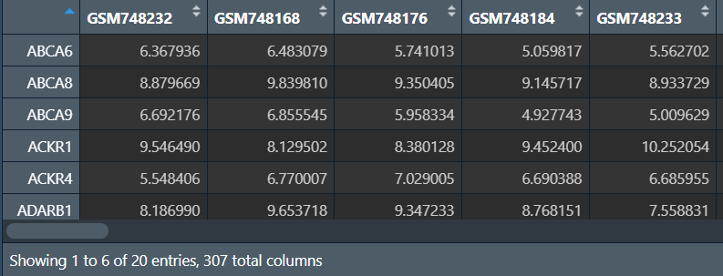

<a id="mulu">目录</a>
<a href="#mulu" class="back">回到目录</a>
<style>
    .back{width:40px;height:40px;display:inline-block;line-height:20px;font-size:20px;background-color:lightyellow;position: fixed;bottom:50px;right:50px;z-index:999;border:2px solid pink;opacity:0.3;transition:all 0.3s;color:green;}
    .back:hover{color:red;opacity:1}
    img{vertical-align:bottom;}
</style>

<!-- @import "[TOC]" {cmd="toc" depthFrom=3 depthTo=6 orderedList=false} -->

<!-- code_chunk_output -->

- [二分类LASSO回归](#二分类lasso回归)
- [随机森林筛选特征基因](#随机森林筛选特征基因)

<!-- /code_chunk_output -->

<!-- 打开侧边预览：f1->Markdown Preview Enhanced: open...
只有打开侧边预览时保存才自动更新目录 -->

写在前面：本篇教程来自b站课程[TCGA及GEO数据挖掘入门必看](https://www.bilibili.com/video/BV1b34y1g7RM) P56-P

### 二分类LASSO回归
之前的LASSO回归是以生存情况为结果进行分析，这次是按控制/治疗分组（也可以是正常/肿瘤、治疗前/后、癌旁/肿瘤、存活/死亡）
常用于在二分类构建诊断模型后，进行LASSO、随机森林、决策树分析，这三个结果取交集
需要数据：GSE30219标准化的表达矩阵(normalize.txt)、分组信息(Control.txt/Treat.txt)
``` r
library(glmnet);
library(limma);
set.seed(123);  # 随机种子固定结果
```
**读取数据，分组，提取特定基因**：
提取特定基因：可以是某些特定基因集、差异表达分析结果、单因素cox分析结果等。这里取的是平均表达量>12的前20个基因
``` r
# 读取数据
data <- read.table("C:\\Users\\WangTianHao\\Documents\\GitHub\\R-for-bioinformatics\\b站生信课03\\data\\GSE30219\\normalize.txt", header = T, sep = "\t", check.names = F, row.names = 1);
Control <- read.table("C:\\Users\\WangTianHao\\Documents\\GitHub\\R-for-bioinformatics\\b站生信课03\\data\\GSE30219\\Control.txt", header = F, sep = "\t", check.names = F);
Treat <- read.table("C:\\Users\\WangTianHao\\Documents\\GitHub\\R-for-bioinformatics\\b站生信课03\\data\\GSE30219\\Treat.txt", header = F, sep = "\t", check.names = F);
# 分组
conNum <- length(rownames(Control));
treatNum <- length(rownames(Treat));
Type <- c(rep(1, conNum), rep(2, treatNum));
# 按照控制-治疗排序
data1 <- data[, Control[, 1]];
data2 <- data[, Treat[, 1]];
data <- cbind(data1, data2);
# 提取特定基因
data <- data[rowMeans(data)>12, ];
data <- data[c(1:20), ];
```
{:width=180 height=180}
**构建模型进行分析**：
``` r
x <- as.matrix(t(data));
y <- Type;
fit <- glmnet(x, y, family = "binomial");  # 注意binomial代表二分类
cvfit <- cv.glmnet(x, y, family = "binomial", nfolds = 10);
# 绘制交叉验证曲线
pdf(file = "C:\\Users\\WangTianHao\\Documents\\GitHub\\R-for-bioinformatics\\b站生信课03\\save_data\\binomial_cvfit.pdf", width = 6, height = 5.5);
plot(cvfit);
dev.off();
# 根据分析结果筛选特征基因
coef <- coef(fit, s = cvfit$lambda.min);
index <- which(coef != 0);
lassoGene <- row.names(coef)[index];
lassoGene <- lassoGene[-1];
# 保存特征基因的表达矩阵
lassoGene_exp <- data.frame(
  ID = rownames(data[lassoGene, ]),
  data[lassoGene, ]
);
write.table(lassoGene_exp, file = "C:\\Users\\WangTianHao\\Documents\\GitHub\\R-for-bioinformatics\\b站生信课03\\save_data\\LASSO.gene.exp.txt", sep = "\t", quote = F, row.names = F, col.names = T
);
```
{:width=170 height=170}
共获取到了11个特征基因
{:width=400 height=400}
### 随机森林筛选特征基因
将多个决策树结合在一起，每次数据集是随机有放回的选出，同时随机选出部分特征作为输入
需要数据：GSE30219表达矩阵、分组信息(Control.txt/Treat.txt)、差异表达分析结果(diff.Wilcoxon.txt)（用于选择特征基因进行筛选）
```{r}
if(!require("randomForest", quietly = T))
{
  install.packages("randomForest");
}
library(limma);
library(randomForest);
```
标准化表达矩阵（去除平均表达量不到1的基因）：
``` r
data <- read.table("C:\\Users\\WangTianHao\\Documents\\GitHub\\R-for-bioinformatics\\b站生信课03\\data\\GSE30219\\GSE30219.txt", header=T, sep="\t", check.names=F,row.names = 1);
dimnames <- list(rownames(data), colnames(data));
data <- matrix(as.numeric(as.matrix(data)), nrow = nrow(data), dimnames = dimnames);
data <- data[rowMeans(data)>1,];
data <- normalizeBetweenArrays(data);
write.table(data.frame(ID = rownames(data), data), file = "C:\\Users\\WangTianHao\\Documents\\GitHub\\R-for-bioinformatics\\b站生信课03\\data\\GSE30219\\normalize.txt", sep = "\t", quote = F, row.names = F);
```
读取数据，分组，提取差异基因进行分析：
```{r}
data <- read.table("C:\\Users\\WangTianHao\\Documents\\GitHub\\R-for-bioinformatics\\b站生信课03\\data\\GSE30219\\normalize.txt", header = T, sep = "\t", check.names = F, row.names = 1);
Control <- read.table("C:\\Users\\WangTianHao\\Documents\\GitHub\\R-for-bioinformatics\\b站生信课03\\data\\GSE30219\\Control.txt", header = F, sep = "\t", check.names = F);
Treat <- read.table("C:\\Users\\WangTianHao\\Documents\\GitHub\\R-for-bioinformatics\\b站生信课03\\data\\GSE30219\\Treat.txt", header = F, sep = "\t", check.names = F);
# 分组
conNum <- length(rownames(Control));
treatNum <- length(rownames(Treat));
Type <- c(rep(1, conNum), rep(2, treatNum));
# 按照控制-治疗排序
data1 <- data[, Control[, 1]];
data2 <- data[, Treat[, 1]];
data <- cbind(data1, data2);
# 提取特定基因
genes <- read.table("C:\\Users\\WangTianHao\\Documents\\GitHub\\R-for-bioinformatics\\b站生信课03\\save_data\\diff.Wilcoxon.txt", header = T, sep = "\t", check.names = F, row.names = 1);
# 选取最小的20个基因
genes <- genes[order(genes$fdr, decreasing = F), ];
data = data[rownames(genes)[1:20], ];
```
{:width=180 height=180}
横坐标代表有多少个决策树，纵坐标代表误差，图下部绿色的代表对照组，上部红色代表实验组，要选取的是黑色线（误差）最小的树

横坐标代表重要性，纵坐标代表不同基因，一般选取重要性最高的前几个或重要性大于多少的基因
