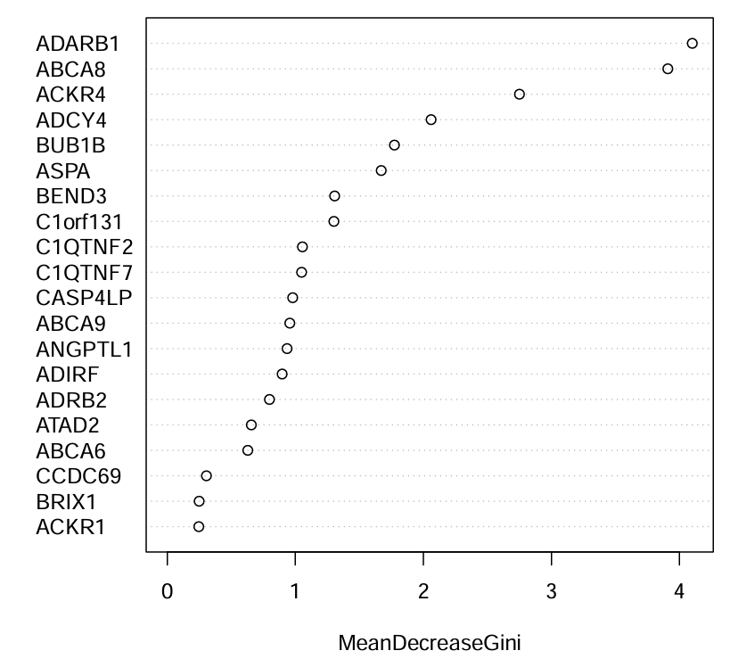
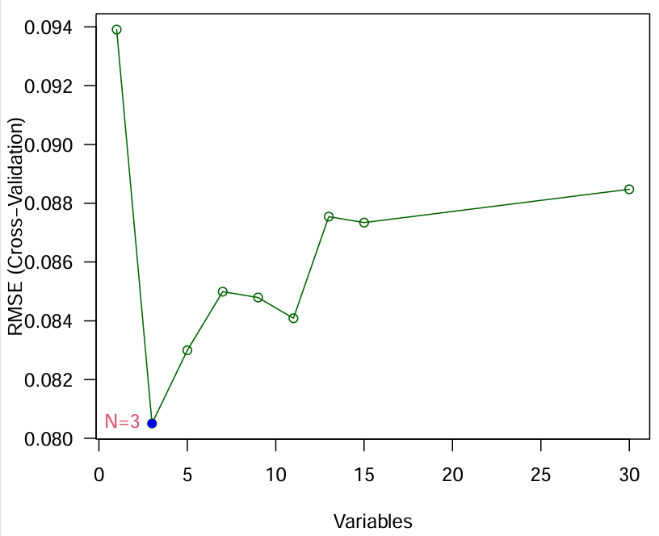
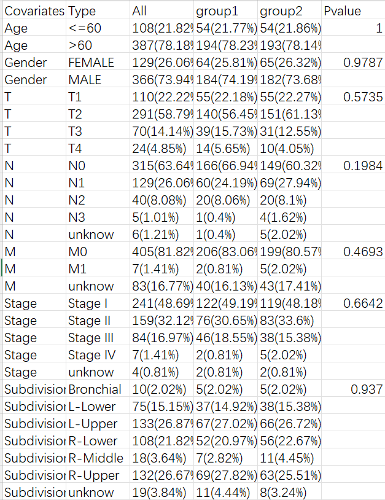
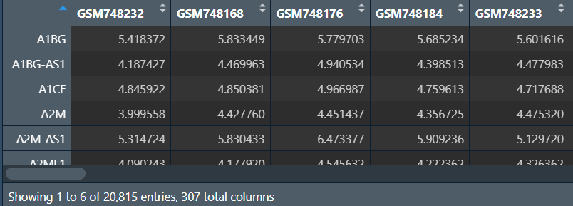
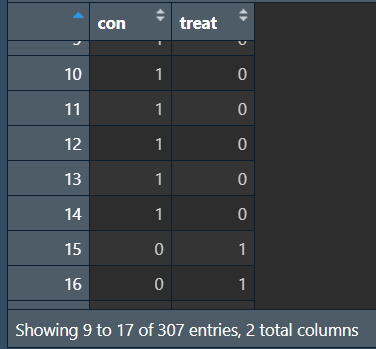
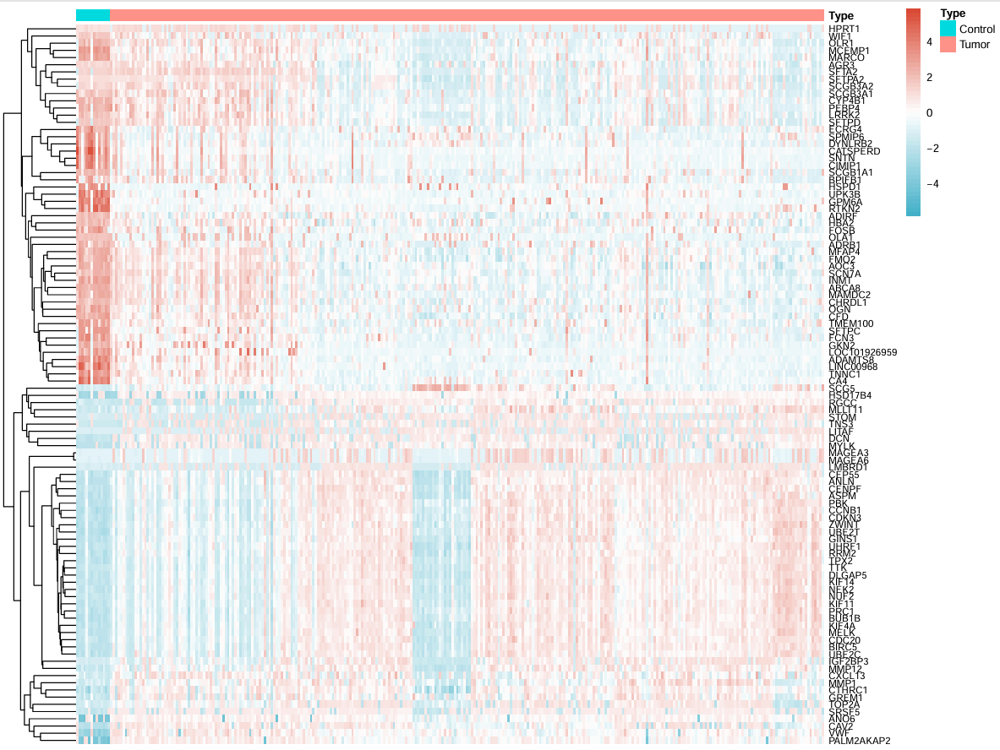
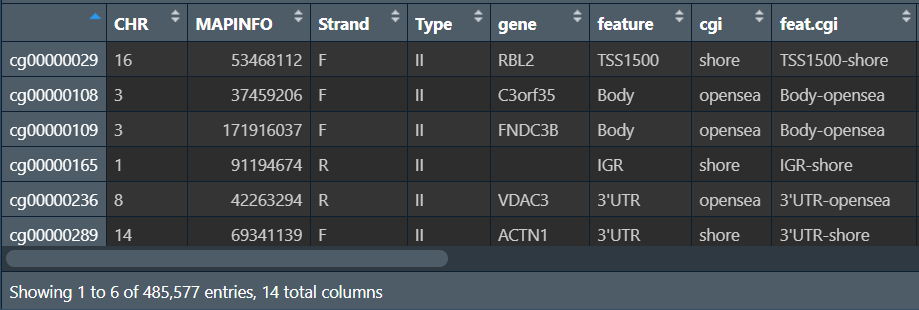
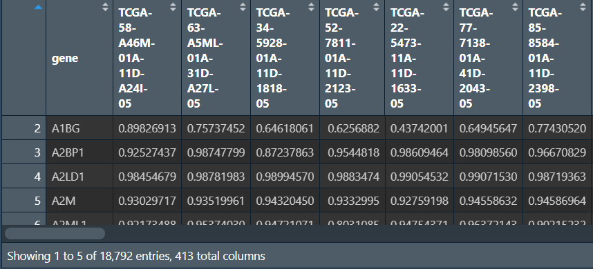

<a id="mulu">目录</a>
<a href="#mulu" class="back">回到目录</a>
<style>
    .back{width:40px;height:40px;display:inline-block;line-height:20px;font-size:20px;background-color:lightyellow;position: fixed;bottom:50px;right:50px;z-index:999;border:2px solid pink;opacity:0.3;transition:all 0.3s;color:green;}
    .back:hover{color:red;opacity:1}
    img{vertical-align:bottom;}
</style>

<!-- @import "[TOC]" {cmd="toc" depthFrom=3 depthTo=6 orderedList=false} -->

<!-- code_chunk_output -->

- [筛选特征基因](#筛选特征基因)
    - [二分类LASSO回归](#二分类lasso回归)
    - [随机森林筛选特征基因](#随机森林筛选特征基因)
    - [SVM-RFE筛选特征基因](#svm-rfe筛选特征基因)
- [临床信息三线表](#临床信息三线表)
- [GEO的Bayes差异表达分析](#geo的bayes差异表达分析)
- [GEO基因差异分析](#geo基因差异分析)
- [TCGA甲基化数据注释](#tcga甲基化数据注释)

<!-- /code_chunk_output -->

<!-- 打开侧边预览：f1->Markdown Preview Enhanced: open...
只有打开侧边预览时保存才自动更新目录 -->

写在前面：本篇教程来自b站课程[TCGA及GEO数据挖掘入门必看](https://www.bilibili.com/video/BV1b34y1g7RM) P56-P62 [相关资料下载](https://github.com/lwstkhyl/bioinformatic-and-R/tree/main/b%E7%AB%99%E7%94%9F%E4%BF%A1%E8%AF%BEdata)

### 筛选特征基因
##### 二分类LASSO回归
之前的LASSO回归是以生存情况为结果进行分析，这次是按控制/治疗分组（也可以是正常/肿瘤、治疗前/后、癌旁/肿瘤、存活/死亡）
常用于在二分类构建诊断模型后，进行LASSO、随机森林、决策树分析，这三个结果取交集（当然用于分析的基因必须是相同的），以下将依次介绍这三种方法
需要数据：GSE30219标准化的表达矩阵(normalize.txt)、分组信息(Control.txt/Treat.txt)
``` r
library(glmnet);
library(limma);
set.seed(123);  # 随机种子固定结果
```
**读取数据，分组，提取特定基因**：
提取特定基因：可以是某些特定基因集、差异表达分析结果、单因素cox分析结果等。这里取的是平均表达量>12的前20个基因
``` r
# 读取数据
data <- read.table("data\\GSE30219\\normalize.txt", header = T, sep = "\t", check.names = F, row.names = 1);
Control <- read.table("data\\GSE30219\\Control.txt", header = F, sep = "\t", check.names = F);
Treat <- read.table("data\\GSE30219\\Treat.txt", header = F, sep = "\t", check.names = F);
# 分组
conNum <- length(rownames(Control));
treatNum <- length(rownames(Treat));
Type <- c(rep(1, conNum), rep(2, treatNum));
# 按照控制-治疗排序
data1 <- data[, Control[, 1]];
data2 <- data[, Treat[, 1]];
data <- cbind(data1, data2);
# 提取特定基因
data <- data[rowMeans(data)>12, ];
data <- data[c(1:20), ];
```
{:width=180 height=180}
**构建模型进行分析**：
``` r
x <- as.matrix(t(data));
y <- Type;
fit <- glmnet(x, y, family = "binomial");  # 注意binomial代表二分类
cvfit <- cv.glmnet(x, y, family = "binomial", nfolds = 10);
# 绘制交叉验证曲线
pdf(file = "save_data\\binomial_cvfit.pdf", width = 6, height = 5.5);
plot(cvfit);
dev.off();
# 根据分析结果筛选特征基因
coef <- coef(fit, s = cvfit$lambda.min);
index <- which(coef != 0);
lassoGene <- row.names(coef)[index];
lassoGene <- lassoGene[-1];
# 保存特征基因的表达矩阵
lassoGene_exp <- data.frame(
  ID = rownames(data[lassoGene, ]),
  data[lassoGene, ]
);
write.table(lassoGene_exp, file = "save_data\\LASSO.gene.exp.txt", sep = "\t", quote = F, row.names = F, col.names = T
);
```
{:width=170 height=170}
共获取到了11个特征基因
{:width=400 height=400}
##### 随机森林筛选特征基因
将多个决策树结合在一起，每次数据集是随机有放回的选出，同时随机选出部分特征作为输入
需要数据：GSE30219表达矩阵、分组信息(Control.txt/Treat.txt)、差异表达分析结果(diff.Wilcoxon.txt)（用于选择特征基因进行筛选）
``` r
if(!require("randomForest", quietly = T))
{
  install.packages("randomForest");
}
library(limma);
library(randomForest);
```
**标准化表达矩阵（去除平均表达量不到1的基因）**：
``` r
data <- read.table("data\\GSE30219\\GSE30219.txt", header=T, sep="\t", check.names=F,row.names = 1);
dimnames <- list(rownames(data), colnames(data));
data <- matrix(as.numeric(as.matrix(data)), nrow = nrow(data), dimnames = dimnames);
data <- data[rowMeans(data)>1,];
data <- normalizeBetweenArrays(data);
write.table(data.frame(ID = rownames(data), data), file = "data\\GSE30219\\normalize.txt", sep = "\t", quote = F, row.names = F);
```
**读取数据，分组，提取差异基因进行分析**：
提取特定基因：可以是某些特定基因集、差异表达分析结果、单因素cox分析结果等。这里取的是fdr最小的20个基因
``` r
data <- read.table("data\\GSE30219\\normalize.txt", header = T, sep = "\t", check.names = F, row.names = 1);
Control <- read.table("data\\GSE30219\\Control.txt", header = F, sep = "\t", check.names = F);
Treat <- read.table("data\\GSE30219\\Treat.txt", header = F, sep = "\t", check.names = F);
# 分组
conNum <- length(rownames(Control));
treatNum <- length(rownames(Treat));
Type <- c(rep(1, conNum), rep(2, treatNum));
# 按照控制-治疗排序
data1 <- data[, Control[, 1]];
data2 <- data[, Treat[, 1]];
data <- cbind(data1, data2);
# 提取特定基因
genes <- read.table("save_data\\diff.Wilcoxon.txt", header = T, sep = "\t", check.names = F, row.names = 1);
# 选取fdr最小的20个基因
genes <- genes[order(genes$fdr, decreasing = F), ];
data = data[rownames(genes)[1:20], ];
```
{:width=180 height=180}
**构建森林**：
``` r
x <- as.matrix(t(data));
y <- Type;
rf <- randomForest(as.factor(y) ~ ., data = x, ntree = 500);
pdf(file = "save_data\\random_forest.pdf", width = 6, height = 6);
plot(rf, main = "Random forest", lwd = 2);
dev.off();
```
{:width=400 height=400}
横坐标代表有多少个决策树，纵坐标代表误差，图下部绿色的代表对照组，上部红色代表实验组，要选取的是黑色线（误差）最小的树
**基因的重要性图**：
``` r
# 找出误差最小的点
optionTrees <- which.min(rf$err.rate[, 1]);
rf2 <- randomForest(as.factor(y) ~ ., data = x, ntree = optionTrees);
# 基因重要性
importance <- importance(x = rf2);
# 绘图
pdf(file = "save_data\\geneImportance.pdf", width = 6.2, height = 6);
varImpPlot(rf2, main = "");
dev.off();
```
{:width=400 height=400}
横坐标代表重要性，纵坐标代表不同基因，一般选取重要性最高的前几个或重要性大于多少的基因
**筛选特征基因，并保存它们的表达矩阵**：
``` r
rfGenes <- importance[order(importance[, "MeanDecreaseGini"], decreasing = TRUE), ];
# 重要性评分大于2的基因
rfGenes <- names(rfGenes[rfGenes>2])  ;
# 也可以是重要性评分最高的5个基因
# rfGenes <- names(rfGenes[1:5])          
# 特征基因表达量
sigExp <- data[rfGenes, ];
write.table(data.frame(ID = rownames(sigExp), sigExp), file = "save_data\\rfGeneExp.txt", sep = "\t", quote = F, col.names = T, row.names = F);
```
{:width=120 height=120}
##### SVM-RFE筛选特征基因
支持向量机-递归特征消除(support vector machine-recursive feature elimination, SVM-RFE)是基于支持向量机的机器学习方法，通过删减SVM产生的特征向量来寻找最佳变量
需要数据：上面得到的GSE30219标准化表达矩阵、分组信息(Control.txt/Treat.txt)、差异表达分析结果(diff.Wilcoxon.txt)（用于选择特征基因进行筛选）
``` r
if(!require("kernlab", quietly = T))
{
  install.packages("kernlab");
}
library(e1071);
library(kernlab);
library(caret);
library(limma);
set.seed(123);  # 随机种子固定结果
```
**读取数据，分组，提取差异基因进行分析**：（同上面随机森林筛选）
提取特定基因：可以是某些特定基因集、差异表达分析结果、单因素cox分析结果等。这里取的是logFC绝对值最大的前30个基因
``` r
data <- read.table("data\\GSE30219\\normalize.txt", header = T, sep = "\t", check.names = F, row.names = 1);
Control <- read.table("data\\GSE30219\\Control.txt", header = F, sep = "\t", check.names = F);
Treat <- read.table("data\\GSE30219\\Treat.txt", header = F, sep = "\t", check.names = F);
# 分组
conNum <- length(rownames(Control));
treatNum <- length(rownames(Treat));
Type <- c(rep(1, conNum), rep(2, treatNum));
# 按照控制-治疗排序
data1 <- data[, Control[, 1]];
data2 <- data[, Treat[, 1]];
data <- cbind(data1, data2);
# 提取特定基因
genes <- read.table("save_data\\diff.Wilcoxon.txt", header = T, sep = "\t", check.names = F, row.names = 1);
# 选取logFC绝对值最大的前30个基因
genes <- genes[order(abs(genes$logFC), decreasing = T), ];
data <- data[rownames(genes)[1:30], ];
```
{:width=180 height=180}
**SVM-RFE分析并绘图**：
注：运行时间可能很长（30min-1h左右）
``` r
# SVM-RFE分析
x <- t(data);
y <- as.numeric(as.factor(Type));
Profile <- rfe(
  x = x, y = y,
  sizes = c(seq(1, 15, by=2)),
  rfeControl = rfeControl(functions = caretFuncs, method = "cv"),
  methods = "svmRadial"
);
# 绘图
pdf(file = "save_data\\SVM-RFE.pdf", width = 6, height = 5.5);
par(las = 1);
x <- Profile$results$Variables;
y <- Profile$results$RMSE;
plot(
  x, y, 
  xlab = "Variables", ylab = "RMSE (Cross-Validation)", 
  col = "darkgreen"
);
lines(x, y, col = "darkgreen");
wmin <- which.min(y);
wmin.x <- x[wmin];
wmin.y <- y[wmin];
points(wmin.x, wmin.y, col = "blue", pch = 16);
text(wmin.x, wmin.y, paste0('N=', wmin.x), pos = 2, col = 2);
dev.off();
```
{:width=400 height=400}
横坐标是特征数量（或者说是基因数），纵坐标是交叉验证的误差，需要选取误差值最小的基因数，可以看到当N=3（基因数为3）的时候最合适
**筛选特征基因，并保存它们的表达矩阵**：
``` r
# 特征基因
featureGenes <- Profile$optVariables;
# 表达矩阵
sigExp <- data[featureGenes, ];
write.table(
  data.frame(ID = rownames(sigExp), sigExp), 
  file = "save_data\\SVM-RFE.Gene.Exp.txt", 
  sep = "\t", quote = F, col.names = T, row.names = F
);
```
{:width=100 height=100}
### 临床信息三线表
比如评估某种药物的治疗效果，将样本分为治疗组和对照组，这时就需要统计每组的临床特征。例如下面的三线表：
{:width=500 height=500}
第一列是临床特征名称，第二列是每个特征有哪些分类，之后是各分类在全部/第一组/第二组中的样本数及占比，后面的p值代表该特征在两组中的差异是否显著。一般来讲，我们希望临床特征在两组中没有统计学差异(p>0.05)且p值越接近1越好，因为我们想要的是治疗影响两组的数据，而不是临床特征对两组产生影响，因此两组越相似越好
使用的临床特征数据：允许空值，包含样本名、Age、Gender、T、N、M、Stage、Subdivision列，其中只有年龄列是数值型，其它均为字符型(T1/N0/M0/FEMALE/Stage II)，Subdivision列取值为Bronchial、L-Lower、L-Upper、R-Lower、R-Middle、R-Upper、unknow
**读取数据并分组**：
``` r
clinical <- read.table("data\\临床信息三线表clinical.txt", header = T, sep = "\t", check.names = F, row.names = 1);
# 将年龄按>60和<=60分组（将数据都变成离散变量）
clinical[, "Age"] <- ifelse(
  clinical[, "Age"]=="unknow", "unknow", 
  ifelse(
    clinical[,"Age"]>60,
    ">60",
    "<=60"
  )
);
# 分组，这里随机成2组，实际上应按指定的方式分组
samples <- sample(
  rownames(clinical),
  round(length(rownames(clinical))/2)
);
# 获取各个分组的临床信息
group1clinical <- clinical[which(rownames(clinical) %in% samples), ];
group1clinical <- cbind(group1clinical, Type = "group1");  # 标识属于哪组
group2clinical <- clinical[-which(rownames(clinical) %in% samples), ];
group2clinical <- cbind(group2clinical, Type = "group2");  # 标识属于哪组
# 合并
group12clinical <- rbind(group1clinical, group2clinical);
```
{:width=180 height=180}
**计算p值**：
``` r
cliStatOut <- data.frame();
for(i in 1:(ncol(group12clinical)-1)){
  nameStat <- colnames(group12clinical)[i];
  tableStat <- table(group12clinical[, c(nameStat, "Type")]);
  # All为全部集的名字
  tableStatSum <- cbind(All = rowSums(tableStat), tableStat);
  tableStatRatio <- prop.table(tableStatSum, 2);
  tableStatRatio <- round(tableStatRatio*100, 2);
  tableStatPaste <- paste(tableStatSum, "(", tableStatRatio, "%)", sep = "");
  tableStatOut <- matrix(tableStatPaste, ncol = 3, dimnames = dimnames(tableStatSum));
  # 是否纳入unknow样本（将unknow作为临床特征的一个分类），这里纳入了
  # pStat <- chisq.test(tableStat[row.names(tableStat)!="unknow", ]);
  pStat <- chisq.test(tableStat);  # 卡方检验
  pValueStat <- round(pStat$p.value, 4);
  pValueCol <- c(pValueStat, rep(" ", (nrow(tableStatOut)-1)));
  tableStatOut <- cbind(
    Covariates = nameStat,
    Type = row.names(tableStatOut),
    tableStatOut,
    Pvalue = pValueCol
  );
  cliStatOut <- rbind(cliStatOut, tableStatOut);
}
# 保存结果
write.table(cliStatOut, file = "save_data\\result.xls", sep = "\t", quote = F, row.names = F);
```
{:width=400 height=400}
注：因为是随机分组，所以每次运行结果不同
### GEO的Bayes差异表达分析
之前的GEO差异表达分析使用的是wilcox方法，要求每组的样本量数量多，如果两组样本数差异过大，就不适合wilcox方法
这里我们使用Bayes方法，适合于样本数没有那么多，且是tpm数据/芯片数据的情况
需要数据：之前得到的GSE30219标准化表达矩阵、分组信息(Control.txt/Treat.txt)
``` r
library(limma);
library(pheatmap);
```
**读取数据、合并、分组**：
``` r
# 读取数据
data <- read.table("data\\GSE30219\\normalize.txt", header = T, sep = "\t", check.names = F, row.names = 1);
Control <- read.table("data\\GSE30219\\Control.txt", header = F, sep = "\t", check.names = F);
Treat <- read.table("data\\GSE30219\\Treat.txt", header = F, sep = "\t", check.names = F);
# 按控制/治疗的顺序排序
conData <- data[, Control[, 1]];
treatData <- data[, Treat[, 1]];
data <- cbind(conData, treatData);
conNum <- ncol(conData);
treatNum <- ncol(treatData);
# 分组
Type <- c(rep("con", conNum), rep("treat", treatNum));
design <- model.matrix(~0+factor(Type));
colnames(design) <- c("con", "treat");
```
`data`：
{:width=170 height=170}
`design`：
{:width=200 height=200}
**差异分析**：
``` r
fit <- lmFit(data, design);
cont.matrix<-makeContrasts(treat-con, levels = design);
fit2 <- contrasts.fit(fit, cont.matrix);
fit2 <- eBayes(fit2);
# 分析结果
allDiff <- topTable(fit2, adjust = 'fdr', number = 200000);
# 保存
write.table(
  rbind(id = colnames(allDiff), allDiff),
  file = "save_data\\Bayes.all.gene.txt", 
  sep = "\t", quote = F, col.names = F
);
```
{:width=200 height=200}
**筛选**：
``` r
# 筛选标准
logFCfilter <- 1;
adj.P.Val.Filter <- 0.05;
# 筛选
diffSig <- allDiff[with(allDiff, (abs(logFC)>logFCfilter & adj.P.Val<adj.P.Val.Filter )), ];
diffGeneExp <- data[row.names(diffSig), ];
# 保存
write.table(
  rbind(id = colnames(diffSig), diffSig),
  file = "save_data\\Bayes.diff.gene.txt", 
  sep = "\t", quote = F, col.names = F
);
write.table(
  rbind(id = colnames(diffGeneExp), diffGeneExp),
  file = "save_data\\Bayes.diffGeneExp.txt", 
  sep = "\t", quote = F, col.names = F
);
```
`diffSig`：
{:width=150 height=150}
`diffGeneExp`：
{:width=170 height=170}
**热图和火山图**：类似于之前的差异分析
``` r
# 热图
geneNum <- 50;  # 要展示的基因数量     
diffSig <- diffSig[order(as.numeric(as.vector(diffSig$logFC))), ];  # 按logFC排序
diffGeneName <- as.vector(rownames(diffSig));  # 差异基因名
diffLength <- length(diffGeneName);  # 差异基因长度
hmGene <- c();  # 展示的基因
if(diffLength>(2*geneNum)){
  hmGene <- diffGeneName[c(1:geneNum, (diffLength-geneNum+1):diffLength)];
}else{
  hmGene <- diffGeneName;
}
hmExp <- data[hmGene, ];
Type <- c(rep("Control", conNum),rep("Tumor", treatNum));  # 分组信息
names(Type) <- colnames(data);
Type <- as.data.frame(Type);
pdf(file = "save_data\\geo_Bayes_heatmap.pdf", width = 10, height = 7.5);
pheatmap(
  hmExp, 
  annotation = Type, 
  color = colorRampPalette(c("#44B1C9", "white", "#DA4A35"))(50),
  cluster_cols = F,
  show_colnames = F,
  scale = "row",
  fontsize = 8,
  fontsize_row = 7,
  fontsize_col = 8
);
dev.off();
# 火山图
pdf(file = "save_data\\geo_Bayes_vol.pdf", width = 5, height = 5);
xMax <- 6;
yMax <- max(-log10(allDiff$adj.P.Val))+1;
plot(
  as.numeric(as.vector(allDiff$logFC)), 
  -log10(allDiff$adj.P.Val), 
  xlab = "logFC",
  ylab = "-log10(adj.P.Val)",
  main = "Volcano", 
  xlim = c(-xMax, xMax),
  ylim = c(0, yMax),
  yaxs = "i",
  pch = 20, 
  cex = 1.2
);
diffSub <- subset(
  allDiff, adj.P.Val<adj.P.Val.Filter & as.numeric(as.vector(logFC))>logFCfilter
);  # x=logFC_filter右边的点
points(
  as.numeric(as.vector(diffSub$logFC)), 
  -log10(diffSub$adj.P.Val), 
  pch = 20, 
  col = "#E64B35",
  cex = 1.5
);
diffSub <- subset(
  allDiff, 
  adj.P.Val<adj.P.Val.Filter & as.numeric(as.vector(logFC))<(-logFCfilter)
);  # x=-logFC_filter左边的点
points(
  as.numeric(as.vector(diffSub$logFC)),
  -log10(diffSub$adj.P.Val), 
  pch = 20, 
  col = "#4DBBD5",
  cex = 1.5
);
abline(v = 0, lty = 2, lwd = 3);  #分界线
dev.off();
```
{:width=600 height=600}
{:width=400 height=400}
### GEO基因差异分析
差异表达分析往往以logFC/修正后p值/fdr进行筛选，而基因差异分析一般只以p值为筛选条件，阈值的标准比较低，画箱线图，图中的基因可以不是差异基因，而上面画的图都是差异基因
需要数据：之前得到的GSE30219标准化表达矩阵、分组信息(Control.txt/Treat.txt)
``` r
if(!require("ggthemes", quietly = T))
{
  install.packages("ggthemes");
}
library(limma)
library(stringr);
library(ggplot2);
library(ggVolcano);
library(ggthemes);
library(ggrepel);
library(pheatmap);
library(reshape2);
library(ggpubr);
```
**读取数据，分组，合并**：
``` r
# 读取数据
data <- read.table("data\\GSE30219\\normalize.txt", header = T, sep = "\t", check.names = F, row.names = 1);
Control <- read.table("data\\GSE30219\\Control.txt", header = F, sep = "\t", check.names = F);
Treat <- read.table("data\\GSE30219\\Treat.txt", header = F, sep = "\t", check.names = F);
# 分组
conData <- data[, Control[, 1]];
treatData <- data[, Treat[, 1]];
conNum <- ncol(conData);
treatNum <- ncol(treatData);
# 合并
data <- cbind(conData, treatData);
# 修改行名，让样本名体现组别
colnames(data) <- c(
  paste(colnames(conData), "Control", sep = "_"),
  paste(colnames(treatData), "Treat", sep = "_")
);
# 分组信息
type <- c(rep(1, conNum), rep(2, treatNum));
Type <- c(rep("Control", conNum), rep("Treat", treatNum));
```
{:width=200 height=200}
**差异分析**：
``` r
# 提取自己感兴趣的基因，单个基因也可
data <- data[1:100, ];  # 这里以前100个基因为例
# data <- data["A1BG", , drop=F];  # 如果是单个基因要加drop=F
exp <- data;  # 保存data表达量，下面画图要用
# 差异分析
sigVec <- c();
sigGeneVec <- c();
for(i in row.names(data)){
  rt <- data.frame(
    expression = t(data[i, ])[, i],
    type = type
  );
  test <- wilcox.test(expression ~ type, data = rt);
  pvalue <- test$p.value;
  Sig <- ifelse(
    pvalue<0.05, "***",
    ifelse(
      pvalue<0.01, "**",
      ifelse(
        pvalue<0.05, "*", ""
      )
    )
  );
  if(pvalue<0.05){  # 阈值为p值0.05
    sigVec <- c(sigVec, paste0(i, Sig));  # 在基因名后标注p值
    sigGeneVec <- c(sigGeneVec, i);  # 将差异基因添加到结果中
  }
}
# 提取差异基因
data <- data[sigGeneVec, , drop=F];
write.table(
  rbind(ID = colnames(data), data), 
  file = "save_data\\diffGeneExp.txt", 
  sep = "\t", quote = F, col.names = F
);
```
{:width=180 height=180}
在前100个基因中共选出64个差异基因
**箱线图**：
``` r
exp <- as.data.frame(t(exp));
# 是否仅展示p<0.05的基因（这里全部展示了）
# exp <- exp[, sigGeneVec];
exp <- cbind(exp, Type = Type);
# 宽变长
data <- melt(exp, id.vars = c("Type"));
colnames(data) <- c("Type", "Gene", "Expression");
p <- ggboxplot(
  data, x = "Gene", y = "Expression", 
  color = "Type",
  xlab = "", ylab = "Gene expression",
  legend.title = "Type",
  width = 1,
  palette = c("#19468B", "#EE1D23") 
) +
  rotate_x_text(60) +
  stat_compare_means(
    aes(group = Type),
    method = "wilcox.test",
    symnum.args = list(
      cutpoints = c(0, 0.001, 0.01, 0.05, 1), 
      symbols = c("***", "**", "*", "ns")
    ), 
    label = "p.signif"
  );
# 根据基因数量修改宽高
pdf(file = "save_data\\diff.boxplot1.pdf", width = 16, height = 6.5);
print(p);
dev.off();
```
{:width=400 height=400}
纵坐标是表达量，横坐标是基因名，分组是按控制/治疗，上面的星号标识了是否有统计学差异
### TCGA甲基化数据注释
使用上一篇中TCGA甲基化数据下载和整理得到的甲基化数据`methylation.450.txt`
安装包`ChAMP`：因为这个包的依赖很大，使用`BiocManager`安装很容易中断，可以先将`ChAMPdata`、`geneLenDataBase`、`IlluminaHumanMethylationEPICanno.ilm10b4.hg19`这几个依赖在bioconductor网站下载到本地进行安装，之后再运行`BiocManager::install("ChAMP")`
``` r
if(!require("minfi", quietly = T))
{
  BiocManager::install("minfi");
}
if(!require("ChAMP", quietly = T))
{
  BiocManager::install("ChAMP");
}
library(stringr);
library(tidyverse);
library(ChAMP);
library(data.table);
```
**获取注释信息**：
``` r
myimport <- champ.import(
  directory = system.file("extdata", package = "ChAMPdata")
);
myfilter <- champ.filter(
  beta = myimport$beta,
  pd = myimport$pd,
  detP = myimport$detP,
  beadcount = myimport$beadcount
);
```
{:width=200 height=200}
行名是探针id，`gene`列是基因名（注释信息），其它例如feature、CHR列都是标识探针的分类，如果想专门对某类基因进行研究，就根据这些列进行筛选
**读入甲基化数据，进行注释**：
``` r
# 读入甲基化数据
rt <- fread("data\\甲基化数据\\methylation.450.txt");
rt <- column_to_rownames(rt, var = "ID");
# 获取探针对应的基因名
annotation123 <- probe.features[rownames(rt), ];
# 合并
rt <- cbind(rt, annotation123$gene);
```
{:width=250 height=250}
行名是探针名，列名是样本名，最后一列是添加的基因名注释
**去重，整理数据**：
``` r
# 去除重复基因，保留最大值
rt <- aggregate(. ~ annotation123$gene, data = rt, max);
# 删除第一行、最后一列（无用值）
rt <- rt[-1, -length(colnames(rt))];
# 改列名
colnames(rt)[1] <- "gene";
# 保存
write.table(rt, 'data\\甲基化数据\\450.txt', sep = "\t", quote = F, row.names = F);
```
{:width=250 height=250}
