<a id="mulu">目录</a>
<a href="#mulu" class="back">回到目录</a>
<style>
    .back{width:40px;height:40px;display:inline-block;line-height:20px;font-size:20px;background-color:lightyellow;position: fixed;bottom:50px;right:50px;z-index:999;border:2px solid pink;opacity:0.3;transition:all 0.3s;color:green;}
    .back:hover{color:red;opacity:1}
    img{vertical-align:bottom;}
</style>

<!-- @import "[TOC]" {cmd="toc" depthFrom=3 depthTo=6 orderedList=false} -->

<!-- code_chunk_output -->

- [相关性分析](#相关性分析)
    - [棒棒糖图和散点图](#棒棒糖图和散点图)
    - [mRNA-lncRNA共表达分析](#mrna-lncrna共表达分析)
- [批次矫正前后PCA图](#批次矫正前后pca图)

<!-- /code_chunk_output -->

<!-- 打开侧边预览：f1->Markdown Preview Enhanced: open...
只有打开侧边预览时保存才自动更新目录 -->

写在前面：本篇教程来自b站课程[TCGA及GEO数据挖掘入门必看](https://www.bilibili.com/video/BV1b34y1g7RM) P63-P69

### 相关性分析
##### 棒棒糖图和散点图
需要数据：tpm表达矩阵、cibersort免疫细胞浸润分析得到的`CIBERSORT-Results.txt`
```{r}
if(!require("ggExtra", quietly = T))
{
  install.packages("ggExtra");
}
library(limma);
library(reshape2);
library(ggpubr);
library(ggExtra);
```
**读取数据，合并**：
```{r}
# 表达矩阵
data <- read.table("C:\\Users\\WangTianHao\\Documents\\GitHub\\R-for-bioinformatics\\b站生信课03\\save_data\\TCGA_LUSC_TPM.txt", check.names = F, row.names = 1, sep = '\t', header = T);
# 仅保留肿瘤样本
group <- sapply(strsplit(colnames(data), "\\-"), "[", 4);
group <- sapply(strsplit(group,""), "[", 1);
data <- data[, group == 0];
# 对A1BG基因进行分析，可以换成其它基因
gene <- "A1BG";
data <- t(data[gene, , drop=F]);
data <- as.data.frame(data);
# 免疫细胞浸润分析数据
immune <- read.table("C:\\Users\\WangTianHao\\Documents\\GitHub\\R-for-bioinformatics\\b站生信课03\\save_data\\CIBERSORT-Results.txt", header = T, sep = '\t', check.names = F, row.names = 1);
# 仅保留肿瘤样本
group <- sapply(strsplit(rownames(immune), "\\-"), "[", 4);
group <- sapply(strsplit(group,""), "[", 1);
immune <- immune[group == 0, ];
# 合并
sameSample <- intersect(row.names(immune), row.names(data));
rt <- cbind(immune[sameSample, , drop=F], data[sameSample, , drop=F]);
```
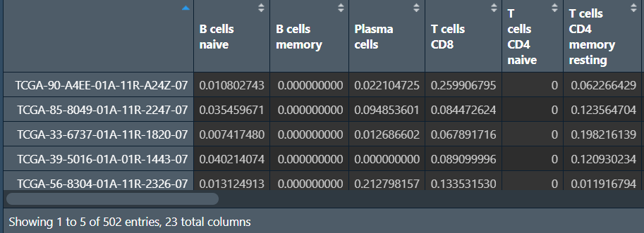{:width=200 height=200}
行名是样本名，列是免疫细胞种类和A1BG基因表达量
**相关性散点图**：每个免疫细胞都和A1BG表达量进行分析，将符合阈值的画图
```{r}
outTab <- data.frame();
for(i in colnames(rt)[1:(ncol(rt)-1)]){
  x <- as.numeric(rt[, gene]);  # x轴是表达量
  y <- as.numeric(rt[, i]);  # y轴是免疫分析得分
  if(sd(y)==0)  y[1] <- 0.00001;
  # spearman非线性相关\pearson线性相关，哪个结果更符合预期就用哪个
  cor <- cor.test(x, y, method = "spearman");
  outVector <- cbind(Gene = gene, Cell = i, cor = cor$estimate, pvalue = cor$p.value);
  outTab <- rbind(outTab, outVector);
  # 阈值设置为0.05
  if(cor$p.value<0.05){
    outFile <- paste0("C:\\Users\\WangTianHao\\Documents\\GitHub\\R-for-bioinformatics\\b站生信课03\\save_data\\cor.result\\cor.", i, ".pdf");
    df1 <- as.data.frame(cbind(x, y));
    p1 <- ggplot(df1, aes(x, y)) + 
      xlab(paste0(gene, " expression")) + 
      ylab(i) +
      geom_point() + 
      geom_smooth(method = "lm",formula = y ~ x) + 
      theme_bw() +
      stat_cor(method = 'spearman', aes(x = x, y = y));
    p2 <- ggMarginal(
      p1, 
      type = "density", 
      xparams = list(fill = "orange"), 
      yparams = list(fill = "blue")
    );
    #相关性图形
    pdf(file = outFile, width = 5.2, height = 5);
    print(p2);
    dev.off();
  }
}
# 保存
write.table(outTab, file = "C:\\Users\\WangTianHao\\Documents\\GitHub\\R-for-bioinformatics\\b站生信课03\\save_data\\cor.result\\cor.result.txt", sep = "\t", row.names = F, quote = F);
```
其中一张图：
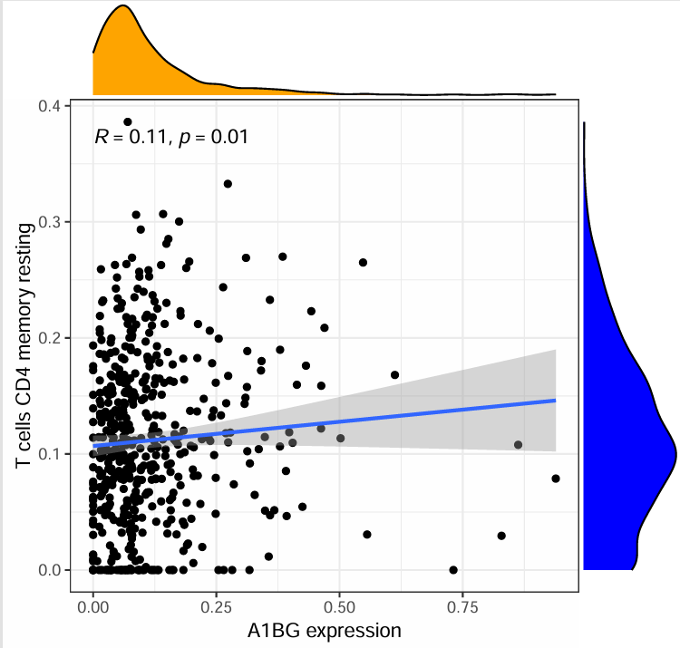{:width=500 height=500}
横坐标是指定基因表达量，纵坐标是某个免疫细胞浸润水平，每个点都是一个样本
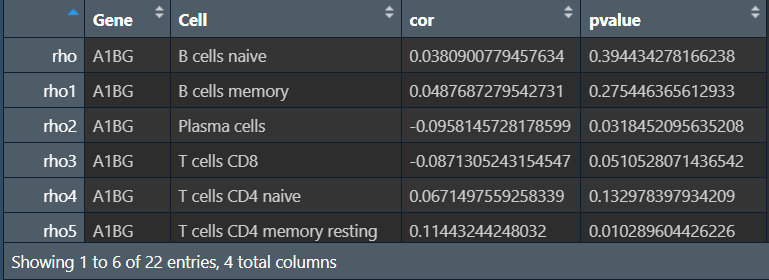{:width=170 height=170}
**棒棒糖图**：
```{r}
outTab$cor <- as.numeric(outTab$cor);
outTab$pvalue <- as.numeric(outTab$pvalue);
# 圆圈颜色
p.col <- c('gold', 'pink', 'orange', 'LimeGreen', 'darkgreen');
fcolor <- function(x, p.col){
  color <- ifelse(
    x>0.8, p.col[1],
    ifelse(
      x>0.6, p.col[2],
      ifelse(
        x>0.4, p.col[3],
        ifelse(
          x>0.2, p.col[4], p.col[5]
        )
      )
    )
  );
  return(color);
}
points.color <- fcolor(x = outTab$pvalue, p.col = p.col);
outTab$points.color <- points.color;
# 圆圈大小
p.cex <- seq(2.5, 5.5, length = 5);
fcex <- function(x){
  x <- abs(x);
  cex <- ifelse(
    x<0.1, p.cex[1],
    ifelse(
      x<0.2, p.cex[2],
      ifelse(
        x<0.3, p.cex[3],
        ifelse(
          x<0.4, p.cex[4], p.cex[5]
        )
      )
    )
  );
  return(cex);
}
points.cex <- fcex(x = outTab$cor);
outTab$points.cex <- points.cex;
# 按相关性从高到低排序
outTab <- outTab[order(outTab$cor), ];
# x轴范围
xlim <- ceiling(max(abs(outTab$cor))*10)/10;
# 画图
pdf(file = "C:\\Users\\WangTianHao\\Documents\\GitHub\\R-for-bioinformatics\\b站生信课03\\save_data\\Lollipop.pdf", width = 9, height = 7);
layout(
  mat = matrix(c(1,1,1,1,1,0,2,0,3,0), nc = 2),
  width = c(8,2.2),
  heights = c(1,2,1,2,1)
);
par(bg = "white", las = 1, mar = c(5,18,2,4), cex.axis = 1.5, cex.lab = 2);
plot(
  1,
  type = "n",
  xlim = c(-xlim,xlim),ylim = c(0.5,nrow(outTab)+0.5),
  xlab = "Correlation Coefficient",ylab = "",
  yaxt = "n",yaxs = "i",axes = F
);
rect(
  par('usr')[1], par('usr')[3], par('usr')[2], par('usr')[4],
  col = "#F5F5F5", border = "#F5F5F5"
);
grid(ny = nrow(outTab), col = "white", lty = 1, lwd = 2);
segments(
  x0 = outTab$cor, y0 = 1:nrow(outTab),
  x1 = 0, y1 = 1:nrow(outTab),
  lwd = 4
);
points(
  x = outTab$cor,
  y = 1:nrow(outTab),
  col = outTab$points.color,
  pch = 16,
  cex = outTab$points.cex
);
text(
  par('usr')[1],
  1:nrow(outTab), outTab$Cell,
  adj = 1, xpd = T, cex = 1.5
);
pvalue.text <- ifelse(
  outTab$pvalue<0.001,
  '<0.001',
  sprintf("%.03f", outTab$pvalue)
);
redcutoff_cor <- 0;
redcutoff_pvalue <- 0.05;
text(
  par('usr')[2],
  1:nrow(outTab), pvalue.text,
  adj = 0, xpd = T, cex = 1.5,
  col = ifelse(
    abs(outTab$cor)>redcutoff_cor & outTab$pvalue<redcutoff_pvalue,
    "red","black"
  )
);
axis(1, tick = F);
par(mar = c(0,4,3,4));
plot(
  1,
  type = "n", axes = F,
  xlab = "",ylab = ""
);
legend(
  "left",
  legend = c(0.1,0.2,0.3,0.4,0.5),
  col = "black", bty = "n", pch = 16,
  pt.cex = p.cex, cex = 2,
  title = "abs(cor)"
);
par(mar = c(0,6,4,6), cex.axis = 1.5, cex.main = 2);
barplot(
  rep(1, 5),
  horiz = T,
  space = 0,
  border = NA,
  col = p.col,
  xaxt = "n", yaxt = "n",
  xlab = "", ylab = "", main = "pvalue"
);
axis(4, at = 0:5, c(1,0.8,0.6,0.4,0.2,0), tick = F);
dev.off();
```
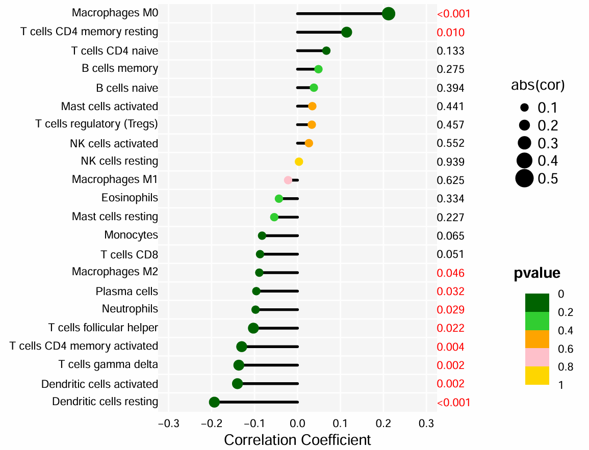{:width=500 height=500}
横坐标是相关性系数cor，纵坐标是不同的免疫细胞，点的大小是相关性系数cor，颜色是p值
因为是随便选的基因，所以相关性都不高
##### mRNA-lncRNA共表达分析
将第一节中数据预处理-TCGA数据-表达数据中`new_matrix <- subset(x = new_matrix, gene_type=="protein_coding")`根据protein_coding筛选改成根据lncRNA筛选，得到`TCGA_LUSC_lncRNA.txt`
还需要tpm表达矩阵（mRNA表达数据）
```{r}
if(!require("ggalluvial", quietly = T))
{
  install.packages("ggalluvial");
}
library(limma);
library(dplyr);
library(ggalluvial);
library(ggplot2);
library(igraph);
```
**读取数据**：
```{r}
# mRNA表达矩阵
mRNA <- read.table("C:\\Users\\WangTianHao\\Documents\\GitHub\\R-for-bioinformatics\\b站生信课03\\save_data\\TCGA_LUSC_TPM.txt", check.names = F, row.names = 1, sep = '\t', header = T);
# 仅保留肿瘤样本
group <- sapply(strsplit(colnames(mRNA), "\\-"), "[", 4);
group <- sapply(strsplit(group,""), "[", 1);
mRNA <- mRNA[, group == 0];
# 去除低质量mRNA
mRNA <- mRNA[rowMeans(mRNA)>0.5, ];
# 提取自己感兴趣的mRNA
mRNA <- mRNA[1:10, ];
# lncRNA表达矩阵
lncRNA <- read.table("C:\\Users\\WangTianHao\\Documents\\GitHub\\R-for-bioinformatics\\b站生信课03\\save_data\\TCGA_LUSC_lncRNA.txt", check.names = F, row.names = 1, sep = '\t', header = T);
# 仅保留肿瘤样本
group <- sapply(strsplit(colnames(lncRNA), "\\-"), "[", 4);
group <- sapply(strsplit(group,""), "[", 1);
lncRNA <- lncRNA[, group == 0];
# 去除低质量lncRNA
lncRNA <- lncRNA[rowMeans(lncRNA)>0.5, ];
lncRNA <- lncRNA[apply(lncRNA, 1, sd)>0.5, ];
```
`mRNA`：
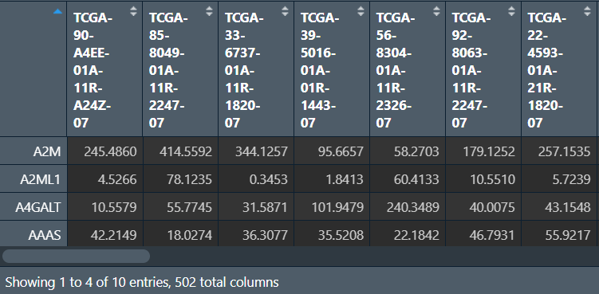{:width=200 height=200}
`lncRNA`：
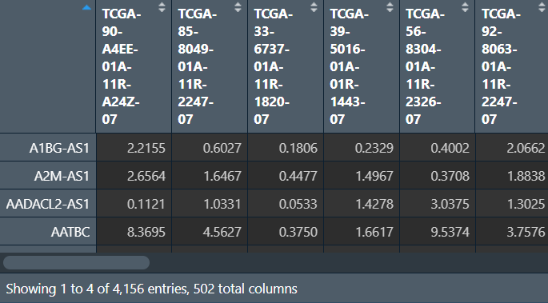{:width=220 height=220}
**进行分析**：
```{r}
# 筛选阈值
corFilter <- 0.3;
pvalueFilter <- 0.001;
# 相关性检验
outTab <- data.frame();
for(i in row.names(lncRNA)){
  for(j in row.names(mRNA)){
    x <- as.numeric(mRNA[j, ]);
    y <- as.numeric(lncRNA[i, ]);
    # spearman非线性相关\pearson线性相关，哪个结果更符合预期就用哪个
    corT <- cor.test(x, y, method = "pearson");
    cor <- corT$estimate;
    pvalue <- corT$p.value;
    regulation <- ifelse(
      cor>corFilter, "postive",
      ifelse(
        cor<(-corFilter), "negative", "none"
      )
    );
    if(regulation!="none" & (pvalue<pvalueFilter)){
      outTab <- rbind(
        outTab,
        cbind(
          mRNA = j,
          lncRNA = i,
          cor,
          pvalue,
          Regulation = regulation
        )
      );
    }
  }
}
# 保存结果
write.table(outTab, file = "C:\\Users\\WangTianHao\\Documents\\GitHub\\R-for-bioinformatics\\b站生信课03\\save_data\\lncRes.txt", sep = "\t", quote = F, row.names = F);
# 保存筛选出的lncRNA的表达矩阵
LncRNA2 <- unique(as.vector(outTab[, "lncRNA"]));
LncRNAexp <- lncRNA[LncRNA2, ];
write.table(
  rbind(ID = colnames(LncRNAexp), LncRNAexp),
  file = "C:\\Users\\WangTianHao\\Documents\\GitHub\\R-for-bioinformatics\\b站生信课03\\save_data\\LncExp.txt",
  sep = "\t", quote = F, col.names = F
);
```
`outTab`：
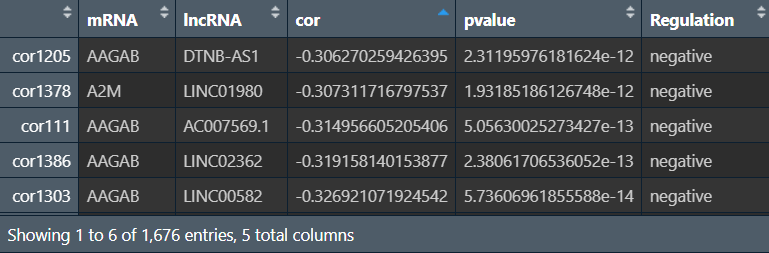{:width=150 height=150}
cor和pvalue是mRNA和lncRNA的相关性系数和p值，regulation是它们的相互作用关系（相关性系数>0为"postive"，反之为"negative"）
`LncRNAexp`：
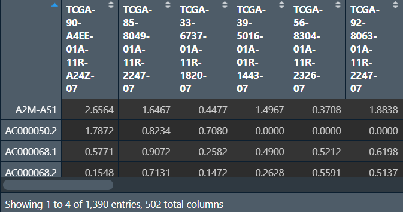{:width=200 height=200}
**画图**：mRNA与lncRNA的对应关系连线
```{r}
rt <- outTab;
# 第一张图
# 颜色
mycol <- rep(c('#AB3282', '#53A85F', '#F1BB72', '#F3B1A0', '#D6E7A3', '#57C3F3', '#476D87', '#E95C59', '#E59CC4','#E5D2DD' , '#23452F', '#BD956A', '#8C549C', '#585658', '#9FA3A8', '#E0D4CA', '#5F3D69', '#C5DEBA', '#58A4C3', '#E4C755', '#F7F398', '#AA9A59', '#E63863', '#E39A35', '#C1E6F3', '#6778AE', '#91D0BE', '#B53E2B', '#712820', '#DCC1DD', '#CCE0F5',  '#CCC9E6', '#625D9E', '#68A180', '#3A6963', '#968175'), 10);
# 画图
p1 <- ggplot(
  data = rt, 
  aes(axis1 = lncRNA, axis2 = mRNA, y = 1)
) +
  geom_alluvium(
    aes(fill = mRNA), 
    width = 0.1, 
    knot.pos = 0.1, 
    reverse = F
  ) + 
  geom_stratum(
    fill = NA, color = NA, 
    alpha = 0.5, 
    width = 0.1
  ) +
  geom_text(
    stat = 'stratum', 
    size =1.5, 
    color='black', 
    label.strata = T
  ) +
  scale_fill_manual(values = mycol) +
  scale_x_discrete(
    limits = c('lncRNA','mRNA'), 
    expand = c(0, 0)
  ) +
  xlab("") + 
  ylab("") + 
  theme_bw() + 
  theme(
    axis.line = element_blank(), 
    axis.ticks = element_blank(),
    axis.text.x = element_blank(), 
    panel.grid = element_blank(),
    panel.border = element_blank()
  ) + 
  coord_flip() +
  ggtitle("");
pdf(file = "C:\\Users\\WangTianHao\\Documents\\GitHub\\R-for-bioinformatics\\b站生信课03\\save_data\\Lnccor1.pdf", width = 9, height = 5);
print(p1);
dev.off();

# 第二张图
# 准备
lncNode <- data.frame(
  Node = unique(as.vector(rt[, "lncRNA"])), 
  Type = "lncRNA"
);
mrnaNode <- data.frame(
  Node = unique(as.vector(rt[,"mRNA"])), 
  Type = "mRNA"
);
nodeOut <- rbind(lncNode, mrnaNode);
color <- ifelse(nodeOut$Type=="lncRNA", '#58A4C3', '#9FA3A8');
value <- ifelse(nodeOut$Type=="lncRNA", 2, 5);
fontSize <- ifelse(nodeOut$Type=="lncRNA", 0.01, 0.65);
node <- data.frame(
  id = nodeOut$Node,
  label = nodeOut$Node,
  color = color,
  shape = "dot",
  value = value,
  fontSize = fontSize
);
edge <- data.frame(
  from = rt$lncRNA,
  to = rt$mRNA,
  length = 100,
  arrows = "middle",
  smooth = TRUE,
  shadow = FALSE,
  weight = as.numeric(rt$cor)
);
d <- data.frame(
  p1 = edge$from, 
  p2 = edge$to, 
  weight = abs(edge$weight)
);
g <- graph.data.frame(d, directed = FALSE);
E(g)$color <- "grey";
V(g)$size <- node$value[match(
  names(components(g)$membership),
  node$label
)];
V(g)$shape <- "sphere";
V(g)$lable.cex <- node$fontSize[match(
  names(components(g)$membership),
  node$label
)];
V(g)$color <- node$color[match(
  names(components(g)$membership),
  node$label
)];
# 画图
pdf("C:\\Users\\WangTianHao\\Documents\\GitHub\\R-for-bioinformatics\\b站生信课03\\save_data\\Lnccor2.pdf", width = 9, height = 8);
layout(mat = matrix(c(1,2,1,2), nc = 2), height = c(1,11));
par(mar = c(0,0,0,0));
plot(
  1,
  type = "n",
  axes = F,
  xlab = "",ylab = ""
);
legend(
  'center',
  legend = c('lncRNA','mRNA'),
  col = c('#58A4C3', '#9FA3A8'),
  pch = 16,
  bty = "n",
  ncol = 2,
  cex = 2
);
vertex.frame.color <- node$color;
edge_col <- E(g)$color;
plot(
  g,
  layout = layout_on_sphere,
  vertex.size = V(g)$size,
  vertex.label = node$label,
  vertex.label.cex = V(g)$lable.cex,
  edge.width = 0.05,
  edge.arrow.size = 0,
  vertex.label.color = NULL,
  vertex.frame.color = NA,
  edge.color = edge_col,
  vertex.label.font = 2
);
dev.off();
```
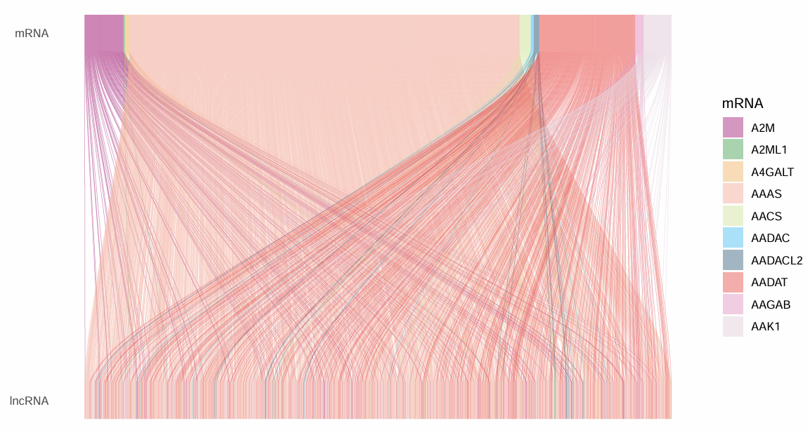{:width=400 height=400}
上面是mRNA，下面是lncRNA，右边图例是mRNA的，因为lncRNA数量太多，没有显示它们的名称
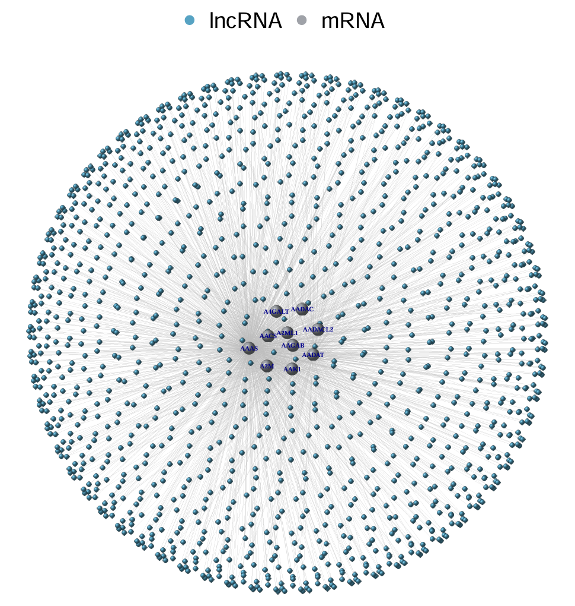{:width=500 height=500}
中间的大球是mRNA，周围的小球是lncRNA
注：还可以画热图（参照之前cibersort的热图）
### 批次矫正前后PCA图
使用数据：GSE30219、GSE74777、tpm表达矩阵
具体方法与第一篇中去批次效应相同，这里只是多画了PCA图
```{r}
library(limma);
library(sva);
library(ggplot2);
```
**读取三个表达矩阵，去批次效应**：（同之前的方法）
```{r}
# 文件路径
files <- c("C:\\Users\\WangTianHao\\Documents\\GitHub\\R-for-bioinformatics\\b站生信课03\\save_data\\TCGA_LUSC_TPM.txt", "C:\\Users\\WangTianHao\\Documents\\GitHub\\R-for-bioinformatics\\b站生信课03\\data\\GSE30219\\GSE30219.txt","C:\\Users\\WangTianHao\\Documents\\GitHub\\R-for-bioinformatics\\b站生信课03\\data\\GSE74777\\GSE74777.txt");
gene_list <- list();
# 读取数据并初步处理
for (i in 1:length(files)) {
  rt <- read.table(files[i], header = T, sep = '\t', check.names = F, row.names = 1);
  dimnames <- list(rownames(rt), colnames(rt));
  rt <- matrix(as.numeric(as.matrix(rt)), nrow = nrow(rt),  dimnames = dimnames);
  if(substr(colnames(rt)[1], 1, 3)=='TCG'){
    rt <- log2(rt+1);
  }
  if(substr(colnames(rt)[1], 1, 3)=='GSM'){
    rt <- normalizeBetweenArrays(rt);
  }
  gene_list[[i]] <- rt;
  if(i==1){
    gene <- rownames(gene_list[[1]]);
  }
  else{
    gene <- intersect(gene, rownames(gene_list[[i]]));
  }
}
# 合并并创建分组信息
for (i in 1:length(files)) {
  if(i==1){
    merge_data <- gene_list[[1]][gene, ];
    batch_type <- c(rep(1, ncol(gene_list[[1]])));
  }
  else{
    merge_data <- cbind(merge_data, gene_list[[i]][gene, ]);
    batch_type <- c(batch_type, rep(i, ncol(gene_list[[i]])));
  }
}
# 去除批次效应
outTab <- ComBat(merge_data, batch_type, par.prior = T);
```
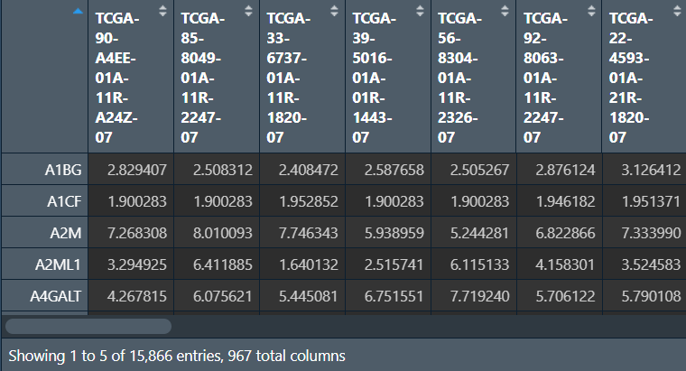{:width=250 height=250}
**画图**：
```{r}
# 画图函数
draw_PCA <- function(data, res_path){  # 行名是样本名，列名是基因名
  # 标签
  Project <- c(
    rep("TCGA", table(batch_type==1)[2]),
    rep("GSE30219", table(batch_type==2)[2]),
    rep("GSE74777", table(batch_type==3)[2])
  );
  # PCA分析
  data.pca <- prcomp(data);
  pcaPredict <- predict(data.pca);
  PCA <- data.frame(PC1 = pcaPredict[, 1], PC2 = pcaPredict[, 2], Type = Project);
  # 颜色
  bioCol <- c("#FF0000", "#0066FF", "#FF9900", "#6E568C", "#7CC767", "#223D6C", "#D20A13", "#FFD121");
  bioCol <- bioCol[1:length(levels(factor(Project)))];
  # 画图
  p <- ggplot(data = PCA, aes(PC1, PC2)) + 
    geom_point(aes(color = Type)) +
    scale_colour_manual(name = "",  values = bioCol) +
    theme_bw() +
    theme(
      plot.margin = unit(rep(1.5, 4), 'lines'),
      panel.grid.major = element_blank(), 
      panel.grid.minor = element_blank()
    );
  pdf(file = res_path, height = 5, width = 6);
  print(p);
  dev.off();
  return(PCA);
}
# 画图，分别是去批次前后的表达矩阵
PCA_res1 <- draw_PCA(t(merge_data), "C:\\Users\\WangTianHao\\Documents\\GitHub\\R-for-bioinformatics\\b站生信课03\\save_data\\PCA1.pdf");
PCA_res2 <- draw_PCA(t(outTab), "C:\\Users\\WangTianHao\\Documents\\GitHub\\R-for-bioinformatics\\b站生信课03\\save_data\\PCA2.pdf");
```
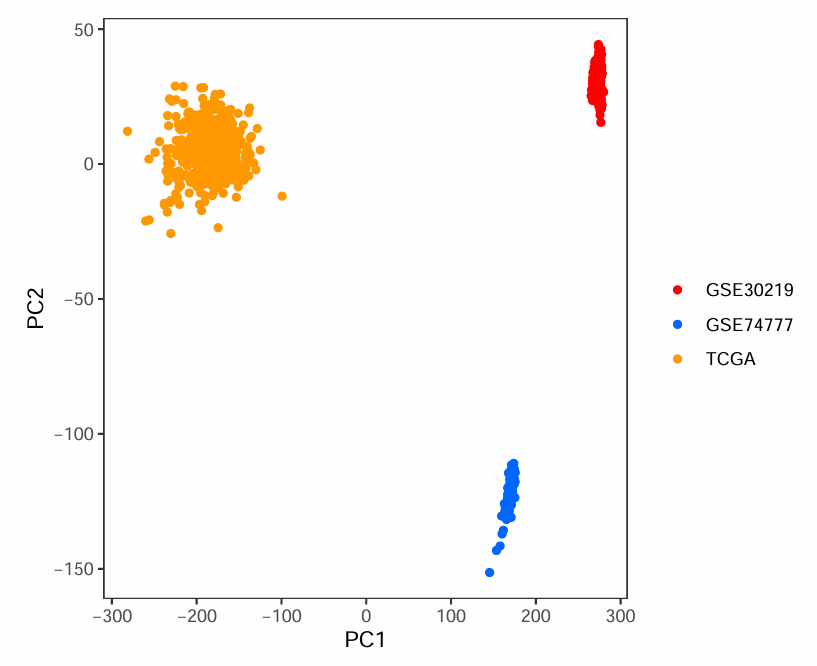{:width=400 height=400}
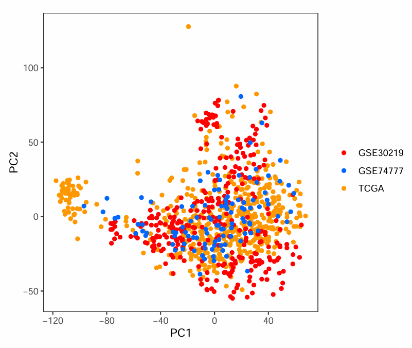{:width=400 height=400}
可以看到第一张图中同种颜色的点都集中在一起，不同颜色点离得很远，说明批次效应较强。通常希望像第二张图一样，不同颜色的点（不同数据集的样本）都混在一起
