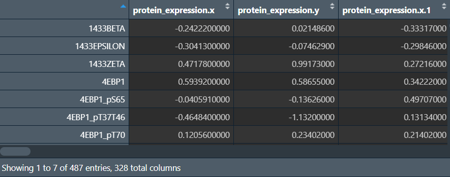
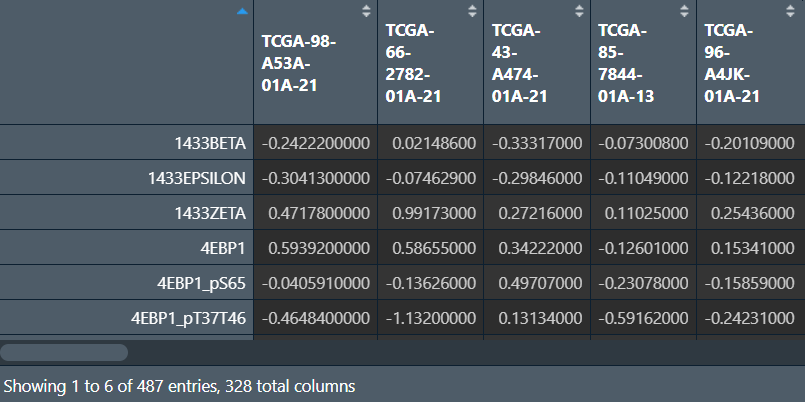
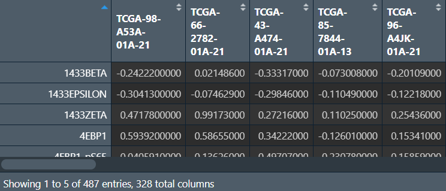

<a id="mulu">目录</a>
<a href="#mulu" class="back">回到目录</a>
<style>
    .back{width:40px;height:40px;display:inline-block;line-height:20px;font-size:20px;background-color:lightyellow;position: fixed;bottom:50px;right:50px;z-index:999;border:2px solid pink;opacity:0.3;transition:all 0.3s;color:green;}
    .back:hover{color:red;opacity:1}
    img{vertical-align:bottom;}
</style>

<!-- @import "[TOC]" {cmd="toc" depthFrom=3 depthTo=6 orderedList=false} -->

<!-- code_chunk_output -->

- [TCGA蛋白质数据下载和整理](#tcga蛋白质数据下载和整理)

<!-- /code_chunk_output -->

<!-- 打开侧边预览：f1->Markdown Preview Enhanced: open...
只有打开侧边预览时保存才自动更新目录 -->

写在前面：本篇教程来自b站课程[TCGA及GEO数据挖掘入门必看](https://www.bilibili.com/video/BV1b34y1g7RM) P70-P [相关资料下载](https://github.com/lwstkhyl/bioinformatic-and-R/tree/main/b%E7%AB%99%E7%94%9F%E4%BF%A1%E8%AF%BEdata)

### TCGA蛋白质数据下载和整理
进入[TCGA官网](https://portal.gdc.cancer.gov)
`Cohort Builder`：
- `Program`--`TCGA`
- `Project`--`TCGA LUSC`（肺鳞癌）

`Repository`：
- `Data Category`--`proteome profiling`

共328个，下载cart和Metadata
```{r}
library(stringr);
library(tidyverse);
library(impute);
```
**读取数据，合并**：
```{r}
wd <- "C:/Users/WangTianHao/Documents/GitHub/R-for-bioinformatics/b站生信课03/data/protein/gdc_download_20241001_061720.892622"
# 读取数据
count_files <- dir(wd, pattern = "*.tsv$", recursive = T);
exp <- list();  # 保存到列表中
for(i in 1:length(count_files)){
  exp[[i]] <- read.table(
    paste0(wd, "/", count_files[[i]]), 
    sep = "\t", header = T
  ) %>%
    dplyr::select(c(5, 6));  # 只选取蛋白质名称和表达量两列
}
# 行数不一样，用merge函数合并
m <- Reduce(
  function(x, y) merge(x, y, by = 'peptide_target',all = T),
  exp
);
# 改行名为蛋白质名
exp <- column_to_rownames(m, var = "peptide_target");
```
{:width=220 height=220}
**修改列名为样本名称**：
```{r}
# 读取metadata
meta <- jsonlite::fromJSON("C:/Users/WangTianHao/Documents/GitHub/R-for-bioinformatics/b站生信课03/data/protein/metadata.cart.2024-10-01.json");
ID <- sapply(
  meta$associated_entities,
  function(x) {x$entity_submitter_id}
);
# 样本名--文件名对照
file2id <- data.frame(
  file_name = meta$file_id,
  ID = ID
);
count_files2 <- stringr::str_split(count_files, "/", simplify = T)[, 1];  # 提取出已读取文件路径中的文件夹名
file2id <- file2id[match(count_files2, file2id$file_name), ];  # 修改顺序
# 修改
colnames(exp) <- file2id$ID;
exp <- as.matrix(exp);
```
{:width=250 height=250}
**删除NA值**：因为NA值太多，如果用正常方法删除，剩下的蛋白质就太少了，因此用`impute.knn`方法对NA值进行**补全**
```{r}
# 正常方法：将近删除一半
# exp <- na.omit(exp);
mat <- impute.knn(exp);
exp <- mat$data;
# 保存数据
exp1 <- data.frame(ID = rownames(exp), exp);
colnames(exp1) <- gsub('[.]', '-', colnames(exp1));
write.table(exp1, 'C:/Users/WangTianHao/Documents/GitHub/R-for-bioinformatics/b站生信课03/data/protein/protein.txt', sep = "\t", quote = F, row.names = F);
```
{:width=200 height=200}
行名是蛋白质名称，列名是样本名，值是每个样本每种蛋白质的表达水平
