<a id="mulu">目录</a>
<a href="#mulu" class="back">回到目录</a>

<!-- @import "[TOC]" {cmd="toc" depthFrom=3 depthTo=6 orderedList=false} -->

<!-- code_chunk_output -->

- [测序相关](#测序相关)
    - [标准化](#标准化)
- [常用分析方法](#常用分析方法)
    - [差异分析](#差异分析)
    - [单因素cox分析](#单因素cox分析)
    - [生存曲线](#生存曲线)
    - [分子互作网络](#分子互作网络)
    - [LASSO-COX筛选基因构建模型](#lasso-cox筛选基因构建模型)
      - [LASSO回归](#lasso回归)
      - [生存分析与ROC曲线](#生存分析与roc曲线)
    - [模型验证](#模型验证)
      - [内/外部验证](#内外部验证)
      - [独立性验证](#独立性验证)
    - [GO与KEGG富集分析](#go与kegg富集分析)
    - [免疫分析](#免疫分析)
    - [治疗反应](#治疗反应)
    - [总结](#总结)
- [常用数据库](#常用数据库)

<!-- /code_chunk_output -->

<!-- 打开侧边预览：f1->Markdown Preview Enhanced: open...
只有打开侧边预览时保存才自动更新目录 -->

### 测序相关
- read：测序过程中要将一个基因切分成多个小段DNA，每对小段进行一次测序，就称为一次read
- count：一个基因所有read的总数
  在某样品中，基因A的count>基因B，但这不能说明基因A的表达一定比B高，可能只是因为基因A更长
  在两个样品中，其中一个样品基因A的count比另一个样品高，也不能说明这个样品基因A表达更多，可能是因为PCR时这个样品基因A扩增次数更多
- 转录本(transcript)：基因转录成pre-mRNA后，因为基因有内含子和外显子，需要对pre-mRNA进行剪切，有不同的剪切方法，产生不同的转录本
- 基因长度：有多少个碱基对（不包括内含子），大概有4种定义方式
  - 基因最长的转录本长度
  - 多个转录本长度的平均值
  - 非重叠外显子长度和（L1+L2+L3+L4）--常用
    {:width=50 height=50}
  - 非重叠编码序列长度和
- 测序深度：测序得到的碱基总量(bp)与基因组（或转录组、测序目标区域）大小的比值
    简单理解：PCR扩增后，DNA片段越多，测序的时候得到的碱基总量也就越多，测序深度越大

##### 标准化
- RPK：`count`/`基因长度`*10^3^，即每千个碱基的read数
    用于同一个样品中，比较不同基因表达量，可以减少基因长度的影响
- RPKM/FPKM：某个样品中`某基因的count值`/`该基因长度`/`所有基因count值之和`*10^9^，即每千个转录、每百万映射读取的read数
    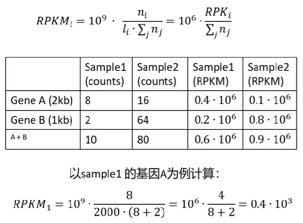{:width=300 height=300}
    在减少基因长度的影响后，再减少测序深度的影响
    单端测序使用RPKM，双端测序（得到正反两个测序结果）使用FPKM
    可以在样品内比较，无法在样品间比较。以上图为例，只能说明样品1中基因A表达量高于B，不能说明样品1中基因A表达量高于样品2中基因A表达量
- TPM：某个样品中`某基因的count值`/`该基因长度`/`所有基因count值与其基因长度比值之和`*10^6^，即每千个转录、每百万映射读取的transcripts
    {:width=200 height=200}
    {:width=200 height=200}
    既能组内比较，又能组间比较
- CPM（使用较少）：某个样品中`某基因的count值`/`所有基因的count值之和`*10^6^，即每百万映射读取的reads
    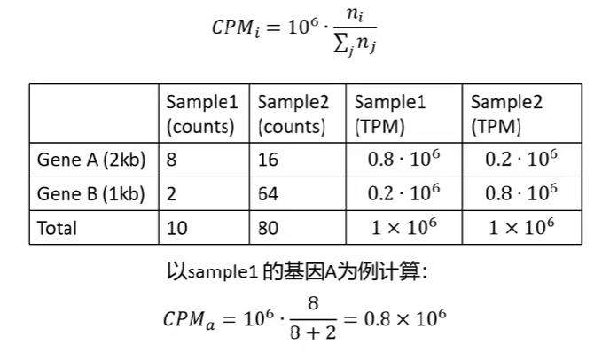{:width=250 height=250}
    可以用于组件比较，不能用于组内比较

在使用R包作差异分析时，有些R包（如DESeq2）只能输入count值，而不能输入标准化后的值，因为它有自己的一套标准化算法，
总结：
{:width=100 height=100}
### 常用分析方法
以`用于头颈部鳞状细胞癌患者生存、治疗结果、免疫浸润的ADME相关基因签名的探索和验证`论文为例
ADME:药物在体内的吸收(Absorption)、分布(Distribution)、代谢(Metabolism)、和排泄(Excretion)，属于药代动力学研究的内容
##### 差异分析
通过肿瘤与正常细胞基因表达的差异，筛选出18353个差异表达基因
再将18353个差异表达基因与298个ADME基因取交集，得到160个差异表达的ADME基因
{:width=100 height=100}{:width=50 height=50}
##### 单因素cox分析
通俗来讲，就是为了研究哪类群体的“死亡”速度更快、什么因素影响了“死亡”速度
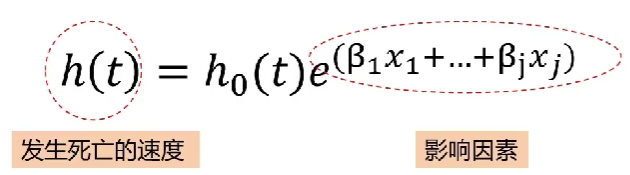{:width=80 height=80}其中h~0~(t)为常数
两个简单的例子：
- 想知道性别对某疾病的影响，即是男性死亡风险高，还是女性死亡风险高。可以在t时刻，用女性的死亡风险除以男性的死亡风险，最后得到一个风险比，当其大于1且有统计学意义时就可以说女性死亡风险更高
- 想知道多个基因对死亡的影响，可以分别计算它们的风险比
    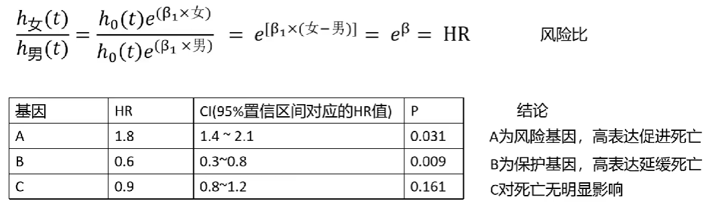{:width=150 height=150}
无需记住公式，R包会提供函数进行计算

在实际应用中，会在很多个基因中进行筛选，如
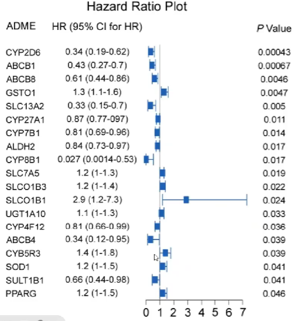{:width=200 height=200}
一共得到了19个有价值的差异表达基因，HR小于1为保护基因，大于1为风险基因
##### 生存曲线
如何验证通过单因素cox分析得到的基因是否真的有价值？
将每个基因根据表达量的中位数/均值，分为高表达与低表达两组，绘制曲线
曲线的横坐标为时间，纵坐标为生存概率
{:width=200 height=200}
比较同一时刻高/低表达组的生存概率，就可以知道单因素cox分析预测的是否准确
##### 分子互作网络
{:width=250 height=250}
- 圆圈：即旁边标注的基因
- 圈里有螺旋结构：代表这个基因的分子结构已知，没有则代表未知
- 圆圈颜色：不同颜色代表不同功能的基因
- 线条：表示基因之间存在的联系，没有则代表现在还不知道是否有联系
- 线条颜色：代表分子间不同的关系，具体可以在[string官网](http://string-db.org/) 中找到
##### LASSO-COX筛选基因构建模型
###### LASSO回归
{:width=250 height=250}
- 等号右边为n个影响因素及权重，X为影响因素，β为常数（代表对应X的权重）
- 等号左边的Y可以称为受它们影响的结果

在这些影响因素中，有些对结果的影响权重较高，有些较低。可以剔除一些影响因子，同时让Y不发生太大的改变，保留权值高的影响因子
LASSO回归提供了一个惩罚函数，逐渐让权值低的X的β=0，最后只留下必要的影响因子，从而简化模型

---

回归系数路径图：
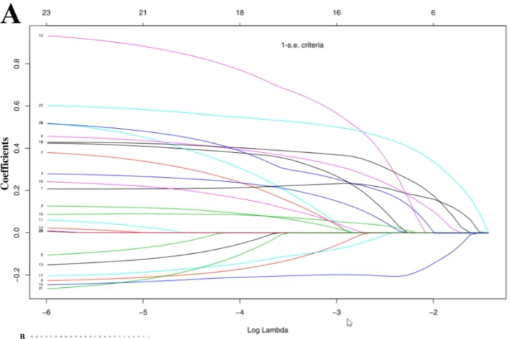{:width=300 height=300}
- 纵轴：回归系数
- 横轴：log λ（LASSO回归中的一个参数）
- 多少条线就代表了多少个变量的回归系数

随着λ不断变大，越来越多的回归系数收敛到0，回归方程越来越简单，最后只剩下Y=β~0~，这显然是不合理的，因此需要知道当λ为多少时才能得到合理的结果（保留多少个影响因素

---

交叉验证曲线：
{:width=300 height=300}
- 纵轴：似然偏差，越小代表拟合效果越好
- 横轴：log λ（同回归系数路径图）
- `λ min`：偏差最小时的log λ值，此时模型的拟合效果最好
- `λ1-se`（λ1减se）：表示`λ min`右侧的一个标准误，此时模型的拟合效果也很好，同时模型的变量更少、模型更简单
- 很多时候以λ1-se作为筛选标准，实际上`λ min`~`λ1-se`范围内都可以

---

通过LASSO回归，在上面的19个基因中筛选了其中14个关键基因
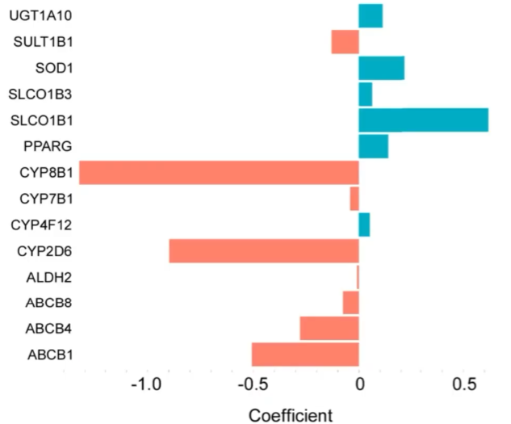{:width=250 height=250}
去掉了其中4个影响权重较低的基因，同时保证了模型预测效果
###### 生存分析与ROC曲线
在完成上面的步骤后，根据14个关键基因在每个样本中的表达值，对每个样品进行风险打分。此例中共有274个样本，因此有274个风险得分
之后根据风险得分将这些样本分为高风险组和低风险组（设置分组阈值为风险得分的中位数）
对高/低风险组进行生存分析：
{:width=250 height=250}
并绘制ROC曲线：
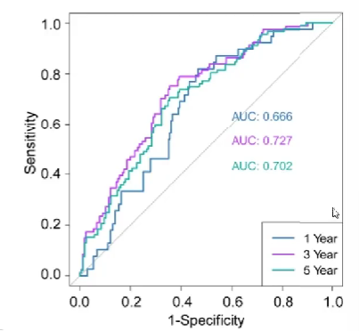{:width=250 height=250}
在ROC曲线中，只需关注AUC值，上图中对角线（灰色）即为AUC=0.5的基准线
- ROC曲线接近左上角（AUC值较大）：模型预测准确率高
- ROC曲线略高于基准线（AUC值略大于0.5）：模型预测准确率一般
- ROC曲线低于基准线（AUC值小于0.5）：模型未达到最低标准，无法使用
##### 模型验证
###### 内/外部验证
- 内部验证：将最开始建模所用到的数据集分成两部分，一部分用于建模，另一部分用于验证
- 外部验证：用另外一批测序的数据

重复上面的步骤：计算验证组风险得分，根据之前算出的分组阈值将它们分为高风险组和低风险组，画出生存分析图和ROC曲线
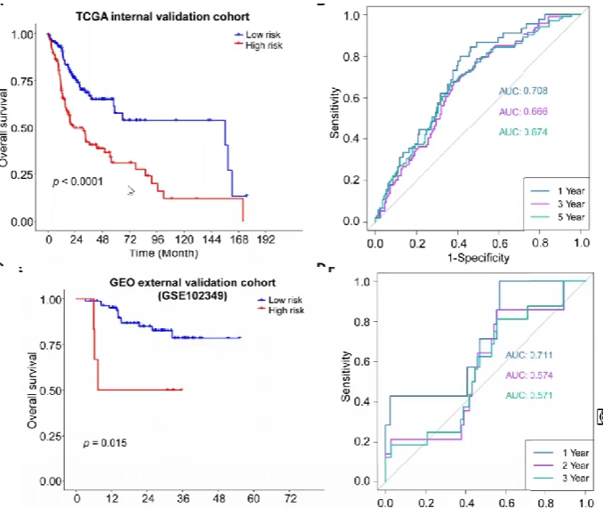{:width=400 height=400}
可以看到内部验证效果较好（因为都来自同一批数据），外部验证中`1year`的效果较好，`2year`和`3year`效果一般
###### 独立性验证
即探究某个因素对预测结果的影响
此例中探究了淋巴血管是否浸润对结果的影响
按淋巴血管是否浸润分为有浸润组和无浸润组，对这两组分别重复上面的步骤（分为高风险组和低风险组，画出生存分析图），得到两张生存分析图
{:width=200 height=200}
在这两组中高风险组生存率都低于低风险组，且低/高风险组中出现浸润的病人比例类似
得出结论：生存分析结果不受淋巴血管是否浸润的影响
##### GO与KEGG富集分析
统计各差异表达基因的生物学功能
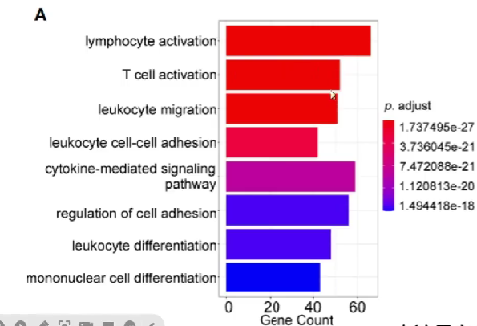{:width=200 height=200}
纵轴为生物学功能，横轴为具有某项生物学功能的基因总数
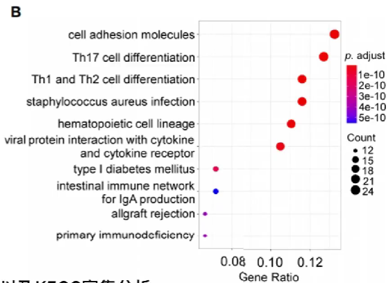{:width=200 height=200}
纵轴为生物学功能，横轴为具有某项生物学功能的基因比例
可以看到它们的p值很小，说明有统计学意义
此例中大多数基因都与免疫学功能有关，因此需要进行免疫分析
##### 免疫分析
为了弄清肿瘤组织中免疫细胞的构成比（免疫微环境），其对肿瘤的发展、治疗有很大作用
主要有2种方法：
- 单细胞测序，得到各个细胞亚群比例。缺点是成本很高
- 根据RNA-seq结果推测处组织中各免疫细胞构成

对高/低风险组分别进行免疫分析，并汇总到一个图上，可以得到各种免疫细胞在高/低风险组中的数量差别
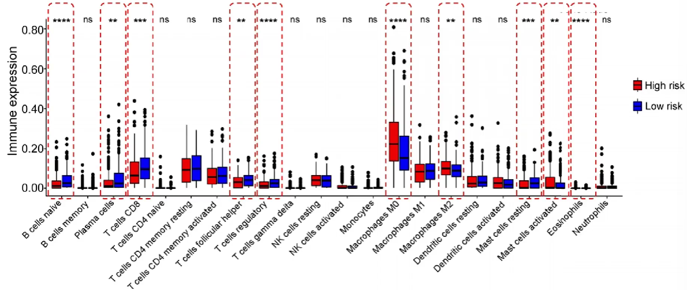{:width=300 height=300}
共统计了22种免疫细胞，其中10种（红色虚线部分）在高/低风险组中的比例有显著差异

---

免疫评分：将上面得到的有显著差异的免疫细胞单独进行风险评分
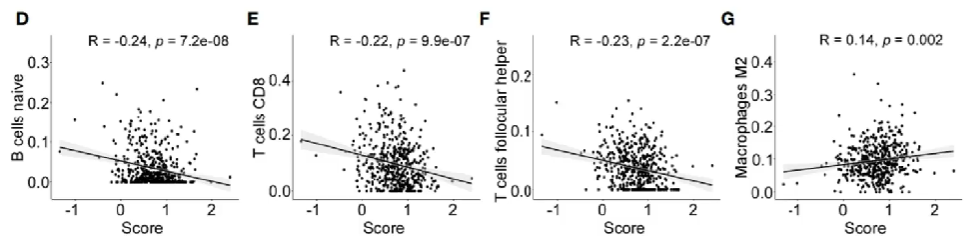{:width=150 height=150}
图中的拟合曲线表明了该种免疫细胞对风险影响：斜率<0则有利，斜率>0则有害
三种评分：
- Stromal score(基质评分)：评估肿瘤组织中的基质细胞浸润水平
- Immune score(免疫评分)：评估肿瘤组织中的免疫细胞浸润水平
- Estimate Score(可推测帅瘤纯度) = stromal score + immune score

上述评分越高，肿瘤纯度越低，预后越好
{:width=200 height=200}
##### 治疗反应
即高/低风险组经过免疫治疗/化疗后的生存分析
{:width=400 height=400}
可以看到免疫治疗组预测效果较差，化疗组预测效果较好
##### 总结
{:width=300 height=300}
简化一下：
{:width=300 height=300}
- 差异分析是基础，它得到要进行分析的基因
- 富集分析让我们知道差异基因的哪项功能多，方便后续针对性的研究
- 互作网络得到分子间的相互作用
- 根据具体的临床问题构建相应的模型，并进行验证（内部、外部、实验验证）

为什么要实验验证？
基因表达，蛋白质不一定表达。而真正影响身体的是表达出的蛋白质，需要通过实验检测蛋白质的表达
### 常用数据库
