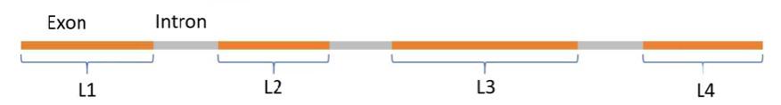
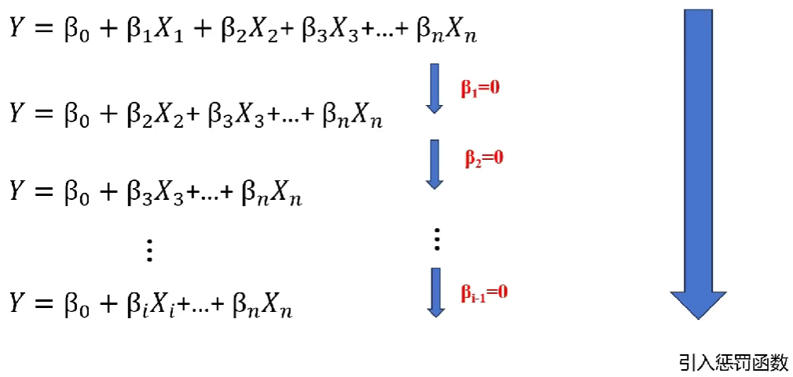
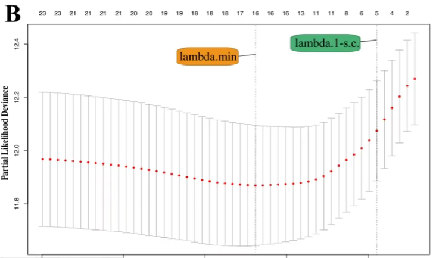

<a id="mulu">目录</a>
<a href="#mulu" class="back">回到目录</a>

<!-- @import "[TOC]" {cmd="toc" depthFrom=3 depthTo=6 orderedList=false} -->

<!-- code_chunk_output -->

- [测序相关](#测序相关)
    - [标准化](#标准化)
- [常用分析方法](#常用分析方法)
    - [单因素cox分析](#单因素cox分析)
    - [生存曲线](#生存曲线)
    - [分子互作网络](#分子互作网络)
    - [LASSO-COX筛选基因构建模型](#lasso-cox筛选基因构建模型)
      - [LASSO回归](#lasso回归)

<!-- /code_chunk_output -->

<!-- 打开侧边预览：f1->Markdown Preview Enhanced: open...
只有打开侧边预览时保存才自动更新目录 -->

### 测序相关
- read：测序过程中要将一个基因切分成多个小段DNA，每对小段进行一次测序，就称为一次read
- count：一个基因所有read的总数
  在某样品中，基因A的count>基因B，但这不能说明基因A的表达一定比B高，可能只是因为基因A更长
  在两个样品中，其中一个样品基因A的count比另一个样品高，也不能说明这个样品基因A表达更多，可能是因为PCR时这个样品基因A扩增次数更多
- 转录本(transcript)：基因转录成pre-mRNA后，因为基因有内含子和外显子，需要对pre-mRNA进行剪切，有不同的剪切方法，产生不同的转录本
- 基因长度：有多少个碱基对（不包括内含子），大概有4种定义方式
  - 基因最长的转录本长度
  - 多个转录本长度的平均值
  - 非重叠外显子长度和（L1+L2+L3+L4）--常用
    {:width=50 height=50}
  - 非重叠编码序列长度和
- 测序深度：测序得到的碱基总量(bp)与基因组（或转录组、测序目标区域）大小的比值
    简单理解：PCR扩增后，DNA片段越多，测序的时候得到的碱基总量也就越多，测序深度越大

##### 标准化
- RPK：`count`/`基因长度`*10^3^，即每千个碱基的read数
    用于同一个样品中，比较不同基因表达量，可以减少基因长度的影响
- RPKM/FPKM：某个样品中`某基因的count值`/`该基因长度`/`所有基因count值之和`*10^9^，即每千个转录、每百万映射读取的read数
    {:width=300 height=300}
    在减少基因长度的影响后，再减少测序深度的影响
    单端测序使用RPKM，双端测序（得到正反两个测序结果）使用FPKM
    可以在样品内比较，无法在样品间比较。以上图为例，只能说明样品1中基因A表达量高于B，不能说明样品1中基因A表达量高于样品2中基因A表达量
- TPM：某个样品中`某基因的count值`/`该基因长度`/`所有基因count值与其基因长度比值之和`*10^6^，即每千个转录、每百万映射读取的transcripts
    {:width=200 height=200}
    {:width=200 height=200}
    既能组内比较，又能组间比较
- CPM（使用较少）：某个样品中`某基因的count值`/`所有基因的count值之和`*10^6^，即每百万映射读取的reads
    {:width=250 height=250}
    可以用于组件比较，不能用于组内比较

在使用R包作差异分析时，有些R包（如DESeq2）只能输入count值，而不能输入标准化后的值，因为它有自己的一套标准化算法，
总结：
{:width=100 height=100}
### 常用分析方法
##### 单因素cox分析
通俗来讲，就是为了研究哪类群体的“死亡”速度更快、什么因素影响了“死亡”速度
{:width=80 height=80}其中h~0~(t)为常数
两个简单的例子：
- 想知道性别对某疾病的影响，即是男性死亡风险高，还是女性死亡风险高。可以在t时刻，用女性的死亡风险除以男性的死亡风险，最后得到一个风险比，当其大于1且有统计学意义时就可以说女性死亡风险更高
- 想知道多个基因对死亡的影响，可以分别计算它们的风险比
    {:width=150 height=150}
无需记住公式，R包会提供函数进行计算

在实际应用中，会在很多个基因中进行筛选，如
{:width=200 height=200}
一共得到了19个有价值的差异表达基因，HR小于1为保护基因，大于1为风险基因
##### 生存曲线
如何验证通过单因素cox分析得到的基因是否真的有价值？
将每个基因根据表达量的中位数/均值，分为高表达与低表达两组，绘制曲线
曲线的横坐标为时间，纵坐标为生存概率
{:width=200 height=200}
比较同一时刻高/低表达组的生存概率，就可以知道单因素cox分析预测的是否准确
##### 分子互作网络
{:width=250 height=250}
- 圆圈：即旁边标注的基因
- 圈里有螺旋结构：代表这个基因的分子结构已知，没有则代表未知
- 圆圈颜色：不同颜色代表不同功能的基因
- 线条：表示基因之间存在的联系，没有则代表现在还不知道是否有联系
- 线条颜色：代表分子间不同的关系，具体可以在[string官网](http://string-db.org/) 中找到
##### LASSO-COX筛选基因构建模型
###### LASSO回归
{:width=250 height=250}
- 等号右边为n个影响因素及权重，X为影响因素，β为常数（代表对应X的权重）
- 等号左边的Y可以称为受它们影响的结果

在这些影响因素中，有些对结果的影响权重较高，有些较低。可以剔除一些影响因子，同时让Y不发生太大的改变，保留权值高的影响因子
LASSO回归提供了一个惩罚函数，逐渐让权值低的X的β=0，最后只留下必要的影响因子，从而简化模型

---

回归系数路径图：
{:width=300 height=300}
- 纵轴：回归系数
- 横轴：log λ（LASSO回归中的一个参数）
- 多少条线就代表了多少个变量的回归系数

随着λ不断变大，越来越多的回归系数收敛到0，回归方程越来越简单，最后只剩下Y=β~0~，这显然是不合理的，因此需要知道当λ为多少时才能得到合理的结果（保留多少个影响因素

---

交叉验证曲线：
{:width=300 height=300}
- 纵轴：似然偏差，越小代表拟合效果越好
- 横轴：log λ（同回归系数路径图）
- `λ min`：偏差最小时的log λ值，此时模型的拟合效果最好
- `λ1-se`（λ1减se）：表示`λ min`右侧的一个标准误，此时模型的拟合效果也很好，同时模型的变量更少、模型更简单
- 很多时候以λ1-se作为筛选标准，实际上`λ min`~`λ1-se`范围内都可以

---

通过LASSO回归，在上面的19个基因中筛选了其中14个关键基因
{:width=250 height=250}
去掉了其中4个影响权重较低的基因，同时保证了模型预测效果
