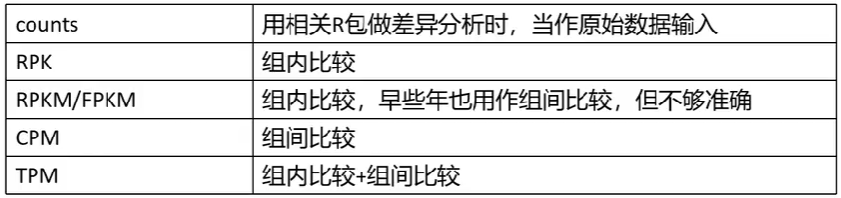

<a id="mulu">目录</a>
<a href="#mulu" class="back">回到目录</a>

<!-- @import "[TOC]" {cmd="toc" depthFrom=3 depthTo=6 orderedList=false} -->

<!-- code_chunk_output -->

- [测序相关](#测序相关)
    - [标准化](#标准化)
- [常用分析方法](#常用分析方法)

<!-- /code_chunk_output -->

<!-- 打开侧边预览：f1->Markdown Preview Enhanced: open...
只有打开侧边预览时保存才自动更新目录 -->

### 测序相关
- read：测序过程中要将一个基因切分成多个小段DNA，每对小段进行一次测序，就称为一次read
- count：一个基因所有read的总数
  在某样品中，基因A的count>基因B，但这不能说明基因A的表达一定比B高，可能只是因为基因A更长
  在两个样品中，其中一个样品基因A的count比另一个样品高，也不能说明这个样品基因A表达更多，可能是因为PCR时这个样品基因A扩增次数更多
- 转录本(transcript)：基因转录成pre-mRNA后，因为基因有内含子和外显子，需要对pre-mRNA进行剪切，有不同的剪切方法，产生不同的转录本
- 基因长度：有多少个碱基对（不包括内含子），大概有4种定义方式
  - 基因最长的转录本长度
  - 多个转录本长度的平均值
  - 非重叠外显子长度和（L1+L2+L3+L4）--常用
    {:width=50 height=50}
  - 非重叠编码序列长度和
- 测序深度：测序得到的碱基总量(bp)与基因组（或转录组、测序目标区域）大小的比值
    简单理解：PCR扩增后，DNA片段越多，测序的时候得到的碱基总量也就越多，测序深度越大

##### 标准化
- RPK：`count`/`基因长度`*10^3^，即每千个碱基的read数
    用于同一个样品中，比较不同基因表达量，可以减少基因长度的影响
- RPKM/FPKM：某个样品中`某基因的count值`/`该基因长度`/`所有基因count值之和`*10^9^，即每千个转录、每百万映射读取的read数
    {:width=300 height=300}
    在减少基因长度的影响后，再减少测序深度的影响
    单端测序使用RPKM，双端测序（得到正反两个测序结果）使用FPKM
    可以在样品内比较，无法在样品间比较。以上图为例，只能说明样品1中基因A表达量高于B，不能说明样品1中基因A表达量高于样品2中基因A表达量
- TPM：某个样品中`某基因的count值`/`该基因长度`/`所有基因count值与其基因长度比值之和`*10^6^，即每千个转录、每百万映射读取的transcripts
    {:width=200 height=200}
    {:width=200 height=200}
    既能组内比较，又能组间比较
- CPM（使用较少）：某个样品中`某基因的count值`/`所有基因的count值之和`*10^6^，即每百万映射读取的reads
    {:width=250 height=250}
    可以用于组件比较，不能用于组内比较

在使用R包作差异分析时，有些R包（如DESeq2）只能输入count值，而不能输入标准化后的值，因为它有自己的一套标准化算法，
总结：
{:width=100 height=100}
### 常用分析方法
