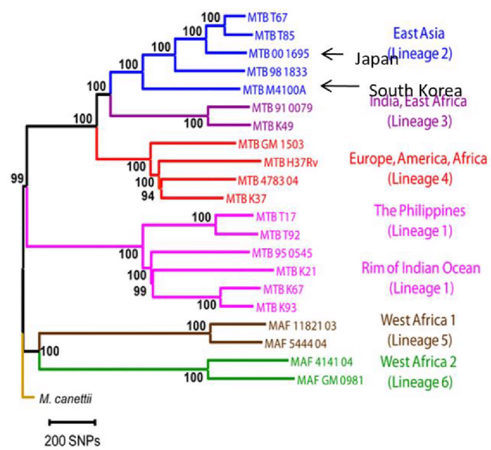
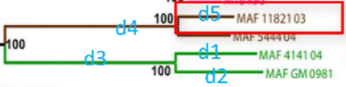
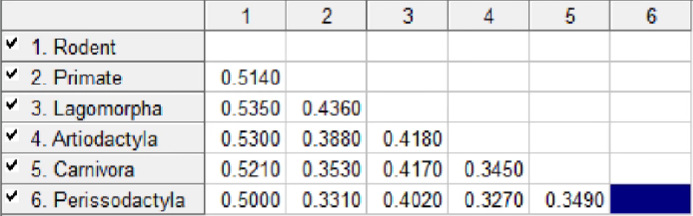

<a id="mulu">目录</a>
<a href="#mulu" class="back">回到目录</a>

<!-- @import "[TOC]" {cmd="toc" depthFrom=3 depthTo=6 orderedList=false} -->

<!-- code_chunk_output -->

- [简介](#简介)
- [建树方法](#建树方法)

<!-- /code_chunk_output -->

<!-- 打开侧边预览：f1->Markdown Preview Enhanced: open...
只有打开侧边预览时保存才自动更新目录 -->

写在前面：本篇教程来自b站课程[构建系统发育树](https://www.bilibili.com/video/BV1R4411w7ih)

### 简介
**分类**：
- **分子树(molecular tree)**：依据分子数据构建的反映分子系统发育的树
  **MLST方法**：扩增出多个单拷贝保守基因，将它们连在一起构造系统发育树
- **物种树(species tree)**：反映物种实际种系发生的树

还可以分为有根树和无根树：
- **有根树**：需选定所有物种的祖先，反映演化途径与进化时间
- **无根树**：将物种分成几个大类

**分辨率问题**：
- 分子树一般只能表示单个分子的进化关系
- 只选用几个基因构建的物种树结构不稳定

解决方法：全基因组建树
- 全基因组SNP树：利用不同样品在全基因组水平上的**单核苷酸多态性(SNP)**来建树
  - 优点：包括基因区和基因间区
  - 缺点：不包括**基因组小片段序列插入或删除(InDel)**的变化
- 全基因组coregene集树：利用不同样品在全基因组水平共有保守单拷贝基因
  - 优点：包括SNP和InDel变化
  - 缺点：不包括基因间区
- 这两种方法建出的树应该几乎没有差别

---

{:width=400 height=400}
**解读**：
- **枝长**：两个物种间的连线长度，体现它们间的差异大小
    {:width=100 height=100}
    MAFGM0981-MAF414104的枝长=d1+d2
    MAFGM0981-MAF1182103的枝长=d2+d3+d4+d5
- **自展值(bootstrap)**：枝干上的数字(100/94/99...)，重复建树n次后，出现这种分类的概率，表明进化树分支可信度，通常认为>75是可靠的
  如果自展值过低，可能是两个序列差异过小或过大，导致树的结构不稳定
  全基因组建树通常较稳定，如果只有几个基因，可能会不稳定
- **标尺**：图底部的`200SNPs`，类似于地图的比例尺
  如果标尺是小数点，则表示序列的差异程度
  标尺不代表分化时间，只有知道突变频率或两个物种的进化时间，才能将序列的差异程度转化成分化时间
### 建树方法
同样的树使用不同的建树方法构建，结构应差不多；如果出现较大差异，可能是数据问题。建树时应多尝试几种方法，比较其中差别
- **邻接法(neighbor joining method, NJ)**：计算速度快，适合序列相似度较高的序列。如果相似度很低，会出现长枝吸引现象（高度不相似的类群聚类在一起）
- **最大似然法(maximum likelyhood method, ML)**：序列间亲缘关系较远，不同谱系进化速率较大变异时
  把每个节点变成其他节点的概率分别相乘，取概率最大的拓扑结构和枝长
- **最大简约法(maximum parsimony method, MP)**：序列差异较小，核酸序列数较小，一般不用在远缘序列上
- **非加权配对算术平均法/非加权组平均法(unweighted pair group method using arithmetic average, UPGMA)**：数据是连续型，例如差异表达数据

建树本质上是一种聚类分析
- **层次聚类**：每个观测值先自成一类，这些类每次两两合并，知道所有类被聚成一类
  - **单联动**：一个类与另一个类中点的最小距离
  - **全联动**：一个类与另一个类中点的最大距离
  - **平均联动(UPGMA)**：一个类与另一个类中的点的平均距离
  - **质心**：两类中质心之间的距离
  - **ward法**：两个类之间所有变量的方差分析的平方和
- **划分聚类**：指定类的个数K，将样品随机分成K类，再重新形成聚合的类，例如kmeans和PAM

这些算法用来计算**距离矩阵**
{:width=150 height=150}
例如A的值是`1 3 5 8 9`，B的值是`1 2 6 7 8`，则A-B距离是根号下(1-1)^2^+(3-2)^2^+(6-5)^2^+(7-8)^2^+(8-9)^2^=根号4=2
两两计算距离完成后，距离小的聚成一类
